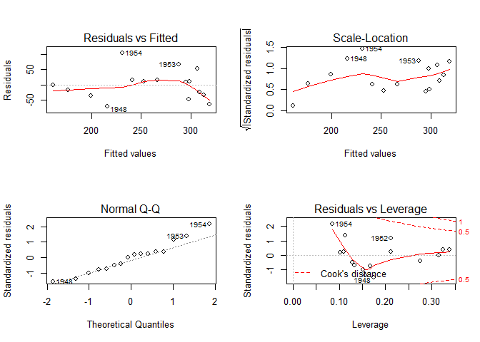
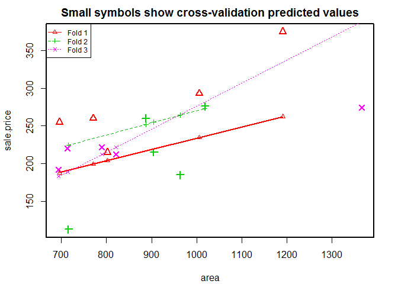
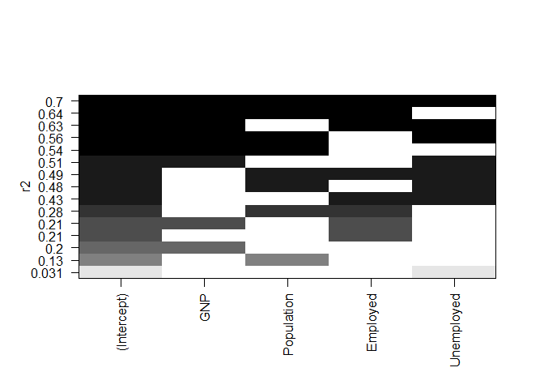
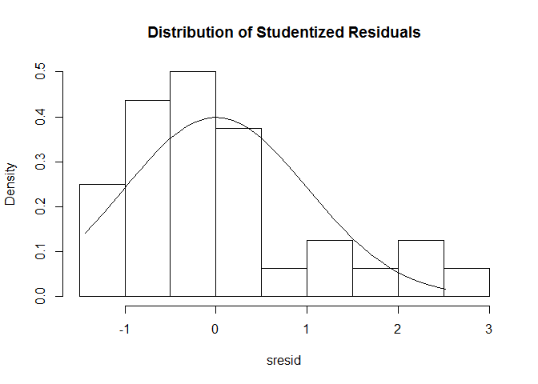
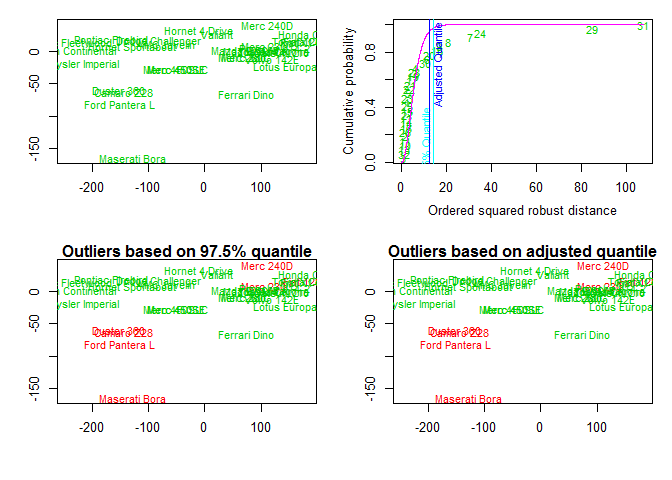

<!--
-   [1, Descriptive Statistics](#descriptive-statistics)
    -   [Group data](#group-data)
-   [2, Frequency Tables, CrossTables, and
    Independence](#frequency-tables-crosstables-and-independence)
    -   [2D frequency tables](#d-frequency-tables)
    -   [3D frequency tables](#d-frequency-tables-1)
    -   [CrossTable](#crosstable)
    -   [Tests of independence](#tests-of-independence)
    -   [Measures of association](#measures-of-association)
-   [3, Correlations](#correlations)
-   [4, t-tests](#t-tests)
-   [5, Nonparametric statistics](#nonparametric-statistics)
    -   [Bivariate tests](#bivariate-tests)
    -   [ANOVA](#anova)
-   [6, Multiple Regressions](#multiple-regressions)
    -   [Fitting the Model](#fitting-the-model)
    -   [Diagnostic plots](#diagnostic-plots)
    -   [Comparing two models with ANOVA](#comparing-two-models-with-anova)
    -   [Cross validation](#cross-validation)
    -   [Variable selection -- Heuristic methods](#variable-selection----heuristic-methods)
    -   [Variable selection -- Graphical methods](#variable-selection----graphical-methods)
    -   [Variable selection -- Relative importance](#variable-selection----relative-importance)
    -   [Going further](#going-further)
-   [7, Regression diagnostics](#regression-diagnostics)
    -   [Outliers](#outliers)
    -   [Influential observations](#influential-observations)
    -   [Nonnormality](#nonnormality)
    -   [Heteroscedasticity](#heteroscedasticity)
    -   [Multicollinearity](#multicollinearity)
    -   [Nonlinearity](#nonlinearity)
    -   [Autocorrelation](#autocorrelation)
    -   [Global diagnostic](#global-diagnostic)
-   [8, ANOVA](#anova-1)
    -   [Evaluate model effects](#evaluate-model-effects)
    -   [Compare nested models directly](#compare-nested-models-directly)
    -   [Multiple comparisons](#multiple-comparisons)
    -   [Visualizing results](#visualizing-results)
    -   [MANOVA](#manova)
    -   [Going further](#going-further-1)
-   [9, (M)ANOVA Assumptions](#manova-assumptions)
    -   [Outliers](#outliers-1)
    -   [Univariate normality](#univariate-normality)
    -   [Multivariate normality](#multivariate-normality)
    -   [Heteroscedasticity](#heteroscedasticity-1)
-   [10, Resampling Statistics](#resampling-statistics)
    -   [Independent k-sample location tests](#independent-k-sample-location-tests)
    -   [Symmetry of a response for repeated measurements](#symmetry-of-a-response-for-repeated-measurements)
    -   [Independence of two numeric variables](#independence-of-two-numeric-variables)
    -   [Independence in contingency tables](#independence-in-contingency-tables)
-->
------------------------------------------------------------------------

**Foreword**

-   Output options: the 'tango' syntax and the 'readable' theme.
-   Codes and snippets.

------------------------------------------------------------------------

1, Descriptive Statistics
-------------------------

Extract basic, exploratory statistics from datasets with `apply`, `summary`, `fivenum`, `describe`, and `stat.desc`.

``` r
# dataset
head(longley, 3)
```

    ##      GNP.deflator     GNP Unemployed Armed.Forces Population Year Employed
    ## 1947         83.0 234.289      235.6        159.0    107.608 1947   60.323
    ## 1948         88.5 259.426      232.5        145.6    108.632 1948   61.122
    ## 1949         88.2 258.054      368.2        161.6    109.773 1949   60.171

``` r
# apply a function
# excluding missing values
sapply(longley, mean, na.rm = TRUE) 
```

    ## GNP.deflator          GNP   Unemployed Armed.Forces   Population 
    ##     101.6813     387.6984     319.3313     260.6687     117.4240 
    ##         Year     Employed 
    ##    1954.5000      65.3170

``` r
# mean, median, 25th and 75th quartiles, min, max
summary(longley)
```

    ##   GNP.deflator         GNP          Unemployed     Armed.Forces  
    ##  Min.   : 83.00   Min.   :234.3   Min.   :187.0   Min.   :145.6  
    ##  1st Qu.: 94.53   1st Qu.:317.9   1st Qu.:234.8   1st Qu.:229.8  
    ##  Median :100.60   Median :381.4   Median :314.4   Median :271.8  
    ##  Mean   :101.68   Mean   :387.7   Mean   :319.3   Mean   :260.7  
    ##  3rd Qu.:111.25   3rd Qu.:454.1   3rd Qu.:384.2   3rd Qu.:306.1  
    ##  Max.   :116.90   Max.   :554.9   Max.   :480.6   Max.   :359.4  
    ##    Population         Year         Employed    
    ##  Min.   :107.6   Min.   :1947   Min.   :60.17  
    ##  1st Qu.:111.8   1st Qu.:1951   1st Qu.:62.71  
    ##  Median :116.8   Median :1954   Median :65.50  
    ##  Mean   :117.4   Mean   :1954   Mean   :65.32  
    ##  3rd Qu.:122.3   3rd Qu.:1958   3rd Qu.:68.29  
    ##  Max.   :130.1   Max.   :1962   Max.   :70.55

``` r
# Tukey min, lower-hinge, median, upper-hinge, max
fivenum(longley$GNP)
```

    ## [1] 234.289 306.787 381.427 463.625 554.894

``` r
# n, nmiss, unique, mean, 5, 10, 25, 50, 75, 90, 95th percentiles
# 5 lowest and 5 highest scores
library(Hmisc)

describe(longley)
```

    ## longley 
    ## 
    ##  7  Variables      16  Observations
    ## ---------------------------------------------------------------------------
    ## GNP.deflator 
    ##        n  missing distinct     Info     Mean      Gmd      .05      .10 
    ##       16        0       16        1    101.7    12.74    86.90    88.35 
    ##      .25      .50      .75      .90      .95 
    ##    94.53   100.60   111.25   114.95   116.00 
    ##                                                                       
    ## Value       83.0  88.2  88.5  89.5  96.2  98.1  99.0 100.0 101.2 104.6
    ## Frequency      1     1     1     1     1     1     1     1     1     1
    ## Proportion 0.062 0.062 0.062 0.062 0.062 0.062 0.062 0.062 0.062 0.062
    ##                                               
    ## Value      108.4 110.8 112.6 114.2 115.7 116.9
    ## Frequency      1     1     1     1     1     1
    ## Proportion 0.062 0.062 0.062 0.062 0.062 0.062
    ## ---------------------------------------------------------------------------
    ## GNP 
    ##        n  missing distinct     Info     Mean      Gmd      .05      .10 
    ##       16        0       16        1    387.7    117.8    252.1    258.7 
    ##      .25      .50      .75      .90      .95 
    ##    317.9    381.4    454.1    510.4    527.4 
    ##                                                                           
    ## Value      234.289 258.054 259.426 284.599 328.975 346.999 363.112 365.385
    ## Frequency        1       1       1       1       1       1       1       1
    ## Proportion   0.062   0.062   0.062   0.062   0.062   0.062   0.062   0.062
    ##                                                                           
    ## Value      397.469 419.180 442.769 444.546 482.704 502.601 518.173 554.894
    ## Frequency        1       1       1       1       1       1       1       1
    ## Proportion   0.062   0.062   0.062   0.062   0.062   0.062   0.062   0.062
    ## ---------------------------------------------------------------------------
    ## Unemployed 
    ##        n  missing distinct     Info     Mean      Gmd      .05      .10 
    ##       16        0       16        1    319.3    110.1    191.6    201.6 
    ##      .25      .50      .75      .90      .95 
    ##    234.8    314.4    384.2    434.4    471.2 
    ##                                                                       
    ## Value      187.0 193.2 209.9 232.5 235.6 282.2 290.4 293.6 335.1 357.8
    ## Frequency      1     1     1     1     1     1     1     1     1     1
    ## Proportion 0.062 0.062 0.062 0.062 0.062 0.062 0.062 0.062 0.062 0.062
    ##                                               
    ## Value      368.2 381.3 393.1 400.7 468.1 480.6
    ## Frequency      1     1     1     1     1     1
    ## Proportion 0.062 0.062 0.062 0.062 0.062 0.062
    ## ---------------------------------------------------------------------------
    ## Armed.Forces 
    ##        n  missing distinct     Info     Mean      Gmd      .05      .10 
    ##       16        0       16        1    260.7    79.85    155.7    160.3 
    ##      .25      .50      .75      .90      .95 
    ##    229.8    271.8    306.1    344.9    355.9 
    ##                                                                       
    ## Value      145.6 159.0 161.6 165.0 251.4 255.2 257.2 263.7 279.8 282.7
    ## Frequency      1     1     1     1     1     1     1     1     1     1
    ## Proportion 0.062 0.062 0.062 0.062 0.062 0.062 0.062 0.062 0.062 0.062
    ##                                               
    ## Value      285.7 304.8 309.9 335.0 354.7 359.4
    ## Frequency      1     1     1     1     1     1
    ## Proportion 0.062 0.062 0.062 0.062 0.062 0.062
    ## ---------------------------------------------------------------------------
    ## Population 
    ##        n  missing distinct     Info     Mean      Gmd      .05      .10 
    ##       16        0       16        1    117.4    8.229    108.4    109.2 
    ##      .25      .50      .75      .90      .95 
    ##    111.8    116.8    122.3    126.6    128.4 
    ##                                                                           
    ## Value      107.608 108.632 109.773 110.929 112.075 113.270 115.094 116.219
    ## Frequency        1       1       1       1       1       1       1       1
    ## Proportion   0.062   0.062   0.062   0.062   0.062   0.062   0.062   0.062
    ##                                                                           
    ## Value      117.388 118.734 120.445 121.950 123.366 125.368 127.852 130.081
    ## Frequency        1       1       1       1       1       1       1       1
    ## Proportion   0.062   0.062   0.062   0.062   0.062   0.062   0.062   0.062
    ## ---------------------------------------------------------------------------
    ## Year 
    ##        n  missing distinct     Info     Mean      Gmd      .05      .10 
    ##       16        0       16        1     1954    5.667     1948     1948 
    ##      .25      .50      .75      .90      .95 
    ##     1951     1954     1958     1960     1961 
    ##                                                                       
    ## Value       1947  1948  1949  1950  1951  1952  1953  1954  1955  1956
    ## Frequency      1     1     1     1     1     1     1     1     1     1
    ## Proportion 0.062 0.062 0.062 0.062 0.062 0.062 0.062 0.062 0.062 0.062
    ##                                               
    ## Value       1957  1958  1959  1960  1961  1962
    ## Frequency      1     1     1     1     1     1
    ## Proportion 0.062 0.062 0.062 0.062 0.062 0.062
    ## ---------------------------------------------------------------------------
    ## Employed 
    ##        n  missing distinct     Info     Mean      Gmd      .05      .10 
    ##       16        0       16        1    65.32    4.153    60.28    60.72 
    ##      .25      .50      .75      .90      .95 
    ##    62.71    65.50    68.29    69.45    69.81 
    ##                                                                          
    ## Value      60.171 60.323 61.122 61.187 63.221 63.639 63.761 64.989 66.019
    ## Frequency       1      1      1      1      1      1      1      1      1
    ## Proportion  0.062  0.062  0.062  0.062  0.062  0.062  0.062  0.062  0.062
    ##                                                            
    ## Value      66.513 67.857 68.169 68.655 69.331 69.564 70.551
    ## Frequency       1      1      1      1      1      1      1
    ## Proportion  0.062  0.062  0.062  0.062  0.062  0.062  0.062
    ## ---------------------------------------------------------------------------

``` r
# nbr.val, nbr.null, nbr.na, min max, range, sum,
# median, mean, SE.mean, CI.mean, var, std.dev, coef.var
library(pastecs)

stat.desc(longley)
```

    ##              GNP.deflator          GNP   Unemployed Armed.Forces
    ## nbr.val        16.0000000   16.0000000   16.0000000   16.0000000
    ## nbr.null        0.0000000    0.0000000    0.0000000    0.0000000
    ## nbr.na          0.0000000    0.0000000    0.0000000    0.0000000
    ## min            83.0000000  234.2890000  187.0000000  145.6000000
    ## max           116.9000000  554.8940000  480.6000000  359.4000000
    ## range          33.9000000  320.6050000  293.6000000  213.8000000
    ## sum          1626.9000000 6203.1750000 5109.3000000 4170.7000000
    ## median        100.6000000  381.4270000  314.3500000  271.7500000
    ## mean          101.6812500  387.6984375  319.3312500  260.6687500
    ## SE.mean         2.6978884   24.8487344   23.3616062   17.3979901
    ## CI.mean.0.95    5.7504129   52.9638237   49.7940849   37.0829381
    ## var           116.4576250 9879.3536593 8732.2342917 4843.0409583
    ## std.dev        10.7915534   99.3949378   93.4464247   69.5919604
    ## coef.var        0.1061312    0.2563718    0.2926316    0.2669747
    ##                Population         Year     Employed
    ## nbr.val      1.600000e+01 1.600000e+01 1.600000e+01
    ## nbr.null     0.000000e+00 0.000000e+00 0.000000e+00
    ## nbr.na       0.000000e+00 0.000000e+00 0.000000e+00
    ## min          1.076080e+02 1.947000e+03 6.017100e+01
    ## max          1.300810e+02 1.962000e+03 7.055100e+01
    ## range        2.247300e+01 1.500000e+01 1.038000e+01
    ## sum          1.878784e+03 3.127200e+04 1.045072e+03
    ## median       1.168035e+02 1.954500e+03 6.550400e+01
    ## mean         1.174240e+02 1.954500e+03 6.531700e+01
    ## SE.mean      1.739025e+00 1.190238e+00 8.779921e-01
    ## CI.mean.0.95 3.706645e+00 2.536932e+00 1.871396e+00
    ## var          4.838735e+01 2.266667e+01 1.233392e+01
    ## std.dev      6.956102e+00 4.760952e+00 3.511968e+00
    ## coef.var     5.923918e-02 2.435893e-03 5.376806e-02

``` r
# item name, item number, nvalid, mean, sd,
# median, mad, min, max, skew, kurtosis, se
library(psych)

describe(longley)
```

    ##              vars  n    mean    sd  median trimmed    mad     min     max
    ## GNP.deflator    1 16  101.68 10.79  100.60  101.93  15.79   83.00  116.90
    ## GNP             2 16  387.70 99.39  381.43  386.71 118.57  234.29  554.89
    ## Unemployed      3 16  319.33 93.45  314.35  317.26 116.75  187.00  480.60
    ## Armed.Forces    4 16  260.67 69.59  271.75  261.84  52.78  145.60  359.40
    ## Population      5 16  117.42  6.96  116.80  117.22   8.17  107.61  130.08
    ## Year            6 16 1954.50  4.76 1954.50 1954.50   5.93 1947.00 1962.00
    ## Employed        7 16   65.32  3.51   65.50   65.31   4.31   60.17   70.55
    ##               range  skew kurtosis    se
    ## GNP.deflator  33.90 -0.13    -1.40  2.70
    ## GNP          320.61  0.02    -1.35 24.85
    ## Unemployed   293.60  0.14    -1.30 23.36
    ## Armed.Forces 213.80 -0.37    -1.20 17.40
    ## Population    22.47  0.26    -1.27  1.74
    ## Year          15.00  0.00    -1.43  1.19
    ## Employed      10.38 -0.09    -1.55  0.88

``` r
# with
with(longley, median(GNP))
```

    ## [1] 381.427

``` r
# vs.
median(longley$GNP)
```

    ## [1] 381.427

### Group data

``` r
# dataset
head(mtcars, 3)
```

    ##                mpg cyl disp  hp drat    wt  qsec vs am gear carb
    ## Mazda RX4     21.0   6  160 110 3.90 2.620 16.46  0  1    4    4
    ## Mazda RX4 Wag 21.0   6  160 110 3.90 2.875 17.02  0  1    4    4
    ## Datsun 710    22.8   4  108  93 3.85 2.320 18.61  1  1    4    1

``` r
# variable grouped by one factor to show a function
by(mtcars$mpg, mtcars$cyl, FUN = function(x) { c(m = mean(x), s = sd(x)) }) 
```

    ## mtcars$cyl: 4
    ##         m         s 
    ## 26.663636  4.509828 
    ## -------------------------------------------------------- 
    ## mtcars$cyl: 6
    ##         m         s 
    ## 19.742857  1.453567 
    ## -------------------------------------------------------- 
    ## mtcars$cyl: 8
    ##         m         s 
    ## 15.100000  2.560048

``` r
# description statistics by group
library(psych)

describeBy(mtcars, group = mtcars$am)
```

    ## 
    ##  Descriptive statistics by group 
    ## group: 0
    ##      vars  n   mean     sd median trimmed    mad    min    max  range
    ## mpg     1 19  17.15   3.83  17.30   17.12   3.11  10.40  24.40  14.00
    ## cyl     2 19   6.95   1.54   8.00    7.06   0.00   4.00   8.00   4.00
    ## disp    3 19 290.38 110.17 275.80  289.71 124.83 120.10 472.00 351.90
    ## hp      4 19 160.26  53.91 175.00  161.06  77.10  62.00 245.00 183.00
    ## drat    5 19   3.29   0.39   3.15    3.28   0.22   2.76   3.92   1.16
    ## wt      6 19   3.77   0.78   3.52    3.75   0.45   2.46   5.42   2.96
    ## qsec    7 19  18.18   1.75  17.82   18.07   1.19  15.41  22.90   7.49
    ## vs      8 19   0.37   0.50   0.00    0.35   0.00   0.00   1.00   1.00
    ## am      9 19   0.00   0.00   0.00    0.00   0.00   0.00   0.00   0.00
    ## gear   10 19   3.21   0.42   3.00    3.18   0.00   3.00   4.00   1.00
    ## carb   11 19   2.74   1.15   3.00    2.76   1.48   1.00   4.00   3.00
    ##       skew kurtosis    se
    ## mpg   0.01    -0.80  0.88
    ## cyl  -0.95    -0.74  0.35
    ## disp  0.05    -1.26 25.28
    ## hp   -0.01    -1.21 12.37
    ## drat  0.50    -1.30  0.09
    ## wt    0.98     0.14  0.18
    ## qsec  0.85     0.55  0.40
    ## vs    0.50    -1.84  0.11
    ## am     NaN      NaN  0.00
    ## gear  1.31    -0.29  0.10
    ## carb -0.14    -1.57  0.26
    ## -------------------------------------------------------- 
    ## group: 1
    ##      vars  n   mean    sd median trimmed   mad   min    max  range  skew
    ## mpg     1 13  24.39  6.17  22.80   24.38  6.67 15.00  33.90  18.90  0.05
    ## cyl     2 13   5.08  1.55   4.00    4.91  0.00  4.00   8.00   4.00  0.87
    ## disp    3 13 143.53 87.20 120.30  131.25 58.86 71.10 351.00 279.90  1.33
    ## hp      4 13 126.85 84.06 109.00  114.73 63.75 52.00 335.00 283.00  1.36
    ## drat    5 13   4.05  0.36   4.08    4.02  0.27  3.54   4.93   1.39  0.79
    ## wt      6 13   2.41  0.62   2.32    2.39  0.68  1.51   3.57   2.06  0.21
    ## qsec    7 13  17.36  1.79  17.02   17.39  2.34 14.50  19.90   5.40 -0.23
    ## vs      8 13   0.54  0.52   1.00    0.55  0.00  0.00   1.00   1.00 -0.14
    ## am      9 13   1.00  0.00   1.00    1.00  0.00  1.00   1.00   0.00   NaN
    ## gear   10 13   4.38  0.51   4.00    4.36  0.00  4.00   5.00   1.00  0.42
    ## carb   11 13   2.92  2.18   2.00    2.64  1.48  1.00   8.00   7.00  0.98
    ##      kurtosis    se
    ## mpg     -1.46  1.71
    ## cyl     -0.90  0.43
    ## disp     0.40 24.19
    ## hp       0.56 23.31
    ## drat     0.21  0.10
    ## wt      -1.17  0.17
    ## qsec    -1.42  0.50
    ## vs      -2.13  0.14
    ## am        NaN  0.00
    ## gear    -1.96  0.14
    ## carb    -0.21  0.60

``` r
# description statistics by group 
library(doBy)

summaryBy(mpg + wt ~ cyl + vs, data = mtcars, 
  FUN = function(x) { c(m = mean(x), s = sd(x)) } )
```

    ##   cyl vs    mpg.m     mpg.s     wt.m      wt.s
    ## 1   4  0 26.00000        NA 2.140000        NA
    ## 2   4  1 26.73000 4.7481107 2.300300 0.5982073
    ## 3   6  0 20.56667 0.7505553 2.755000 0.1281601
    ## 4   6  1 19.12500 1.6317169 3.388750 0.1162164
    ## 5   8  0 15.10000 2.5600481 3.999214 0.7594047

2, Frequency Tables, CrossTables, and Independence
--------------------------------------------------

Create frequency and contingency tables from categorical variables. Perform tests of independence, measures of association, and graphically display results.

### 2D frequency tables

`mytable <- table(A, B)` where A are rows, B are columns.

``` r
# dataset
mytable <- matrix(c(1,2,3,4), nrow = 2)
mytable
```

    ##      [,1] [,2]
    ## [1,]    1    3
    ## [2,]    2    4

``` r
# A frequencies (summed over columns = 1)
margin.table(mytable, 1)
```

    ## [1] 4 6

``` r
# B frequencies (summed over rows = 2)
margin.table(mytable, 2)
```

    ## [1] 3 7

``` r
# A/(A + B)
# cell percentages
prop.table(mytable)
```

    ##      [,1] [,2]
    ## [1,]  0.1  0.3
    ## [2,]  0.2  0.4

``` r
# row percentages
prop.table(mytable, 1)
```

    ##           [,1]      [,2]
    ## [1,] 0.2500000 0.7500000
    ## [2,] 0.3333333 0.6666667

``` r
# column percentages 
prop.table(mytable, 2)
```

    ##           [,1]      [,2]
    ## [1,] 0.3333333 0.4285714
    ## [2,] 0.6666667 0.5714286

### 3D frequency tables

``` r
# dataset
head(CO2, 3)
```

    ## Grouped Data: uptake ~ conc | Plant
    ##   Plant   Type  Treatment conc uptake
    ## 1   Qn1 Quebec nonchilled   95   16.0
    ## 2   Qn1 Quebec nonchilled  175   30.4
    ## 3   Qn1 Quebec nonchilled  250   34.8

``` r
A <- as.numeric(CO2[, 'Plant'])
B <- CO2[, 'conc']
C <- CO2[, 'uptake']
mytable <- table(A, B, C)
```

``` r
# several arrays (3D)
dim(mytable) # the printout is immense
```

    ## [1] 12  7 76

``` r
# folded table (2D)
dim(ftable(mytable)) # the printout is immense
```

    ## [1] 84 76

``` r
# 3-Way frequency Table
mytable <- xtabs(~A + B + C, data = mytable, na.action = na.omit)

dim(ftable(mytable)) # the printout is immense
```

    ## [1] 84 76

### CrossTable

``` r
A <- as.numeric(CO2[1:8, 'Plant'])
A
```

    ## [1] 1 1 1 1 1 1 1 2

``` r
B <- CO2[1:8, 'conc']
B
```

    ## [1]   95  175  250  350  500  675 1000   95

``` r
# 2-way cross tabulation
library(gmodels)

CrossTable(A, B) # mydata$myrowvar x mydata$mycolvar
```

    ## 
    ##  
    ##    Cell Contents
    ## |-------------------------|
    ## |                       N |
    ## | Chi-square contribution |
    ## |           N / Row Total |
    ## |           N / Col Total |
    ## |         N / Table Total |
    ## |-------------------------|
    ## 
    ##  
    ## Total Observations in Table:  8 
    ## 
    ##  
    ##              | B 
    ##            A |        95 |       175 |       250 |       350 |       500 |       675 |      1000 | Row Total | 
    ## -------------|-----------|-----------|-----------|-----------|-----------|-----------|-----------|-----------|
    ##            1 |         1 |         1 |         1 |         1 |         1 |         1 |         1 |         7 | 
    ##              |     0.321 |     0.018 |     0.018 |     0.018 |     0.018 |     0.018 |     0.018 |           | 
    ##              |     0.143 |     0.143 |     0.143 |     0.143 |     0.143 |     0.143 |     0.143 |     0.875 | 
    ##              |     0.500 |     1.000 |     1.000 |     1.000 |     1.000 |     1.000 |     1.000 |           | 
    ##              |     0.125 |     0.125 |     0.125 |     0.125 |     0.125 |     0.125 |     0.125 |           | 
    ## -------------|-----------|-----------|-----------|-----------|-----------|-----------|-----------|-----------|
    ##            2 |         1 |         0 |         0 |         0 |         0 |         0 |         0 |         1 | 
    ##              |     2.250 |     0.125 |     0.125 |     0.125 |     0.125 |     0.125 |     0.125 |           | 
    ##              |     1.000 |     0.000 |     0.000 |     0.000 |     0.000 |     0.000 |     0.000 |     0.125 | 
    ##              |     0.500 |     0.000 |     0.000 |     0.000 |     0.000 |     0.000 |     0.000 |           | 
    ##              |     0.125 |     0.000 |     0.000 |     0.000 |     0.000 |     0.000 |     0.000 |           | 
    ## -------------|-----------|-----------|-----------|-----------|-----------|-----------|-----------|-----------|
    ## Column Total |         2 |         1 |         1 |         1 |         1 |         1 |         1 |         8 | 
    ##              |     0.250 |     0.125 |     0.125 |     0.125 |     0.125 |     0.125 |     0.125 |           | 
    ## -------------|-----------|-----------|-----------|-----------|-----------|-----------|-----------|-----------|
    ## 
    ## 

### Tests of independence

There are more tests of independence in section 10, Resampling Statistics.

``` r
# dataset, a contingency table
colors
```

    ##             fair.hair red.hair medium.hair dark.hair black.hair
    ## blue eyes         326       38         241       110          3
    ## light eyes        688      116         584       188          4
    ## medium eyes       343       84         909       412         26
    ## dark eyes          98       48         403       681         85

``` r
# chi-square test on 2-way tables
# test independence of the row and column variables, p-value is calculated from the asymptotic chi-squared distribution of the test statistic
chisq.test(colors)
```

    ## 
    ##  Pearson's Chi-squared test
    ## 
    ## data:  colors
    ## X-squared = 1240, df = 12, p-value < 2.2e-16

``` r
# dataset, a contingency table in 2x2 matrix form
TeaTasting <-
matrix(c(3, 1, 1, 3),
       nrow = 2,
       dimnames = list(Guess = c("Milk", "Tea"),
                       Truth = c("Milk", "Tea")))
TeaTasting
```

    ##       Truth
    ## Guess  Milk Tea
    ##   Milk    3   1
    ##   Tea     1   3

``` r
# Fisher exact test
fisher.test(TeaTasting, alternative = "greater")
```

    ## 
    ##  Fisher's Exact Test for Count Data
    ## 
    ## data:  TeaTasting
    ## p-value = 0.2429
    ## alternative hypothesis: true odds ratio is greater than 1
    ## 95 percent confidence interval:
    ##  0.3135693       Inf
    ## sample estimates:
    ## odds ratio 
    ##   6.408309

``` r
# 3D contingency table, where the last dimension refers to the strata
Rabbits <-
array(c(0, 0, 6, 5,
        3, 0, 3, 6,
        6, 2, 0, 4,
        5, 6, 1, 0,
        2, 5, 0, 0),
      dim = c(2, 2, 5),
      dimnames = list(
          Delay = c("None", "1.5h"),
          Response = c("Cured", "Died"),
          Penicillin.Level = c("1/8", "1/4", "1/2", "1", "4")))
Rabbits
```

    ## , , Penicillin.Level = 1/8
    ## 
    ##       Response
    ## Delay  Cured Died
    ##   None     0    6
    ##   1.5h     0    5
    ## 
    ## , , Penicillin.Level = 1/4
    ## 
    ##       Response
    ## Delay  Cured Died
    ##   None     3    3
    ##   1.5h     0    6
    ## 
    ## , , Penicillin.Level = 1/2
    ## 
    ##       Response
    ## Delay  Cured Died
    ##   None     6    0
    ##   1.5h     2    4
    ## 
    ## , , Penicillin.Level = 1
    ## 
    ##       Response
    ## Delay  Cured Died
    ##   None     5    1
    ##   1.5h     6    0
    ## 
    ## , , Penicillin.Level = 4
    ## 
    ##       Response
    ## Delay  Cured Died
    ##   None     2    0
    ##   1.5h     5    0

``` r
# Mantel-Haenszel test / Cochran-Mantel-Haenszel chi-squared test, hypothesis that two nominal variables are conditionally independent in each stratum, assuming that there is no three-way interaction.
mantelhaen.test(Rabbits)
```

    ## 
    ##  Mantel-Haenszel chi-squared test with continuity correction
    ## 
    ## data:  Rabbits
    ## Mantel-Haenszel X-squared = 3.9286, df = 1, p-value = 0.04747
    ## alternative hypothesis: true common odds ratio is not equal to 1
    ## 95 percent confidence interval:
    ##   1.026713 47.725133
    ## sample estimates:
    ## common odds ratio 
    ##                 7

``` r
# dataset
# 3-way contingency table based on variables A, B, and C
A <- CO2[, 'Plant']
B <- CO2[, 'conc']
C <- CO2[, 'uptake']
mytable <- xtabs(~A+B+C) # a 3D array
```

``` r
# loglinear Models
# mutual independence: A, B, and C are pairwise independent
library(MASS)

loglm(~A + B + C, mytable)
```

    ## Call:
    ## loglm(formula = ~A + B + C, data = mytable)
    ## 
    ## Statistics:
    ##                        X^2   df  P(> X^2)
    ## Likelihood Ratio  720.1035 6291 1.0000000
    ## Pearson          6300.0000 6291 0.4656775

``` r
# conditional independence: A is independent of B, given C
loglm(~A + B + C + A * C + B * C, mytable)
```

    ## Call:
    ## loglm(formula = ~A + B + C + A * C + B * C, data = mytable)
    ## 
    ## Statistics:
    ##                       X^2   df P(> X^2)
    ## Likelihood Ratio 12.13685 5016        1
    ## Pearson               NaN 5016      NaN

``` r
# no three-way interaction
loglm(~A + B + C + A * B + A * C + B * C, mytable)
```

    ## Call:
    ## loglm(formula = ~A + B + C + A * B + A * C + B * C, data = mytable)
    ## 
    ## Statistics:
    ##                       X^2   df P(> X^2)
    ## Likelihood Ratio 1.038376 4950        1
    ## Pearson               NaN 4950      NaN

### Measures of association

Association between two nominal variables, giving a value between 0 and +1 (inclusive). It is based on Pearson's chi-squared statistic.

``` r
# Dataset
str(Arthritis)
```

    ## 'data.frame':    84 obs. of  5 variables:
    ##  $ ID       : int  57 46 77 17 36 23 75 39 33 55 ...
    ##  $ Treatment: Factor w/ 2 levels "Placebo","Treated": 2 2 2 2 2 2 2 2 2 2 ...
    ##  $ Sex      : Factor w/ 2 levels "Female","Male": 2 2 2 2 2 2 2 2 2 2 ...
    ##  $ Age      : int  27 29 30 32 46 58 59 59 63 63 ...
    ##  $ Improved : Ord.factor w/ 3 levels "None"<"Some"<..: 2 1 1 3 3 3 1 3 1 1 ...

``` r
tab <- xtabs(~Improved + Treatment, data = Arthritis)
tab
```

    ##         Treatment
    ## Improved Placebo Treated
    ##   None        29      13
    ##   Some         7       7
    ##   Marked       7      21

``` r
summary(assocstats(tab))
```

    ## 
    ## Call: xtabs(formula = ~Improved + Treatment, data = Arthritis)
    ## Number of cases in table: 84 
    ## Number of factors: 2 
    ## Test for independence of all factors:
    ##  Chisq = 13.055, df = 2, p-value = 0.001463
    ##                     X^2 df  P(> X^2)
    ## Likelihood Ratio 13.530  2 0.0011536
    ## Pearson          13.055  2 0.0014626
    ## 
    ## Phi-Coefficient   : NA 
    ## Contingency Coeff.: 0.367 
    ## Cramer's V        : 0.394

``` r
# phi coefficient, contingency coefficient, and Cramér's V for an 2D table
library(vcd)

assocstats(tab)
```

    ##                     X^2 df  P(> X^2)
    ## Likelihood Ratio 13.530  2 0.0011536
    ## Pearson          13.055  2 0.0014626
    ## 
    ## Phi-Coefficient   : NA 
    ## Contingency Coeff.: 0.367 
    ## Cramer's V        : 0.394

``` r
# Dataset
TeaTasting
```

    ##       Truth
    ## Guess  Milk Tea
    ##   Milk    3   1
    ##   Tea     1   3

``` r
# Cohen's kappa and weighted kappa for a confusion matrix
library(vcd)

kappa(TeaTasting)
```

    ## [1] 2.333333

3, Correlations
---------------

``` r
# dataset
head(mtcars, 3)
```

    ##                mpg cyl disp  hp drat    wt  qsec vs am gear carb
    ## Mazda RX4     21.0   6  160 110 3.90 2.620 16.46  0  1    4    4
    ## Mazda RX4 Wag 21.0   6  160 110 3.90 2.875 17.02  0  1    4    4
    ## Datsun 710    22.8   4  108  93 3.85 2.320 18.61  1  1    4    1

``` r
# correlations/covariances among numeric variables in
# a data frame
cor(mtcars, use = "complete.obs", method = "kendall") # method = "pearson", "spearman" or "kendall"
```

    ##             mpg        cyl       disp         hp        drat         wt
    ## mpg   1.0000000 -0.7953134 -0.7681311 -0.7428125  0.46454879 -0.7278321
    ## cyl  -0.7953134  1.0000000  0.8144263  0.7851865 -0.55131785  0.7282611
    ## disp -0.7681311  0.8144263  1.0000000  0.6659987 -0.49898277  0.7433824
    ## hp   -0.7428125  0.7851865  0.6659987  1.0000000 -0.38262689  0.6113081
    ## drat  0.4645488 -0.5513178 -0.4989828 -0.3826269  1.00000000 -0.5471495
    ## wt   -0.7278321  0.7282611  0.7433824  0.6113081 -0.54714953  1.0000000
    ## qsec  0.3153652 -0.4489698 -0.3008155 -0.4729061  0.03272155 -0.1419881
    ## vs    0.5896790 -0.7710007 -0.6033059 -0.6305926  0.37510111 -0.4884787
    ## am    0.4690128 -0.4946212 -0.5202739 -0.3039956  0.57554849 -0.6138790
    ## gear  0.4331509 -0.5125435 -0.4759795 -0.2794458  0.58392476 -0.5435956
    ## carb -0.5043945  0.4654299  0.4137360  0.5959842 -0.09535193  0.3713741
    ##             qsec         vs          am        gear        carb
    ## mpg   0.31536522  0.5896790  0.46901280  0.43315089 -0.50439455
    ## cyl  -0.44896982 -0.7710007 -0.49462115 -0.51254349  0.46542994
    ## disp -0.30081549 -0.6033059 -0.52027392 -0.47597955  0.41373600
    ## hp   -0.47290613 -0.6305926 -0.30399557 -0.27944584  0.59598416
    ## drat  0.03272155  0.3751011  0.57554849  0.58392476 -0.09535193
    ## wt   -0.14198812 -0.4884787 -0.61387896 -0.54359562  0.37137413
    ## qsec  1.00000000  0.6575431 -0.16890405 -0.09126069 -0.50643945
    ## vs    0.65754312  1.0000000  0.16834512  0.26974788 -0.57692729
    ## am   -0.16890405  0.1683451  1.00000000  0.77078758 -0.05859929
    ## gear -0.09126069  0.2697479  0.77078758  1.00000000  0.09801487
    ## carb -0.50643945 -0.5769273 -0.05859929  0.09801487  1.00000000

``` r
cov(mtcars, use = "complete.obs") 
```

    ##              mpg         cyl        disp          hp         drat
    ## mpg    36.324103  -9.1723790  -633.09721 -320.732056   2.19506351
    ## cyl    -9.172379   3.1895161   199.66028  101.931452  -0.66836694
    ## disp -633.097208 199.6602823 15360.79983 6721.158669 -47.06401915
    ## hp   -320.732056 101.9314516  6721.15867 4700.866935 -16.45110887
    ## drat    2.195064  -0.6683669   -47.06402  -16.451109   0.28588135
    ## wt     -5.116685   1.3673710   107.68420   44.192661  -0.37272073
    ## qsec    4.509149  -1.8868548   -96.05168  -86.770081   0.08714073
    ## vs      2.017137  -0.7298387   -44.37762  -24.987903   0.11864919
    ## am      1.803931  -0.4657258   -36.56401   -8.320565   0.19015121
    ## gear    2.135685  -0.6491935   -50.80262   -6.358871   0.27598790
    ## carb   -5.363105   1.5201613    79.06875   83.036290  -0.07840726
    ##               wt         qsec           vs           am        gear
    ## mpg   -5.1166847   4.50914919   2.01713710   1.80393145   2.1356855
    ## cyl    1.3673710  -1.88685484  -0.72983871  -0.46572581  -0.6491935
    ## disp 107.6842040 -96.05168145 -44.37762097 -36.56401210 -50.8026210
    ## hp    44.1926613 -86.77008065 -24.98790323  -8.32056452  -6.3588710
    ## drat  -0.3727207   0.08714073   0.11864919   0.19015121   0.2759879
    ## wt     0.9573790  -0.30548161  -0.27366129  -0.33810484  -0.4210806
    ## qsec  -0.3054816   3.19316613   0.67056452  -0.20495968  -0.2804032
    ## vs    -0.2736613   0.67056452   0.25403226   0.04233871   0.0766129
    ## am    -0.3381048  -0.20495968   0.04233871   0.24899194   0.2923387
    ## gear  -0.4210806  -0.28040323   0.07661290   0.29233871   0.5443548
    ## carb   0.6757903  -1.89411290  -0.46370968   0.04637097   0.3266129
    ##             carb
    ## mpg  -5.36310484
    ## cyl   1.52016129
    ## disp 79.06875000
    ## hp   83.03629032
    ## drat -0.07840726
    ## wt    0.67579032
    ## qsec -1.89411290
    ## vs   -0.46370968
    ## am    0.04637097
    ## gear  0.32661290
    ## carb  2.60887097

``` r
# correlations with significance levels
library(Hmisc)

rcorr(as.matrix(mtcars), type = "pearson") # type can be pearson or spearman
```

    ##        mpg   cyl  disp    hp  drat    wt  qsec    vs    am  gear  carb
    ## mpg   1.00 -0.85 -0.85 -0.78  0.68 -0.87  0.42  0.66  0.60  0.48 -0.55
    ## cyl  -0.85  1.00  0.90  0.83 -0.70  0.78 -0.59 -0.81 -0.52 -0.49  0.53
    ## disp -0.85  0.90  1.00  0.79 -0.71  0.89 -0.43 -0.71 -0.59 -0.56  0.39
    ## hp   -0.78  0.83  0.79  1.00 -0.45  0.66 -0.71 -0.72 -0.24 -0.13  0.75
    ## drat  0.68 -0.70 -0.71 -0.45  1.00 -0.71  0.09  0.44  0.71  0.70 -0.09
    ## wt   -0.87  0.78  0.89  0.66 -0.71  1.00 -0.17 -0.55 -0.69 -0.58  0.43
    ## qsec  0.42 -0.59 -0.43 -0.71  0.09 -0.17  1.00  0.74 -0.23 -0.21 -0.66
    ## vs    0.66 -0.81 -0.71 -0.72  0.44 -0.55  0.74  1.00  0.17  0.21 -0.57
    ## am    0.60 -0.52 -0.59 -0.24  0.71 -0.69 -0.23  0.17  1.00  0.79  0.06
    ## gear  0.48 -0.49 -0.56 -0.13  0.70 -0.58 -0.21  0.21  0.79  1.00  0.27
    ## carb -0.55  0.53  0.39  0.75 -0.09  0.43 -0.66 -0.57  0.06  0.27  1.00
    ## 
    ## n= 32 
    ## 
    ## 
    ## P
    ##      mpg    cyl    disp   hp     drat   wt     qsec   vs     am     gear  
    ## mpg         0.0000 0.0000 0.0000 0.0000 0.0000 0.0171 0.0000 0.0003 0.0054
    ## cyl  0.0000        0.0000 0.0000 0.0000 0.0000 0.0004 0.0000 0.0022 0.0042
    ## disp 0.0000 0.0000        0.0000 0.0000 0.0000 0.0131 0.0000 0.0004 0.0010
    ## hp   0.0000 0.0000 0.0000        0.0100 0.0000 0.0000 0.0000 0.1798 0.4930
    ## drat 0.0000 0.0000 0.0000 0.0100        0.0000 0.6196 0.0117 0.0000 0.0000
    ## wt   0.0000 0.0000 0.0000 0.0000 0.0000        0.3389 0.0010 0.0000 0.0005
    ## qsec 0.0171 0.0004 0.0131 0.0000 0.6196 0.3389        0.0000 0.2057 0.2425
    ## vs   0.0000 0.0000 0.0000 0.0000 0.0117 0.0010 0.0000        0.3570 0.2579
    ## am   0.0003 0.0022 0.0004 0.1798 0.0000 0.0000 0.2057 0.3570        0.0000
    ## gear 0.0054 0.0042 0.0010 0.4930 0.0000 0.0005 0.2425 0.2579 0.0000       
    ## carb 0.0011 0.0019 0.0253 0.0000 0.6212 0.0146 0.0000 0.0007 0.7545 0.1290
    ##      carb  
    ## mpg  0.0011
    ## cyl  0.0019
    ## disp 0.0253
    ## hp   0.0000
    ## drat 0.6212
    ## wt   0.0146
    ## qsec 0.0000
    ## vs   0.0007
    ## am   0.7545
    ## gear 0.1290
    ## carb

``` r
# dataset
x <- mtcars[1:3]
y <- mtcars[4:6]
```

``` r
# correlation between two vectors
cor(x, y)
```

    ##              hp       drat         wt
    ## mpg  -0.7761684  0.6811719 -0.8676594
    ## cyl   0.8324475 -0.6999381  0.7824958
    ## disp  0.7909486 -0.7102139  0.8879799

**Polychoric correlation**

The correlation between two theorised normally distributed continuous latent variables, from two observed ordinal variables.

``` r
# dataset
# 2-way contingency table of counts
colors
```

    ##             fair.hair red.hair medium.hair dark.hair black.hair
    ## blue eyes         326       38         241       110          3
    ## light eyes        688      116         584       188          4
    ## medium eyes       343       84         909       412         26
    ## dark eyes          98       48         403       681         85

``` r
# polychoric correlation
library(polycor)

polychor(colors)
```

    ## [1] 0.4743984

``` r
# heterogeneous correlations in one matrix
# pearson (numeric-numeric),
# polyserial (numeric-ordinal),
# and polychoric (ordinal-ordinal)
# a data frame with ordered factors and numeric variables
hetcor(colors)
```

    ## 
    ## Two-Step Estimates
    ## 
    ## Correlations/Type of Correlation:
    ##             fair.hair red.hair medium.hair dark.hair black.hair
    ## fair.hair           1  Pearson     Pearson   Pearson    Pearson
    ## red.hair       0.8333        1     Pearson   Pearson    Pearson
    ## medium.hair    0.2597   0.6467           1   Pearson    Pearson
    ## dark.hair     -0.7091  -0.2251      0.1911         1    Pearson
    ## black.hair     -0.781  -0.3875    -0.06329    0.9674          1
    ## 
    ## Standard Errors:
    ##             fair.hair red.hair medium.hair dark.hair
    ## fair.hair                                           
    ## red.hair      0.03628                               
    ## medium.hair    0.3607   0.1383                      
    ## dark.hair     0.09977   0.3733      0.3841          
    ## black.hair    0.06019   0.3004      0.4092  0.001491
    ## 
    ## n = 4 
    ## 
    ## P-values for Tests of Bivariate Normality:
    ##             fair.hair red.hair medium.hair dark.hair
    ## fair.hair                                           
    ## red.hair       0.8306                               
    ## medium.hair    0.6939   0.8609                      
    ## dark.hair      0.7465   0.6335      0.7161          
    ## black.hair     0.6582   0.5927      0.6711    0.9873

4, t-tests
----------

``` r
# independent 2-group t-test
t.test(y ~ x) # where y is numeric and x is a binary factor

# independent 2-group t-test
t.test(y1, y2) # where y1 and y2 are numeric 

# paired t-test
t.test(y1, y2, paired = TRUE) # where y1 & y2 are numeric 

# one sample t-test
t.test(y, mu = 3) # Ho: mu=3
```

``` r
# dataset
# 2-way contingency table
colors
```

    ##             fair.hair red.hair medium.hair dark.hair black.hair
    ## blue eyes         326       38         241       110          3
    ## light eyes        688      116         584       188          4
    ## medium eyes       343       84         909       412         26
    ## dark eyes          98       48         403       681         85

``` r
mean(as.numeric(colors[1,])) # row 1 average
```

    ## [1] 143.6

``` r
# independent 2-group t-test
t.test(as.numeric(colors[1,]), as.numeric(colors[2,])) # where y1 and y2 are numeric 
```

    ## 
    ##  Welch Two Sample t-test
    ## 
    ## data:  as.numeric(colors[1, ]) and as.numeric(colors[2, ])
    ## t = -1.164, df = 5.5777, p-value = 0.2918
    ## alternative hypothesis: true difference in means is not equal to 0
    ## 95 percent confidence interval:
    ##  -541.5725  196.7725
    ## sample estimates:
    ## mean of x mean of y 
    ##     143.6     316.0

``` r
# one sample t-test
t.test(as.numeric(colors[1,]), mu = 0) # Ho: mu=0
```

    ## 
    ##  One Sample t-test
    ## 
    ## data:  as.numeric(colors[1, ])
    ## t = 2.348, df = 4, p-value = 0.07868
    ## alternative hypothesis: true mean is not equal to 0
    ## 95 percent confidence interval:
    ##  -26.2009 313.4009
    ## sample estimates:
    ## mean of x 
    ##     143.6

``` r
t.test(as.numeric(colors[1,]), mu = 0, alternative="greater") # Ho: mu=<0
```

    ## 
    ##  One Sample t-test
    ## 
    ## data:  as.numeric(colors[1, ])
    ## t = 2.348, df = 4, p-value = 0.03934
    ## alternative hypothesis: true mean is greater than 0
    ## 95 percent confidence interval:
    ##  13.22123      Inf
    ## sample estimates:
    ## mean of x 
    ##     143.6

-   `alternative="less"` or `alternative="greater"` option to specify a one tailed test.
-   `var.equal = TRUE` option to specify equal variances and a pooled variance estimate.

For multivariate tests and ANOVA, see sections 8 and 9.

5, Nonparametric statistics
---------------------------

Nonnormal distributions.

### Bivariate tests

``` r
# independent 2-group Mann-Whitney U test
wilcox.test(y ~ A) # where y is numeric and A is A binary factor

# independent 2-group Mann-Whitney U test
wilcox.test(y, x) # where y and x are numeric

# dependent 2-group Wilcoxon signed rank test
wilcox.test(y1, y2, paired = TRUE) # where y1 and y2 are numeric
```

``` r
# 2-way contingency table
colors
```

    ##             fair.hair red.hair medium.hair dark.hair black.hair
    ## blue eyes         326       38         241       110          3
    ## light eyes        688      116         584       188          4
    ## medium eyes       343       84         909       412         26
    ## dark eyes          98       48         403       681         85

``` r
# independent 2-group Mann-Whitney U Test
wilcox.test(as.numeric(colors[1,]), as.numeric(colors[2,])) # where y and x are numeric
```

    ## 
    ##  Wilcoxon rank sum test
    ## 
    ## data:  as.numeric(colors[1, ]) and as.numeric(colors[2, ])
    ## W = 8, p-value = 0.4206
    ## alternative hypothesis: true location shift is not equal to 0

`alternative="less"` or `alternative="greater"` option to specify a one
tailed test.

### ANOVA

``` r
# Kruskal Wallis test one-Way ANOVA by ranks
kruskal.test(y ~ A) # where y1 is numeric and A is a factor

# randomized block design - Friedman test
friedman.test(y ~ A | B) # where y are the data values, A is a grouping factor and B is a blocking factor

# Kruskal Wallis test one-way ANOVA by ranks
kruskal.test(y, x) # where y and x are numeric
```

``` r
# dataset
# 2-way contingency table
colors
```

    ##             fair.hair red.hair medium.hair dark.hair black.hair
    ## blue eyes         326       38         241       110          3
    ## light eyes        688      116         584       188          4
    ## medium eyes       343       84         909       412         26
    ## dark eyes          98       48         403       681         85

``` r
# Kruskal Wallis test one-way ANOVA by ranks
kruskal.test(as.numeric(colors[1,]), as.numeric(colors[2,])) # where y and x are numeric
```

    ## 
    ##  Kruskal-Wallis rank sum test
    ## 
    ## data:  as.numeric(colors[1, ]) and as.numeric(colors[2, ])
    ## Kruskal-Wallis chi-squared = 4, df = 4, p-value = 0.406

6, Multiple Regressions
-----------------------

### Fitting the Model

``` r
# multiple linear regression
fit <- lm(y ~ x1 + x2 + x3, data = mydata)
summary(fit) # show results

# useful functions
coefficients(fit) # model coefficients
confint(fit, level = 0.95) # CIs for model parameters
fitted(fit) # predicted values
residuals(fit) # residuals
anova(fit) # ANOVA table
vcov(fit) # covariance matrix for model parameters
influence(fit) # regression diagnostics 
```

``` r
# dataset
str(longley)
```

    ## 'data.frame':    16 obs. of  7 variables:
    ##  $ GNP.deflator: num  83 88.5 88.2 89.5 96.2 ...
    ##  $ GNP         : num  234 259 258 285 329 ...
    ##  $ Unemployed  : num  236 232 368 335 210 ...
    ##  $ Armed.Forces: num  159 146 162 165 310 ...
    ##  $ Population  : num  108 109 110 111 112 ...
    ##  $ Year        : int  1947 1948 1949 1950 1951 1952 1953 1954 1955 1956 ...
    ##  $ Employed    : num  60.3 61.1 60.2 61.2 63.2 ...

``` r
# multiple linear regression example
fit <- lm(Armed.Forces ~ GNP + Population, data = longley)
summary(fit) # show results
```

    ## 
    ## Call:
    ## lm(formula = Armed.Forces ~ GNP + Population, data = longley)
    ## 
    ## Residuals:
    ##     Min      1Q  Median      3Q     Max 
    ## -70.349 -33.569   5.076  16.409 104.037 
    ## 
    ## Coefficients:
    ##             Estimate Std. Error t value Pr(>|t|)   
    ## (Intercept) 4123.922   1276.579   3.230  0.00657 **
    ## GNP            3.365      0.986   3.413  0.00463 **
    ## Population   -44.011     14.089  -3.124  0.00807 **
    ## ---
    ## Signif. codes:  0 '***' 0.001 '**' 0.01 '*' 0.05 '.' 0.1 ' ' 1
    ## 
    ## Residual standard error: 50.56 on 13 degrees of freedom
    ## Multiple R-squared:  0.5426, Adjusted R-squared:  0.4723 
    ## F-statistic: 7.712 on 2 and 13 DF,  p-value: 0.006191

``` r
# other useful functions
coefficients(fit) # model coefficients
```

    ## (Intercept)         GNP  Population 
    ## 4123.922484    3.365215  -44.010955

``` r
confint(fit, level = 0.95) # CIs for model parameters
```

    ##                   2.5 %      97.5 %
    ## (Intercept) 1366.042123 6881.802846
    ## GNP            1.235097    5.495333
    ## Population   -74.447969  -13.573942

``` r
fitted(fit) # predicted values
```

    ##     1947     1948     1949     1950     1951     1952     1953     1954 
    ## 176.4245 215.9487 161.1151 199.5681 298.4663 306.5279 288.1248 230.9633 
    ##     1955     1956     1957     1958     1959     1960     1961     1962 
    ## 295.1332 308.9566 313.0359 252.7794 318.8698 297.7176 240.7975 266.2711

``` r
residuals(fit) # residuals
```

    ##        1947        1948        1949        1950        1951        1952 
    ## -17.4245114 -70.3487085   0.4848669 -34.5681071  11.4336564  52.8721086 
    ##        1953        1954        1955        1956        1957        1958 
    ##  66.5752438 104.0367029   9.6668098 -23.2566323 -33.2359499  10.9205505 
    ##        1959        1960        1961        1962 
    ## -63.6698197 -46.3175746  16.4025069  16.4288577

``` r
anova(fit) # ANOVA table
```

    ## Analysis of Variance Table
    ## 
    ## Response: Armed.Forces
    ##            Df Sum Sq Mean Sq F value   Pr(>F)   
    ## GNP         1  14479 14478.7  5.6649 0.033301 * 
    ## Population  1  24941 24940.8  9.7583 0.008068 **
    ## Residuals  13  33226  2555.9                    
    ## ---
    ## Signif. codes:  0 '***' 0.001 '**' 0.01 '*' 0.05 '.' 0.1 ' ' 1

``` r
vcov(fit) # covariance matrix for model parameters
```

    ##             (Intercept)          GNP   Population
    ## (Intercept) 1629652.882 1239.7478355 -17970.27388
    ## GNP            1239.748    0.9721911    -13.76775
    ## Population   -17970.274  -13.7677545    198.49444

``` r
influence(fit) # regression diagnostics 
```

    ## $hat
    ##       1947       1948       1949       1950       1951       1952 
    ## 0.27412252 0.17438942 0.31563199 0.16765687 0.21219668 0.21127212 
    ##       1953       1954       1955       1956       1957       1958 
    ## 0.11339116 0.08602104 0.10270245 0.12845683 0.13251347 0.11070418 
    ##       1959       1960       1961       1962 
    ## 0.15598638 0.15164367 0.32488437 0.33842686 
    ## 
    ## $coefficients
    ##      (Intercept)          GNP  Population
    ## 1947  128.042531  0.131479474 -1.53731106
    ## 1948   29.040635  0.121992502 -0.69544934
    ## 1949   -6.396740 -0.005738655  0.07379997
    ## 1950  177.778426  0.175668519 -2.11609661
    ## 1951  133.333008  0.093997366 -1.43810938
    ## 1952  638.680267  0.462229807 -6.92955762
    ## 1953  422.107967  0.305133565 -4.56222462
    ## 1954 -385.998493 -0.325674565  4.42308458
    ## 1955   54.458118  0.042127997 -0.59713302
    ## 1956 -163.371695 -0.131240587  1.81041089
    ## 1957 -212.039316 -0.179084306  2.37664757
    ## 1958  -51.395691 -0.033854337  0.55600613
    ## 1959 -329.488802 -0.311550864  3.79446941
    ## 1960    3.116881 -0.049904757  0.10916689
    ## 1961 -242.199361 -0.158976865  2.60043035
    ## 1962 -194.416431 -0.113799395  2.04462752
    ## 
    ## $sigma
    ##     1947     1948     1949     1950     1951     1952     1953     1954 
    ## 52.28757 47.63741 52.61955 51.47046 52.48826 49.73420 48.50003 42.21357 
    ##     1955     1956     1957     1958     1959     1960     1961     1962 
    ## 52.53729 52.12610 51.60167 52.51353 48.66817 50.57779 52.30331 52.29577 
    ## 
    ## $wt.res
    ##        1947        1948        1949        1950        1951        1952 
    ## -17.4245114 -70.3487085   0.4848669 -34.5681071  11.4336564  52.8721086 
    ##        1953        1954        1955        1956        1957        1958 
    ##  66.5752438 104.0367029   9.6668098 -23.2566323 -33.2359499  10.9205505 
    ##        1959        1960        1961        1962 
    ## -63.6698197 -46.3175746  16.4025069  16.4288577

### Diagnostic plots

``` r
# diagnostic plots
layout(matrix(c(1,2,3,4),2,2)) # optional 4 graphs/page
plot(fit)
```

<center></center>

``` r
layout(matrix(c(1,1,1,1),2,2))
```

### Comparing two models with ANOVA

``` r
# compare models
fit1 <- lm(y ~ x1 + x2 + x3 + x4, data = mydata)
fit2 <- lm(y ~ x1 + x2)

anova(fit1, fit2) 
```

``` r
# compare models
fit1 <- lm(Armed.Forces ~ GNP + Population, data = longley)
fit2 <- lm(Armed.Forces ~ GNP, data = longley)

anova(fit1, fit2) 
```

    ## Analysis of Variance Table
    ## 
    ## Model 1: Armed.Forces ~ GNP + Population
    ## Model 2: Armed.Forces ~ GNP
    ##   Res.Df   RSS Df Sum of Sq      F   Pr(>F)   
    ## 1     13 33226                                
    ## 2     14 58167 -1    -24941 9.7583 0.008068 **
    ## ---
    ## Signif. codes:  0 '***' 0.001 '**' 0.01 '*' 0.05 '.' 0.1 ' ' 1

### Cross validation

``` r
# dataset
library(DAAG)

data(houseprices)
head(houseprices, 3)
```

    ##    area bedrooms sale.price
    ## 9   694        4        192
    ## 10  905        4        215
    ## 11  802        4        215

``` r
# k-fold cross-validation
library(DAAG)

# case 1, # 3 fold cross-validation
CVlm(houseprices, form.lm = formula(sale.price ~ area), m = 3, dots = FALSE, seed = 29, plotit = c("Observed","Residual"), main = "Small symbols show cross-validation predicted values", legend.pos = "topleft", printit = TRUE)
```

    ## Analysis of Variance Table
    ## 
    ## Response: sale.price
    ##           Df Sum Sq Mean Sq F value Pr(>F)  
    ## area       1  18566   18566       8  0.014 *
    ## Residuals 13  30179    2321                 
    ## ---
    ## Signif. codes:  0 '***' 0.001 '**' 0.01 '*' 0.05 '.' 0.1 ' ' 1

<center></center>

    ## 
    ## fold 1 
    ## Observations in test set: 5 
    ##              11  20    21     22   23
    ## area        802 696 771.0 1006.0 1191
    ## cvpred      204 188 199.3  234.7  262
    ## sale.price  215 255 260.0  293.0  375
    ## CV residual  11  67  60.7   58.3  113
    ## 
    ## Sum of squares = 24351    Mean square = 4870    n = 5 
    ## 
    ## fold 2 
    ## Observations in test set: 5 
    ##              10   13    14      17     18
    ## area        905  716 963.0 1018.00 887.00
    ## cvpred      255  224 264.4  273.38 252.06
    ## sale.price  215  113 185.0  276.00 260.00
    ## CV residual -40 -112 -79.4    2.62   7.94
    ## 
    ## Sum of squares = 20416    Mean square = 4083    n = 5 
    ## 
    ## fold 3 
    ## Observations in test set: 5 
    ##                 9   12     15    16     19
    ## area        694.0 1366 821.00 714.0 790.00
    ## cvpred      183.2  388 221.94 189.3 212.49
    ## sale.price  192.0  274 212.00 220.0 221.50
    ## CV residual   8.8 -114  -9.94  30.7   9.01
    ## 
    ## Sum of squares = 14241    Mean square = 2848    n = 5 
    ## 
    ## Overall (Sum over all 5 folds) 
    ##   ms 
    ## 3934

``` r
# dataset
head(longley, 3)
```

    ##      GNP.deflator GNP Unemployed Armed.Forces Population Year Employed
    ## 1947         83.0 234        236          159        108 1947     60.3
    ## 1948         88.5 259        232          146        109 1948     61.1
    ## 1949         88.2 258        368          162        110 1949     60.2

``` r
# case 2, # 3 fold cross-validation
CVlm(longley, form.lm = formula(Armed.Forces ~ GNP + Population), m = 3, dots = FALSE, seed = 29, plotit = c("Observed","Residual"), main = "Small symbols show cross-validation predicted values", legend.pos = "topleft", printit = TRUE)
```

    ## Analysis of Variance Table
    ## 
    ## Response: Armed.Forces
    ##            Df Sum Sq Mean Sq F value Pr(>F)   
    ## GNP         1  14479   14479    5.66 0.0333 * 
    ## Population  1  24941   24941    9.76 0.0081 **
    ## Residuals  13  33226    2556                  
    ## ---
    ## Signif. codes:  0 '***' 0.001 '**' 0.01 '*' 0.05 '.' 0.1 ' ' 1

<center></center>

    ## 
    ## fold 1 
    ## Observations in test set: 5 
    ##               1953 1954  1957  1960  1962
    ## Predicted    288.1  231 313.0 297.7 266.3
    ## cvpred       281.4  219 310.6 295.7 263.1
    ## Armed.Forces 354.7  335 279.8 251.4 282.7
    ## CV residual   73.3  116 -30.8 -44.3  19.6
    ## 
    ## Sum of squares = 22004    Mean square = 4401    n = 5 
    ## 
    ## fold 2 
    ## Observations in test set: 6 
    ##               1948   1949   1955   1958  1959  1961
    ## Predicted    215.9 161.12 295.13 252.78 318.9 240.8
    ## cvpred       231.9 171.41 306.33 255.07 324.5 234.9
    ## Armed.Forces 145.6 161.60 304.80 263.70 255.2 257.2
    ## CV residual  -86.3  -9.81  -1.53   8.63 -69.3  22.3
    ## 
    ## Sum of squares = 12917    Mean square = 2153    n = 6 
    ## 
    ## fold 3 
    ## Observations in test set: 5 
    ##               1947  1950  1951  1952   1956
    ## Predicted    176.4 199.6 298.5 306.5 308.96
    ## cvpred       192.8 211.9 282.3 288.9 295.17
    ## Armed.Forces 159.0 165.0 309.9 359.4 285.70
    ## CV residual  -33.8 -46.9  27.6  70.5  -9.47
    ## 
    ## Sum of squares = 9161    Mean square = 1832    n = 5 
    ## 
    ## Overall (Sum over all 5 folds) 
    ##   ms 
    ## 2755

### Variable selection -- Heuristic methods

``` r
# dataset
head(longley, 3)
```

    ##      GNP.deflator GNP Unemployed Armed.Forces Population Year Employed
    ## 1947         83.0 234        236          159        108 1947     60.3
    ## 1948         88.5 259        232          146        109 1948     61.1
    ## 1949         88.2 258        368          162        110 1949     60.2

``` r
# Stepwise Regression
library(MASS)

fit <- lm(Armed.Forces ~ GNP + Population + Employed + Unemployed, data = longley)
step <- stepAIC(fit, direction = "both")
```

    ## Start:  AIC=125
    ## Armed.Forces ~ GNP + Population + Employed + Unemployed
    ## 
    ##              Df Sum of Sq   RSS AIC
    ## <none>                    21655 125
    ## - Unemployed  1      4508 26163 126
    ## - Population  1      5522 27177 127
    ## - Employed    1     10208 31863 130
    ## - GNP         1     15323 36978 132

``` r
step$anova # display results
```

    ## Stepwise Model Path 
    ## Analysis of Deviance Table
    ## 
    ## Initial Model:
    ## Armed.Forces ~ GNP + Population + Employed + Unemployed
    ## 
    ## Final Model:
    ## Armed.Forces ~ GNP + Population + Employed + Unemployed
    ## 
    ## 
    ##   Step Df Deviance Resid. Df Resid. Dev AIC
    ## 1                         11      21655 125

The goal is to reduce the AIC. Adding variable does not improve the model. Let's opt for the most valuable variable.

``` r
fit <- lm(Armed.Forces ~ Unemployed, data = longley)
step <- stepAIC(fit, direction = "both")
```

    ## Start:  AIC=138
    ## Armed.Forces ~ Unemployed
    ## 
    ##              Df Sum of Sq   RSS AIC
    ## - Unemployed  1      2287 72646 137
    ## <none>                    70359 138
    ## 
    ## Step:  AIC=137
    ## Armed.Forces ~ 1
    ## 
    ##              Df Sum of Sq   RSS AIC
    ## <none>                    72646 137
    ## + Unemployed  1      2287 70359 138

``` r
step$anova # display results
```

    ## Stepwise Model Path 
    ## Analysis of Deviance Table
    ## 
    ## Initial Model:
    ## Armed.Forces ~ Unemployed
    ## 
    ## Final Model:
    ## Armed.Forces ~ 1
    ## 
    ## 
    ##           Step Df Deviance Resid. Df Resid. Dev AIC
    ## 1                                 14      70359 138
    ## 2 - Unemployed  1     2287        15      72646 137

### Variable selection -- Graphical methods

``` r
# model
fit <- lm(Armed.Forces ~ GNP + Population + Employed + Unemployed, data = longley)
```

``` r
# all Subsets Regression
library(leaps)

leaps <- regsubsets(Armed.Forces ~ GNP + Population + Employed + Unemployed, data = longley, nbest = 10)

# view results
summary(leaps)
```

    ## Subset selection object
    ## Call: regsubsets.formula(Armed.Forces ~ GNP + Population + Employed + 
    ##     Unemployed, data = longley, nbest = 10)
    ## 4 Variables  (and intercept)
    ##            Forced in Forced out
    ## GNP            FALSE      FALSE
    ## Population     FALSE      FALSE
    ## Employed       FALSE      FALSE
    ## Unemployed     FALSE      FALSE
    ## 10 subsets of each size up to 4
    ## Selection Algorithm: exhaustive
    ##          GNP Population Employed Unemployed
    ## 1  ( 1 ) " " " "        "*"      " "       
    ## 1  ( 2 ) "*" " "        " "      " "       
    ## 1  ( 3 ) " " "*"        " "      " "       
    ## 1  ( 4 ) " " " "        " "      "*"       
    ## 2  ( 1 ) "*" "*"        " "      " "       
    ## 2  ( 2 ) "*" " "        " "      "*"       
    ## 2  ( 3 ) " " "*"        " "      "*"       
    ## 2  ( 4 ) " " " "        "*"      "*"       
    ## 2  ( 5 ) " " "*"        "*"      " "       
    ## 2  ( 6 ) "*" " "        "*"      " "       
    ## 3  ( 1 ) "*" "*"        "*"      " "       
    ## 3  ( 2 ) "*" " "        "*"      "*"       
    ## 3  ( 3 ) "*" "*"        " "      "*"       
    ## 3  ( 4 ) " " "*"        "*"      "*"       
    ## 4  ( 1 ) "*" "*"        "*"      "*"

``` r
# plot a table of models showing variables in each model
# models are ordered by the selection statistic
plot(leaps, scale = "r2")
```

<center></center>

``` r
# plot statistic by subset size
library(car)

subsets(leaps, statistic = "rsq", legend = FALSE) # available criteria are rsq, rss, adjr2, cp, bic
```

<center></center>

    ##            Abbreviation
    ## GNP                   G
    ## Population            P
    ## Employed              E
    ## Unemployed            U

``` r
subsets(leaps, statistic = "bic", legend = FALSE) # available criteria are rsq, rss, adjr2, cp, bic
```

<center></center>

    ##            Abbreviation
    ## GNP                   G
    ## Population            P
    ## Employed              E
    ## Unemployed            U

### Variable selection -- Relative importance

Model: `fit <- lm(Armed.Forces ~ GNP + Population + Employed + Unemployed, data = longley)`.

Warning: `eval=FALSE`.

``` r
# calculate the relative importance of each predictor
library(relaimpo)

calc.relimp(fit, type = c("lmg", "last", "first", "pratt"), rela = TRUE)
```

Results.

    Response variable: Armed.Forces 
    Total response variance: 4843 
    Analysis based on 16 observations 

    4 Regressors: 
    GNP Population Employed Unemployed 
    Proportion of variance explained by model: 70.2%
    Metrics are normalized to sum to 100% (rela=TRUE). 

    Relative importance metrics: 

                 lmg  last first  pratt
    GNP        0.328 0.431 0.348  4.566
    Population 0.241 0.155 0.232 -1.934
    Employed   0.217 0.287 0.365 -1.780
    Unemployed 0.215 0.127 0.055  0.148

    Average coefficients for different model sizes: 

                   1X     2Xs     3Xs     4Xs
    GNP         0.313   1.301   3.641   5.026
    Population  3.646 -14.815 -24.637 -37.260
    Employed    9.062  17.646 -34.249 -54.144
    Unemployed -0.132  -0.511  -0.584  -0.436

**Bootstrapping**

Model: `fit <- lm(Armed.Forces ~ GNP + Population + Employed + Unemployed, data = longley)`.

Warning: `eval=FALSE`.

``` r
# bootstrap measures of relative importance (1000 samples)
boot <- boot.relimp(fit, b = 1000, type = c("lmg", "last", "first", "pratt"), rank = TRUE, diff = TRUE, rela = TRUE)
booteval.relimp(boot) # print result
```

Results.

    Response variable: Armed.Forces 
    Total response variance: 4843 
    Analysis based on 16 observations 

    4 Regressors: 
    GNP Population Employed Unemployed 
    Proportion of variance explained by model: 70.2%
    Metrics are normalized to sum to 100% (rela=TRUE). 

    Relative importance metrics: 

                 lmg  last first  pratt
    GNP        0.328 0.431 0.348  4.566
    Population 0.241 0.155 0.232 -1.934
    Employed   0.217 0.287 0.365 -1.780
    Unemployed 0.215 0.127 0.055  0.148

    Average coefficients for different model sizes: 

                   1X     2Xs     3Xs     4Xs
    GNP         0.313   1.301   3.641   5.026
    Population  3.646 -14.815 -24.637 -37.260
    Employed    9.062  17.646 -34.249 -54.144
    Unemployed -0.132  -0.511  -0.584  -0.436

     
     Confidence interval information ( 1000 bootstrap replicates, bty= perc ): 
    Relative Contributions with confidence intervals: 
     
                                     Lower  Upper
                     percentage 0.95 0.95    0.95   
    GNP.lmg           0.3280    ABC_  0.1488  0.4030
    Population.lmg    0.2410    _BCD  0.1572  0.3060
    Employed.lmg      0.2170    ABCD  0.1107  0.3240
    Unemployed.lmg    0.2150    ABCD  0.0586  0.5550
                                                    
    GNP.last          0.4310    ABCD  0.0101  0.5660
    Population.last   0.1550    _BCD  0.0003  0.3850
    Employed.last     0.2870    ABCD  0.0476  0.6280
    Unemployed.last   0.1270    ABCD  0.0009  0.7810
                                                    
    GNP.first         0.3480    ABCD  0.0151  0.3960
    Population.first  0.2320    _BCD  0.0070  0.3060
    Employed.first    0.3650    ABCD  0.0159  0.4020
    Unemployed.first  0.0550    ABCD  0.0004  0.9280
                                                    
    GNP.pratt         4.5660    ABCD -1.0160 10.5380
    Population.pratt -1.9340    ABCD -6.0800  2.2050
    Employed.pratt   -1.7800    _BCD -5.0290  0.8510
    Unemployed.pratt  0.1480    ABC_ -0.3250  1.0910

    Letters indicate the ranks covered by bootstrap CIs. 
    (Rank bootstrap confidence intervals always obtained by percentile method) 
    CAUTION: Bootstrap confidence intervals can be somewhat liberal. 

     
     Differences between Relative Contributions: 
     
                                                Lower   Upper
                                difference 0.95 0.95    0.95   
    GNP-Population.lmg           0.0871         -0.0188  0.1521
    GNP-Employed.lmg             0.1106         -0.0479  0.1949
    GNP-Unemployed.lmg           0.1130         -0.4021  0.3281
    Population-Employed.lmg      0.0236         -0.1091  0.1124
    Population-Unemployed.lmg    0.0259         -0.3904  0.2417
    Employed-Unemployed.lmg      0.0023         -0.4315  0.2295
                                                               
    GNP-Population.last          0.2756         -0.1062  0.4502
    GNP-Employed.last            0.1438         -0.5564  0.4011
    GNP-Unemployed.last          0.3041         -0.7408  0.5502
    Population-Employed.last    -0.1318         -0.6191  0.2653
    Population-Unemployed.last   0.0285         -0.7382  0.3622
    Employed-Unemployed.last     0.1603         -0.6784  0.4852
                                                               
    GNP-Population.first         0.1161         -0.0590  0.1736
    GNP-Employed.first          -0.0172         -0.0893  0.0934
    GNP-Unemployed.first         0.2930         -0.9047  0.3766
    Population-Employed.first   -0.1333         -0.2134  0.0688
    Population-Unemployed.first  0.1769         -0.8967  0.2969
    Employed-Unemployed.first    0.3102         -0.8937  0.3823
                                                               
    GNP-Population.pratt         6.4995         -2.2069 15.7978
    GNP-Employed.pratt           6.3461         -1.3879 15.0093
    GNP-Unemployed.pratt         4.4180         -1.9134 10.6456
    Population-Employed.pratt   -0.1534         -4.1860  5.9691
    Population-Unemployed.pratt -2.0815         -6.1439  2.2348
    Employed-Unemployed.pratt   -1.9281         -5.2057  0.1725

    * indicates that CI for difference does not include 0. 
    CAUTION: Bootstrap confidence intervals can be somewhat liberal.

Warning: `eval=FALSE`.

``` r
plot(booteval.relimp(boot, sort = TRUE)) # to plot the results
```

The .png file.

<center>

</center>
### Going further

-   The `nls` package provides functions for nonlinear regression.
-   Perform robust regression with the `rlm` function in the `MASS` package.
-   The `robust` package provides a comprehensive library of robust methods, including regression.
-   The `robustbase` package also provides basic robust statistics including model selection methods.

7, Regression diagnostics
-------------------------

``` r
# assume that we are fitting a multiple linear regression
fit <- lm(mpg ~ disp + hp + wt + drat, data = mtcars)
fit
```

    ## 
    ## Call:
    ## lm(formula = mpg ~ disp + hp + wt + drat, data = mtcars)
    ## 
    ## Coefficients:
    ## (Intercept)         disp           hp           wt         drat  
    ##    29.14874      0.00382     -0.03478     -3.47967      1.76805

### Outliers

``` r
library(car)

# assessing outliers
outlierTest(fit) # Bonferonni p-value for most extreme obs
```

    ## 
    ## No Studentized residuals with Bonferonni p < 0.05
    ## Largest |rstudent|:
    ##                rstudent unadjusted p-value Bonferonni p
    ## Toyota Corolla     2.52             0.0184        0.588

``` r
qqPlot(fit, main = "QQ Plot") #qq plot for studentized resid
```

<center></center>

``` r
leveragePlots(fit) # leverage plots
```

<center></center>

### Influential observations

Model: `fit <- lm(mpg ~ disp + hp + wt + drat, data = mtcars)`.

``` r
# influential observations
# added variable plots
library(car)

avPlots(fit)
```

<center></center>

``` r
par(mfrow = c(1,1))

# Cook's D plot
# identify D values > 4/(n-k-1)
cutoff <- 4/((nrow(mtcars) - length(fit$coefficients) - 2))
plot(fit, which = 4, cook.levels = cutoff)
```

<center></center>

Warning: `eval=FALSE`; interactive function.

``` r
# influence plot
influencePlot(fit, id.method = "identify", main = "Influence Plot", sub = "Circle size is proportial to Cook's Distance" )
```

<center></center>

### Nonnormality

Model: `fit <- lm(mpg ~ disp + hp + wt + drat, data = mtcars)`.

``` r
# normality of residuals
# qq plot for studentized resid
library(car)

qqPlot(fit, main = "QQ Plot")
```

<center></center>

``` r
# distribution of studentized residuals
library(MASS)

sresid <- studres(fit)
hist(sresid, freq = FALSE, main = "Distribution of Studentized Residuals")
xfit <- seq(min(sresid), max(sresid),length = 40)
yfit <- dnorm(xfit)
lines(xfit, yfit) 
```

<center></center>

### Heteroscedasticity

Nonconstant error variance.

Model: `fit <- lm(mpg ~ disp + hp + wt + drat, data = mtcars)`.

``` r
# evaluate homoscedasticity
# non-constant error variance test
ncvTest(fit)
```

    ## Non-constant Variance Score Test 
    ## Variance formula: ~ fitted.values 
    ## Chisquare = 1.43    Df = 1     p = 0.232

``` r
# plot studentized residuals vs. fitted values
spreadLevelPlot(fit)
```

<center></center>

    ## 
    ## Suggested power transformation:  0.662

### Multicollinearity

Model: `fit <- lm(mpg ~ disp + hp + wt + drat, data = mtcars)`.

``` r
# evaluatecCollinearity
vif(fit)
```

    ## disp   hp   wt drat 
    ## 8.21 2.89 5.10 2.28

``` r
sqrt(vif(fit)) > 2 # benchmark = 1.96, rounded to 2
```

    ##  disp    hp    wt  drat 
    ##  TRUE FALSE  TRUE FALSE

### Nonlinearity

Model: `fit <- lm(mpg ~ disp + hp + wt + drat, data = mtcars)`.

``` r
# evaluate nonlinearity
# component + residual plot
crPlots(fit)
```

<center></center>

``` r
# Ceres plots
ceresPlots(fit)
```

<center></center>

### Autocorrelation

Serial correlation or non-independence of errors.

Model: `fit <- lm(mpg ~ disp + hp + wt + drat, data = mtcars)`.

``` r
# test for autocorrelated errors
durbinWatsonTest(fit)
```

    ##  lag Autocorrelation D-W Statistic p-value
    ##    1           0.101          1.74    0.29
    ##  Alternative hypothesis: rho != 0

### Global diagnostic

Model: `fit <- lm(mpg ~ disp + hp + wt + drat, data = mtcars)`.

``` r
# global test of model assumptions
library(gvlma)

gvmodel <- gvlma(fit)
summary(gvmodel) 
```

    ## 
    ## Call:
    ## lm(formula = mpg ~ disp + hp + wt + drat, data = mtcars)
    ## 
    ## Residuals:
    ##    Min     1Q Median     3Q    Max 
    ## -3.508 -1.905 -0.506  0.982  5.688 
    ## 
    ## Coefficients:
    ##             Estimate Std. Error t value Pr(>|t|)    
    ## (Intercept) 29.14874    6.29359    4.63  8.2e-05 ***
    ## disp         0.00382    0.01080    0.35   0.7268    
    ## hp          -0.03478    0.01160   -3.00   0.0058 ** 
    ## wt          -3.47967    1.07837   -3.23   0.0033 ** 
    ## drat         1.76805    1.31978    1.34   0.1915    
    ## ---
    ## Signif. codes:  0 '***' 0.001 '**' 0.01 '*' 0.05 '.' 0.1 ' ' 1
    ## 
    ## Residual standard error: 2.6 on 27 degrees of freedom
    ## Multiple R-squared:  0.838,  Adjusted R-squared:  0.814 
    ## F-statistic: 34.8 on 4 and 27 DF,  p-value: 2.7e-10
    ## 
    ## 
    ## ASSESSMENT OF THE LINEAR MODEL ASSUMPTIONS
    ## USING THE GLOBAL TEST ON 4 DEGREES-OF-FREEDOM:
    ## Level of Significance =  0.05 
    ## 
    ## Call:
    ##  gvlma(x = fit) 
    ## 
    ##                      Value p-value                   Decision
    ## Global Stat        13.9382 0.00750 Assumptions NOT satisfied!
    ## Skewness            4.3131 0.03782 Assumptions NOT satisfied!
    ## Kurtosis            0.0138 0.90654    Assumptions acceptable.
    ## Link Function       8.7166 0.00315 Assumptions NOT satisfied!
    ## Heteroscedasticity  0.8947 0.34421    Assumptions acceptable.

8, ANOVA
--------

Analysis of variance (ANOVA) is an alternative to regressions among other applications.

``` r
# lower case letters are numeric variables
# upper case letters are factors

# one-way ANOVA (completely randomized design)
fit <- aov(y ~ A, data = mydataframe)

# randomized block design (B is the blocking factor)
fit <- aov(y ~ A + B, data = mydataframe)

# two-way factorial design
fit <- aov(y ~ A + B + A:B, data = mydataframe)
fit <- aov(y ~ A*B, data = mydataframe) # same thing

# analysis of covariance
fit <- aov(y ~ A + x, data = mydataframe) 
```

``` r
# dataset
head(CO2, 3)
```

    ## Grouped Data: uptake ~ conc | Plant
    ##   Plant   Type  Treatment conc uptake
    ## 1   Qn1 Quebec nonchilled   95   16.0
    ## 2   Qn1 Quebec nonchilled  175   30.4
    ## 3   Qn1 Quebec nonchilled  250   34.8

``` r
# one-way ANOVA (completely randomized design)
fit <- aov(uptake ~ Plant, data = CO2)
fit
```

    ## Call:
    ##    aov(formula = uptake ~ Plant, data = CO2)
    ## 
    ## Terms:
    ##                 Plant Residuals
    ## Sum of Squares   4862      4845
    ## Deg. of Freedom    11        72
    ## 
    ## Residual standard error: 8.2
    ## Estimated effects are balanced

``` r
summary(fit)
```

    ##             Df Sum Sq Mean Sq F value  Pr(>F)    
    ## Plant       11   4862     442    6.57 1.8e-07 ***
    ## Residuals   72   4845      67                    
    ## ---
    ## Signif. codes:  0 '***' 0.001 '**' 0.01 '*' 0.05 '.' 0.1 ' ' 1

``` r
# randomized block design (B is the blocking factor)
fit <- aov(uptake ~ Plant + Type, data = CO2)
fit
```

    ## Call:
    ##    aov(formula = uptake ~ Plant + Type, data = CO2)
    ## 
    ## Terms:
    ##                 Plant Residuals
    ## Sum of Squares   4862      4845
    ## Deg. of Freedom    11        72
    ## 
    ## Residual standard error: 8.2
    ## 1 out of 13 effects not estimable
    ## Estimated effects are balanced

``` r
summary(fit)
```

    ##             Df Sum Sq Mean Sq F value  Pr(>F)    
    ## Plant       11   4862     442    6.57 1.8e-07 ***
    ## Residuals   72   4845      67                    
    ## ---
    ## Signif. codes:  0 '***' 0.001 '**' 0.01 '*' 0.05 '.' 0.1 ' ' 1

``` r
# two-way factorial design
fit <- aov(uptake ~ Plant + Type + Plant:Type, data = CO2)
fit
```

    ## Call:
    ##    aov(formula = uptake ~ Plant + Type + Plant:Type, data = CO2)
    ## 
    ## Terms:
    ##                 Plant Residuals
    ## Sum of Squares   4862      4845
    ## Deg. of Freedom    11        72
    ## 
    ## Residual standard error: 8.2
    ## 12 out of 24 effects not estimable
    ## Estimated effects are balanced

``` r
summary(fit)
```

    ##             Df Sum Sq Mean Sq F value  Pr(>F)    
    ## Plant       11   4862     442    6.57 1.8e-07 ***
    ## Residuals   72   4845      67                    
    ## ---
    ## Signif. codes:  0 '***' 0.001 '**' 0.01 '*' 0.05 '.' 0.1 ' ' 1

``` r
fit <- aov(uptake ~ Plant*Type, data = CO2) # same thing
fit
```

    ## Call:
    ##    aov(formula = uptake ~ Plant * Type, data = CO2)
    ## 
    ## Terms:
    ##                 Plant Residuals
    ## Sum of Squares   4862      4845
    ## Deg. of Freedom    11        72
    ## 
    ## Residual standard error: 8.2
    ## 12 out of 24 effects not estimable
    ## Estimated effects are balanced

``` r
summary(fit)
```

    ##             Df Sum Sq Mean Sq F value  Pr(>F)    
    ## Plant       11   4862     442    6.57 1.8e-07 ***
    ## Residuals   72   4845      67                    
    ## ---
    ## Signif. codes:  0 '***' 0.001 '**' 0.01 '*' 0.05 '.' 0.1 ' ' 1

``` r
# Analysis of Covariance
fit <- aov(uptake ~ uptake + conc, data = CO2)
fit
```

    ## Call:
    ##    aov(formula = uptake ~ uptake + conc, data = CO2)
    ## 
    ## Terms:
    ##                 conc Residuals
    ## Sum of Squares  2285      7422
    ## Deg. of Freedom    1        82
    ## 
    ## Residual standard error: 9.51
    ## Estimated effects may be unbalanced

``` r
summary(fit)
```

    ##             Df Sum Sq Mean Sq F value  Pr(>F)    
    ## conc         1   2285    2285    25.2 2.9e-06 ***
    ## Residuals   82   7422      91                    
    ## ---
    ## Signif. codes:  0 '***' 0.001 '**' 0.01 '*' 0.05 '.' 0.1 ' ' 1

### Evaluate model effects

-   Type I sequential SS: A+B and B+A will produce different results!
-   Use the `drop1` to produce the familiar Type III results; compare each term with the full model.

<!-- -->

``` r
# display Type I ANOVA table
fit1 <- aov(uptake ~ Plant + Type, data = CO2)
summary(fit1)
```

    ##             Df Sum Sq Mean Sq F value  Pr(>F)    
    ## Plant       11   4862     442    6.57 1.8e-07 ***
    ## Residuals   72   4845      67                    
    ## ---
    ## Signif. codes:  0 '***' 0.001 '**' 0.01 '*' 0.05 '.' 0.1 ' ' 1

``` r
# display Type I ANOVA table
fit2 <- aov(uptake ~ Type + Plant, data = CO2)
summary(fit2)
```

    ##             Df Sum Sq Mean Sq F value  Pr(>F)    
    ## Type         1   3366    3366   50.02 8.1e-10 ***
    ## Plant       10   1497     150    2.22   0.026 *  
    ## Residuals   72   4845      67                    
    ## ---
    ## Signif. codes:  0 '***' 0.001 '**' 0.01 '*' 0.05 '.' 0.1 ' ' 1

``` r
# display type III SS and F tests
drop1(fit1, ~ ., test = "F")
```

    ## Single term deletions
    ## 
    ## Model:
    ## uptake ~ Plant + Type
    ##        Df Sum of Sq  RSS AIC F value Pr(>F)  
    ## <none>              4845 365                 
    ## Plant  10      1497 6341 367    2.22  0.026 *
    ## Type    0         0 4845 365                 
    ## ---
    ## Signif. codes:  0 '***' 0.001 '**' 0.01 '*' 0.05 '.' 0.1 ' ' 1

``` r
drop1(fit2, ~ ., test = "F")
```

    ## Single term deletions
    ## 
    ## Model:
    ## uptake ~ Type + Plant
    ##        Df Sum of Sq  RSS AIC F value Pr(>F)  
    ## <none>              4845 365                 
    ## Type    0         0 4845 365                 
    ## Plant  10      1497 6341 367    2.22  0.026 *
    ## ---
    ## Signif. codes:  0 '***' 0.001 '**' 0.01 '*' 0.05 '.' 0.1 ' ' 1

### Compare nested models directly

``` r
fit1 <- aov(uptake ~ Plant + Type, data = CO2)
fit2 <- aov(uptake ~ Plant, data = CO2)

anova(fit1, fit2)
```

    ## Analysis of Variance Table
    ## 
    ## Model 1: uptake ~ Plant + Type
    ## Model 2: uptake ~ Plant
    ##   Res.Df  RSS Df Sum of Sq F Pr(>F)
    ## 1     72 4845                      
    ## 2     72 4845  0         0

``` r
fit2 <- aov(uptake ~ Plant + Type, data = CO2)
fit1 <- aov(uptake ~ Plant, data = CO2)

anova(fit1, fit2)
```

    ## Analysis of Variance Table
    ## 
    ## Model 1: uptake ~ Plant
    ## Model 2: uptake ~ Plant + Type
    ##   Res.Df  RSS Df Sum of Sq F Pr(>F)
    ## 1     72 4845                      
    ## 2     72 4845  0         0

### Multiple comparisons

-   Tukey HSD tests for post hoc comparisons on each factor in the model.
-   Factors as an option.
-   Type I SS.

<!-- -->

``` r
# model
fit <- aov(uptake ~ Plant + Type, data = CO2)

# Tukey honestly significant differences
TukeyHSD(fit)
```

    ##   Tukey multiple comparisons of means
    ##     95% family-wise confidence level
    ## 
    ## Fit: aov(formula = uptake ~ Plant + Type, data = CO2)
    ## 
    ## $Plant
    ##            diff    lwr     upr p adj
    ## Qn2-Qn1   1.929 -12.88  16.739 1.000
    ## Qn3-Qn1   4.386 -10.42  19.196 0.997
    ## Qc1-Qn1  -3.257 -18.07  11.553 1.000
    ## Qc3-Qn1  -0.643 -15.45  14.168 1.000
    ## Qc2-Qn1  -0.529 -15.34  14.282 1.000
    ## Mn3-Qn1  -9.114 -23.92   5.696 0.639
    ## Mn2-Qn1  -5.886 -20.70   8.925 0.970
    ## Mn1-Qn1  -6.829 -21.64   7.982 0.918
    ## Mc2-Qn1 -21.086 -35.90  -6.275 0.000
    ## Mc3-Qn1 -15.929 -30.74  -1.118 0.024
    ## Mc1-Qn1 -15.229 -30.04  -0.418 0.038
    ## Qn3-Qn2   2.457 -12.35  17.268 1.000
    ## Qc1-Qn2  -5.186 -20.00   9.625 0.989
    ## Qc3-Qn2  -2.571 -17.38  12.239 1.000
    ## Qc2-Qn2  -2.457 -17.27  12.353 1.000
    ## Mn3-Qn2 -11.043 -25.85   3.768 0.346
    ## Mn2-Qn2  -7.814 -22.62   6.996 0.822
    ## Mn1-Qn2  -8.757 -23.57   6.053 0.694
    ## Mc2-Qn2 -23.014 -37.82  -8.204 0.000
    ## Mc3-Qn2 -17.857 -32.67  -3.047 0.006
    ## Mc1-Qn2 -17.157 -31.97  -2.347 0.010
    ## Qc1-Qn3  -7.643 -22.45   7.168 0.842
    ## Qc3-Qn3  -5.029 -19.84   9.782 0.991
    ## Qc2-Qn3  -4.914 -19.72   9.896 0.993
    ## Mn3-Qn3 -13.500 -28.31   1.311 0.108
    ## Mn2-Qn3 -10.271 -25.08   4.539 0.457
    ## Mn1-Qn3 -11.214 -26.02   3.596 0.323
    ## Mc2-Qn3 -25.471 -40.28 -10.661 0.000
    ## Mc3-Qn3 -20.314 -35.12  -5.504 0.001
    ## Mc1-Qn3 -19.614 -34.42  -4.804 0.002
    ## Qc3-Qc1   2.614 -12.20  17.425 1.000
    ## Qc2-Qc1   2.729 -12.08  17.539 1.000
    ## Mn3-Qc1  -5.857 -20.67   8.953 0.971
    ## Mn2-Qc1  -2.629 -17.44  12.182 1.000
    ## Mn1-Qc1  -3.571 -18.38  11.239 1.000
    ## Mc2-Qc1 -17.829 -32.64  -3.018 0.006
    ## Mc3-Qc1 -12.671 -27.48   2.139 0.167
    ## Mc1-Qc1 -11.971 -26.78   2.839 0.233
    ## Qc2-Qc3   0.114 -14.70  14.925 1.000
    ## Mn3-Qc3  -8.471 -23.28   6.339 0.735
    ## Mn2-Qc3  -5.243 -20.05   9.568 0.988
    ## Mn1-Qc3  -6.186 -21.00   8.625 0.958
    ## Mc2-Qc3 -20.443 -35.25  -5.632 0.001
    ## Mc3-Qc3 -15.286 -30.10  -0.475 0.037
    ## Mc1-Qc3 -14.586 -29.40   0.225 0.057
    ## Mn3-Qc2  -8.586 -23.40   6.225 0.719
    ## Mn2-Qc2  -5.357 -20.17   9.453 0.985
    ## Mn1-Qc2  -6.300 -21.11   8.511 0.952
    ## Mc2-Qc2 -20.557 -35.37  -5.747 0.001
    ## Mc3-Qc2 -15.400 -30.21  -0.589 0.034
    ## Mc1-Qc2 -14.700 -29.51   0.111 0.054
    ## Mn2-Mn3   3.229 -11.58  18.039 1.000
    ## Mn1-Mn3   2.286 -12.52  17.096 1.000
    ## Mc2-Mn3 -11.971 -26.78   2.839 0.233
    ## Mc3-Mn3  -6.814 -21.62   7.996 0.919
    ## Mc1-Mn3  -6.114 -20.92   8.696 0.961
    ## Mn1-Mn2  -0.943 -15.75  13.868 1.000
    ## Mc2-Mn2 -15.200 -30.01  -0.389 0.039
    ## Mc3-Mn2 -10.043 -24.85   4.768 0.493
    ## Mc1-Mn2  -9.343 -24.15   5.468 0.603
    ## Mc2-Mn1 -14.257 -29.07   0.553 0.070
    ## Mc3-Mn1  -9.100 -23.91   5.711 0.641
    ## Mc1-Mn1  -8.400 -23.21   6.411 0.746
    ## Mc3-Mc2   5.157  -9.65  19.968 0.989
    ## Mc1-Mc2   5.857  -8.95  20.668 0.971
    ## Mc1-Mc3   0.700 -14.11  15.511 1.000

### Visualizing results

``` r
# two-way interaction plot
attach(mtcars)

gear <- factor(gear)
cyl <- factor(cyl)

# two-way interactions
library(car)

interaction.plot(cyl, gear, mpg, type = "b", col = c(1:3), leg.bty = "o", leg.bg = "beige", lwd = 2, pch = c(18,24,22), xlab = "Number of Cylinders", ylab = "Mean Miles Per Gallon", main = "Interaction Plot")
```

<center></center>

``` r
# mean plots for single factors, and includes confidence intervals
library(gplots)

plotmeans(mpg ~ cyl, xlab = "Number of Cylinders", ylab = "Miles Per Gallon", main = "Mean Plot\nwith 95% CI")
```

<center></center>

``` r
detach(mtcars)
```

### MANOVA

Multivariate analysis of variance (MANOVA) With more than one dependent variable Y. We can run several ANOVA over different Y, or one MANOVA with one Y built with several variables.

``` r
head(longley, 3)
```

    ##      GNP.deflator GNP Unemployed Armed.Forces Population Year Employed
    ## 1947         83.0 234        236          159        108 1947     60.3
    ## 1948         88.5 259        232          146        109 1948     61.1
    ## 1949         88.2 258        368          162        110 1949     60.2

``` r
attach(longley)

# 2x2 factorial MANOVA with 3 dependent variables, Y
Y <- cbind(Unemployed, Armed.Forces, Employed) # Y
fit <- manova(Y ~ Population*GNP) # Y ~ X

# display type I SS
summary(fit, test = "Pillai")
```

    ##                Df Pillai approx F num Df den Df  Pr(>F)    
    ## Population      1  0.997     1074      3     10 7.7e-13 ***
    ## GNP             1  0.888       26      3     10 4.6e-05 ***
    ## Population:GNP  1  0.870       22      3     10 9.4e-05 ***
    ## Residuals      12                                          
    ## ---
    ## Signif. codes:  0 '***' 0.001 '**' 0.01 '*' 0.05 '.' 0.1 ' ' 1

``` r
# test = "Wilks", "Hotelling-Lawley", and "Roy"

# display univariate statistics
summary.aov(fit)
```

    ##  Response Unemployed :
    ##                Df Sum Sq Mean Sq F value  Pr(>F)    
    ## Population      1  61739   61739   45.92   2e-05 ***
    ## GNP             1  42841   42841   31.87 0.00011 ***
    ## Population:GNP  1  10270   10270    7.64 0.01715 *  
    ## Residuals      12  16133    1344                    
    ## ---
    ## Signif. codes:  0 '***' 0.001 '**' 0.01 '*' 0.05 '.' 0.1 ' ' 1
    ## 
    ##  Response Armed.Forces :
    ##                Df Sum Sq Mean Sq F value Pr(>F)   
    ## Population      1   9647    9647    4.25 0.0617 . 
    ## GNP             1  29772   29772   13.10 0.0035 **
    ## Population:GNP  1   5958    5958    2.62 0.1314   
    ## Residuals      12  27268    2272                  
    ## ---
    ## Signif. codes:  0 '***' 0.001 '**' 0.01 '*' 0.05 '.' 0.1 ' ' 1
    ## 
    ##  Response Employed :
    ##                Df Sum Sq Mean Sq F value  Pr(>F)    
    ## Population      1  170.6   170.6  546.45 2.2e-11 ***
    ## GNP             1   10.5    10.5   33.60 8.5e-05 ***
    ## Population:GNP  1    0.1     0.1    0.41    0.54    
    ## Residuals      12    3.7     0.3                    
    ## ---
    ## Signif. codes:  0 '***' 0.001 '**' 0.01 '*' 0.05 '.' 0.1 ' ' 1

``` r
# display type III SS
fit1 <- manova(Y ~ Population*GNP)
fit2 <- manova(Y ~ GNP*Population)
# type III GNP effect
summary(fit1)
```

    ##                Df Pillai approx F num Df den Df  Pr(>F)    
    ## Population      1  0.997     1074      3     10 7.7e-13 ***
    ## GNP             1  0.888       26      3     10 4.6e-05 ***
    ## Population:GNP  1  0.870       22      3     10 9.4e-05 ***
    ## Residuals      12                                          
    ## ---
    ## Signif. codes:  0 '***' 0.001 '**' 0.01 '*' 0.05 '.' 0.1 ' ' 1

``` r
# type III Population effect
summary(fit2)
```

    ##                Df Pillai approx F num Df den Df  Pr(>F)    
    ## GNP             1  0.997     1088      3     10 7.2e-13 ***
    ## Population      1  0.786       12      3     10  0.0011 ** 
    ## GNP:Population  1  0.870       22      3     10 9.4e-05 ***
    ## Residuals      12                                          
    ## ---
    ## Signif. codes:  0 '***' 0.001 '**' 0.01 '*' 0.05 '.' 0.1 ' ' 1

**Multiple comparisons**

`TukeyHSD` and `plot` do work with a MANOVA fit. Run each dependent variable separately to obtain them... or proceed with ANOVA on each dependent variable.

### Going further

Package `lme4` has excellent facilities for fitting linear and generalized linear mixed-effects models.

9, (M)ANOVA Assumptions
-----------------------

### Outliers

Outliers can severely affect normality and homogeneity of variance.

``` r
# dataset
head(mtcars, 3)
```

    ##                mpg cyl disp  hp drat   wt qsec vs am gear carb
    ## Mazda RX4     21.0   6  160 110 3.90 2.62 16.5  0  1    4    4
    ## Mazda RX4 Wag 21.0   6  160 110 3.90 2.88 17.0  0  1    4    4
    ## Datsun 710    22.8   4  108  93 3.85 2.32 18.6  1  1    4    1

``` r
# detect outliers
# ordered squared robust Mahalanobis distances of the observations against the empirical distribution function of the MD2i
library(mvoutlier)

outliers <-
aq.plot(mtcars[c("mpg", "disp", "hp", "drat", "wt", "qsec")])
```

    ## Projection to the first and second robust principal components.
    ## Proportion of total variation (explained variance): 0.974

<center></center>

``` r
outliers # show list of outliers
```

    ## $outliers
    ##           Mazda RX4       Mazda RX4 Wag          Datsun 710 
    ##               FALSE               FALSE               FALSE 
    ##      Hornet 4 Drive   Hornet Sportabout             Valiant 
    ##               FALSE               FALSE               FALSE 
    ##          Duster 360           Merc 240D            Merc 230 
    ##                TRUE                TRUE                TRUE 
    ##            Merc 280           Merc 280C          Merc 450SE 
    ##               FALSE               FALSE               FALSE 
    ##          Merc 450SL         Merc 450SLC  Cadillac Fleetwood 
    ##               FALSE               FALSE               FALSE 
    ## Lincoln Continental   Chrysler Imperial            Fiat 128 
    ##               FALSE               FALSE                TRUE 
    ##         Honda Civic      Toyota Corolla       Toyota Corona 
    ##               FALSE               FALSE               FALSE 
    ##    Dodge Challenger         AMC Javelin          Camaro Z28 
    ##               FALSE               FALSE                TRUE 
    ##    Pontiac Firebird           Fiat X1-9       Porsche 914-2 
    ##               FALSE               FALSE               FALSE 
    ##        Lotus Europa      Ford Pantera L        Ferrari Dino 
    ##               FALSE                TRUE               FALSE 
    ##       Maserati Bora          Volvo 142E 
    ##                TRUE               FALSE

``` r
par(mfrow = c(1,1))
```

### Univariate normality

``` r
# Q-Q plot
qqnorm(mtcars$mpg)
qqline(mtcars$mpg)
```

<center></center>

``` r
# Shapiro-Wilk test of normality
shapiro.test(mtcars$mpg)
```

    ## 
    ##  Shapiro-Wilk normality test
    ## 
    ## data:  mtcars$mpg
    ## W = 0.9, p-value = 0.1

``` r
library(nortest)

# Anderson-Darling test for normality
ad.test(mtcars$mpg)
```

    ## 
    ##  Anderson-Darling normality test
    ## 
    ## data:  mtcars$mpg
    ## A = 0.6, p-value = 0.1

``` r
# Cramer-von Mises test for normality
cvm.test(mtcars$mpg)
```

    ## 
    ##  Cramer-von Mises normality test
    ## 
    ## data:  mtcars$mpg
    ## W = 0.09, p-value = 0.2

``` r
# Lilliefors (Kolmogorov-Smirnov) test for normality
lillie.test(mtcars$mpg)
```

    ## 
    ##  Lilliefors (Kolmogorov-Smirnov) normality test
    ## 
    ## data:  mtcars$mpg
    ## D = 0.1, p-value = 0.2

``` r
# Pearson chi-square test for normality
pearson.test(mtcars$mpg)
```

    ## 
    ##  Pearson chi-square normality test
    ## 
    ## data:  mtcars$mpg
    ## P = 8, p-value = 0.2

``` r
# Shapiro-Francia test for normality
sf.test(mtcars$mpg)
```

    ## 
    ##  Shapiro-Francia normality test
    ## 
    ## data:  mtcars$mpg
    ## W = 1, p-value = 0.1

### Multivariate normality

``` r
head(EuStockMarkets, 3)
```

    ##       DAX  SMI  CAC FTSE
    ## [1,] 1629 1678 1773 2444
    ## [2,] 1614 1688 1750 2460
    ## [3,] 1607 1679 1718 2448

``` r
library(mvnormtest)

# Shapiro-Wilk test for multivariate normality of numeric matrix
mshapiro.test(t(EuStockMarkets))
```

    ## 
    ##  Shapiro-Wilk normality test
    ## 
    ## data:  Z
    ## W = 0.9, p-value <2e-16

With a p x 1 multivariate normal random vector x vector, the squared Mahalanobis distance between x and ?? is going to be chi-square distributed with p degrees of freedom.

``` r
# graphical assessment of multivariate normality
x <- as.matrix(EuStockMarkets) # n x p numeric matrix
center <- colMeans(x) # centroid
n <- nrow(x); p <- ncol(x)
cov <- cov(x)
d <- mahalanobis(x, center, cov) # distances

qqplot(qchisq(ppoints(n), df = p), d, main = "QQ Plot Assessing Multivariate Normality", ylab = "Mahalanobis D2")
abline(a = 0, b = 1) 
```

<center></center>

### Heteroscedasticity

Nonconstant error variance or non-homogeneity of variances.

``` r
# dataset
head(mtcars, 3)
```

    ##                mpg cyl disp  hp drat   wt qsec vs am gear carb
    ## Mazda RX4     21.0   6  160 110 3.90 2.62 16.5  0  1    4    4
    ## Mazda RX4 Wag 21.0   6  160 110 3.90 2.88 17.0  0  1    4    4
    ## Datsun 710    22.8   4  108  93 3.85 2.32 18.6  1  1    4    1

``` r
# y is a numeric variable and G is the grouping variable
# Bartlett parametric test of homogeneity of variances
bartlett.test(mpg ~ cyl, data=mtcars)
```

    ## 
    ##  Bartlett test of homogeneity of variances
    ## 
    ## data:  mpg by cyl
    ## Bartlett's K-squared = 8, df = 2, p-value = 0.02

``` r
# Figner-Killeen non-parametric test of homogeneity of variances
fligner.test(mpg ~ cyl, data = mtcars) 
```

    ## 
    ##  Fligner-Killeen test of homogeneity of variances
    ## 
    ## data:  mpg by cyl
    ## Fligner-Killeen:med chi-squared = 7, df = 2, p-value = 0.03

``` r
library(HH)

# y is numeric and G is a grouping factor
# G must be of type factor
hov(mpg ~ factor(cyl), data = mtcars)
```

    ## 
    ##  hov: Brown-Forsyth
    ## 
    ## data:  mpg
    ## F = 6, df:factor(cyl) = 2, df:Residuals = 30, p-value = 0.009
    ## alternative hypothesis: variances are not identical

``` r
# homogeneity of variance plot
# graphic test of homogeneity of variances based on Brown-Forsyth
hovPlot(mpg ~ factor(cyl), data = mtcars) 
```

<center></center>

**Non-homogeneity of covariance matrices**

``` r
# dataset
head(iris, 3)
```

    ##   Sepal.Length Sepal.Width Petal.Length Petal.Width Species
    ## 1          5.1         3.5          1.4         0.2  setosa
    ## 2          4.9         3.0          1.4         0.2  setosa
    ## 3          4.7         3.2          1.3         0.2  setosa

``` r
library(biotools)
```

    ## ---
    ## biotools version 3.0

``` r
# Box's M test
# very sensitive to violations of normality, leading to rejection in most typical cases
boxM(iris[, -5], iris[, 5])
```

    ## 
    ##  Box's M-test for Homogeneity of Covariance Matrices
    ## 
    ## data:  iris[, -5]
    ## Chi-Sq (approx.) = 100, df = 20, p-value <2e-16

10, Resampling Statistics
-------------------------

### Independent k-sample location tests

``` r
# dataset
head(mtcars, 3)
```

    ##                mpg cyl disp  hp drat   wt qsec vs am gear carb
    ## Mazda RX4     21.0   6  160 110 3.90 2.62 16.5  0  1    4    4
    ## Mazda RX4 Wag 21.0   6  160 110 3.90 2.88 17.0  0  1    4    4
    ## Datsun 710    22.8   4  108  93 3.85 2.32 18.6  1  1    4    1

``` r
# exact Wilcoxon Mann Whitney rank sum test
# re-randomization or permutation based statistical tests
# where y is numeric and A is a binary factor
library(coin)

wilcox_test(mpg ~ factor(am), data = mtcars, distribution = "exact")
```

    ## 
    ##  Exact Wilcoxon-Mann-Whitney Test
    ## 
    ## data:  mpg by factor(am) (0, 1)
    ## Z = -3, p-value = 0.001
    ## alternative hypothesis: true mu is not equal to 0

``` r
# lower case letters represent numerical variables and upper case letters represent categorical factors
```

-   Monte-Carlo simulations are available for all tests. Exact tests are available for 2 group procedures.
-   These tests do not assume random sampling from well-defined populations. They can be a reasonable alternative to     classical procedures when test assumptions can not be met.

<!-- -->

``` r
# one-way permutation test based on 9999 Monte-Carlo
# resamplings
# y is numeric and A is a categorical factor
library(coin)

oneway_test(mpg ~ factor(am), data = mtcars, distribution = approximate(B = 9999))
```

    ## 
    ##  Approximative Two-Sample Fisher-Pitman Permutation Test
    ## 
    ## data:  mpg by factor(am) (0, 1)
    ## Z = -3, p-value = 5e-04
    ## alternative hypothesis: true mu is not equal to 0

### Symmetry of a response for repeated measurements

``` r
# exact Wilcoxon signed rank test
# where y1 and y2 are repeated measures
library(coin)

wilcoxsign_test(mpg ~ factor(am), data = mtcars, distribution = "exact")
```

    ## 
    ##  Exact Wilcoxon-Pratt Signed-Rank Test
    ## 
    ## data:  y by x (pos, neg) 
    ##   stratified by block
    ## Z = 5, p-value = 5e-10
    ## alternative hypothesis: true mu is not equal to 0

``` r
# Freidman Test based on 9999 Monte-Carlo resamplings.
# y is numeric, A is a grouping factor, and B is a
# blocking factor
friedman_test(y ~ A | B, data = mydata,  distribution = approximate(B = 9999))
```

### Independence of two numeric variables

``` r
# Spearman Test of independence based on 9999 Monte-Carlo
# resamplings. x and y are numeric variables
library(coin)

spearman_test(mpg ~ am, data = mtcars, distribution = approximate(B = 9999))
```

    ## 
    ##  Approximative Spearman Correlation Test
    ## 
    ## data:  mpg by am
    ## Z = 3, p-value = 0.001
    ## alternative hypothesis: true rho is not equal to 0

### Independence in contingency tables

``` r
# dataset
head(CO2)
```

    ## Grouped Data: uptake ~ conc | Plant
    ##   Plant   Type  Treatment conc uptake
    ## 1   Qn1 Quebec nonchilled   95   16.0
    ## 2   Qn1 Quebec nonchilled  175   30.4
    ## 3   Qn1 Quebec nonchilled  250   34.8
    ## 4   Qn1 Quebec nonchilled  350   37.2
    ## 5   Qn1 Quebec nonchilled  500   35.3
    ## 6   Qn1 Quebec nonchilled  675   39.2

``` r
cases <- c(4, 2, 3, 1, 59)
n <- sum(cases)
cochran <- data.frame(
    diphtheria = factor(
        unlist(rep(list(c(1, 1, 1, 1),
                        c(1, 1, 0, 1),
                        c(0, 1, 1, 1),
                        c(0, 1, 0, 1),
                        c(0, 0, 0, 0)),
                   cases))
    ),
    media = factor(rep(LETTERS[1:4], n)),
    case =  factor(rep(seq_len(n), each = 4))
)

head(cochran)
```

    ##   diphtheria media case
    ## 1          1     A    1
    ## 2          1     B    1
    ## 3          1     C    1
    ## 4          1     D    1
    ## 5          1     A    2
    ## 6          1     B    2

``` r
# independence in 2-way contingency table based on
# 9999 Monte-Carlo resamplings. A and B are factors
library(coin)

chisq_test(Plant ~ Type, data = CO2, distribution = approximate(B = 9999))
```

    ## 
    ##  Approximative Linear-by-Linear Association Test
    ## 
    ## data:  Plant (ordered) by Type (Quebec, Mississippi)
    ## Z = -8, p-value <2e-16
    ## alternative hypothesis: two.sided

``` r
# Cochran-Mantel-Haenzsel Test of 3-way Contingency Table
# based on 9999 Monte-Carlo resamplings. A, B, are factors
# and C is a stratefying factor
mh_test(diphtheria ~ media | case, data = cochran, distribution = approximate(B = 9999))
```

    ## 
    ##  Approximative Marginal Homogeneity Test
    ## 
    ## data:  diphtheria by
    ##   media (A, B, C, D) 
    ##   stratified by case
    ## chi-squared = 8, p-value = 0.05

``` r
# linear by linear association test based on 9999
# Monte-Carlo resamplings
# A and B are ordered factors
library(coin)

lbl_test(Plant ~ Type, data = CO2, distribution = approximate(B = 9999)) 
```

    ## 
    ##  Approximative Linear-by-Linear Association Test
    ## 
    ## data:  Plant (ordered) by Type (Quebec, Mississippi)
    ## Z = -8, p-value <2e-16
    ## alternative hypothesis: two.sided

Many other univariate and multivariate tests are possible using the functions in the `coin` package.
