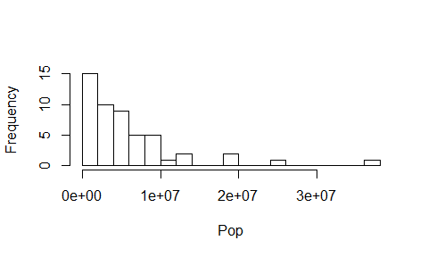
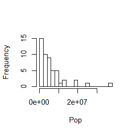

-   [1, Preliminary Options](#preliminary-options)
-   [2, Chunks](#chunks)
-   [3, Inputting Data](#inputting-data)
-   [4, Formatting Code Chunks](#formatting-code-chunks)
    -   [`eval=TRUE`; show the results (default).](#evaltrue-show-the-results-default.)
    -   [`eval=FALSE`; or no results.](#evalfalse-or-no-results.)
    -   [`results='markup'`; show split code/results/code/results (default).](#resultsmarkup-show-split-coderesultscoderesults-default.)
    -   [`eval='asis'`; show 'unboxed' results.](#evalasis-show-unboxed-results.)
    -   [`eval='hide'`; show code only.](#evalhide-show-code-only.)
    -   [`eval='hold'`; show code block/results block.](#evalhold-show-code-blockresults-block.)
    -   [`echo=TRUE`; show the code (default).](#echotrue-show-the-code-default.)
    -   [`echo=FALSE`; or no code.](#echofalse-or-no-code.)
    -   [`warning`, `error`, `message` are set to TRUE by default. They can be set of FALSE when running a library() code to avoid polluting the report.](#warning-error-message-are-set-to-true-by-default.-they-can-be-set-of-false-when-running-a-library-code-to-avoid-polluting-the-report.)
    -   [`tidy=TRUE/FALSE`; with the `formatR` and `shiny` packages (you manage spaces and indents) (FALSE by default).](#tidytruefalse-with-the-formatr-and-shiny-packages-you-manage-spaces-and-indents-false-by-default.)
    -   [cache=TRUE/FALSE; cache the results (FALSE by default).](#cachetruefalse-cache-the-results-false-by-default.)
    -   [`comment='##'`; the comments in results (by default).](#comment-the-comments-in-results-by-default.)
    -   [`comment='#'`; the new comments.](#comment-the-new-comments.)
    -   [code chunk `{r}`.](#code-chunk-r.)
    -   [code chunk `{code=NULL}`.](#code-chunk-codenull.)
    -   [code chunk `{text}`.](#code-chunk-text.)
    -   [code chunk `{python}`.](#code-chunk-python.)
    -   [`hightlight=TRUE`; hightlight the code (default).](#hightlighttrue-hightlight-the-code-default.)
    -   [`hightlight=FALSE`; or not.](#hightlightfalse-or-not.)
    -   [`prompt=TRUE`; add `>` before the code.](#prompttrue-add-before-the-code.)
    -   [`prompt=FALSE`; or not (default).](#promptfalse-or-not-default.)
    -   [`strip.white=TRUE`; remove white space from the code (default).](#strip.whitetrue-remove-white-space-from-the-code-default.)
    -   [`strip.white=FALSE`; or not.](#strip.whitefalse-or-not.)
-   [5, Formatting Plot Chunk](#formatting-plot-chunk)
    -   [`fig.path='figure/'`; new file path for this chunk.](#fig.pathfigure-new-file-path-for-this-chunk.)
    -   [The device prints .png files by default.](#the-device-prints-.png-files-by-default.)
    -   [`fig.width= , fig.height=`; change the box size (`=7` by default).](#fig.width-fig.height-change-the-box-size-7-by-default.)
    -   [`fig.width=5, fig.height=5`.](#fig.width5-fig.height5.)
    -   [`fig.height=3`.](#fig.height3.)
    -   [`fig.width=3`.](#fig.width3.)
    -   [`out.height=100, out.width=100`; in pixels.](#out.height100-out.width100-in-pixels.)
    -   [`resize.height=200, resize.width=200`; resize tike graphics for latex, in pixels.](#resize.height200-resize.width200-resize-tike-graphics-for-latex-in-pixels.)
    -   [`sanitize=TRUE`; sanitize 'tike' graphics for latex.](#sanitizetrue-sanitize-tike-graphics-for-latex.)
    -   [Set the device arguments:](#set-the-device-arguments)
    -   [dpi multiplier for .html output on retina screens:](#dpi-multiplier-for-.html-output-on-retina-screens)
    -   [`fig.align='left'` or `fig.align='default'`.](#fig.alignleft-or-fig.aligndefault.)
    -   [`fig.align='right'`.](#fig.alignright.)
    -   [`fig.align='center'`.](#fig.aligncenter.)
    -   [Figure captions at the bottom of the plot; figure caption in latex:](#figure-captions-at-the-bottom-of-the-plot-figure-caption-in-latex)
    -   [Versions](#versions)
    -   [`fig.pos='test'`; string to be used as the figure position arrangement in latex.](#fig.postest-string-to-be-used-as-the-figure-position-arrangement-in-latex.)
    -   [Show](#show)

------------------------------------------------------------------------

**Foreword**

-   Output options: the 'tango' syntax and the 'readable' theme.
-   Snippets and results.

------------------------------------------------------------------------

1, Preliminary Options
-------------------

Usually, the following code is set to FALSE (not showing in a report). These are the general options. Code and plot chunks overrule the general options.

``` r
knitr::opts_chunk$set(echo=TRUE, eval=TRUE, fig.height=3, fig.width=3)
```

2, Chunks
------

Naming a chunk is including it in the document outline. The outline is a navigation tool to jump though the document.

3, Inputting Data
--------------

The dataset comes from the [US Census Bureau](http://www.census.gov/popest/data/national/totals/2011/index.html). On their website, open Excel file 'NST-EST2011-02' about the annual estimates of the resident population.

The data have become an object: a data frame. Check it out, and add column names:

``` r
head(USstatePops,3)
```

    ##        V1      V2
    ## 1 Alabama 4779735
    ## 2  Alaska  710231
    ## 3 Arizona 6392013

``` r
colnames(USstatePops) <- c('State', 'Pop')

head(USstatePops, 3)
```

    ##     State     Pop
    ## 1 Alabama 4779735
    ## 2  Alaska  710231
    ## 3 Arizona 6392013

Check out the data frame:

``` r
str(USstatePops)
```

    ## 'data.frame':    51 obs. of  2 variables:
    ##  $ State: Factor w/ 51 levels "Alabama","Alaska",..: 1 2 3 4 5 6 7 8 9 10 ...
    ##  $ Pop  : int  4779735 710231 6392013 2915921 37253956 5029196 3574097 897934 601723 18801311 ...

The states should be strings, not factors.

Extract numbers or strings without any loss from a factor structure:

``` r
# make a copy for safety
USstatePops2 <- USstatePops

USstatePops2$State <- as.character(levels(USstatePops2$State))
```

Check out the new data frame:

``` r
str(USstatePops2)
```

    ## 'data.frame':    51 obs. of  2 variables:
    ##  $ State: chr  "Alabama" "Alaska" "Arizona" "Arkansas" ...
    ##  $ Pop  : int  4779735 710231 6392013 2915921 37253956 5029196 3574097 897934 601723 18801311 ...

``` r
head(USstatePops2, 3)
```

    ##     State     Pop
    ## 1 Alabama 4779735
    ## 2  Alaska  710231
    ## 3 Arizona 6392013

4, Formatting Code Chunks
----------------------

### `eval=TRUE`; show the results (default).

``` r
mean(USstatePops2$Pop)
```

    ## [1] 6053834

### `eval=FALSE`; or no results.

``` r
mean(USstatePops2$Pop)
```

### `results='markup'`; show split code/results/code/results (default).

``` r
mean(USstatePops2$Pop)
```

    ## [1] 6053834

``` r
median(USstatePops2$Pop)
```

    ## [1] 4339362

### `eval='asis'`; show 'unboxed' results.

``` r
mean(USstatePops2$Pop)
```

\[1\] 6053834

``` r
median(USstatePops2$Pop)
```

\[1\] 4339362

### `eval='hide'`; show code only.

``` r
mean(USstatePops2$Pop)
median(USstatePops2$Pop)
```

### `eval='hold'`; show code block/results block.

``` r
mean(USstatePops2$Pop)
median(USstatePops2$Pop)
```

    ## [1] 6053834
    ## [1] 4339362

------------------------------------------------------------------------

### `echo=TRUE`; show the code (default).

``` r
mean(USstatePops2$Pop)
```

    ## [1] 6053834

``` r
median(USstatePops2$Pop)
```

    ## [1] 4339362

### `echo=FALSE`; or no code.

    ## [1] 6053834

    ## [1] 4339362

------------------------------------------------------------------------

### `warning`, `error`, `message` are set to TRUE by default. They can be set of FALSE when running a library() code to avoid polluting the report.

``` text
{r, warning=TRUE, error=TRUE, message=TRUE}
```

------------------------------------------------------------------------

### `tidy=TRUE/FALSE`; with the `formatR` and `shiny` packages (you manage spaces and indents) (FALSE by default).

``` text
{r, tidy=TRUE}
```

------------------------------------------------------------------------

### cache=TRUE/FALSE; cache the results (FALSE by default).

Can be resused in future knits since it **creates a subdir (the 'cache')** with a R workspace, .rdb and .rdx files.

``` text
{r, cache=TRUE}
```

The `cache.path='cache/'` can be changed. See `cache-comments`, `cache.lazy`, `cache.vars`, `autodep`, `dependson`.

------------------------------------------------------------------------

### `comment='##'`; the comments in results (by default).

``` r
mean(USstatePops2$Pop)
```

    ## [1] 6053834

### `comment='#'`; the new comments.

``` r
mean(USstatePops2$Pop)
```

    # [1] 6053834

------------------------------------------------------------------------

### code chunk `{r}`.

``` r
list <- c(1, 2, 3)
list
```

    ## [1] 1 2 3

### code chunk `{code=NULL}`.

``` code
list <- c(1, 2, 3)
list
```

### code chunk `{text}`.

``` text
list <- c(1, 2, 3)
list
```

### code chunk `{python}`.

``` python
list = [1, 2, 3]
print(list)
```

Set up the new language first.

------------------------------------------------------------------------

### `hightlight=TRUE`; hightlight the code (default).

``` r
mean(USstatePops2$Pop)
```

    ## [1] 6053834

### `hightlight=FALSE`; or not.

``` r
mean(USstatePops2$Pop)
```

    ## [1] 6053834

### `prompt=TRUE`; add `>` before the code.

``` r
> mean(USstatePops2$Pop)
```

    ## [1] 6053834

### `prompt=FALSE`; or not (default).

``` r
mean(USstatePops2$Pop)
```

    ## [1] 6053834

### `strip.white=TRUE`; remove white space from the code (default).

``` r
mean(USstatePops2$Pop)
```

    ## [1] 6053834

### `strip.white=FALSE`; or not.

``` r
mean(USstatePops2$Pop)
```

    ## [1] 6053834

5, Formatting Plot Chunk
---------------------

Prints the plots in the .html report and and creates a subdir with the plot files (the references).

### `fig.path='figure/'`; new file path for this chunk.

Otherwise, the path is set in the general options.

``` r
hist(USstatePops2$Pop, breaks = 20, main = '', xlab = 'Pop')
```


### The device prints .png files by default.

It can be changed to other formats.

`dev='png'`.

``` r
hist(USstatePops2$Pop, breaks = 20, main = '', xlab = 'Pop')
```


`dev='jpeg'`.

``` r
hist(USstatePops2$Pop, breaks = 20, main = '', xlab = 'Pop')
```


`dev='pdf'`; `'pdf'` cannot be printed in the .html report, but only included in the subdir.

``` r
hist(USstatePops2$Pop, breaks = 20, main ='', xlab = 'Pop')
```


------------------------------------------------------------------------

### `fig.width= , fig.height=`; change the box size (`=7` by default).

``` r
hist(USstatePops2$Pop, breaks = 20, main ='', xlab = 'Pop')
```


### `fig.width=5, fig.height=5`.

``` r
hist(USstatePops2$Pop, breaks = 20, main ='', xlab = 'Pop')
```


### `fig.height=3`.

``` r
hist(USstatePops2$Pop, breaks = 20, main ='', xlab = 'Pop')
```


### `fig.width=3`.

``` r
hist(USstatePops2$Pop, breaks = 20, main ='', xlab = 'Pop')
```



### `out.height=100, out.width=100`; in pixels.

``` r
hist(USstatePops2$Pop, breaks = 20, main ='', xlab = 'Pop')
```


------------------------------------------------------------------------

### `resize.height=200, resize.width=200`; resize tike graphics for latex, in pixels.

``` r
hist(USstatePops2$Pop, breaks = 20, main ='', xlab = 'Pop')
```


### `sanitize=TRUE`; sanitize 'tike' graphics for latex.

``` r
hist(USstatePops2$Pop, breaks = 20, main ='', xlab = 'Pop')
```


------------------------------------------------------------------------

### Set the device arguments:

`dev.args=list(bg='yellow', pointsize=10)`.

``` r
hist(USstatePops2$Pop, breaks = 20, main ='', xlab = 'Pop')
```


`dev.args=list(pointsize=8), fig.height=3`.

``` r
hist(USstatePops2$Pop, breaks = 20, main ='', xlab = 'Pop')
```


------------------------------------------------------------------------

#### dots per inch.

`dpi=72`.

``` r
hist(USstatePops2$Pop, breaks = 20, main ='', xlab = 'Pop')
```


`dpi=90`.

``` r
hist(USstatePops2$Pop, breaks = 20, main ='', xlab = 'Pop')
```



### dpi multiplier for .html output on retina screens:

`fig.retina=1`

``` r
hist(USstatePops2$Pop, breaks = 20, main ='', xlab = 'Pop')
```


`fig.retina=2`; double dpi.

``` r
hist(USstatePops2$Pop, breaks = 20, main ='', xlab = 'Pop')
```


------------------------------------------------------------------------

### `fig.align='left'` or `fig.align='default'`.

``` r
hist(USstatePops2$Pop, breaks = 20, main ='', xlab = 'Pop')
```


### `fig.align='right'`.

### `fig.align='center'`.

``` r
hist(USstatePops2$Pop, breaks = 20, main ='', xlab = 'Pop')
```

<center></center>

------------------------------------------------------------------------

### Figure captions at the bottom of the plot; figure caption in latex:

`fig.cap='CAPTION 14'`.

``` r
hist(USstatePops2$Pop, breaks = 20, main ='', xlab = 'Pop')
```


See:

-   `fig.lp=''`; figure caption prefix
-   `fig.scap=''`; short figure caption prefix.
-   `fig.subcap=''`; subcaption.
-   `fig.env=''`; the latex environment for figures.

------------------------------------------------------------------------

### Versions

`fig.keep='high'`; merge low-level changes into high-level plots.

``` r
hist(USstatePops2$Pop, breaks = 20, main ='', xlab = 'Pop')
```


See:

-   `fig.keep='all'`; keep all plots (low-level changes may produce new plots).
-   `fig.keep='first'/'last'`; keep the first/last plot only.
-   `fig.keep='none'`; discard all plots.

------------------------------------------------------------------------

### `fig.pos='test'`; string to be used as the figure position arrangement in latex.

``` r
hist(USstatePops2$Pop, breaks = 20, main = '', xlab = 'Pop')
```


------------------------------------------------------------------------

### Show

`fig.show='asis'`.

``` r
hist(USstatePops2$Pop, breaks = 10, main = '', xlab = 'Pop')
```


``` r
hist(USstatePops2$Pop, breaks = 20, main = '', xlab = 'Pop')
```


-   `fig.show='hold'`; display the plots at the very end of the chunk.

<!-- -->

``` r
hist(USstatePops2$Pop, breaks = 10, main = '', xlab = 'Pop')
hist(USstatePops2$Pop, breaks = 20, main = '', xlab = 'Pop')
```


See:

-   `fig.show='hide'`; generate the plots, but not in the final document.
-   `fig.show='animate'`; combine all of the plots created into an animation. Additional packages and settings are required.

------------------------------------------------------------------------