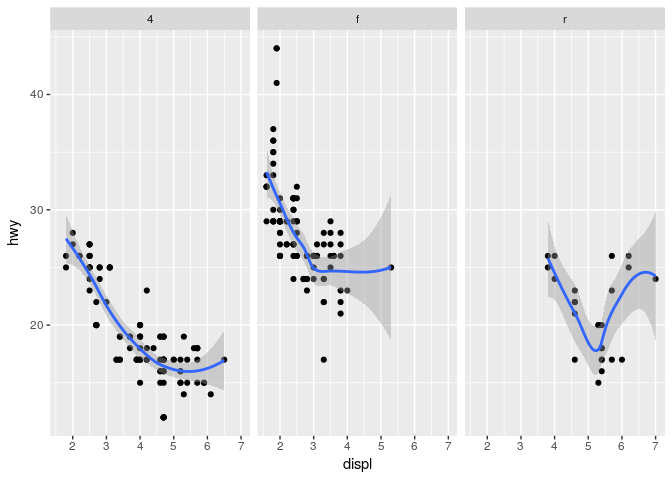
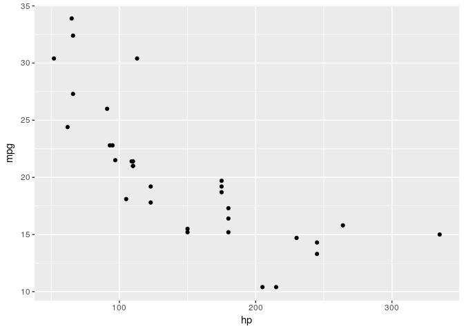

[TOC]

------------------------------------------------------------------------

**Foreword**

Code snippets and excerpts from the tutorial. From DataCamp.

------------------------------------------------------------------------

Overall data structures
=======================

    # Create variables
    a <- c(1,2,3,4,5,6,7,8,9)
    b <- list(x = LifeCycleSavings[,1], y = LifeCycleSavings[,2])

    # Retrieve the types of `a` and `b`
    # atomic data types
    typeof(a)

    ## [1] "double"

    typeof(b)

    ## [1] "list"

    # Retrieve the classes of `a` and `b`
    # for attributes, methods attached
    class(a)

    ## [1] "numeric"

    class(b)

    ## [1] "list"

Note that if an object does not have a class attribute, it has an
implicit `class`, "matrix", "array" or the result of the `mode()`
function.

Dates and formulas are a special class.

    # Retrieve the object type
    typeof(quote(x * 10))

    ## [1] "language"

    # Retrieve the class
    class(quote(x * 10))

    ## [1] "call"

    # A formula
    c <- y ~ x # Sepal.Width ~ Petal.Width
    d <- y ~ x + b # Sepal.Width ~ Petal.Width + Species

    # Double check the class of `c`
    class(c)

    ## [1] "formula"

    # Return the type of `d`
    typeof(c)

    ## [1] "language"

    # Retrieve the attributes of `d`
    attributes(c)

    ## $class
    ## [1] "formula"
    ## 
    ## $.Environment
    ## <environment: R_GlobalEnv>

Formula structures
==================

-   Independent variables appear as "predictor (variable)", "controlled
    variable", "feature", etc.
-   Dependent variables are "response variable", "outcome variable"
    or "label".

<!-- -->

    e <- ~ x + y + z
    f <- y ~ x + b 

    # Return the length of `g`
    length(e)

    ## [1] 2

    length(f)

    ## [1] 3

    # Retrieve the elements at index 1 and 2
    e[[1]]

    ## `~`

    e[[2]]

    ## x + y + z

    f[[1]]

    ## `~`

    f[[2]]

    ## y

    f[[3]]

    ## x + b

Formulation
-----------

-   `y ~ x + a + b` where "y is a function of x, a, and b".
-   `Sepal.Width ~ Petal.Width | Species` where "the sepal width is a
    function of petal width, conditioned on species".

<!-- -->

    "y ~ x1 + x2"
    h <- as.formula("y ~ x1 + x2")
    h <- formula("y ~ x1 + x2")

Concatenation
-------------

    # Create variables
    i <- y ~ x
    j <- y ~ x + x1
    k <- y ~ x + x1 + x2

    # Concatentate
    formulae <- list(as.formula(i), as.formula(j), as.formula(k))
    formulae

    ## [[1]]
    ## y ~ x
    ## 
    ## [[2]]
    ## y ~ x + x1
    ## 
    ## [[3]]
    ## y ~ x + x1 + x2

    # Double check the class of the list elements
    class(formulae[[1]])

    ## [1] "formula"

    # Join all with `c()`
    l <- c(i, j, k)

    # Apply `as.formula` to all elements of `f`
    lapply(l, as.formula)

    ## [[1]]
    ## y ~ x
    ## 
    ## [[2]]
    ## y ~ x + x1
    ## 
    ## [[3]]
    ## y ~ x + x1 + x2

Operators
---------

-   `-` for removing terms,
-   `:` for interaction for the variable' interaction, not the variable
    itself (regression),
-   `*` for crossing: include two variables and their interaction
    (regression),
-   `%in%` for nesting,
-   `^` for limit crossing to the specified degree,
-   `-1` for removing the intercept.

<!-- -->

    # Use multiple independent variables
    y ~ x1 + x2

    ## y ~ x1 + x2

    # Ignore objects in an analysis
    y ~ x1 - x2

    ## y ~ x1 - x2

    # Interactions
    y ~ x1 * x2

    ## y ~ x1 * x2

    # or
    y ~ x1 + x2 + x1:x2

    ## y ~ x1 + x2 + x1:x2

    # No intercept
    y ~ x1 * x2 -1

    ## y ~ x1 * x2 - 1

    y ~ 0 + x1 * x2

    ## y ~ 0 + x1 * x2

    # Nesting
    y ~ a + a:b

    ## y ~ a + a:b

    # or
    y ~ a + b %in% a

    ## y ~ a + b %in% a

    # Quadratic regression
    y ~ x + I(x^2)

    ## y ~ x + I(x^2)

    # Polynomial regression
    y ~ x + I(x^2) + I(x^3)

    ## y ~ x + I(x^2) + I(x^3)

    # Factorial ANOVA
    y ~ (a*b*c)^2

    ## y ~ (a * b * c)^2

    # All independent variables
    y ~ .

    ## y ~ .

Examine formulas
================

    m <- formula("y ~ x1 + x2")

    attributes(m)

    ## $class
    ## [1] "formula"
    ## 
    ## $.Environment
    ## <environment: R_GlobalEnv>

    typeof(m)

    ## [1] "language"

    class(m)

    ## [1] "formula"

    terms(m)

    ## y ~ x1 + x2
    ## attr(,"variables")
    ## list(y, x1, x2)
    ## attr(,"factors")
    ##    x1 x2
    ## y   0  0
    ## x1  1  0
    ## x2  0  1
    ## attr(,"term.labels")
    ## [1] "x1" "x2"
    ## attr(,"order")
    ## [1] 1 1
    ## attr(,"intercept")
    ## [1] 1
    ## attr(,"response")
    ## [1] 1
    ## attr(,".Environment")
    ## <environment: R_GlobalEnv>

    print(all.vars(m))

    ## [1] "y"  "x1" "x2"

    library(plyr)
    is.formula(m)

    ## [1] TRUE

Modify formulas
===============

    update(y ~ x1 + x2, ~ . + x3)

    ## y ~ x1 + x2 + x3

Use formulas
============

Linear models
-------------

    lm.m <- lm(Sepal.Width ~ Petal.Width + log(Petal.Length) + Species, 
            data = iris, 
            subset = Sepal.Length > 4.6)

    print(lm.m)

    ## 
    ## Call:
    ## lm(formula = Sepal.Width ~ Petal.Width + log(Petal.Length) + 
    ##     Species, data = iris, subset = Sepal.Length > 4.6)
    ## 
    ## Coefficients:
    ##       (Intercept)        Petal.Width  log(Petal.Length)  
    ##            3.1531             0.6620             0.4612  
    ## Speciesversicolor   Speciesvirginica  
    ##           -1.9265            -2.3088

Get back a data.frame of the fitted object
------------------------------------------

    stats::model.frame(formula = Sepal.Width ~ Petal.Width + log(Petal.Length) + Species, 
                       data = iris, 
                       subset = Sepal.Length > 6.9, 
                       drop.unused.levels = TRUE)

    ##     Sepal.Width Petal.Width log(Petal.Length)    Species
    ## 51          3.2         1.4          1.547563 versicolor
    ## 103         3.0         2.1          1.774952  virginica
    ## 106         3.0         2.1          1.887070  virginica
    ## 108         2.9         1.8          1.840550  virginica
    ## 110         3.6         2.5          1.808289  virginica
    ## 118         3.8         2.2          1.902108  virginica
    ## 119         2.6         2.3          1.931521  virginica
    ## 123         2.8         2.0          1.902108  virginica
    ## 126         3.2         1.8          1.791759  virginica
    ## 130         3.0         1.6          1.757858  virginica
    ## 131         2.8         1.9          1.808289  virginica
    ## 132         3.8         2.0          1.856298  virginica
    ## 136         3.0         2.3          1.808289  virginica

Mixed-effect models
-------------------

The `nlme` and the `lme4` package are dedicated to fitting linear and
generalized linear mixed-effects models.

    # Load packages
    library(MASS)
    library(nlme)

    # Get some data 
    data(oats)

    # Adjust the data names and columns
    names(oats) = c('block', 'variety', 'nitrogen', 'yield')
    oats$mainplot = oats$variety
    oats$subplot = oats$nitrogen

    # Fit a non-linear mixed-effects model 
    nlme.m = lme(yield ~ variety*nitrogen,
                 random = ~ 1|block/mainplot,
                 data = oats)

    # Retrieve a summary
    summary(nlme.m)

    ## Linear mixed-effects model fit by REML
    ##  Data: oats 
    ##        AIC      BIC    logLik
    ##   559.0285 590.4437 -264.5143
    ## 
    ## Random effects:
    ##  Formula: ~1 | block
    ##         (Intercept)
    ## StdDev:    14.64496
    ## 
    ##  Formula: ~1 | mainplot %in% block
    ##         (Intercept) Residual
    ## StdDev:    10.29864 13.30727
    ## 
    ## Fixed effects: yield ~ variety * nitrogen 
    ##                                     Value Std.Error DF   t-value p-value
    ## (Intercept)                      80.00000  9.106959 45  8.784491  0.0000
    ## varietyMarvellous                 6.66667  9.715030 10  0.686222  0.5082
    ## varietyVictory                   -8.50000  9.715030 10 -0.874933  0.4021
    ## nitrogen0.2cwt                   18.50000  7.682956 45  2.407927  0.0202
    ## nitrogen0.4cwt                   34.66667  7.682956 45  4.512152  0.0000
    ## nitrogen0.6cwt                   44.83333  7.682956 45  5.835427  0.0000
    ## varietyMarvellous:nitrogen0.2cwt  3.33333 10.865341 45  0.306786  0.7604
    ## varietyVictory:nitrogen0.2cwt    -0.33333 10.865341 45 -0.030679  0.9757
    ## varietyMarvellous:nitrogen0.4cwt -4.16667 10.865341 45 -0.383482  0.7032
    ## varietyVictory:nitrogen0.4cwt     4.66667 10.865341 45  0.429500  0.6696
    ## varietyMarvellous:nitrogen0.6cwt -4.66667 10.865341 45 -0.429500  0.6696
    ## varietyVictory:nitrogen0.6cwt     2.16667 10.865341 45  0.199411  0.8428
    ##  Correlation: 
    ##                                  (Intr) vrtyMr vrtyVc ntr0.2 ntr0.4 ntr0.6
    ## varietyMarvellous                -0.533                                   
    ## varietyVictory                   -0.533  0.500                            
    ## nitrogen0.2cwt                   -0.422  0.395  0.395                     
    ## nitrogen0.4cwt                   -0.422  0.395  0.395  0.500              
    ## nitrogen0.6cwt                   -0.422  0.395  0.395  0.500  0.500       
    ## varietyMarvellous:nitrogen0.2cwt  0.298 -0.559 -0.280 -0.707 -0.354 -0.354
    ## varietyVictory:nitrogen0.2cwt     0.298 -0.280 -0.559 -0.707 -0.354 -0.354
    ## varietyMarvellous:nitrogen0.4cwt  0.298 -0.559 -0.280 -0.354 -0.707 -0.354
    ## varietyVictory:nitrogen0.4cwt     0.298 -0.280 -0.559 -0.354 -0.707 -0.354
    ## varietyMarvellous:nitrogen0.6cwt  0.298 -0.559 -0.280 -0.354 -0.354 -0.707
    ## varietyVictory:nitrogen0.6cwt     0.298 -0.280 -0.559 -0.354 -0.354 -0.707
    ##                                  vM:0.2 vV:0.2 vM:0.4 vV:0.4 vM:0.6
    ## varietyMarvellous                                                  
    ## varietyVictory                                                     
    ## nitrogen0.2cwt                                                     
    ## nitrogen0.4cwt                                                     
    ## nitrogen0.6cwt                                                     
    ## varietyMarvellous:nitrogen0.2cwt                                   
    ## varietyVictory:nitrogen0.2cwt     0.500                            
    ## varietyMarvellous:nitrogen0.4cwt  0.500  0.250                     
    ## varietyVictory:nitrogen0.4cwt     0.250  0.500  0.500              
    ## varietyMarvellous:nitrogen0.6cwt  0.500  0.250  0.500  0.250       
    ## varietyVictory:nitrogen0.6cwt     0.250  0.500  0.250  0.500  0.500
    ## 
    ## Standardized Within-Group Residuals:
    ##         Min          Q1         Med          Q3         Max 
    ## -1.81300913 -0.56144819  0.01758018  0.63864472  1.57034195 
    ## 
    ## Number of Observations: 72
    ## Number of Groups: 
    ##               block mainplot %in% block 
    ##                   6                  18

Non-linear models
-----------------

    # Set seed
    set.seed(20160227)

    # Data
    x <- seq(0,50,1)
    y <- ((runif(1,10,20)*x)/(runif(1,0,10)+x))+rnorm(51,0,1)

    # Non-linear model
    nls.m <- nls(y ~ a*x/(b+x), 
                 start=c(a=4, b=1))

Generalized Linear Models (GLM)
-------------------------------

    # Load package
    library(MPDiR)

    # Get the data
    data(Chromatic)

    # Model
    glm.m <- glm(Thresh ~ Axis:(I(Age^-1) + Age),
                 family = Gamma(link = "identity"), 
                 data = Chromatic)

    # Get back a summary
    summary(glm.m)

    ## 
    ## Call:
    ## glm(formula = Thresh ~ Axis:(I(Age^-1) + Age), family = Gamma(link = "identity"), 
    ##     data = Chromatic)
    ## 
    ## Deviance Residuals: 
    ##     Min       1Q   Median       3Q      Max  
    ## -1.2160  -0.3728  -0.0805   0.2311   1.2932  
    ## 
    ## Coefficients:
    ##                       Estimate Std. Error t value Pr(>|t|)    
    ## (Intercept)          3.282e-04  9.965e-05   3.294  0.00106 ** 
    ## AxisDeutan:I(Age^-1) 7.803e-03  3.686e-04  21.172  < 2e-16 ***
    ## AxisProtan:I(Age^-1) 8.271e-03  3.863e-04  21.410  < 2e-16 ***
    ## AxisTritan:I(Age^-1) 1.166e-02  5.284e-04  22.065  < 2e-16 ***
    ## AxisDeutan:Age       1.521e-05  3.418e-06   4.450 1.06e-05 ***
    ## AxisProtan:Age       1.540e-05  3.434e-06   4.484 9.10e-06 ***
    ## AxisTritan:Age       4.812e-05  5.838e-06   8.241 1.48e-15 ***
    ## ---
    ## Signif. codes:  0 '***' 0.001 '**' 0.01 '*' 0.05 '.' 0.1 ' ' 1
    ## 
    ## (Dispersion parameter for Gamma family taken to be 0.2054848)
    ## 
    ##     Null deviance: 543.35  on 510  degrees of freedom
    ## Residual deviance: 100.40  on 504  degrees of freedom
    ## AIC: -4777.6
    ## 
    ## Number of Fisher Scoring iterations: 6

Use formulas in graphical functions
===================================

Basic
-----

    # Get data
    data(airquality)

    # Plot
    plot(Ozone ~ Wind, data = airquality, pch = as.character(Month))

The `lattice` package
---------------------

    # Load package
    library(lattice)

    # Plot histogram
    histogram(~ Ozone | factor(Month), 
              data = airquality, 
              layout = c(2, 3),
              xlab = "Ozone (ppb)")

The `ggplot2` package
---------------------

    # Load package
    library(ggplot2)

    # Plot
    ggplot(mpg, aes(displ, hwy)) +
      geom_point() +
      geom_smooth(method = "lm", 
                  formula = y ~ splines::bs(x, 3), 
                  se = FALSE)

    ggplot(mpg, aes(displ, hwy)) +
      geom_point() +
      geom_smooth(span = 0.8) +
      facet_wrap(~drv)

The `ggformula` package
-----------------------

`ggplot2`, but provides an interface that is based on formulas like the
`lattice` package. Check out the vignette.

    # Load package
    library(ggformula)

    # Plot
    gf_point(mpg ~ hp, data = mtcars)

The `dplyr` package
-------------------

Standard and non-standard evaluation.

    # Load `dplyr`
    library(dplyr)

    # NSE evaluation
    select(iris, Sepal.Length, Petal.Length)

    ##     Sepal.Length Petal.Length
    ## 1            5.1          1.4
    ## 2            4.9          1.4
    ## 3            4.7          1.3
    ## 4            4.6          1.5
    ## 5            5.0          1.4
    ## 6            5.4          1.7
    ## 7            4.6          1.4
    ## 8            5.0          1.5
    ## 9            4.4          1.4
    ## 10           4.9          1.5
    ## 11           5.4          1.5
    ## 12           4.8          1.6
    ## 13           4.8          1.4
    ## 14           4.3          1.1
    ## 15           5.8          1.2
    ## 16           5.7          1.5
    ## 17           5.4          1.3
    ## 18           5.1          1.4
    ## 19           5.7          1.7
    ## 20           5.1          1.5
    ## 21           5.4          1.7
    ## 22           5.1          1.5
    ## 23           4.6          1.0
    ## 24           5.1          1.7
    ## 25           4.8          1.9
    ## 26           5.0          1.6
    ## 27           5.0          1.6
    ## 28           5.2          1.5
    ## 29           5.2          1.4
    ## 30           4.7          1.6
    ## 31           4.8          1.6
    ## 32           5.4          1.5
    ## 33           5.2          1.5
    ## 34           5.5          1.4
    ## 35           4.9          1.5
    ## 36           5.0          1.2
    ## 37           5.5          1.3
    ## 38           4.9          1.4
    ## 39           4.4          1.3
    ## 40           5.1          1.5
    ## 41           5.0          1.3
    ## 42           4.5          1.3
    ## 43           4.4          1.3
    ## 44           5.0          1.6
    ## 45           5.1          1.9
    ## 46           4.8          1.4
    ## 47           5.1          1.6
    ## 48           4.6          1.4
    ## 49           5.3          1.5
    ## 50           5.0          1.4
    ## 51           7.0          4.7
    ## 52           6.4          4.5
    ## 53           6.9          4.9
    ## 54           5.5          4.0
    ## 55           6.5          4.6
    ## 56           5.7          4.5
    ## 57           6.3          4.7
    ## 58           4.9          3.3
    ## 59           6.6          4.6
    ## 60           5.2          3.9
    ## 61           5.0          3.5
    ## 62           5.9          4.2
    ## 63           6.0          4.0
    ## 64           6.1          4.7
    ## 65           5.6          3.6
    ## 66           6.7          4.4
    ## 67           5.6          4.5
    ## 68           5.8          4.1
    ## 69           6.2          4.5
    ## 70           5.6          3.9
    ## 71           5.9          4.8
    ## 72           6.1          4.0
    ## 73           6.3          4.9
    ## 74           6.1          4.7
    ## 75           6.4          4.3
    ## 76           6.6          4.4
    ## 77           6.8          4.8
    ## 78           6.7          5.0
    ## 79           6.0          4.5
    ## 80           5.7          3.5
    ## 81           5.5          3.8
    ## 82           5.5          3.7
    ## 83           5.8          3.9
    ## 84           6.0          5.1
    ## 85           5.4          4.5
    ## 86           6.0          4.5
    ## 87           6.7          4.7
    ## 88           6.3          4.4
    ## 89           5.6          4.1
    ## 90           5.5          4.0
    ## 91           5.5          4.4
    ## 92           6.1          4.6
    ## 93           5.8          4.0
    ## 94           5.0          3.3
    ## 95           5.6          4.2
    ## 96           5.7          4.2
    ## 97           5.7          4.2
    ## 98           6.2          4.3
    ## 99           5.1          3.0
    ## 100          5.7          4.1
    ## 101          6.3          6.0
    ## 102          5.8          5.1
    ## 103          7.1          5.9
    ## 104          6.3          5.6
    ## 105          6.5          5.8
    ## 106          7.6          6.6
    ## 107          4.9          4.5
    ## 108          7.3          6.3
    ## 109          6.7          5.8
    ## 110          7.2          6.1
    ## 111          6.5          5.1
    ## 112          6.4          5.3
    ## 113          6.8          5.5
    ## 114          5.7          5.0
    ## 115          5.8          5.1
    ## 116          6.4          5.3
    ## 117          6.5          5.5
    ## 118          7.7          6.7
    ## 119          7.7          6.9
    ## 120          6.0          5.0
    ## 121          6.9          5.7
    ## 122          5.6          4.9
    ## 123          7.7          6.7
    ## 124          6.3          4.9
    ## 125          6.7          5.7
    ## 126          7.2          6.0
    ## 127          6.2          4.8
    ## 128          6.1          4.9
    ## 129          6.4          5.6
    ## 130          7.2          5.8
    ## 131          7.4          6.1
    ## 132          7.9          6.4
    ## 133          6.4          5.6
    ## 134          6.3          5.1
    ## 135          6.1          5.6
    ## 136          7.7          6.1
    ## 137          6.3          5.6
    ## 138          6.4          5.5
    ## 139          6.0          4.8
    ## 140          6.9          5.4
    ## 141          6.7          5.6
    ## 142          6.9          5.1
    ## 143          5.8          5.1
    ## 144          6.8          5.9
    ## 145          6.7          5.7
    ## 146          6.7          5.2
    ## 147          6.3          5.0
    ## 148          6.5          5.2
    ## 149          6.2          5.4
    ## 150          5.9          5.1

    # standard evaluation 
    select_(iris, ~Sepal.Length)

    ##     Sepal.Length
    ## 1            5.1
    ## 2            4.9
    ## 3            4.7
    ## 4            4.6
    ## 5            5.0
    ## 6            5.4
    ## 7            4.6
    ## 8            5.0
    ## 9            4.4
    ## 10           4.9
    ## 11           5.4
    ## 12           4.8
    ## 13           4.8
    ## 14           4.3
    ## 15           5.8
    ## 16           5.7
    ## 17           5.4
    ## 18           5.1
    ## 19           5.7
    ## 20           5.1
    ## 21           5.4
    ## 22           5.1
    ## 23           4.6
    ## 24           5.1
    ## 25           4.8
    ## 26           5.0
    ## 27           5.0
    ## 28           5.2
    ## 29           5.2
    ## 30           4.7
    ## 31           4.8
    ## 32           5.4
    ## 33           5.2
    ## 34           5.5
    ## 35           4.9
    ## 36           5.0
    ## 37           5.5
    ## 38           4.9
    ## 39           4.4
    ## 40           5.1
    ## 41           5.0
    ## 42           4.5
    ## 43           4.4
    ## 44           5.0
    ## 45           5.1
    ## 46           4.8
    ## 47           5.1
    ## 48           4.6
    ## 49           5.3
    ## 50           5.0
    ## 51           7.0
    ## 52           6.4
    ## 53           6.9
    ## 54           5.5
    ## 55           6.5
    ## 56           5.7
    ## 57           6.3
    ## 58           4.9
    ## 59           6.6
    ## 60           5.2
    ## 61           5.0
    ## 62           5.9
    ## 63           6.0
    ## 64           6.1
    ## 65           5.6
    ## 66           6.7
    ## 67           5.6
    ## 68           5.8
    ## 69           6.2
    ## 70           5.6
    ## 71           5.9
    ## 72           6.1
    ## 73           6.3
    ## 74           6.1
    ## 75           6.4
    ## 76           6.6
    ## 77           6.8
    ## 78           6.7
    ## 79           6.0
    ## 80           5.7
    ## 81           5.5
    ## 82           5.5
    ## 83           5.8
    ## 84           6.0
    ## 85           5.4
    ## 86           6.0
    ## 87           6.7
    ## 88           6.3
    ## 89           5.6
    ## 90           5.5
    ## 91           5.5
    ## 92           6.1
    ## 93           5.8
    ## 94           5.0
    ## 95           5.6
    ## 96           5.7
    ## 97           5.7
    ## 98           6.2
    ## 99           5.1
    ## 100          5.7
    ## 101          6.3
    ## 102          5.8
    ## 103          7.1
    ## 104          6.3
    ## 105          6.5
    ## 106          7.6
    ## 107          4.9
    ## 108          7.3
    ## 109          6.7
    ## 110          7.2
    ## 111          6.5
    ## 112          6.4
    ## 113          6.8
    ## 114          5.7
    ## 115          5.8
    ## 116          6.4
    ## 117          6.5
    ## 118          7.7
    ## 119          7.7
    ## 120          6.0
    ## 121          6.9
    ## 122          5.6
    ## 123          7.7
    ## 124          6.3
    ## 125          6.7
    ## 126          7.2
    ## 127          6.2
    ## 128          6.1
    ## 129          6.4
    ## 130          7.2
    ## 131          7.4
    ## 132          7.9
    ## 133          6.4
    ## 134          6.3
    ## 135          6.1
    ## 136          7.7
    ## 137          6.3
    ## 138          6.4
    ## 139          6.0
    ## 140          6.9
    ## 141          6.7
    ## 142          6.9
    ## 143          5.8
    ## 144          6.8
    ## 145          6.7
    ## 146          6.7
    ## 147          6.3
    ## 148          6.5
    ## 149          6.2
    ## 150          5.9

    select_(iris, ~Sepal.Length, ~Petal.Length) #works

    ##     Sepal.Length Petal.Length
    ## 1            5.1          1.4
    ## 2            4.9          1.4
    ## 3            4.7          1.3
    ## 4            4.6          1.5
    ## 5            5.0          1.4
    ## 6            5.4          1.7
    ## 7            4.6          1.4
    ## 8            5.0          1.5
    ## 9            4.4          1.4
    ## 10           4.9          1.5
    ## 11           5.4          1.5
    ## 12           4.8          1.6
    ## 13           4.8          1.4
    ## 14           4.3          1.1
    ## 15           5.8          1.2
    ## 16           5.7          1.5
    ## 17           5.4          1.3
    ## 18           5.1          1.4
    ## 19           5.7          1.7
    ## 20           5.1          1.5
    ## 21           5.4          1.7
    ## 22           5.1          1.5
    ## 23           4.6          1.0
    ## 24           5.1          1.7
    ## 25           4.8          1.9
    ## 26           5.0          1.6
    ## 27           5.0          1.6
    ## 28           5.2          1.5
    ## 29           5.2          1.4
    ## 30           4.7          1.6
    ## 31           4.8          1.6
    ## 32           5.4          1.5
    ## 33           5.2          1.5
    ## 34           5.5          1.4
    ## 35           4.9          1.5
    ## 36           5.0          1.2
    ## 37           5.5          1.3
    ## 38           4.9          1.4
    ## 39           4.4          1.3
    ## 40           5.1          1.5
    ## 41           5.0          1.3
    ## 42           4.5          1.3
    ## 43           4.4          1.3
    ## 44           5.0          1.6
    ## 45           5.1          1.9
    ## 46           4.8          1.4
    ## 47           5.1          1.6
    ## 48           4.6          1.4
    ## 49           5.3          1.5
    ## 50           5.0          1.4
    ## 51           7.0          4.7
    ## 52           6.4          4.5
    ## 53           6.9          4.9
    ## 54           5.5          4.0
    ## 55           6.5          4.6
    ## 56           5.7          4.5
    ## 57           6.3          4.7
    ## 58           4.9          3.3
    ## 59           6.6          4.6
    ## 60           5.2          3.9
    ## 61           5.0          3.5
    ## 62           5.9          4.2
    ## 63           6.0          4.0
    ## 64           6.1          4.7
    ## 65           5.6          3.6
    ## 66           6.7          4.4
    ## 67           5.6          4.5
    ## 68           5.8          4.1
    ## 69           6.2          4.5
    ## 70           5.6          3.9
    ## 71           5.9          4.8
    ## 72           6.1          4.0
    ## 73           6.3          4.9
    ## 74           6.1          4.7
    ## 75           6.4          4.3
    ## 76           6.6          4.4
    ## 77           6.8          4.8
    ## 78           6.7          5.0
    ## 79           6.0          4.5
    ## 80           5.7          3.5
    ## 81           5.5          3.8
    ## 82           5.5          3.7
    ## 83           5.8          3.9
    ## 84           6.0          5.1
    ## 85           5.4          4.5
    ## 86           6.0          4.5
    ## 87           6.7          4.7
    ## 88           6.3          4.4
    ## 89           5.6          4.1
    ## 90           5.5          4.0
    ## 91           5.5          4.4
    ## 92           6.1          4.6
    ## 93           5.8          4.0
    ## 94           5.0          3.3
    ## 95           5.6          4.2
    ## 96           5.7          4.2
    ## 97           5.7          4.2
    ## 98           6.2          4.3
    ## 99           5.1          3.0
    ## 100          5.7          4.1
    ## 101          6.3          6.0
    ## 102          5.8          5.1
    ## 103          7.1          5.9
    ## 104          6.3          5.6
    ## 105          6.5          5.8
    ## 106          7.6          6.6
    ## 107          4.9          4.5
    ## 108          7.3          6.3
    ## 109          6.7          5.8
    ## 110          7.2          6.1
    ## 111          6.5          5.1
    ## 112          6.4          5.3
    ## 113          6.8          5.5
    ## 114          5.7          5.0
    ## 115          5.8          5.1
    ## 116          6.4          5.3
    ## 117          6.5          5.5
    ## 118          7.7          6.7
    ## 119          7.7          6.9
    ## 120          6.0          5.0
    ## 121          6.9          5.7
    ## 122          5.6          4.9
    ## 123          7.7          6.7
    ## 124          6.3          4.9
    ## 125          6.7          5.7
    ## 126          7.2          6.0
    ## 127          6.2          4.8
    ## 128          6.1          4.9
    ## 129          6.4          5.6
    ## 130          7.2          5.8
    ## 131          7.4          6.1
    ## 132          7.9          6.4
    ## 133          6.4          5.6
    ## 134          6.3          5.1
    ## 135          6.1          5.6
    ## 136          7.7          6.1
    ## 137          6.3          5.6
    ## 138          6.4          5.5
    ## 139          6.0          4.8
    ## 140          6.9          5.4
    ## 141          6.7          5.6
    ## 142          6.9          5.1
    ## 143          5.8          5.1
    ## 144          6.8          5.9
    ## 145          6.7          5.7
    ## 146          6.7          5.2
    ## 147          6.3          5.0
    ## 148          6.5          5.2
    ## 149          6.2          5.4
    ## 150          5.9          5.1

    select_(iris, quote(Sepal.Length), quote(Petal.Length)) # yes!

    ##     Sepal.Length Petal.Length
    ## 1            5.1          1.4
    ## 2            4.9          1.4
    ## 3            4.7          1.3
    ## 4            4.6          1.5
    ## 5            5.0          1.4
    ## 6            5.4          1.7
    ## 7            4.6          1.4
    ## 8            5.0          1.5
    ## 9            4.4          1.4
    ## 10           4.9          1.5
    ## 11           5.4          1.5
    ## 12           4.8          1.6
    ## 13           4.8          1.4
    ## 14           4.3          1.1
    ## 15           5.8          1.2
    ## 16           5.7          1.5
    ## 17           5.4          1.3
    ## 18           5.1          1.4
    ## 19           5.7          1.7
    ## 20           5.1          1.5
    ## 21           5.4          1.7
    ## 22           5.1          1.5
    ## 23           4.6          1.0
    ## 24           5.1          1.7
    ## 25           4.8          1.9
    ## 26           5.0          1.6
    ## 27           5.0          1.6
    ## 28           5.2          1.5
    ## 29           5.2          1.4
    ## 30           4.7          1.6
    ## 31           4.8          1.6
    ## 32           5.4          1.5
    ## 33           5.2          1.5
    ## 34           5.5          1.4
    ## 35           4.9          1.5
    ## 36           5.0          1.2
    ## 37           5.5          1.3
    ## 38           4.9          1.4
    ## 39           4.4          1.3
    ## 40           5.1          1.5
    ## 41           5.0          1.3
    ## 42           4.5          1.3
    ## 43           4.4          1.3
    ## 44           5.0          1.6
    ## 45           5.1          1.9
    ## 46           4.8          1.4
    ## 47           5.1          1.6
    ## 48           4.6          1.4
    ## 49           5.3          1.5
    ## 50           5.0          1.4
    ## 51           7.0          4.7
    ## 52           6.4          4.5
    ## 53           6.9          4.9
    ## 54           5.5          4.0
    ## 55           6.5          4.6
    ## 56           5.7          4.5
    ## 57           6.3          4.7
    ## 58           4.9          3.3
    ## 59           6.6          4.6
    ## 60           5.2          3.9
    ## 61           5.0          3.5
    ## 62           5.9          4.2
    ## 63           6.0          4.0
    ## 64           6.1          4.7
    ## 65           5.6          3.6
    ## 66           6.7          4.4
    ## 67           5.6          4.5
    ## 68           5.8          4.1
    ## 69           6.2          4.5
    ## 70           5.6          3.9
    ## 71           5.9          4.8
    ## 72           6.1          4.0
    ## 73           6.3          4.9
    ## 74           6.1          4.7
    ## 75           6.4          4.3
    ## 76           6.6          4.4
    ## 77           6.8          4.8
    ## 78           6.7          5.0
    ## 79           6.0          4.5
    ## 80           5.7          3.5
    ## 81           5.5          3.8
    ## 82           5.5          3.7
    ## 83           5.8          3.9
    ## 84           6.0          5.1
    ## 85           5.4          4.5
    ## 86           6.0          4.5
    ## 87           6.7          4.7
    ## 88           6.3          4.4
    ## 89           5.6          4.1
    ## 90           5.5          4.0
    ## 91           5.5          4.4
    ## 92           6.1          4.6
    ## 93           5.8          4.0
    ## 94           5.0          3.3
    ## 95           5.6          4.2
    ## 96           5.7          4.2
    ## 97           5.7          4.2
    ## 98           6.2          4.3
    ## 99           5.1          3.0
    ## 100          5.7          4.1
    ## 101          6.3          6.0
    ## 102          5.8          5.1
    ## 103          7.1          5.9
    ## 104          6.3          5.6
    ## 105          6.5          5.8
    ## 106          7.6          6.6
    ## 107          4.9          4.5
    ## 108          7.3          6.3
    ## 109          6.7          5.8
    ## 110          7.2          6.1
    ## 111          6.5          5.1
    ## 112          6.4          5.3
    ## 113          6.8          5.5
    ## 114          5.7          5.0
    ## 115          5.8          5.1
    ## 116          6.4          5.3
    ## 117          6.5          5.5
    ## 118          7.7          6.7
    ## 119          7.7          6.9
    ## 120          6.0          5.0
    ## 121          6.9          5.7
    ## 122          5.6          4.9
    ## 123          7.7          6.7
    ## 124          6.3          4.9
    ## 125          6.7          5.7
    ## 126          7.2          6.0
    ## 127          6.2          4.8
    ## 128          6.1          4.9
    ## 129          6.4          5.6
    ## 130          7.2          5.8
    ## 131          7.4          6.1
    ## 132          7.9          6.4
    ## 133          6.4          5.6
    ## 134          6.3          5.1
    ## 135          6.1          5.6
    ## 136          7.7          6.1
    ## 137          6.3          5.6
    ## 138          6.4          5.5
    ## 139          6.0          4.8
    ## 140          6.9          5.4
    ## 141          6.7          5.6
    ## 142          6.9          5.1
    ## 143          5.8          5.1
    ## 144          6.8          5.9
    ## 145          6.7          5.7
    ## 146          6.7          5.2
    ## 147          6.3          5.0
    ## 148          6.5          5.2
    ## 149          6.2          5.4
    ## 150          5.9          5.1

    select_(iris, "Sepal.Length", "Petal.Length", "Species")

    ##     Sepal.Length Petal.Length    Species
    ## 1            5.1          1.4     setosa
    ## 2            4.9          1.4     setosa
    ## 3            4.7          1.3     setosa
    ## 4            4.6          1.5     setosa
    ## 5            5.0          1.4     setosa
    ## 6            5.4          1.7     setosa
    ## 7            4.6          1.4     setosa
    ## 8            5.0          1.5     setosa
    ## 9            4.4          1.4     setosa
    ## 10           4.9          1.5     setosa
    ## 11           5.4          1.5     setosa
    ## 12           4.8          1.6     setosa
    ## 13           4.8          1.4     setosa
    ## 14           4.3          1.1     setosa
    ## 15           5.8          1.2     setosa
    ## 16           5.7          1.5     setosa
    ## 17           5.4          1.3     setosa
    ## 18           5.1          1.4     setosa
    ## 19           5.7          1.7     setosa
    ## 20           5.1          1.5     setosa
    ## 21           5.4          1.7     setosa
    ## 22           5.1          1.5     setosa
    ## 23           4.6          1.0     setosa
    ## 24           5.1          1.7     setosa
    ## 25           4.8          1.9     setosa
    ## 26           5.0          1.6     setosa
    ## 27           5.0          1.6     setosa
    ## 28           5.2          1.5     setosa
    ## 29           5.2          1.4     setosa
    ## 30           4.7          1.6     setosa
    ## 31           4.8          1.6     setosa
    ## 32           5.4          1.5     setosa
    ## 33           5.2          1.5     setosa
    ## 34           5.5          1.4     setosa
    ## 35           4.9          1.5     setosa
    ## 36           5.0          1.2     setosa
    ## 37           5.5          1.3     setosa
    ## 38           4.9          1.4     setosa
    ## 39           4.4          1.3     setosa
    ## 40           5.1          1.5     setosa
    ## 41           5.0          1.3     setosa
    ## 42           4.5          1.3     setosa
    ## 43           4.4          1.3     setosa
    ## 44           5.0          1.6     setosa
    ## 45           5.1          1.9     setosa
    ## 46           4.8          1.4     setosa
    ## 47           5.1          1.6     setosa
    ## 48           4.6          1.4     setosa
    ## 49           5.3          1.5     setosa
    ## 50           5.0          1.4     setosa
    ## 51           7.0          4.7 versicolor
    ## 52           6.4          4.5 versicolor
    ## 53           6.9          4.9 versicolor
    ## 54           5.5          4.0 versicolor
    ## 55           6.5          4.6 versicolor
    ## 56           5.7          4.5 versicolor
    ## 57           6.3          4.7 versicolor
    ## 58           4.9          3.3 versicolor
    ## 59           6.6          4.6 versicolor
    ## 60           5.2          3.9 versicolor
    ## 61           5.0          3.5 versicolor
    ## 62           5.9          4.2 versicolor
    ## 63           6.0          4.0 versicolor
    ## 64           6.1          4.7 versicolor
    ## 65           5.6          3.6 versicolor
    ## 66           6.7          4.4 versicolor
    ## 67           5.6          4.5 versicolor
    ## 68           5.8          4.1 versicolor
    ## 69           6.2          4.5 versicolor
    ## 70           5.6          3.9 versicolor
    ## 71           5.9          4.8 versicolor
    ## 72           6.1          4.0 versicolor
    ## 73           6.3          4.9 versicolor
    ## 74           6.1          4.7 versicolor
    ## 75           6.4          4.3 versicolor
    ## 76           6.6          4.4 versicolor
    ## 77           6.8          4.8 versicolor
    ## 78           6.7          5.0 versicolor
    ## 79           6.0          4.5 versicolor
    ## 80           5.7          3.5 versicolor
    ## 81           5.5          3.8 versicolor
    ## 82           5.5          3.7 versicolor
    ## 83           5.8          3.9 versicolor
    ## 84           6.0          5.1 versicolor
    ## 85           5.4          4.5 versicolor
    ## 86           6.0          4.5 versicolor
    ## 87           6.7          4.7 versicolor
    ## 88           6.3          4.4 versicolor
    ## 89           5.6          4.1 versicolor
    ## 90           5.5          4.0 versicolor
    ## 91           5.5          4.4 versicolor
    ## 92           6.1          4.6 versicolor
    ## 93           5.8          4.0 versicolor
    ## 94           5.0          3.3 versicolor
    ## 95           5.6          4.2 versicolor
    ## 96           5.7          4.2 versicolor
    ## 97           5.7          4.2 versicolor
    ## 98           6.2          4.3 versicolor
    ## 99           5.1          3.0 versicolor
    ## 100          5.7          4.1 versicolor
    ## 101          6.3          6.0  virginica
    ## 102          5.8          5.1  virginica
    ## 103          7.1          5.9  virginica
    ## 104          6.3          5.6  virginica
    ## 105          6.5          5.8  virginica
    ## 106          7.6          6.6  virginica
    ## 107          4.9          4.5  virginica
    ## 108          7.3          6.3  virginica
    ## 109          6.7          5.8  virginica
    ## 110          7.2          6.1  virginica
    ## 111          6.5          5.1  virginica
    ## 112          6.4          5.3  virginica
    ## 113          6.8          5.5  virginica
    ## 114          5.7          5.0  virginica
    ## 115          5.8          5.1  virginica
    ## 116          6.4          5.3  virginica
    ## 117          6.5          5.5  virginica
    ## 118          7.7          6.7  virginica
    ## 119          7.7          6.9  virginica
    ## 120          6.0          5.0  virginica
    ## 121          6.9          5.7  virginica
    ## 122          5.6          4.9  virginica
    ## 123          7.7          6.7  virginica
    ## 124          6.3          4.9  virginica
    ## 125          6.7          5.7  virginica
    ## 126          7.2          6.0  virginica
    ## 127          6.2          4.8  virginica
    ## 128          6.1          4.9  virginica
    ## 129          6.4          5.6  virginica
    ## 130          7.2          5.8  virginica
    ## 131          7.4          6.1  virginica
    ## 132          7.9          6.4  virginica
    ## 133          6.4          5.6  virginica
    ## 134          6.3          5.1  virginica
    ## 135          6.1          5.6  virginica
    ## 136          7.7          6.1  virginica
    ## 137          6.3          5.6  virginica
    ## 138          6.4          5.5  virginica
    ## 139          6.0          4.8  virginica
    ## 140          6.9          5.4  virginica
    ## 141          6.7          5.6  virginica
    ## 142          6.9          5.1  virginica
    ## 143          5.8          5.1  virginica
    ## 144          6.8          5.9  virginica
    ## 145          6.7          5.7  virginica
    ## 146          6.7          5.2  virginica
    ## 147          6.3          5.0  virginica
    ## 148          6.5          5.2  virginica
    ## 149          6.2          5.4  virginica
    ## 150          5.9          5.1  virginica

Other packages
--------------

-   `Formula`,
-   `formula.tools`.

From R for Data Science by Garrett Grolemund and Hadley Wickham (2017).

------------------------------------------------------------------------
