-   [Plotting Packages](#plotting-packages)
-   [Data Type & Dataset](#data-type-dataset)
    -   [Data Types](#data-types)
    -   [Functions](#functions)
    -   [Dataset](#dataset)
-   [The Basic Package](#the-basic-package)
    -   [Basic Plots, Options & Parameters](#basic-plots-options-parameters)
    -   [Univariate Plots](#univariate-plots)
    -   [Bivariate (Multivariate) Plots](#bivariate-multivariate-plots)
    -   [Multivariate Plots](#multivariate-plots)
    -   [Times Series](#times-series)
    -   [Regressions and Residual Plots](#regressions-and-residual-plots)
-   [The `lattice` and `latticeExtra` Packages](#the-lattice-and-latticeextra-packages)
    -   [Coloring](#coloring)
    -   [Documentation](#documentation)
    -   [A note on reordering the levels (factors)](#a-note-on-reordering-the-levels-factors)
    -   [Uni-, Bi-, Multivariate Plots](#uni--bi--multivariate-plots)
-   [Additional Packages](#additional-packages)
    -   [The `sm` Package (density)](#the-sm-package-density)
    -   [The `car` Package (scatter)](#the-car-package-scatter)
    -   [The `vioplot` Package (boxplot)](#the-vioplot-package-boxplot)
    -   [The `vcd` Package (count, correlation, mosaic)](#the-vcd-package-count-correlation-mosaic)
    -   [The `hexbin` Package (scatter)](#the-hexbin-package-scatter)
    -   [The `car` Package (scatter)](#the-car-package-scatter-1)
    -   [The `scatterplot3d` Package](#the-scatterplot3d-package)
    -   [The `rgl` Package (interactive)](#the-rgl-package-interactive)
    -   [The `cluster` Package (dendrogram)](#the-cluster-package-dendrogram)
    -   [The `extracat` Package (splom)](#the-extracat-package-splom)
    -   [The `ash` Package (density)](#the-ash-package-density)
    -   [The `KernSmooth` Package (density)](#the-kernsmooth-package-density)
    -   [The `crorplot` Package (correlation)](#the-crorplot-package-correlation)

------------------------------------------------------------------------

**Foreword**

-   Output options: the 'tango' syntax and the 'readable' theme.
-   Code snippets and results.
-   Some data might necessitate more specialized packages.
-   For explaining data, presenting results, reporting and publishing,
    we can generate prettier graphics with `ggvis` or `ggplot2`, and
    interactive packages such as `shiny`.

------------------------------------------------------------------------

Plotting Packages
-----------------

Packages used in bold.

Graphics:

-   `maps` for grids and mapping.
-   `diagram` for flow charts.
-   `plotrix` for ternary, polar plots.
-   `gplots`.
-   `pixmap`, `png`, `rtiff`, `ReadImages`, `EBImage`, `RImageJ`.
-   **`leaflet`**.

Grid:

-   **`vcd`** for mosaic, ternary plots.
-   `grImport` for vectors.
-   `ggplot2` and extensions.
-   **`lattice`** and **`latticeExtra`**.
-   `gridBase`.

grDevices:

-   `JavaGD`.
-   `Cairo`.
-   `tikzDevice`.

Interactive:

-   **`rgl`**.
-   `ggvis`.
-   `iplots`.
-   `rggobi`.

Others:

-   **`ash`** for density plots.
-   **`cluster`** for dendrograms.
-   `copula` for multivariate analyses.
-   **`corrplot`** for correlations.
-   `compositions` for geometries, ternary plots.
-   **`extracat`** for missing values.
-   `soiltexture` for ternary plots and more.
-   **`KernSmooth`** for histograms-density plots.
-   `openair` for polar, circular plots.
-   **`sm`** for density plots.
-   **`car`** for scatter plots.
-   **`vioplot`** for boxplots.
-   **`vcd`** for mosaic plots and multivariate analyses.
-   **`hexbin`** for scatter plots.
-   **`scatterplot3d`** for 3D scatter plots.
-   **`cluster`** for dendrograms.
-   `shiny` for interactive plots.
-   `ggvis`.

Data Type & Dataset
-------------------

### Data Types

-   continuous vs categorical (or discrete).
-   continuous: float, x-y-z, 3D, map coordinates, trianguar, lat-long,
    polar, degree-distance, angle-vector.
-   categorical: integer, binary, dichotomic, dummy, factor,
    ordinal (ordered).

Continuous variable characteristics:

-   asymmetry.
-   outliers.
-   multimodality.
-   gaps, missing values.
-   heaping, redundance.
-   rounding, integer.
-   impossibilities, anomalies.
-   errors.
-   ...

Categorical variable characteristics:

-   unexpected pattern of results.
-   uneven distribution.
-   extra categories.
-   unbalanced experiments.
-   large numbers of categories.
-   NA, errors, missings...
-   nominal: no fixed order.
-   ordinal: fixed order (scale of 1 to 5).
-   discrete: counts, integers.
-   dependencies, correlation, associations.
-   causal relationships, outliers, groups, clusters, gaps, barriers,
    conditional relationship.
-   ...

Univariate main plots:

-   histogram.
-   density.
-   qqmath chart.
-   box & whickers chart.
-   bar chart.
-   dot.

Bivariate main plots:

-   xy chart.
-   qq chart.

Trivariate main plots:

-   cloud.
-   wireframe.
-   countour.
-   level.

Multivariate main plots:

-   sploms.
-   parallel charts (coordinate).

Specialized plots:

-   frequencies, crosstabs: bar charts, mosaic plots, association plots.
-   correlations: sploms, pairs, correlograms.
-   t-tests, non-parrametric tests of group differences: box plot,
    density plot.
-   regression: scatter plot.
-   ANOVA: box plots, line plots.

### Functions

**Create a new variable**

``` r
iris2 <- within(iris, area <- Petal.Width*Petal.Length)
head(iris2, 3)
```

    ##   Sepal.Length Sepal.Width Petal.Length Petal.Width Species area
    ## 1          5.1         3.5          1.4         0.2  setosa 0.28
    ## 2          4.9         3.0          1.4         0.2  setosa 0.28
    ## 3          4.7         3.2          1.3         0.2  setosa 0.26

``` r
area <- with(iris, area <- Petal.Width*Petal.Length)
head(area, 3)
```

    ## [1] 0.28 0.28 0.26

### Dataset

For most examples, we use the `mtcars` dataset.

Prepare the dataset.

``` r
attach(mtcars)
```

Get data attached to a package (an example).

``` r
data(gvhd10, package = 'latticeExtra')
```

The Basic Package
-----------------

### Basic Plots, Options & Parameters

**Standardize the parameters (an example)**

``` r
# color and tick mark text orientation
par(col = 'black', las = 1)
```

**Grid and layout**

One plot.

``` r
plot(hp, mpg, xlab = 'horsepower', ylab = 'miles per gallon')
```


A grid of plots.

``` r
par(mfrow = c(2, 1))

plot(mpg, hp, ylab = 'horsepower', xlab = 'miles per gallon')
boxplot(mpg ~ cyl, xlab = 'mile per gallon', ylab = 'number of cylinders', horizontal = TRUE)

par(mfrow = c(1, 2))

plot(mpg, hp, ylab = 'horsepower', xlab = 'miles per gallon')
boxplot(mpg ~ cyl, xlab = 'mile per gallon', ylab = 'number of cylinders', horizontal = TRUE)
```


``` r
par(mfrow = c(1, 1))
```

Other grids.

``` r
layout(matrix(c(1,1,2,3), 2, 2, byrow = TRUE))

plot(mpg, xlab = 'observations', ylab = 'miles per gallon')
plot(hp, mpg, xlab = 'horsepower', ylab = 'miles per gallon')
boxplot(mpg ~ cyl, ylab = 'mile per gallon', xlab = 'number of cylinders')
```


``` r
# view
matrix(c(1,2,1,3), 2, 2, byrow = TRUE)
```

    ##      [,1] [,2]
    ## [1,]    1    2
    ## [2,]    1    3

``` r
layout(matrix(c(1,2,1,3), 2, 2, byrow = TRUE))

hist(wt)
hist(mpg)
hist(disp)
```


``` r
layout(matrix(c(1,1,2,3), 2, 2, byrow = TRUE),  widths = c(3,1), heights = c(1,2))

hist(wt)
hist(mpg)
hist(disp)
```


``` r
nf <- layout(matrix(c(1,1,2,3), 2, 2, byrow = TRUE), widths = lcm(12), heights = lcm(6))
layout.show(nf)
```


``` r
plot(mpg, xlab = 'observations', ylab = 'miles per gallon')
plot(hp, mpg, xlab = 'horsepower', ylab = 'miles per gallon')
boxplot(mpg ~ cyl, ylab = 'mile per gallon', xlab = 'number of cylinders')
```


Gridview with additional packages.

``` r
library(vcd)
```

``` r
mplot(A, B, C)
```

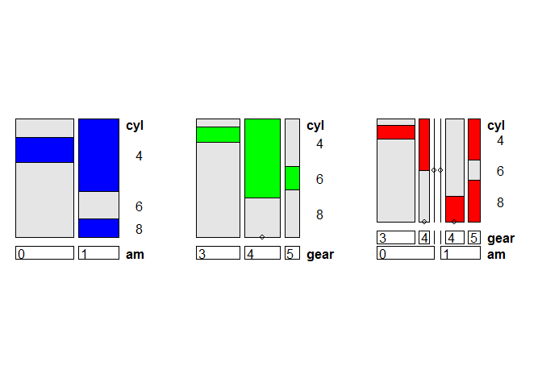

See the `lattice` and `latticeExtra` packages for built-in
facet/gridview. `ggplot2` as well.

**Plot and add ablines**

``` r
plot(hp, mpg, xlab = 'horsepower', ylab = 'miles per gallon')

# abline(h = yvalues, v = xvalues)
abline(lm(mpg ~ hp))

# main = 'Title' or...
title('Title')
```


``` r
plot(hp, mpg, xlab = 'horsepower', ylab = 'miles per gallon')

abline(h = c(20, 25))
abline(v = c(50, 150))
abline(v = seq(200, 300, 50), lty = 2, col = 'blue')
```

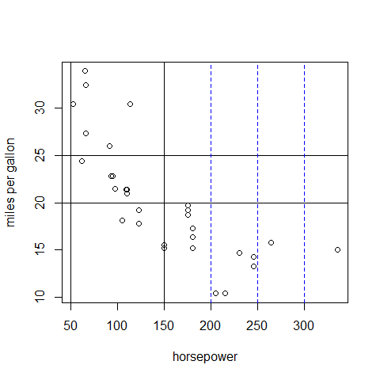

**Add a legend**

``` r
boxplot(mpg ~ cyl, main = 'Title',
   yaxt = 'n', xlab = 'mile per gallon', horizontal = TRUE, col = terrain.colors(3))

legend('topright', inset = 0.05, title = 'number of cylinders', c('4','6','8'), fill = terrain.colors(3), horiz = TRUE)
```


**Save**

``` r
mygraph <- plot(hp, mpg, main = 'Title', xlab = 'horsepower', ylab = 'miles per gallon')

pdf('mygraph.pdf')
png('mygraph.png')
jpeg('mygraph.jpg')
bmp('mygraph.bmp')
postscript('mygraph.ps')
```

**View in a new window**

Typing the function will open a new window to render the plot.

-   `windows()` for Windows.
-   `X11()` for Linux.
-   `quartz()` for OS X.

<!-- -->

``` r
# open the new windows
windows()

plot(hp, mpg, main = 'Title', xlab = 'horsepower', ylab = 'miles per gallon')
```

**Enrich the plot, add text**

``` r
plot(hp, mpg,
     main = 'Title', col.main = 'blue',
     sub = 'figure 1', col.sub = 'blue',
     xlab = 'horsepower', 
     ylab = 'miles per gallon',
     col.lab = 'red', cex.lab = 0.9,
     xlim = c(50, 350),
     ylim = c(0, 40))

text(100, 10, 'text 1') # x and y coordinate
mtext('text 2', 4, line = 0.5) # pos = 1 (bottom), 2 (left), 3 (top), 4 (right); line (margin)
```


With `locator()`, use the mouse; with 1 for 1 click, 2 for... Find the
coordinates to be entered in the code. For example (after two clicks):

``` text
> locator(2)
$x
[1] 212.5308 293.7854

$y
[1] 33.34040 31.87281
```

``` r
plot(hp, mpg,
     main = 'Title',
     xlab = 'horsepower', 
     ylab = 'miles per gallon')

text(hp, mpg, row.names(mtcars), cex = 0.7, pos = 4, col = 'red')
```


**Enrich the plot, add symbols**

``` r
plot(hp, mpg,
     main = 'Title',
     xlab = 'horsepower', 
     ylab = 'miles per gallon')

symbols(250, 20, squares = 1, add = TRUE, inches = 0.1, fg = 'red')
symbols(250, 25, circles = 1, add = TRUE, inches = 0.1, fg = 'red')
```


``` r
#rectangles
#stars
#thermometers
#boxplots
```

**Combine plots; change `pch =` & `col =`**

``` r
par(mfrow = c(2,2))

# 1
plot(hp, mpg,
     main = 'P1',
     xlab = 'horsepower', 
     ylab = 'miles per gallon',
     pch = 1,
     col = 'black')

# 2
plot(hp, mpg,
     main = 'P2',
     xlab = 'horsepower', 
     ylab = 'miles per gallon',
     pch = 3,
     col = 'blue',
     cex = 0.5)

# 3
plot(hp, mpg,
     main = 'P3',
     xlab = 'horsepower', 
     ylab = 'miles per gallon',
     pch = 5,
     col = 'red',
     cex = 2)

# 4
plot(hp, mpg,
     main = 'P4',
     xlab = 'horsepower', 
     ylab = 'miles per gallon',
     pch = 7,
     col = 'green')
```


``` r
# reverse
par(mfrow = c(1,1))
```

**Change `col =`**


**Change `pch =`**


``` r
par(fig = c(0,0.8,0,0.8))

plot(mtcars$wt, mtcars$mpg, xlab = 'Car Weight',   ylab = 'miles Per Gallon')

par(fig = c(0,0.8,0.55,1), new = TRUE)

boxplot(mtcars$wt, horizontal = TRUE, axes = FALSE)

par(fig = c(0.65,1,0,0.8), new = TRUE)

boxplot(mtcars$mpg, axes = FALSE)

mtext('Enhanced Scatterplot', side = 3, outer = TRUE, line = -3)
```


``` r
# reverse
par(mfrow = c(1,1))
```

**Change `type =`; without dots**

``` r
x <- c(1:5); y <- x

par(pch = 22, col = 'red') # plotting symbol and color

par(mfrow = c(2,4)) # all plots on one page
opts = c('p','l','o','b','c','s','S','h')

for (i in 1:length(opts)) {
  heading = paste('type =',opts[i])
  plot(x, y, type = 'n', main = heading)
  lines(x, y, type = opts[i])
}
```


``` r
# reverse
par(mfrow = c(1,1), col = 'black')
```

**Change `type =`; with dots**

``` r
x <- c(1:5); y <- x

par(pch = 22, col = 'blue') # plotting symbol and color

par(mfrow = c(2,4)) # all plots on one page
opts = c('p','l','o','b','c','s','S','h')

for (i in 1:length(opts)) {
  heading = paste('type =',opts[i])
  plot(x, y, main = heading)
  lines(x, y, type = opts[i])
}
```

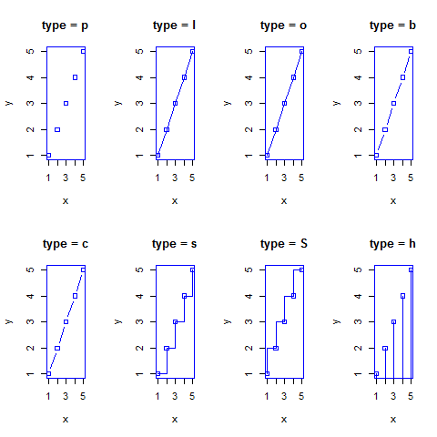

``` r
# reverse
par(mfrow = c(1,1), col = 'black')
```

**Add or modify the axes**

``` r
plot(hp, mpg,
     main = 'Title',
     xlab = 'horsepower', 
     ylab = 'miles per gallon',
     xaxt = 'n',
     yaxt = 'n')

axis(1, at = c(100, 200, 300), labels = NULL, pos = 15, lty = 'dashed', col = 'green', las = 2, tck = -0.05)

axis(4, at = c(20, 30), labels = c('bt', 'up'), pos = 125, lty = 'dashed', col = 'blue', las = 2, tck = -0.05)
```


``` r
# reverse
par(las = 1)
```

**Add layers to the first plot**

``` r
plot(mpg,
     main = 'Title',
     xlab = 'horsepower', 
     ylab = 'miles per gallon')

# add lines
lines(mpg[1:10], type = 'l', col = 'green')
```

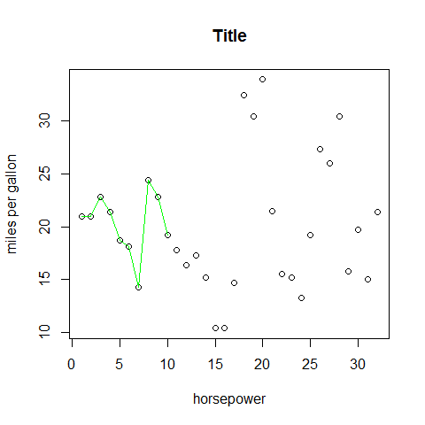

### Univariate Plots

**Plot; continuous**

``` r
plot(mpg, main = 'Title', xlab = 'observations', ylab = 'miles per gallon')
```

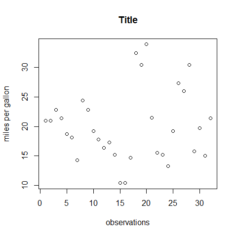

**Plot; categorical**

``` r
plot(cyl, main = 'Title', xlab = 'observations', ylab = 'cylinders')
```


**QQnorm; continuous**

``` r
qqnorm(mpg, main = 'Title', xlab = 'observations', ylab = 'cylinders')
```


**QQnorm; categorical**

``` r
qqnorm(cyl, main = 'Title', xlab = 'observations', ylab = 'cylinders')
```

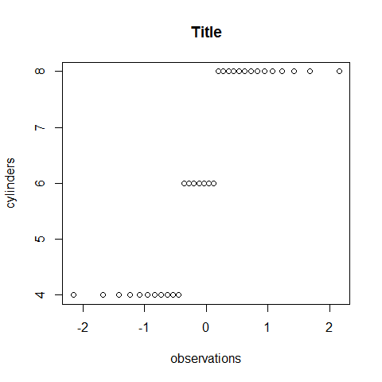

**Stripchart; continuous**

``` r
stripchart(mpg, main = 'Title', xlab = 'miles per gallon')
```


**Stripchart; categorical**

``` r
stripchart(cyl, main = 'Title', xlab = 'cylinders')
```


**Barplot (vertical); continuous**

``` r
barplot(mpg[1:10], main = 'Title', xlab = 'observations', ylab = 'miles per gallon')
```


**Barplot (horizontal); categorical**

``` r
barplot(cyl[1:10], main = 'Title', horiz = TRUE, xlab = 'cylinders', ylab = 'observations')
```


**Barplots options**

Group with `table()`.

``` r
counts <- table(cyl)
counts
```

    ## cyl
    ##  4  6  8 
    ## 11  7 14

``` r
barplot(counts, main = 'Title', horiz = TRUE, xlab = 'count', names.arg = c('4 Cyl', '6 Cyl', '8 Cyl'))
```

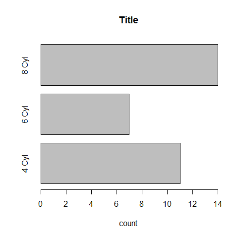

``` r
counts <- table(vs, gear)
counts
```

    ##    gear
    ## vs   3  4  5
    ##   0 12  2  4
    ##   1  3 10  1

``` r
barplot(counts, main = 'Title', xlab = 'gearbox', col = c('darkblue', 'red'), legend = rownames(counts)) 
```


``` r
counts <- table(vs, gear)
counts
```

    ##    gear
    ## vs   3  4  5
    ##   0 12  2  4
    ##   1  3 10  1

``` r
barplot(counts, main = 'Title', xlab='gearbox', col = c('darkblue', 'red'), legend =  rownames(counts), beside = TRUE)
```


Group with `aggregate()`.

``` r
aggregate(mtcars, by = list(cyl, vs), FUN = mean, na.rm = TRUE)
```

    ##   Group.1 Group.2      mpg cyl   disp       hp     drat       wt     qsec
    ## 1       4       0 26.00000   4 120.30  91.0000 4.430000 2.140000 16.70000
    ## 2       6       0 20.56667   6 155.00 131.6667 3.806667 2.755000 16.32667
    ## 3       8       0 15.10000   8 353.10 209.2143 3.229286 3.999214 16.77214
    ## 4       4       1 26.73000   4 103.62  81.8000 4.035000 2.300300 19.38100
    ## 5       6       1 19.12500   6 204.55 115.2500 3.420000 3.388750 19.21500
    ##   vs        am     gear     carb
    ## 1  0 1.0000000 5.000000 2.000000
    ## 2  0 1.0000000 4.333333 4.666667
    ## 3  0 0.1428571 3.285714 3.500000
    ## 4  1 0.7000000 4.000000 1.500000
    ## 5  1 0.0000000 3.500000 2.500000

``` r
par(las = 2) # make label text perpendicular to axis

par(mar = c(5, 8, 4, 2)) # increase y-axis margin.

counts <- table(mtcars$gear)
barplot(counts, main = 'Car Distribution', horiz = TRUE, names.arg = c('3 Gears', '4 Gears', '5   Gears'), cex.names = 0.8)
```


``` r
# reverse
par(las = 1)
```

Colors.

``` r
library(RColorBrewer)

par(mfrow = c(2, 1))

barplot(iris$Petal.Length)
barplot(table(iris$Species, iris$Sepal.Length), col = brewer.pal(3, 'Set1'))
```


``` r
par(mfrow = c(1, 1))
```

**Pie Chart**

Avoid!

**Dotchart; continuous**

``` r
dotchart(mpg, main = 'Title', xlab = 'miles per gallon', ylab = 'observations')
```


**Dotchart; categorical**

``` r
dotchart(cyl, main = 'Title', xlab = 'cylinders', ylab = 'observations')
```


**Dotchart options**

``` r
dotchart(mpg,labels = row.names(mtcars), cex = 0.7, main = 'Title', xlab = 'miles per gallon')
```


``` r
# sort by mpg
x <- mtcars[order(mpg),]

# must be factors
x$cyl <- factor(x$cyl)
x$color[x$cyl == 4] <- 'red'
x$color[x$cyl == 6] <- 'blue'
x$color[x$cyl == 8] <- 'darkgreen'

dotchart(x$mpg, labels = row.names(x), cex = 0.7, groups = x$cyl, main = 'Title',  xlab = 'miles per gallon', gcolor = 'black', color = x$color)
```


More with the `hmisc` package and `panel.dotplot()` and in the `lattice`
package section.

**Boxplot; continuous**

``` r
boxplot(mpg, main = 'Title', xlab = 'miles per gallon', ylab = 'observations')
```


**Stem; continuous**

``` r
stem(mpg)
```

    ## 
    ##   The decimal point is at the |
    ## 
    ##   10 | 44
    ##   12 | 3
    ##   14 | 3702258
    ##   16 | 438
    ##   18 | 17227
    ##   20 | 00445
    ##   22 | 88
    ##   24 | 4
    ##   26 | 03
    ##   28 | 
    ##   30 | 44
    ##   32 | 49

**Histogram; continuous**

``` r
hist(mpg, main = 'Title', xlab = 'miles per gallon - bins', ylab = 'count')
```


**Histogram; categorical**

``` r
hist(cyl, main = 'Title', xlab = 'cylinders - bins', ylab = 'count')
```


**Histogram options**

``` r
hist(mpg, breaks = 12, col = 'red')
```


``` r
x <- mpg

h <- hist(x, breaks = 10, main = 'Title', xlab = 'miles per gallon')

xfit <- seq(min(x), max(x),length = 40)
yfit <- dnorm(xfit, mean = mean(x), sd = sd(x))
yfit <- yfit*diff(h$mids[1:2])*length(x)

lines(xfit, yfit, col = 'blue', lwd = 2)
```


Colors.

``` r
library(RColorBrewer)

par(mfrow = c(2, 3))

hist(VADeaths, breaks = 10, col = brewer.pal(3, 'Set3'), main = '3, Set3')
hist(VADeaths, breaks = 4, col = brewer.pal(3, 'Set2'), main = '3, Set2')
hist(VADeaths, breaks = 8, col = brewer.pal(3, 'Set1'), main = '3, Set1')
hist(VADeaths, breaks = 2, col = brewer.pal(8, 'Set3'), main = '8, Set3')
hist(VADeaths, breaks = 10, col = brewer.pal(8, 'Greys'), main = '8, Greys')
hist(VADeaths, breaks = 10, col = brewer.pal(8, 'Greens'), main = '8, Greens')
```


``` r
par(mfrow = c(1, 1))
```

**Density Plot; continuous**

``` r
plot(density(mpg), main = 'Title')
```

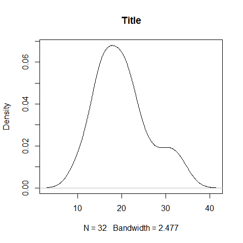

``` r
plot(density(mpg), main = 'Title')

polygon(density(mpg), col = 'red', border = 'blue') 
```


``` r
d1 <- density(mtcars$mpg)
plot(d1)
rug(mtcars$mpg)

lines(density(mtcars$mpg, d1$bw/2), col = 'green')
lines(density(mtcars$mpg, d1$bw/5), col = 'blue')
```


### Bivariate (Multivariate) Plots

**Plot, continuous/continuous**

``` r
plot(mpg, hp, main = 'Title', xlab = 'miles per gallon', ylab = 'horsepowers')
```

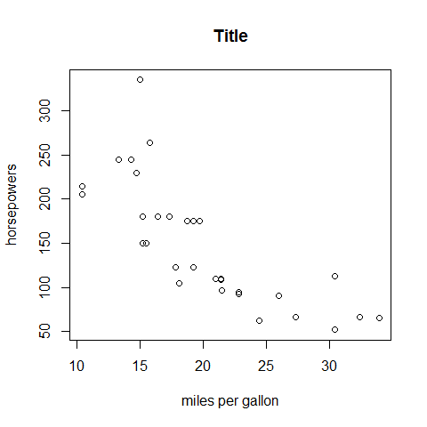

**Plot, continuous/categorical**

``` r
plot(mpg, cyl, main = 'Title', xlab = 'miles per gallon', ylab = 'cylinders')
```


**Plot options**

``` r
plot(wt, mpg, main = 'Title', xlab = 'weight', ylab = 'miles per gallon ')

abline(lm(mpg ~ wt), col = 'red') # regression
lines(lowess(wt, mpg), col = 'blue') # lowess line
```


**SmoothScatter; continuous/continuous**

``` r
smoothScatter(mpg, hp, main = 'Title', xlab = 'miles per gallon', ylab = 'horsepowers')
```


**Sunflowerplot; categorical/categorical**

Special symbols at each location: one observation = one dot; more
observations = cross, star, etc.

``` r
sunflowerplot(gear, cyl, main = 'Title', xlab = 'gearbox', ylab = 'cylinders')
```


**Boxplot**

``` r
boxplot(mpg ~ cyl, main = 'Title',   xlab = 'cylinders', ylab = 'miles per gallon') 
```


Colors.

``` r
library(RColorBrewer)

par(mfrow = c(1, 2))

boxplot(iris$Sepal.Length, col = 'red')
boxplot(iris$Sepal.Length ~ iris$Species, col = topo.colors(3))
```


``` r
par(mfrow = c(1, 1))
```

``` r
library(dplyr)

data(Pima.tr2, package = 'MASS')

PimaV <- select(Pima.tr2, glu:age)
boxplot(scale(PimaV), pch = 16, outcol = 'red')
```


**Boxplot options**

``` r
four <- subset(mpg, cyl == 4)
six <- subset(mpg, cyl == 6)
eight <- subset(mpg, cyl == 8)

boxplot(four, six, eight, main = 'Title', ylab = 'miles per gallon')

axis(1, at = c(1, 2, 3), labels = c('4 Cyl', '6 Cyl', '8 Cyl'))
```

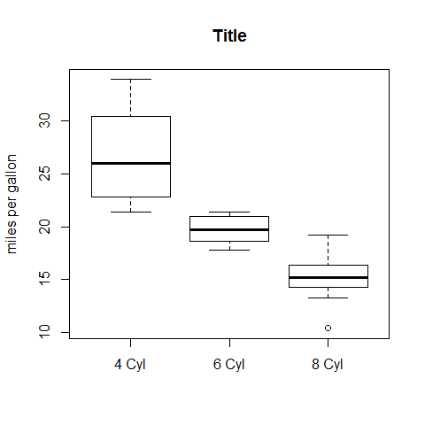

**Dotchart**

``` r
counts <- table(gear, cyl)
counts
```

    ##     cyl
    ## gear  4  6  8
    ##    3  1  2 12
    ##    4  8  4  0
    ##    5  2  1  2

``` r
dotchart(counts, main = 'Title', xlab = 'count', ylab = 'cylinders/gearbox')
```


``` r
counts <- table(cyl, gear)
counts
```

    ##    gear
    ## cyl  3  4  5
    ##   4  1  8  2
    ##   6  2  4  1
    ##   8 12  0  2

``` r
dotchart(counts, main = 'Title', xlab = 'count', ylab = 'gearbox/cylinders')
```


**Barplot with its options**

Vertical or horizontal. The legend as well can be horizontal or
vertical.

``` r
counts <- table(gear, cyl)
counts
```

    ##     cyl
    ## gear  4  6  8
    ##    3  1  2 12
    ##    4  8  4  0
    ##    5  2  1  2

``` r
barplot(counts, main = 'Title', xlab = 'cylinders', ylab = 'count', ylim = c(0, 20), col = terrain.colors(3))

legend('topleft', inset = .04, title = 'gearbox',
   c('3','4','5'), fill = terrain.colors(3), horiz = TRUE)
```


``` r
counts <- table(gear, cyl)
counts
```

    ##     cyl
    ## gear  4  6  8
    ##    3  1  2 12
    ##    4  8  4  0
    ##    5  2  1  2

``` r
barplot(counts, main = 'Title', xlab = 'cylinders', ylab = 'count', ylim = c(0, 25), col = terrain.colors(3), legend = rownames(counts))
```


``` r
counts <- table(gear, cyl)
counts
```

    ##     cyl
    ## gear  4  6  8
    ##    3  1  2 12
    ##    4  8  4  0
    ##    5  2  1  2

``` r
barplot(counts, main = 'Title', xlab = 'cylinders', ylab = 'count', ylim = c(0, 20), col = terrain.colors(3), legend = rownames(counts), beside = TRUE)
```


**Spineplot**

'Count' = blocks; categorical (with factors).

``` r
cyl2 <- as.factor(cyl) # mandatory for the y
gear2 <- as.factor(gear)

spineplot(gear2, cyl2, main = 'Title', xlab = 'gearbox', ylab = 'cylinders')
```


Count = blocks; continuous.

``` r
spineplot(mpg, cyl2, main = 'Title', xlab = 'miles per gallon', ylab = 'cylinders')
```


**Mosaicplot**

Count = blocks.

``` r
counts <- table(gear, cyl)
counts
```

    ##     cyl
    ## gear  4  6  8
    ##    3  1  2 12
    ##    4  8  4  0
    ##    5  2  1  2

``` r
mosaicplot(counts, main = 'Title', xlab = 'gearbox', ylab = 'cylinders')
```


### Multivariate Plots

**Pairs**

``` r
pairs( ~mpg + disp + hp)
```


**Coplot**

``` r
coplot(mpg ~ hp | wt)
```

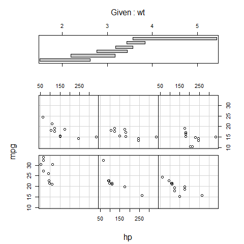

**Correlograms**

``` r
library(corrgram)

corrgram(mtcars, order = TRUE, lower.panel = panel.shade, upper.panel=panel.pie, text.panel = panel.txt, main = 'Car Milage Data in PC2/PC1 Order')
```


**Plot a dataset with colors**

``` r
library(RColorBrewer)

plot(iris, col = brewer.pal(3, 'Set1'))
```


**Stars**

The star branches are explanatory; be careful with the interpretation!
Well-advised for visual and pattern exploration.

``` r
mtcars[1:4, c(1, 4, 6)]
```

    ##                 mpg  hp    wt
    ## Mazda RX4      21.0 110 2.620
    ## Mazda RX4 Wag  21.0 110 2.875
    ## Datsun 710     22.8  93 2.320
    ## Hornet 4 Drive 21.4 110 3.215

``` r
stars(mtcars[1:4, c(1, 4, 6)])
```


**Trivariate plots**

-   `image()`.
-   `contour()`.
-   `filled.contour()`.
-   `persp()`.
-   `symbols()`.

### Times Series

Add packages: `zoo` and `xts`.

**Basics**

``` r
plot(AirPassengers, type = 'l')
```


**Change the `type =`**

``` r
y1 <- rnorm(100)

par(mfrow = c(2, 1))

plot(y1, type = 'p', main = 'p vs l')
plot(y1, type = 'l')
```


``` r
plot(y1, type = 'l', main = 'l vs h')
plot(y1, type = 'h')
```


``` r
plot(y1, type = 'l', lty = 3, main = 'l 3 vs o')
plot(y1, type = 'o')
```

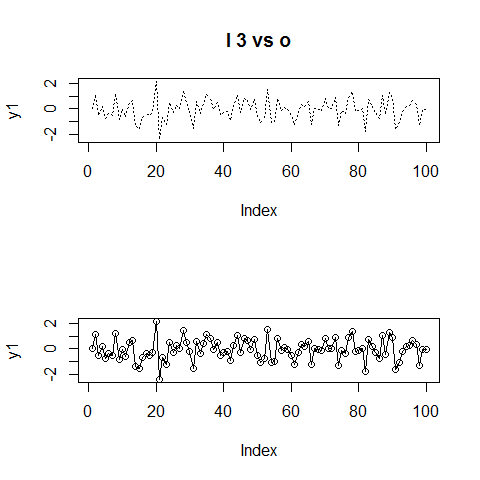

``` r
plot(y1, type = 'b', main = 'b vs c')
plot(y1, type = 'c')
```


``` r
plot(y1, type = 's', main = 's vs S')
plot(y1, type = 'S')
```


``` r
# reverse
par(mfrow = c(1, 1))
```

**Add a box**

``` r
y1 <- rnorm(100)
y2 <- rnorm(100)

par(mfrow = (c(2, 1)))

plot(y1, type = 'l', axes = FALSE, xlab = '', ylab = '', main = '')

box(col = 'gray')

lines(x = c(20, 20, 40, 40), y = c(-7, max(y1), max(y1), -7), lwd = 3, col = 'gray')

plot(y2, type = 'l', axes = FALSE, xlab = '', ylab = '', main = '')

box(col = 'gray')

lines(x = c(20, 20, 40, 40), y = c(7, min(y2), min(y2), 7), lwd = 3, col = 'gray')
```


``` r
# reverse
par(mfrow = c(1,1))
```

**Add lines and text within the plot**

``` r
y1 <- rnorm(100)

# x goes from 0 to 100
# xaxt = 'n' remove the x ticks
plot(y1, type = 'l', lwd = 2, lty = 'longdash', main = 'Title', ylab = 'y', xlab = 'time', xaxt = 'n')

abline(h = 0, lty = 'longdash')

abline(v = 20, lty = 'longdash')
abline(v = 50, lty = 'longdash')
abline(v = 95, lty = 'longdash')

text(17, 1.5, srt = 90, adj = 0, labels = 'Tag 1', cex = 0.8)
text(47, 1.5, srt = 90, adj = 0, labels = 'Tag a', cex = 0.8)
text(92, 1.5, srt = 90, adj = 0, labels = 'Tag alpha', cex = 0.8)
```


**A comprehensive example**

``` r
# new data
head(Orange)
```

    ##   Tree  age circumference
    ## 1    1  118            30
    ## 2    1  484            58
    ## 3    1  664            87
    ## 4    1 1004           115
    ## 5    1 1231           120
    ## 6    1 1372           142

``` r
# convert factor to numeric for convenience
Orange$Tree <- as.numeric(Orange$Tree)
ntrees <- max(Orange$Tree)

# get the range for the x and y axis
xrange <- range(Orange$age)
yrange <- range(Orange$circumference)

# set up the plot
plot(xrange, yrange, type = 'n', xlab = 'Age (days)',
   ylab = 'Circumference (mm)' )
colors <- rainbow(ntrees)
linetype <- c(1:ntrees)
plotchar <- seq(18, 18 + ntrees, 1)

# add lines
for (i in 1:ntrees) {
  tree <- subset(Orange, Tree == i)
  lines(tree$age, tree$circumference, type = 'b', lwd = 1.5,
    lty = linetype[i], col = colors[i], pch = plotchar[i])
}

# add a title and subtitle
title('Tree Growth', 'example of line plot')

# add a legend
legend(xrange[1], yrange[2], 1:ntrees, cex = 0.8, col = colors,
   pch = plotchar, lty = linetype, title = 'Tree')
```


**Change `lty =`**


### Regressions and Residual Plots

``` r
# first
regr <- lm(mpg ~ hp)

summary(regr)
```

    ## 
    ## Call:
    ## lm(formula = mpg ~ hp)
    ## 
    ## Residuals:
    ##     Min      1Q  Median      3Q     Max 
    ## -5.7121 -2.1122 -0.8854  1.5819  8.2360 
    ## 
    ## Coefficients:
    ##             Estimate Std. Error t value Pr(>|t|)    
    ## (Intercept) 30.09886    1.63392  18.421  < 2e-16 ***
    ## hp          -0.06823    0.01012  -6.742 1.79e-07 ***
    ## ---
    ## Signif. codes:  0 '***' 0.001 '**' 0.01 '*' 0.05 '.' 0.1 ' ' 1
    ## 
    ## Residual standard error: 3.863 on 30 degrees of freedom
    ## Multiple R-squared:  0.6024, Adjusted R-squared:  0.5892 
    ## F-statistic: 45.46 on 1 and 30 DF,  p-value: 1.788e-07

``` r
plot(mpg ~ hp)
abline(regr)
```


``` r
par(mfrow = c(2, 2))

# then
plot(regr)
```


``` r
# reverse
par(mfrow = c(1, 1))
```

The `lattice` and `latticeExtra` Packages
-----------------------------------------

``` r
library(lattice)
```

### Coloring

``` r
# Show the default settings
show.settings()
```


``` r
# Save the default theme
mytheme <- trellis.par.get()

# Turn the B&W
trellis.par.set(canonical.theme(color = FALSE))
show.settings()
```


### Documentation

-   [National Park Service, Advanced
    Graphics (Lattice)](http://science.nature.nps.gov/im/datamgmt/statistics/r/graphics/lattice.cfm)
-   [Treillis
    Plots](https://www.stat.auckland.ac.nz/~ihaka/787/lectures-trellis.pdf)

### A note on reordering the levels (factors)

``` r
# start
cyl <- mtcars$cyl
cyl <- as.factor(cyl)
cyl
```

    ##  [1] 6 6 4 6 8 6 8 4 4 6 6 8 8 8 8 8 8 4 4 4 4 8 8 8 8 4 4 4 8 6 8 4
    ## Levels: 4 6 8

``` r
levels(cyl)
```

    ## [1] "4" "6" "8"

``` r
# option 1
cyl <- factor(cyl, levels = c('8', '6', '4'))
# or levels = 3:1
# or levels = letters[3:1]
levels(cyl)
```

    ## [1] "8" "6" "4"

``` r
cyl <- mtcars$cyl
cyl <- as.factor(cyl)
# option 2
cyl <- reorder(cyl, new.order = 3:1)
levels(cyl)
```

    ## [1] "8" "6" "4"

``` r
library(lattice)

# normalized x-axis for comparison
barchart(Class ~ Freq | Sex + Age, data = as.data.frame(Titanic), groups = Survived, stack = TRUE, layout = c(4, 1), auto.key = list(title = 'Survived', columns = 2))
```


``` r
# free x-axis
barchart(Class ~ Freq | Sex + Age, data = as.data.frame(Titanic), groups = Survived, stack = TRUE, layout = c(4, 1), auto.key = list(title = 'Survived', columns = 2), scales = list(x = 'free'))
```


``` r
# or
bc.titanic <- barchart(Class ~ Freq | Sex + Age, data = as.data.frame(Titanic), groups = Survived, stack = TRUE, layout = c(4, 1), auto.key = list(title = 'Survived', columns = 2), scales = list(x = 'free'))

bc.titanic
```


``` r
# add bg grid
update(bc.titanic, panel = function(...) {
  panel.grid(h = 0, v = -1)
  panel.barchart(...)
})
```


``` r
# remove lines
update(bc.titanic, panel = function(...) {
  panel.barchart(..., border = 'transparent')
})
```


``` r
# or
update(bc.titanic, border = 'transparent')
```


``` r
Titanic1 <- as.data.frame(as.table(Titanic[, , 'Adult' ,]))
Titanic1
```

    ##    Class    Sex Survived Freq
    ## 1    1st   Male       No  118
    ## 2    2nd   Male       No  154
    ## 3    3rd   Male       No  387
    ## 4   Crew   Male       No  670
    ## 5    1st Female       No    4
    ## 6    2nd Female       No   13
    ## 7    3rd Female       No   89
    ## 8   Crew Female       No    3
    ## 9    1st   Male      Yes   57
    ## 10   2nd   Male      Yes   14
    ## 11   3rd   Male      Yes   75
    ## 12  Crew   Male      Yes  192
    ## 13   1st Female      Yes  140
    ## 14   2nd Female      Yes   80
    ## 15   3rd Female      Yes   76
    ## 16  Crew Female      Yes   20

``` r
barchart(Class ~ Freq | Sex, Titanic1, groups = Survived, stack = TRUE, auto.key = list(title = 'Survived', columns = 2))
```


``` r
Titanic2 <- reshape(Titanic1, direction = 'wide', v.names = 'Freq', idvar = c('Class', 'Sex'), timevar = 'Survived')

names(Titanic2) <- c('Class', 'Sex', 'Dead', 'Alive')

barchart(Class ~ Dead + Alive | Sex, Titanic2, stack = TRUE, auto.key = list(columns = 2))
```

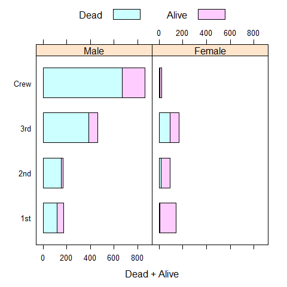

### Uni-, Bi-, Multivariate Plots

**Barchart**

Like `barplot()`.

``` r
# y ~ x
barchart(mpg ~ hp, main = 'Title', xlab = 'horsepowers', ylab = 'miles per gallon')
```


``` r
# y ~ x
barchart(mpg ~ hp, main = 'Title', xlab = 'horsepowers', ylab = 'miles per gallon', horizontal = FALSE)
```


``` r
barchart(VADeaths, groups = FALSE, layout = c(1, 4), aspect = 0.7, reference =FALSE, main = 'Title', xlab = 'rate per 100')
```


``` r
data(postdoc, package = 'latticeExtra')

barchart(prop.table(postdoc, margin = 1), xlab = 'Proportion', auto.key = list(adj = 1))
```


**Change `layout = c(x, y, page)`**

``` r
barchart(mpg ~ hp | factor(cyl), main = 'Title', xlab = 'horsepowers', ylab = 'cylinders - miles per gallon', layout = c(1,3))
```


``` r
barchart(mpg ~ hp | factor(cyl), main = 'Title', xlab = 'cylinders - horsepowers', ylab = 'miles per gallon', layout = c(3,1))
```


**Change `aspect = 1`**

`1` for square.

``` r
barchart(mpg ~ hp | factor(cyl), main = 'Title', xlab = 'horsepowers', ylab = 'miles per gallon', layout = c(3,1), aspect = 1)
```


**Colors**

``` r
barchart(mpg ~ hp, group = cyl, auto.key = list(space = 'right'), main = 'Title', xlab = 'horsepowers', ylab = 'miles per gallon')
```


-   `shingle()`; control the ranges.
-   `equal.count()`; grid.

**Dotplot**

Like `dotchart()`.

``` r
dotplot(mpg, main = 'Title', xlab = 'miles per gallon')
```


``` r
dotplot(factor(cyl) ~ mpg, main = 'Title', xlab = 'miles per gallon', ylab = 'cylinders')
```


``` r
dotplot(factor(cyl) ~ mpg | factor(gear), main = 'Title', xlab = 'gearbox - miles per gallon', ylab = 'cylinders', layout = c(3,1))
```


``` r
dotplot(factor(cyl) ~ mpg | factor(gear), main = 'Title', xlab = 'miles per gallon', ylab = 'gearbox - cylinders', layout = c(1,3), aspect = 0.3)
```


``` r
dotplot(factor(cyl) ~ mpg | factor(gear), main = 'Title', xlab = 'miles per gallon', ylab = 'gearbox - cylinders', layout = c(1,3), aspect = 0.3, origin = 0)
```


``` r
dotplot(factor(cyl) ~ mpg | factor(gear), main = 'Title', xlab = 'miles per gallon', ylab = 'gearbox - cylinders', layout = c(1,3), aspect = 0.3, origin = 0, type = c('p', 'h'))
```


Set `auto.key`.

``` r
# maybe we'll want this later
old.pars <- trellis.par.get()

#trellis.par.set(superpose.symbol = list(pch = c(1,3), col = 12:14))

trellis.par.set(superpose.symbol = list(pch = c(1,3), col = 1))

# Optionally put things back how they were
#trellis.par.set(old.pars)
```

Use `auto.key`.

``` r
dotplot(factor(cyl) ~ mpg | factor(gear), main = 'Title', xlab = 'miles per gallon', ylab = 'gearbox - cylinders', layout = c(1,3), groups = vs, auto.key = list(space = 'right'))
```


``` r
trellis.par.set(old.pars)
```

``` r
trellis.par.set(superpose.symbol = list(pch = c(1,3), col = 1))

dotplot(variety ~ yield | site, barley, layout = c(1, 6), aspect = c(0.7), groups = year, auto.key = list(space = 'right'))
```


``` r
trellis.par.set(old.pars)
```

Vertical.

``` r
dotplot(mpg ~ factor(cyl) | factor(gear), main = 'Title', xlab = 'cylinders', ylab = 'gearbox - miles per gallon', layout = c(1,3), aspect = 0.3)
```


``` r
library(readr)
density <- read_csv('density.csv')
density$Density <- as.numeric(density$Density)

dotplot(reorder(MetropolitanArea, Density) ~ Density, density, type = c('p', 'h'), main = 'Title', xlab = 'Population Density (pop / sq.mi)')
```


``` r
dotplot(reorder(MetropolitanArea, Density) ~ Density | Region, density, type = c('p', 'h'), strip = FALSE, strip.left = TRUE, layout = c(1, 3), scales = list(y = list(relation = 'free')), main = 'Title', xlab = 'Population Density (pop / sq.mi)')
```


**Stripplot**

Like `stripchart()`.

``` r
stripplot(mpg, main = 'Title', xlab = 'miles per gallon')
```


``` r
stripplot(factor(cyl) ~ mpg, main = 'Title', xlab = 'miles per gallon', ylab = 'cylinders')
```

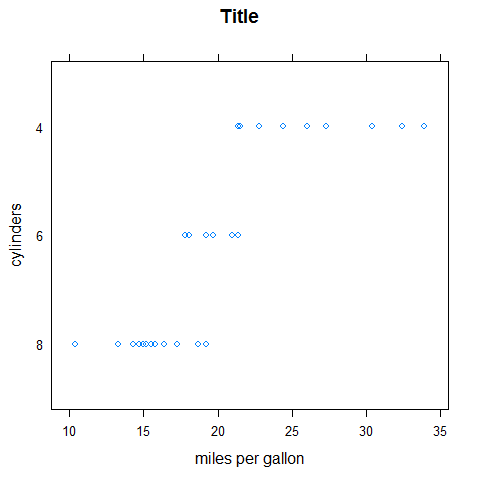

``` r
stripplot(factor(cyl) ~ mpg | factor(gear), main = 'Title', xlab = 'gearbox - miles per gallon', ylab = 'cylinders', layout = c(1,3))
```

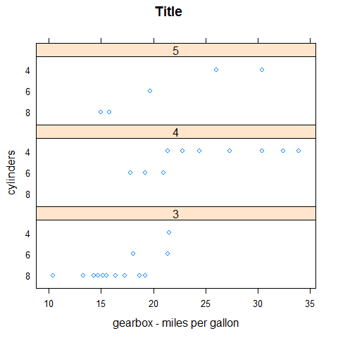

``` r
stripplot(factor(cyl) ~ mpg | factor(gear), main = 'Title', xlab = 'gearbox - miles per gallon', ylab = 'cylinders', layout = c(1,3), groups = vs, auto.key = list(space = 'right'))
```


``` r
stripplot(mpg ~ factor(cyl) | factor(gear), main = 'Title', xlab = 'cylinders', ylab = 'gearbox - miles per gallon', layout = c(1,3))
```


**Histogram**

Like `hist()`.

``` r
histogram(mpg, main = 'Title', xlab = 'miles per gallon')
```


``` r
histogram(~mpg | factor(cyl), layout = c(1, 3), main = 'Title', xlab = 'miles per gallon', ylab = 'density')
```


**Densityplot**

Like `plot.density()`.

``` r
densityplot(mpg, main = 'Title', xlab = 'miles per gallon', ylab = 'density')
```


``` r
densityplot(~mpg | factor(cyl), layout = c(1, 3), main = 'Title', xlab = 'miles per gallon', ylab = 'density')
```

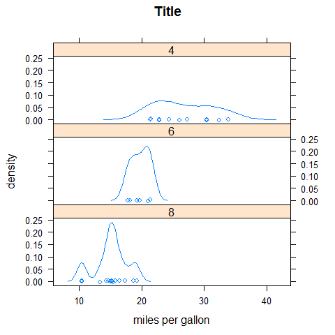

**ECDFplot**

``` r
library(latticeExtra)

ecdfplot(mpg, main = 'Title', xlab = 'miles per gallon', ylab = '')
```


**BWplot**

Like `boxplot`.

``` r
bwplot(mpg, main = 'Title', xlab = 'miles per gallon', ylab = 'density')
```


``` r
bwplot(factor(cyl) ~ mpg, main = 'Title', xlab = 'miles per gallon', ylab = 'cylinders')
```


``` r
bwplot(factor(cyl) ~ mpg | factor(gear), main = 'Title', xlab = 'miles per gallon', ylab = 'gearbox - cylinders', layout = c(1,3))
```


``` r
bwplot(mpg ~ factor(cyl) | factor(gear), main = 'Title', xlab = 'gearbox - cylinders', ylab = 'miles per gallon', layout = c(3,1))
```


**QQmath**

Like `qqnorm()`.

``` r
qqmath(mpg, main = 'Title', ylab = 'miles per gallon')
```


**XYplot**

Like `plot()`.

``` r
xyplot(mpg ~ disp | factor(cyl), main = 'Title', xlab = 'horsepower', ylab = 'cylinders - miles per gallon', layout = c(1,3))
```


``` r
xyplot(mpg ~ disp | factor(cyl), main = 'Title', xlab = 'cylinder - horsepowers', ylab = 'miles per gallon', layout = c(3,1))
```


**XYplot options**

``` r
xyplot(mpg ~ disp | factor(cyl), main = 'Title', xlab = 'cylinder - horsepowers', ylab = 'miles per gallon', layout = c(3,1), aspect = 1)
```


``` r
xyplot(mpg ~ disp | factor(cyl), main = 'Title', xlab = 'cylinder - horsepowers', ylab = 'miles per gallon', layout = c(3,1), aspect = 1, scales = list(y = list(at = seq(10, 30, 10))))
```


``` r
meanmpg <- mean(mpg)

xyplot(mpg ~ disp | factor(cyl), main = 'Title', xlab = 'cylinder - horsepowers', ylab = 'miles per gallon', layout = c(3,1), aspect = 1, panel = function(...) {
  panel.xyplot(...)
  panel.abline(h = meanmpg, lty = 'dashed')
  panel.text(450, meanmpg + 1, 'avg', adj = c(1,  0), cex = 0.7)
})
```


``` r
xyplot(mpg ~ disp | factor(cyl), main = 'Title', xlab = 'cylinder - horsepowers', ylab = 'miles per gallon', layout = c(3,1), aspect = 1, panel = function(x, y, ...) {
    panel.lmline(x, y)
    panel.xyplot(x, y, ...)
})
```


-   `panel.points()`.
-   `panel.lines()`.
-   `panel.segments()`.
-   `panel.arrows()`.
-   `panel.rect()`.
-   `panel.polygon()`.
-   `panel.text()`.
-   `panel.abline()`.
-   `panel.lmline()`.
-   `panel.xyplot()`.
-   `panel.curve()`.
-   `panel.rug()`.
-   `panel.grid()`.
-   `panel.bwplot()`.
-   `panel.histogram()`.
-   `panel.loess()`.
-   `panel.violin()`.
-   `panel.smoothScatter()`.
-   ...
-   `par.settings`.
-   ...

<!-- -->

``` r
library(lattice)

data(SeatacWeather, package = 'latticeExtra')

xyplot(min.temp + max.temp + precip ~ day | month, ylab = 'Temperature and Rainfall', data = SeatacWeather, layout = c(3,1), type = 'l', lty = 1, col = 'black')
```


``` r
xyplot(min.temp + max.temp + precip ~ day | month, ylab = 'Temperature and Rainfall', data = SeatacWeather, layout = c(3,1), type = 'p', lty = 1, col = 'black')
```


``` r
xyplot(min.temp + max.temp + precip ~ day | month, ylab = 'Temperature and Rainfall', data = SeatacWeather, layout = c(3,1), type = 'l', lty = 1, col = 'black')
```


``` r
xyplot(min.temp + max.temp + precip ~ day | month, ylab = 'Temperature and Rainfall', data = SeatacWeather, layout = c(3,1), type = 'o', lty = 1, col = 'black')
```

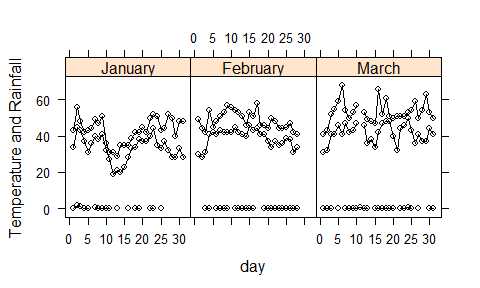

``` r
xyplot(min.temp + max.temp + precip ~ day | month, ylab = 'Temperature and Rainfall', data = SeatacWeather, layout = c(3,1), type = 'r', lty = 1, col = 'black')
```


``` r
xyplot(min.temp + max.temp + precip ~ day | month, ylab = 'Temperature and Rainfall', data = SeatacWeather, layout = c(3,1), type = 'g', lty = 1, col = 'black')
```


``` r
xyplot(min.temp + max.temp + precip ~ day | month, ylab = 'Temperature and Rainfall', data = SeatacWeather, layout = c(3,1), type = 's', lty = 1, col = 'black')
```


``` r
xyplot(min.temp + max.temp + precip ~ day | month, ylab = 'Temperature and Rainfall', data = SeatacWeather, layout = c(3,1), type = 'S', lty = 1, col = 'black')
```

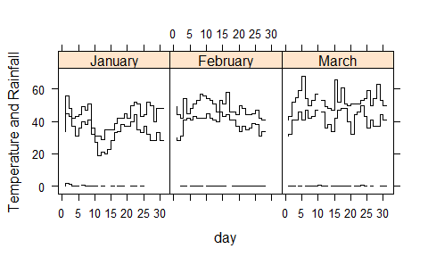

``` r
xyplot(min.temp + max.temp + precip ~ day | month, ylab = 'Temperature and Rainfall', data = SeatacWeather, layout = c(3,1), type = 'h', lty = 1, col = 'black')
```


``` r
xyplot(min.temp + max.temp + precip ~ day | month, ylab = 'Temperature and Rainfall', data = SeatacWeather, layout = c(3,1), type = 'a', lty = 1, col = 'black')
```


``` r
xyplot(min.temp + max.temp + precip ~ day | month, ylab = 'Temperature and Rainfall', data = SeatacWeather, layout = c(3,1), type = 'smooth', lty = 1, col = 'black')
```


``` r
xyplot(mpg ~ hp, main = 'Title', xlab = 'horsepowers', ylab = 'miles per gallon')
```


``` r
xyplot(mpg ~ hp, main = 'Title', xlab = 'horsepowers', ylab = 'miles per gallon', type = 'o')
```


``` r
xyplot(mpg ~ hp, main = 'Title', xlab = 'horsepowers', ylab = 'miles per gallon', type = 'o', pch = 16, lty = 'dashed')
```


``` r
xyplot(mpg ~ hp, main = 'Title', xlab = 'horsepowers', ylab = 'miles per gallon')
```


``` r
data(USAge.df, package = 'latticeExtra')

xyplot(Population ~ Age | factor(Year), USAge.df, groups = Sex, type = c('l', 'g'), auto.key = list(points = FALSE, lines = TRUE, columns = 2), aspect = 'xy', ylab = 'Population (millions)', subset = Year %in% seq(1905, 1975, by = 10))
```


``` r
xyplot(Population ~ Year | factor(Age), USAge.df, groups = Sex, type = 'l', strip = FALSE, strip.left = TRUE, layout = c(1, 3), ylab = 'Population (millions)', auto.key = list(lines = TRUE, points = FALSE, columns = 2), subset = Age %in% c(0, 10, 20))
```


``` r
data(USCancerRates, package = 'latticeExtra')
     
xyplot(rate.male ~ rate.female | state, USCancerRates, aspect = 'iso', pch = '.', cex = 2, index.cond = function(x, y) { median(y - x, na.rm = TRUE) }, scales = list(log = 2, at = c(75, 150, 300, 600)), panel = function(...) { 
  panel.grid(h = -1, v = -1)
  panel.abline(0, 1)
  panel.xyplot(...)
  },
  xlab = 'a',
  ylab = 'b')
```


``` r
data(biocAccess, package = 'latticeExtra')

baxy <- xyplot(log10(counts) ~ hour | month + weekday, biocAccess, type = c('p', 'a'), as.table = TRUE, pch = '.', cex = 2, col.line = 'black')

baxy
```


``` r
library(latticeExtra)
useOuterStrips(baxy)
```


``` r
xyplot(sunspot.year, aspect = 'xy', strip = FALSE, strip.left = TRUE, cut = list(number = 4, overlap = 0.05))
```


``` r
data(biocAccess, package = 'latticeExtra')

ssd <- stl(ts(biocAccess$counts[1:(24 * 30 *2)], frequency = 24), 'periodic')

xyplot(ssd, main = 'Title', xlab = 'Time (Days)')
```


**Splom**

``` r
splom(mtcars[c(1, 3, 6)], groups = cyl, data = mtcars, panel = panel.superpose, key = list(title = 'Three Cylinder Options', columns = 3, points = list(text = list(c('4 Cylinder', '6 Cylinder', '8 Cylinder')))))
```

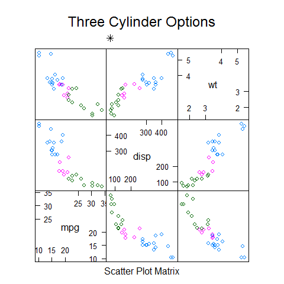

``` r
trellis.par.set(superpose.symbol = list(pch = c(1,3, 22), col = 1, alpha = 0.5))

splom(~data.frame(mpg, disp, hp, drat, wt, qsec), data = mtcars, groups = cyl, pscales = 0, varnames = c('miles\nper\ngallon', 'displacement\n(cu.in(', 'horsepower', 'rear\naxle\nratio', 'weight', '1/4\nmile\ntime'), auto.key = list(columns = 3, title = 'Title'))
```


``` r
trellis.par.set(old.pars)
```

``` r
splom(USArrests)
```


``` r
splom(~USArrests[c(3,1,2,4)] | state.region, pscales = 0, type = c('g', 'p', 'smooth'))
```

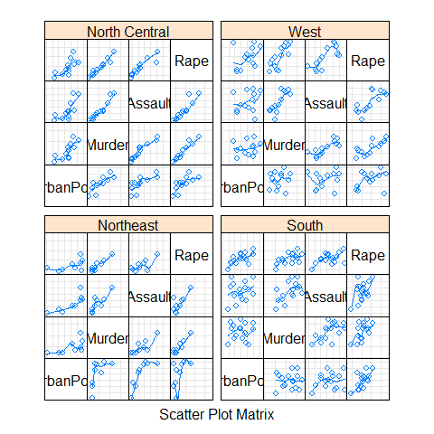

**Parallel plot**

For multivariate continuous data.

``` r
parallelplot(~iris[1:4])
```


``` r
parallelplot(~iris[1:4], horizontal.axis = FALSE)
```

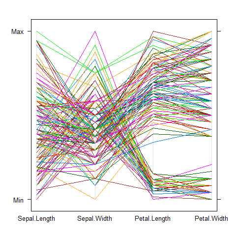

``` r
parallelplot(~iris[1:4], scales = list(x = list(rot = 90)))
```


``` r
parallelplot(~iris[1:4] | Species, iris)
```


``` r
parallelplot(~iris[1:4], iris, groups = Species,
             horizontal.axis = FALSE, scales = list(x = list(rot = 90)))
```


**Trivariate plots**

Like `image()`, `contour()`, `filled.contour()`, `persp()`, `symbols()`.

-   `levelplot()`.
-   `contourplot()`.
-   `cloud()`.
-   `wireframe()`.

Additional Packages
-------------------

### The `sm` Package (density)

``` r
library(sm)
```

**Density plot**

``` r
# create value labels
cyl.f <- factor(cyl, levels = c(4, 6, 8), labels = c('4 cyl', '6 cyl', '8 cyl'))

# plot densities
sm.density.compare(mpg, cyl, xlab = 'miles per gallon')

title(main = 'Title')

# add legend via mouse click
colfill <- c(2:(2 + length(levels(cyl.f))))
legend(25, 0.19, levels(cyl.f), fill = colfill) 
```


### The `car` Package (scatter)

``` r
library(car)
```

**Scatter plot**

``` r
scatterplot(mpg ~ wt | cyl, data = mtcars,    xlab = 'weight', ylab = 'miles per gallon', labels = row.names(mtcars)) 
```


**Splom**

``` r
scatterplotMatrix( ~mpg + disp + drat + wt | cyl, data = mtcars, main = 'Title')
```

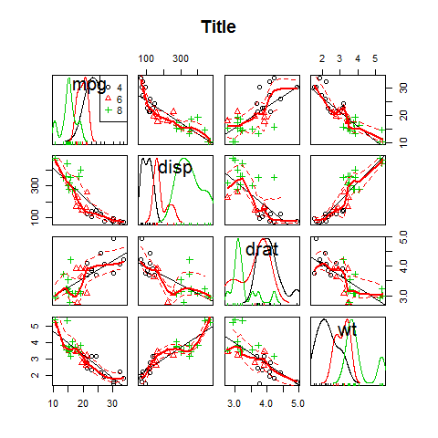

`scatterplotMatrix == spm`.

``` r
spm( ~mpg + disp + drat + wt | cyl, data = mtcars, main = 'Title')
```


### The `vioplot` Package (boxplot)

``` r
library(vioplot)
```

**Violin boxplot**

``` r
x1 <- mpg[mtcars$cyl == 4]
x2 <- mpg[mtcars$cyl == 6]
x3 <- mpg[mtcars$cyl == 8]

vioplot(x1, x2, x3, names = c('4 cyl', '6 cyl', '8 cyl'), col = 'green')

title('Title')
```


### The `vcd` Package (count, correlation, mosaic)

``` r
library(vcd)
```

The package provides a variety of methods for visualizing multivariate
categorical data.

**Count**

``` r
counts <- table(gear, cyl)
counts
```

    ##     cyl
    ## gear  8  6  4
    ##    3 12  2  1
    ##    4  0  4  8
    ##    5  2  1  2

``` r
mosaic(counts, shade = TRUE, legend = TRUE) 
```

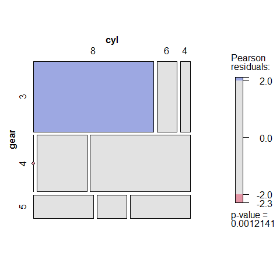

**Correlation**

``` r
counts <- table(gear, cyl)
counts
```

    ##     cyl
    ## gear  8  6  4
    ##    3 12  2  1
    ##    4  0  4  8
    ##    5  2  1  2

``` r
assoc(counts, shade = TRUE)
```


**Mosaic**

``` r
ucb <- data.frame(UCBAdmissions)
ucb <- within(ucb, Accept <- factor(Admit, levels = c('Rejected', 'Admitted')))

library(vcd); library(grid)

doubledecker(xtabs(Freq~ Dept + Gender + Accept, data = ucb), gp = gpar(fill = c('grey90', 'steelblue')))
```

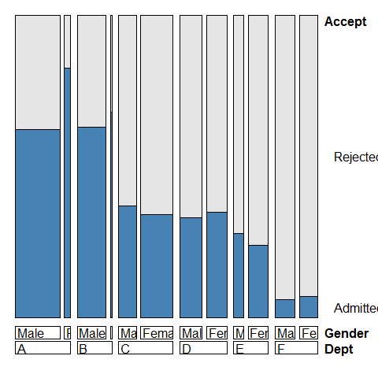

``` r
data(Fertility, package = 'AER')

doubledecker(morekids ~ age, data = Fertility, gp = gpar(fill = c('grey90', 'green')), spacing = spacing_equal(0))
```

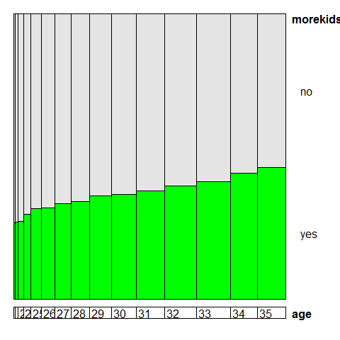

``` r
doubledecker(morekids ~ gender1 + gender2, data = Fertility, gp = gpar(fill = c('grey90', 'green')))
```


``` r
doubledecker(morekids ~ age + gender1 + gender2, data = Fertility, gp = gpar(fill = c('grey90', 'green')), spacing = spacing_dimequal(c(0.1, 0, 0, 0)))
```


### The `hexbin` Package (scatter)

``` r
library(hexbin)
```

**Scatter plot**

``` r
# new data
data(NHANES)

# compare
plot(Serum.Iron ~ Transferin, NHANES, main = 'Title', xlab = 'Transferin', ylab = 'Iron')
```


``` r
# with
hexbinplot(Serum.Iron ~ Transferin, NHANES, main = 'Title', xlab = 'Transferin', ylab = 'Iron')
```


``` r
hexbinplot(mpg ~ hp, main = 'Title', xlab = 'horsepowers', ylab = 'miles per gallon')
```


``` r
x <- rnorm(1000)
y <- rnorm(1000)

bin <- hexbin(x, y, xbins = 50)
plot(bin, main = 'Title') 
```

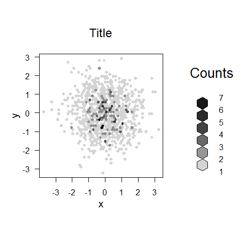

``` r
x <- rnorm(1000)
y <- rnorm(1000)

plot(x, y, main = 'Title', col =  rgb(0, 100, 0, 50, maxColorValue = 255), pch = 16)
```


``` r
data(Diamonds, package = 'Stat2Data')

a = hexbin(Diamonds$PricePerCt, Diamonds$Carat, xbins = 40)

library(RColorBrewer)

plot(a)
```


Colors.

``` r
rf <- colorRampPalette(rev(brewer.pal(12, 'Set3')))

hexbinplot(Diamonds$PricePerCt ~ Diamonds$Carat, colramp = rf)
```


**Mix `lattice` and `hexbin`**

``` r
data(gvhd10, package = 'latticeExtra')

xyplot(asinh(SSC.H) ~ asinh(FL2.H), gvhd10, aspect = 1, panel = panel.hexbinplot, .aspect.ratio = 1, trans = sqrt)
```


``` r
xyplot(asinh(SSC.H) ~ asinh(FL2.H) | Days, gvhd10, aspect = 1, panel = panel.hexbinplot, .aspect.ratio = 1, trans =sqrt)
```


### The `car` Package (scatter)

``` r
library(car)
```

**Scatter plot**

``` r
scatterplotMatrix(~mpg + disp + drat + wt | cyl, data = mtcars,
   main = 'Three Cylinder Options')
```


### The `scatterplot3d` Package

``` r
library(scatterplot3d)
```

**Scatter plot**

``` r
scatterplot3d(wt, disp, mpg, main = 'Title')
```


``` r
scatterplot3d(wt, disp, mpg, pch = 16, highlight.3d = TRUE, type = 'h', main = 'Title')
```


``` r
s3d <- scatterplot3d(wt, disp, mpg, pch = 16, highlight.3d = TRUE, type = 'h', main = '   Title')

fit <- lm(mpg ~ wt + disp)

s3d$plane3d(fit)
```


### The `rgl` Package (interactive)

``` r
library(rgl)
```

**Interactive plot**

The plot will open a new window.

``` r
plot3d(wt, disp, mpg, col = 'red', size = 3)
```

### The `cluster` Package (dendrogram)

``` r
library(cluster)
```

**Dendrogram**

Use the `iris` dataset.

``` r
subset <- sample(1:150, 20)
cS <- as.character(Sp <- iris$Species[subset])
cS
```

    ##  [1] "setosa"     "versicolor" "setosa"     "virginica"  "virginica" 
    ##  [6] "setosa"     "setosa"     "setosa"     "virginica"  "setosa"    
    ## [11] "versicolor" "versicolor" "virginica"  "setosa"     "versicolor"
    ## [16] "versicolor" "setosa"     "virginica"  "versicolor" "versicolor"

``` r
cS[Sp == 'setosa'] <- 'S'
cS[Sp == 'versicolor'] <- 'V'
cS[Sp == 'virginica'] <- 'g'

ai <- agnes(iris[subset, 1:4])

plot(ai, label = cS)
```


### The `extracat` Package (splom)

``` r
library(extracat)
```

**Splom**

For missing values. Binary matrix with reordering and filtering of rows
and columns. The x-axis shows the frequency of NA. The y-axis shows the
marginal distribution of NA.

``` r
# example 1
data(CHAIN, package = 'mi')

visna(CHAIN, sort = 'b')
```


``` r
summary(CHAIN)
```

    ##    log_virus           age            income          healthy     
    ##  Min.   : 0.000   Min.   :21.00   Min.   : 1.000   Min.   :16.67  
    ##  1st Qu.: 0.000   1st Qu.:37.00   1st Qu.: 2.000   1st Qu.:35.00  
    ##  Median : 0.000   Median :43.00   Median : 3.000   Median :45.37  
    ##  Mean   : 4.324   Mean   :42.56   Mean   : 3.377   Mean   :44.40  
    ##  3rd Qu.: 9.105   3rd Qu.:48.00   3rd Qu.: 5.000   3rd Qu.:54.89  
    ##  Max.   :13.442   Max.   :70.00   Max.   :10.000   Max.   :70.11  
    ##  NA's   :179      NA's   :24      NA's   :38       NA's   :24     
    ##      mental           damage        treatment     
    ##  Min.   :0.0000   Min.   :1.000   Min.   :0.0000  
    ##  1st Qu.:0.0000   1st Qu.:3.000   1st Qu.:0.0000  
    ##  Median :0.0000   Median :4.000   Median :1.0000  
    ##  Mean   :0.2717   Mean   :3.578   Mean   :0.8602  
    ##  3rd Qu.:1.0000   3rd Qu.:5.000   3rd Qu.:2.0000  
    ##  Max.   :1.0000   Max.   :5.000   Max.   :2.0000  
    ##  NA's   :24       NA's   :63      NA's   :24

``` r
# example 2
data(oly12, package = 'VGAMdata')

oly12d <- oly12[, names(oly12) != 'DOB']
oly12a <- oly12

names(oly12a) <- abbreviate(names(oly12), 3)

visna(oly12a, sort = 'b')
```


``` r
# example 3
data(freetrade, package = 'Amelia')

freetrade <- within(freetrade, land1 <- reorder(country, tariff, function(x) sum(is.na(x))))

fluctile(xtabs(is.na(tariff) ~ land1 + year, data = freetrade))
```


    ## viewport[base]

``` r
# example 4
data(Pima.tr2, package = 'MASS')

visna(Pima.tr2, sort = 'b')
```


### The `ash` Package (density)

``` r
library(ash)
```

**Density plot**

``` r
plot(ash1(bin1(mtcars$mpg, nbin = 50)), type = 'l')
```

    ## [1] "ash estimate nonzero outside interval ab"


### The `KernSmooth` Package (density)

``` r
library(KernSmooth)
```

**Density plot**

``` r
with(mtcars, {
  hist(mpg, freq = FALSE, main = '', col = 'bisque2', ylab = '')
  lines(density(mpg), lwd = 2)
  ks1 <- bkde(mpg, bandwidth = dpik(mpg))
  lines(ks1, col = 'red', lty = 5, lwd = 2)})
```


### The `crorplot` Package (correlation)

``` r
library(corrplot)
```

**Splom**

``` r
# Create a correlation matrix for the dataset (9-14 are the '2' variables only)
correlations <- cor(mtcars)

corrplot(correlations)
```


