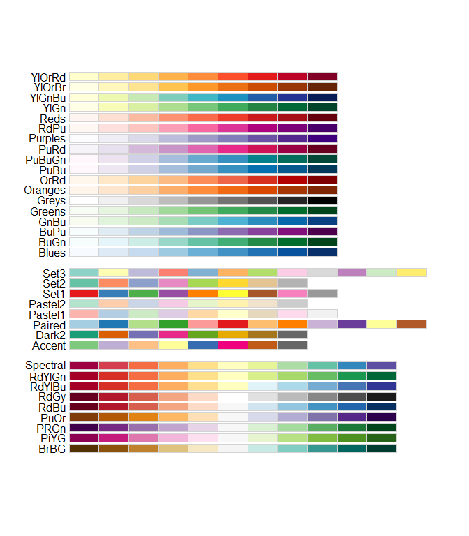

-   [Default colours](#default-colours)
-   [Basic colours](#basic-colours)
-   [RColorBrewer examples](#rcolorbrewer-examples)
-   [Building a palette](#building-a-palette)
-   [Grabing colours](#grabing-colours)

------------------------------------------------------------------------

**Foreword**

-   Output options: the 'tango' syntax and the 'readable' theme.
-   Snippets and results.

------------------------------------------------------------------------

Default colours
---------------

``` r
# Set
palette('default')
palette()
```

    ## [1] "black"   "red"     "green3"  "blue"    "cyan"    "magenta" "yellow" 
    ## [8] "gray"

``` r
# Show
par(mfrow = c(1, 2))

n <- 8
pie(rep(1, n), col = FALSE, main = 'colourless')
n <- 8
pie(rep(1, n), col = palette(), main = 'default')
```


``` r
par(mfrow = c(1, 1))
```

Basic colours
-------------

``` r
# 8 types times 9 tones
n <- 9
rainbow(n, s = 1, v = 1, start = 0, end = max(1, n - 1)/n, alpha = 1)
```

    ## [1] "#FF0000FF" "#FFAA00FF" "#AAFF00FF" "#00FF00FF" "#00FFAAFF" "#00AAFFFF"
    ## [7] "#0000FFFF" "#AA00FFFF" "#FF00AAFF"

``` r
m <- (1:n)/n
gray(m)
```

    ## [1] "#1C1C1C" "#393939" "#555555" "#717171" "#8E8E8E" "#AAAAAA" "#C6C6C6"
    ## [8] "#E3E3E3" "#FFFFFF"

``` r
hsv(m, s = 1, v = 1, alpha = 1)
```

    ## [1] "#FFAA00FF" "#AAFF00FF" "#00FF00FF" "#00FFAAFF" "#00AAFFFF" "#0000FFFF"
    ## [7] "#AA00FFFF" "#FF00AAFF" "#FF0000FF"

``` r
blues9
```

    ## [1] "#F7FBFF" "#DEEBF7" "#C6DBEF" "#9ECAE1" "#6BAED6" "#4292C6" "#2171B5"
    ## [8] "#08519C" "#08306B"

``` r
heat.colors(n, alpha = 1)
```

    ## [1] "#FF0000FF" "#FF2A00FF" "#FF5500FF" "#FF8000FF" "#FFAA00FF" "#FFD500FF"
    ## [7] "#FFFF00FF" "#FFFF40FF" "#FFFFBFFF"

``` r
terrain.colors(n, alpha = 1)
```

    ## [1] "#00A600FF" "#3EBB00FF" "#8BD000FF" "#E6E600FF" "#E8C32EFF" "#EBB25EFF"
    ## [7] "#EDB48EFF" "#F0C9C0FF" "#F2F2F2FF"

``` r
cm.colors(n, alpha = 1)
```

    ## [1] "#80FFFFFF" "#9FFFFFFF" "#BFFFFFFF" "#DFFFFFFF" "#FFFFFFFF" "#FFDFFFFF"
    ## [7] "#FFBFFFFF" "#FF9FFFFF" "#FF80FFFF"

``` r
topo.colors(n, alpha = 1)
```

    ## [1] "#4C00FFFF" "#004CFFFF" "#00E5FFFF" "#00FF4DFF" "#4DFF00FF" "#E6FF00FF"
    ## [7] "#FFFF00FF" "#FFDE59FF" "#FFE0B3FF"

``` r
# Show
par(mfrow = c(2, 2))

pie(rep(1, n), col = rainbow(n, alpha = 1), main = 'rainbow')
pie(rep(1, n), col = gray(m), main = 'gray')
pie(rep(1, n), col = hsv(m, alpha = 1), main = 'hsv')
pie(rep(1, n), col = blues9, main = 'blues9')
```


``` r
pie(rep(1, n), col = heat.colors(n, alpha = 1), main = 'heat')
pie(rep(1, n), col = terrain.colors(n, alpha = 1), main = 'terrain')
pie(rep(1, n), col = cm.colors(n), main = 'cm.colors')
pie(rep(1, n), col = topo.colors(n, alpha = 1), main = 'topo')
```


``` r
par(mfrow = c(1, 1))
```

RColorBrewer examples
---------------------

``` r
library(RColorBrewer)

# Show all
display.brewer.all()
```



``` r
# Pick a palette
n <- 8
colors <- brewer.pal(n, "BuPu")
colors
```

    ## [1] "#F7FCFD" "#E0ECF4" "#BFD3E6" "#9EBCDA" "#8C96C6" "#8C6BB1" "#88419D"
    ## [8] "#6E016B"

``` r
par(mfrow = c(1, 2))
pie(rep(1, n), col = colors, main = 'Sequential RdPu')

# Interpolate these colors
pal <- colorRampPalette(brewer.pal(n, 'RdPu'))
pal(8)
```

    ## [1] "#FFF7F3" "#FDE0DD" "#FCC5C0" "#FA9FB5" "#F768A1" "#DD3497" "#AE017E"
    ## [8] "#7A0177"

``` r
pie(rep(1, n), col = pal(8), main = 'Interpolated RdPu')
```


``` r
# Apply
data(volcano)
par(mfrow = c(2, 1))
image(volcano, col = pal(8))
image(volcano, col = pal(30))
```


``` r
par(mfrow = c(1, 1))
```

``` r
# Show samples
par(mfrow = c(2, 2))

n = 9
pie(rep(1, n), col = brewer.pal(n, 'RdPu'), main = 'Sequential RdPu')
n = 9
pie(rep(1, n), col = brewer.pal(n, 'Set1'), main = 'Qualitative Set1')
n = 12
pie(rep(1, n), col = brewer.pal(n, 'Paired'), main = 'Qualitative Paired')
n = 11
pie(rep(1, n), col = brewer.pal(n, 'RdBu'), main = 'Divergent RdBu')
```


``` r
par(mfrow = c(1, 1))
```

``` r
# Show
n = 8
darkcols <- brewer.pal(n, 'Dark2')
pie(rep(1, n), col = darkcols, main = 'Dark2')
```


Building a palette
------------------

``` r
# All
head(colors())
```

    ## [1] "white"         "aliceblue"     "antiquewhite"  "antiquewhite1"
    ## [5] "antiquewhite2" "antiquewhite3"

``` r
length(colors()) # 657
```

    ## [1] 657

``` r
# Create
mycols <- colors()[c(8, 5, 30, 53, 118, 72)] #
# or
# mycols <- c('aquamarine', 'antiquewhite2', 'blue4', 'chocolate1', 'deeppink2', 'cyan4')

# Show
n = 6
pie(rep(1, n), col = mycols, main = 'mycols')
```


``` r
# Generate randomly
cl <- colors(distinct = TRUE)
set.seed(15887) # to set random generator seed
mycols2 <- sample(cl, 7)

# Show
n = 7
pie(rep(1, n), col = mycols2, main = 'mycols2 (random)')
```


Grabing colours
---------------

-   [Grab Website Colors](http://www.colorcombos.com/grabcolors.html)
-   [RGB Color Codes Chart](http://www.rapidtables.com/web/color/RGB_Color.htm#color%20picker)
