<!--
-   [Documentation](#documentation)
-   [Dataset](#dataset)
-   [The `ggplot2` Package](#the-ggplot2-package)
-   [SECTION 1](#section-1)
-   [1, Introduction](#introduction)
-   [2, Data](#data)
-   [3, Aesthetics](#aesthetics)
-   [4, Geometries](#geometries)
-   [5, qplot and wrap-up](#qplot-and-wrap-up)
-   [SECTION 2](#section-2)
-   [1, Statistics](#statistics)
-   [2, Coordinates and Facets](#coordinates-and-facets)
-   [3, Themes](#themes)
-   [4, Best Practices](#best-practices)
-   [5, Case Study](#case-study)
-   [SECTION 3](#section-3)
-   [SECTION 4 - Cheat List](#section-4---cheat-list)
-->
------------------------------------------------------------------------

**Foreword**

-   Output options: the 'tango' syntax and the 'readable' theme.
-   Snippets and results.

------------------------------------------------------------------------

Documentation
-------------

-   [ggplot2](http://docs.ggplot2.org/current/).
-   [ggthemes](https://github.com/jrnold/ggthemes).
-   [r4stats](http://r4stats.com/examples/graphics-ggplot2/).

Dataset
-------

For most examples, we use the `mtcars`, `diamonds`, `iris`, `ChickWeight`, `recess`, `fish`, `Vocab`, `Titanic`, `mamsleep`, `barley`, `adult` datasets.

The `ggplot2` Package
---------------------

``` r
library(ggplot2)
```

Import additional packages.

``` r
library(digest)
library(grid)
library(gtable)
library(MASS)
library(plyr)
library(reshape2)
library(scales)
library(stats)
library(tidyr)
```

For this project, import additional packages.

``` r
library(ggthemes)
library(RColorBrewer)
library(gridExtra)
library(GGally)
library(car)
library(Hmisc)
library(dplyr)
```

Suggested additional packages...

SECTION 1
---------

Introduction
---------------

**Exploring `ggplot2`, part 1**

``` r
# basic plot
ggplot(mtcars, aes(x = cyl, y = mpg)) +
  geom_point()
```


**Exploring `ggplot2`, part 2**

``` r
# cyl is a factor
ggplot(mtcars, aes(x = factor(cyl), y = mpg)) +
  geom_point()
```


**Exploring `ggplot2`, part 3**

``` r
# scatter plot
ggplot(mtcars, aes(x = wt, y = mpg)) +
  geom_point()
```


``` r
# add color
ggplot(mtcars, aes(x = wt, y = mpg, col = disp)) +
  geom_point()
```


``` r
# change size
ggplot(mtcars, aes(x = wt, y = mpg, size = disp)) +
  geom_point()
```


**Exploring `ggplot2`, part 4**

``` r
# Add geom_point() with +
ggplot(diamonds, aes(x = Carat, y = PricePerCt)) +
  geom_point()
```


``` r
# Add geom_point() and geom_smooth() with +
ggplot(diamonds, aes(x = Carat, y = PricePerCt)) +
  geom_point() + geom_smooth()
```


**Exploring `ggplot2`, part 5**

``` r
# only the smooth line
ggplot(diamonds, aes(x = Carat, y = PricePerCt)) +
  geom_smooth()
```


``` r
# change col
ggplot(diamonds, aes(x = Carat, y = PricePerCt, col = Clarity)) + 
  geom_point()
```


``` r
# change the alpha
ggplot(diamonds, aes(x = Carat, y = PricePerCt, col = Clarity)) +
  geom_point(alpha = 0.4)
```


**Exploring `ggplot2`, part 6**

``` r
# 2 facets for comparison
library(gridExtra)

data(father.son, package = 'UsingR')

a <- ggplot(father.son, aes(fheight, sheight)) +
  geom_point() +
  geom_smooth(method = 'lm', colour = 'red') +
  geom_abline(slope = 1, intercept = 0)

b <- ggplot(father.son, aes(fheight, sheight)) +
  geom_point() +
  geom_smooth(method = 'lm', colour = 'red', se = FALSE) +
  stat_smooth()

grid.arrange(a, b, nrow = 1)
```


``` r
# load more data
data(oly12, package = 'VGAMdata')

# 2 facets for comparison
ggplot(oly12, aes(Height, Weight)) +
  geom_point(size = 1) +
  facet_wrap(~Sex, ncol = 1)
```


``` r
# create a new variable inside de data frame
oly12S <- within(oly12, oly12$Sport <- abbreviate(oly12$Sport, 12))

# multiple facets or splom
ggplot(oly12S, aes(Height, Weight)) +
  geom_point(size = 1) +
  facet_wrap(~Sport) +
  ggtitle('Weight and Height by Sport') 
```


**Understanding the grammar, part 1**

``` r
# create the object containing the data and aes layers
dia_plot <- ggplot(diamonds, aes(x = Carat, y = PricePerCt))

# add a geom layer
dia_plot + 
  geom_point()
```


``` r
# add the same geom layer, but with aes() inside
dia_plot +
  geom_point(aes(col = Clarity))
```


**Understanding the grammar, part 2**

``` r
set.seed(1)

# create the object containing the data and aes layers
dia_plot <- ggplot(diamonds, aes(x = Carat, y = PricePerCt))

# add geom_point() with alpha set to 0.2
dia_plot <- dia_plot +
  geom_point(alpha = 0.2)

dia_plot
```


``` r
# plot dia_plot with additional geom_smooth() with se set to FALSE
dia_plot +
  geom_smooth(se = FALSE)
```


Data
-------

**Base package and `ggplot2`, part 1 - plot**

``` r
# basic plot
plot(mtcars$wt, mtcars$mpg, col = mtcars$cyl)
```


``` r
# change cyl inside mtcars to a factor
mtcars$cyl <- as.factor(mtcars$cyl)

# make the same plot as in the first instruction
plot(mtcars$wt, mtcars$mpg, col = mtcars$cyl)
```

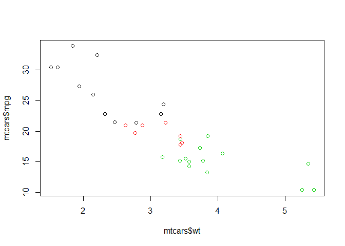

**Base package and `ggplot2`, part 2 - lm**

transfer to other

``` r
# Basic plot
mtcars$cyl <- as.factor(mtcars$cyl)
plot(mtcars$wt, mtcars$mpg, col = mtcars$cyl)

# use lm() to calculate a linear model and save it as carModel
carModel <- lm(mpg ~ wt, data = mtcars)

# Call abline() with carModel as first argument and lty as second
abline(carModel, lty = 2)

# plot each subset efficiently with lapply
lapply(mtcars$cyl, function(x) {
  abline(lm(mpg ~ wt, mtcars, subset = (cyl == x)), col = x)
  })
```

    ## [[1]]
    ## NULL
    ## 
    ## [[2]]
    ## NULL
    ## 
    ## [[3]]
    ## NULL
    ## 
    ## [[4]]
    ## NULL
    ## 
    ## [[5]]
    ## NULL
    ## 
    ## [[6]]
    ## NULL
    ## 
    ## [[7]]
    ## NULL
    ## 
    ## [[8]]
    ## NULL
    ## 
    ## [[9]]
    ## NULL
    ## 
    ## [[10]]
    ## NULL
    ## 
    ## [[11]]
    ## NULL
    ## 
    ## [[12]]
    ## NULL
    ## 
    ## [[13]]
    ## NULL
    ## 
    ## [[14]]
    ## NULL
    ## 
    ## [[15]]
    ## NULL
    ## 
    ## [[16]]
    ## NULL
    ## 
    ## [[17]]
    ## NULL
    ## 
    ## [[18]]
    ## NULL
    ## 
    ## [[19]]
    ## NULL
    ## 
    ## [[20]]
    ## NULL
    ## 
    ## [[21]]
    ## NULL
    ## 
    ## [[22]]
    ## NULL
    ## 
    ## [[23]]
    ## NULL
    ## 
    ## [[24]]
    ## NULL
    ## 
    ## [[25]]
    ## NULL
    ## 
    ## [[26]]
    ## NULL
    ## 
    ## [[27]]
    ## NULL
    ## 
    ## [[28]]
    ## NULL
    ## 
    ## [[29]]
    ## NULL
    ## 
    ## [[30]]
    ## NULL
    ## 
    ## [[31]]
    ## NULL
    ## 
    ## [[32]]
    ## NULL

``` r
# draw the legend of the plot
legend(x = 5, y = 33, legend = levels(mtcars$cyl), col = 1:3, pch = 1, bty = 'n')
```

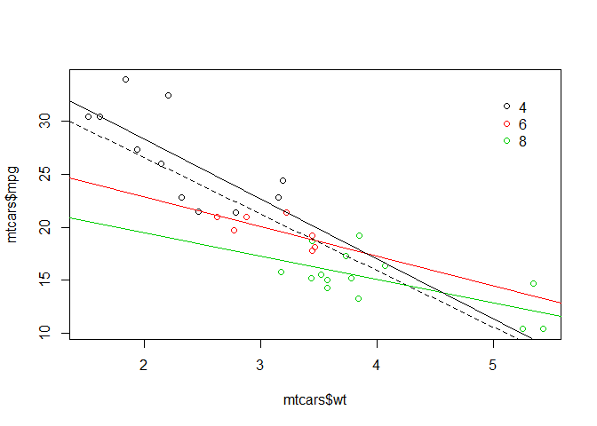

**Base package and `ggplot2`, part 3**

``` r
# scatter plot
ggplot(mtcars, aes(x = wt, y = mpg, col = cyl)) + 
  geom_point()
```


``` r
# include the lines of the linear models, per cyl
ggplot(mtcars, aes(x = wt, y = mpg, col = cyl)) +
  geom_point() +
  geom_smooth(method = 'lm', se = FALSE)
```


``` r
# include a lm for the entire dataset in its whole
ggplot(mtcars, aes(x = wt, y = mpg, col = cyl)) +
  geom_point() +
  geom_smooth(method = 'lm', se = FALSE) +
  geom_smooth(aes(group = 1), method = 'lm', se = FALSE, linetype = 2)
```


**Variables to visuals, part 1**

``` r
iris.tidy <- iris %>%
  gather(key, Value, -Species) %>%
  separate(key, c('Part', 'Measure'), '\\.')

# create 2 facets
ggplot(iris.tidy, aes(x = Species, y = Value, col = Part)) +
  geom_jitter() + facet_grid(. ~ Measure)
```


**Variables to visuals, part 2**

``` r
# Add a new column, Flower, to iris that contains unique ids
iris$Flower <- 1:nrow(iris)

iris.wide <- iris %>%
  gather(key, value, -Species, -Flower) %>%
  separate(key, c('Part', 'Measure'), '\\.') %>%
  spread(Measure, value)

# create 3 facets
ggplot(iris.wide, aes(x = Length, y = Width, col = Part)) + 
  geom_jitter() +
  facet_grid(. ~ Species)
```


Aesthetics
-------------

**All about aesthetics, part 1**

``` r
# map cyl to y
ggplot(mtcars, aes(x = mpg, y = cyl)) +
  geom_point()
```


``` r
# map cyl to x
ggplot(mtcars, aes(y = mpg, x = cyl)) +
  geom_point()
```


``` r
# map cyl to col
ggplot(mtcars, aes(x = wt, y = mpg, col = cyl)) +
  geom_point()
```


``` r
# change shape and size of the points
ggplot(mtcars, aes(x = wt, y = mpg, col = cyl)) +
  geom_point(shape = 1, size = 4)
```


**All about aesthetics, part 2**

``` r
# map cyl to fill
ggplot(mtcars, aes(x = wt, y = mpg, fill = cyl)) +
  geom_point()
```


``` r
# Change shape, size and alpha of the points in the above plot
ggplot(mtcars, aes(x = wt, y = mpg, fill = cyl)) +
  geom_point(shape = 16, size = 6, alpha = 0.6)
```


**All about aesthetics, part 3**

``` r
# map cyl to size
ggplot(mtcars, aes(x = wt, y = mpg, size = cyl)) +
  geom_point()
```

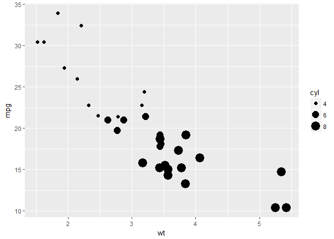

``` r
# map cyl to alpha
ggplot(mtcars, aes(x = wt, y = mpg, alpha = cyl)) +
  geom_point()
```


``` r
# map cyl to shape 
ggplot(mtcars, aes(x = wt, y = mpg, shape = cyl, label = cyl)) +
  geom_point()
```


``` r
# map cyl to labels
ggplot(mtcars, aes(x = wt, y = mpg, label = cyl)) +
  geom_text()
```


**All about attributes, part 1**

``` r
# define a hexadecimal color
my_color <- '#123456'

# set the color aesthetic 
ggplot(mtcars, aes(x = wt, y = mpg, col = cyl)) +
  geom_point()
```


``` r
# set the color aesthetic and attribute 
ggplot(mtcars, aes(x = wt, y = mpg, col = cyl)) +
  geom_point(col = my_color)
```


``` r
# set the fill aesthetic and color, size and shape attributes
ggplot(mtcars, aes(x = wt, y = mpg, fill = cyl)) +
  geom_point(size = 10, shape = 23, col = my_color)
```


**All about attributes, part 2**

``` r
# draw points with alpha 0.5
ggplot(mtcars, aes(x = wt, y = mpg, fill = cyl)) +
  geom_point(alpha = 0.5)
```


``` r
# raw points with shape 24 and color yellow
ggplot(mtcars, aes(x = wt, y = mpg, fill = cyl)) +
  geom_point(shape = 24, col = 'yellow')
```


``` r
# draw text with label x, color red and size 10
ggplot(mtcars, aes(x = wt, y = mpg, fill = cyl)) +
  geom_text(label = 'x', col = 'red', size = 10)
```


**Going all out**

``` r
# Map mpg onto x, qsec onto y and factor(cyl) onto col
ggplot(mtcars, aes(x = mpg, y = qsec, col = factor(cyl))) +
  geom_point()
```


``` r
# Add mapping: factor(am) onto shape
ggplot(mtcars, aes(x = mpg, y = qsec, col = factor(cyl), shape = factor(am))) +
  geom_point()
```


``` r
# Add mapping: (hp/wt) onto size
ggplot(mtcars, aes(x = mpg, y = qsec, col = factor(cyl), shape = factor(am), size = hp/wt)) +
  geom_point()
```


``` r
# Add mapping: rownames(mtcars) onto label
ggplot(mtcars, aes(x = mpg, y = qsec, col = factor(cyl), shape = factor(am), size = hp/wt)) +
  geom_text(aes(label = rownames(mtcars)))
```


**Position**

``` r
# base layers
cyl.am <- ggplot(mtcars, aes(x = factor(cyl), fill = factor(am)))

# add geom (position = 'stack'' by default)
cyl.am + 
  geom_bar(position = 'stack')
```


``` r
# show proportion
cyl.am + 
  geom_bar(position = 'fill')
```


``` r
# dodging
cyl.am + 
  geom_bar(position = 'dodge')
```


``` r
# clean up the axes with scale_ functions
val = c('#E41A1C', '#377EB8')
lab = c('Manual', 'Automatic')

cyl.am + geom_bar(position = 'dodge', ) +
  scale_x_discrete('Cylinders') +
  scale_y_continuous('Number') +
  scale_fill_manual('Transmission', values = val, labels = lab)
```


**Setting a dummy aesthetic**

``` r
# add a new column called group
mtcars$group <- 0

# create jittered plot of mtcars: mpg onto x, group onto y
ggplot(mtcars, aes(x = mpg, y = group)) +   geom_jitter()
```

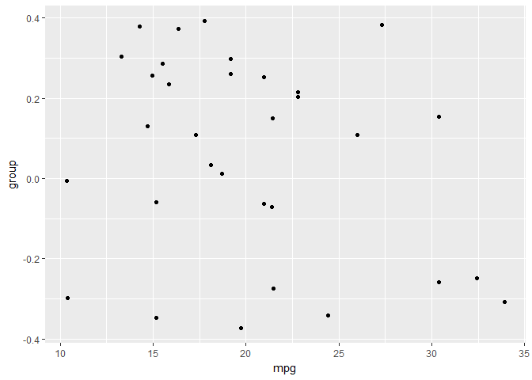

``` r
# change the y aesthetic limits
ggplot(mtcars, aes(x = mpg, y = group)) +
  geom_jitter() +
  scale_y_continuous(limits = c(-2, 2))
```


**Overplotting 1 - Point shape and transparency**

``` r
# basic scatter plot: wt on x-axis and mpg on y-axis; map cyl to col
ggplot(mtcars, aes(x = wt, y = mpg, col = cyl)) +
  geom_point(size = 4)
```


``` r
# hollow circles - an improvement
ggplot(mtcars, aes(x = wt, y = mpg, col = cyl)) +
  geom_point(size = 4, shape = 1)
```


``` r
# add transparency - very nice
ggplot(mtcars, aes(x = wt, y = mpg, col = cyl)) +
  geom_point(size = 4, shape = 1, alpha = 0.6)
```


**Overplotting 2 - alpha with large datasets**

``` r
# scatter plot: carat (x), price (y), clarity (col)
ggplot(diamonds, aes(x = Carat, y = PricePerCt, col = Clarity)) +
  geom_point()
```


``` r
# adjust for overplotting
ggplot(diamonds, aes(x = Carat, y = PricePerCt, col = Clarity)) +
  geom_point(alpha = 0.5)
```


``` r
# scatter plot: clarity (x), carat (y), price (col)
ggplot(diamonds, aes(x = Clarity, y = Carat, col = PricePerCt)) +
  geom_point(alpha = 0.5)
```


``` r
# dot plot with jittering
ggplot(diamonds, aes(x = Clarity, y = Carat, col = PricePerCt)) +
  geom_point(alpha = 0.5, position = 'jitter')
```


Geometries
-------------

**Scatter plots and jittering (1)**

``` r
# plot the cyl on the x-axis and wt on the y-axis
ggplot(mtcars, aes(x = cyl, y = wt)) +
  geom_point()
```


``` r
# Use geom_jitter() instead of geom_point()
ggplot(mtcars, aes(x = cyl, y = wt)) +
  geom_jitter()
```


``` r
# Define the position object using position_jitter(): posn.j
posn.j <-  position_jitter(0.1)

# Use posn.j in geom_point()
ggplot(mtcars, aes(x = cyl, y = wt)) +
  geom_point(position = posn.j)
```


**Scatter plots and jittering (2)**

``` r
# scatter plot of vocabulary (y) against education (x). Use geom_point()
ggplot(Vocab, aes(x = education, y = vocabulary)) + 
  geom_point()
```


``` r
# use geom_jitter() instead of geom_point()
ggplot(Vocab, aes(x = education, y = vocabulary)) +
  geom_jitter()
```


``` r
# set alpha to a very low 0.2
ggplot(Vocab, aes(x = education, y = vocabulary)) +
  geom_jitter(alpha = 0.2)
```


``` r
# set the shape to 1
ggplot(Vocab, aes(x = education, y = vocabulary)) +
  geom_jitter(alpha = 0.2, shape = 1)
```


**Histograms**

``` r
# univariate histogram
ggplot(mtcars, aes(x = mpg)) +
  geom_histogram()
```


``` r
# change the bin width to 1
ggplot(mtcars, aes(x = mpg)) +
  geom_histogram(binwidth = 1)
```


``` r
# change the y aesthetic to density
ggplot(mtcars, aes(x = mpg)) +
  geom_histogram(aes(y = ..density..), binwidth = 1)
```


``` r
# custom color code
myBlue <- '#377EB8'

# Change the fill color to myBlue
ggplot(mtcars, aes(x = mpg)) +
  geom_histogram(aes(y = ..density..), binwidth = 1, fill = myBlue)
```


**Position**

``` r
mtcars$am <- as.factor(mtcars$am)

# bar plot of cyl, filled according to am
ggplot(mtcars, aes(x = cyl, fill = am)) +
  geom_bar()
```


``` r
# change the position argument to stack
ggplot(mtcars, aes(x = cyl, fill = am)) +
  geom_bar(position = 'stack')
```


``` r
# change the position argument to fill
ggplot(mtcars, aes(x = cyl, fill = am)) +
  geom_bar(position = 'fill')
```


``` r
# change the position argument to dodge
ggplot(mtcars, aes(x = cyl, fill = am)) +
  geom_bar(position = 'dodge')
```


**Overlapping bar plots**

``` r
# bar plot of cyl, filled according to am
ggplot(mtcars, aes(x = cyl, fill = am)) +
  geom_bar()
```


``` r
# change the position argument to 'dodge'
ggplot(mtcars, aes(x = cyl, fill = am)) +
  geom_bar(position = 'dodge')
```


``` r
# define posn_d with position_dodge()
posn_d <- position_dodge(0.2)

# change the position argument to posn_d
ggplot(mtcars, aes(x = cyl, fill = am)) +
  geom_bar(position = posn_d)
```


``` r
# use posn_d as position and adjust alpha to 0.6
ggplot(mtcars, aes(x = cyl, fill = am)) +
  geom_bar(position = posn_d, alpha = 0.6)
```


**Overlapping histograms**

``` r
# histogram, add coloring defined by cyl 
ggplot(mtcars, aes(mpg, fill = cyl)) +
  geom_histogram(binwidth = 1)
```

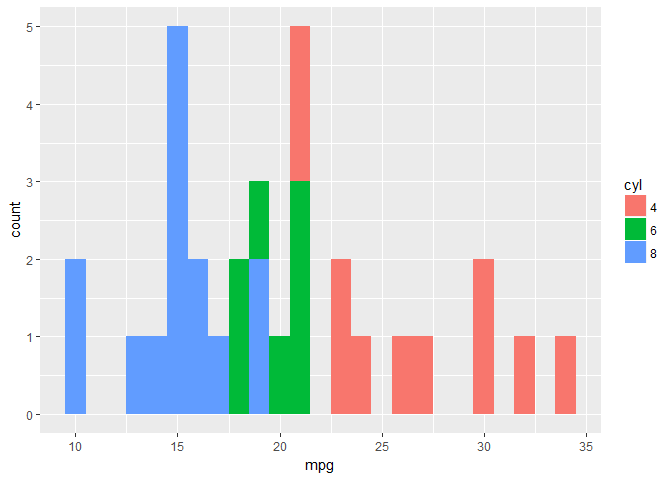

``` r
# change position to identity 
ggplot(mtcars, aes(mpg, fill = cyl)) +
  geom_histogram(binwidth = 1, position = 'identity')
```


``` r
# change geom to freqpoly (position is identity by default) 
ggplot(mtcars, aes(mpg, col = cyl)) +
  geom_freqpoly(binwidth = 1)
```


**Facets or splom histograms**

``` r
# load the package
library(reshape2)

# load new data
data(uniranks, package = 'GDAdata')

# name the variables
names(uniranks)[c(5, 6, 8, 8, 10, 11, 13)] <- c('AvTeach', 'NSSTeach', 'SpendperSt', 'StudentStaffR', 'Careers', 'VAddScore', 'NSSFeedb')

# reshape the data frame
ur2 <- melt(uniranks[, c(3, 5:13)], id.vars = 'UniGroup', variable.name = 'uniV', value.name = 'uniX')
```

``` r
# Splom
ggplot(ur2, aes(uniX)) +
  geom_histogram() +
  xlab('') +
  ylab('') +
  facet_grid(UniGroup ~ uniV, scales = 'free_x')
```


``` r
library(ggplot2)
library(gridExtra)
data(Pima.tr2, package = 'MASS')

h1 <- ggplot(Pima.tr2, aes(glu)) + geom_histogram()
h2 <- ggplot(Pima.tr2, aes(bp)) + geom_histogram()
h3 <- ggplot(Pima.tr2, aes(skin)) + geom_histogram()
h4 <- ggplot(Pima.tr2, aes(bmi)) + geom_histogram()
h5 <- ggplot(Pima.tr2, aes(ped)) + geom_histogram()
h6 <- ggplot(Pima.tr2, aes(age)) + geom_histogram()

grid.arrange(h1, h2, h3, h4, h5, h6, nrow = 2)
```


**Bar plots with color ramp, part 1**

``` r
# Example of how to use a brewed color palette
ggplot(mtcars, aes(x = cyl, fill = am)) +
  geom_bar() + 
  scale_fill_brewer(palette = 'Set1')
```


``` r
Vocab$education <- as.factor(Vocab$education)
Vocab$vocabulary <- as.factor(Vocab$vocabulary)

# Plot education on x and vocabulary on fill
# Use the default brewed color palette
ggplot(Vocab, aes(x = education, fill = vocabulary)) + geom_bar(position = 'fill') + scale_fill_brewer(palette = 'Set3')
```


**Bar plots with color ramp, part 2**

``` r
# Definition of a set of blue colors
blues <- brewer.pal(9, 'Blues')

# Make a color range using colorRampPalette() and the set of blues
blue_range <- colorRampPalette(blues)

# Use blue_range to adjust the color of the bars, use scale_fill_manual()
ggplot(Vocab, aes(x = education, fill = vocabulary)) + 
  geom_bar(position = 'fill') +
  scale_fill_manual(values = blue_range(11))
```


**Overlapping histograms (2)**

``` r
# histogram
ggplot(mtcars, aes(mpg)) + geom_histogram(binwidth = 1)
```


``` r
# expand the histogram to fill using am
ggplot(mtcars, aes(mpg, fill = am)) +
  geom_histogram(binwidth = 1)
```


``` r
# change the position argument to 'dodge'
ggplot(mtcars, aes(mpg, fill = am)) +
  geom_histogram(position = 'dodge', binwidth = 1)
```

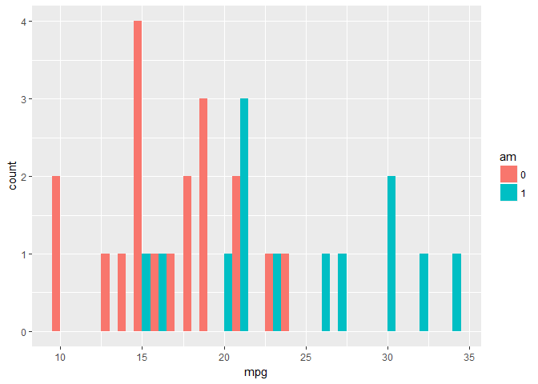

``` r
# change the position argument to 'fill'
ggplot(mtcars, aes(mpg, fill = am)) +
  geom_histogram(position = 'fill', binwidth = 1)
```


``` r
# change the position argument to 'identity' and set alpha to 0.4
ggplot(mtcars, aes(mpg, fill = am)) +
  geom_histogram(position = 'identity', binwidth = 1, alpha = 0.4)
```


``` r
# change fill to cyl
ggplot(mtcars, aes(mpg, fill = cyl)) +
  geom_histogram(position = 'identity', binwidth = 1, alpha = 0.4)
```


**Line plots**

``` r
# plot unemploy as a function of date using a line plot
ggplot(economics, aes(x = date, y = unemploy)) +
  geom_line()  
```


``` r
# adjust plot to represent the fraction of total population that is unemployed
ggplot(economics, aes(x = date, y = unemploy/pop)) +
  geom_line()
```


**Periods of recession**

``` r
# draw the recess periods
ggplot(economics, aes(x = date, y = unemploy/pop)) +
  geom_line() +
  geom_rect(data = recess, inherit.aes = FALSE, aes(xmin = begin, xmax = end, ymin = -Inf, ymax = +Inf), fill = 'red', alpha = 0.2)
```


**Multiple time series, part 1**

``` r
# use gather to go from fish to fish.tidy.
fish.tidy <- gather(fish, Species, Capture, -Year)
```

**Multiple time series, part 2**

``` r
# plot
ggplot(fish.tidy, aes(x = Year, y = Capture, col = Species)) +
  geom_line()
```


`qplot` and wrap-up
--------------------

**Using `qplot`**

``` r
# the old way
plot(mpg ~ wt, data = mtcars)
```


``` r
# using ggplot
ggplot(mtcars, aes(x = wt, y = mpg)) +
  geom_point(shape = 1)
```


``` r
# Using qplot
qplot(wt, mpg, data = mtcars)
```


**Using aesthetics**

``` r
# Categorical: cyl
qplot(wt, mpg, data = mtcars, size = cyl)
```


``` r
# gear
qplot(wt, mpg, data = mtcars, size = gear)
```


``` r
# Continuous: hp
qplot(wt, mpg, data = mtcars, col = hp)
```


``` r
# qsec
qplot(wt, mpg, data = mtcars, size = qsec)
```

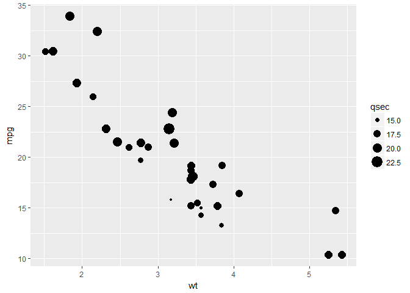

**Choosing geoms, part 1**

``` r
# qplot() with x only
qplot(factor(cyl), data = mtcars)
```


``` r
# qplot() with x and y
qplot(factor(cyl), factor(vs), data = mtcars)
```


``` r
# qplot() with geom set to jitter manually
qplot(factor(cyl), factor(vs), data = mtcars, geom = 'jitter')
```


**Choosing geoms, part 2 - dotplot**

``` r
# make a dot plot with ggplot
ggplot(mtcars, aes(cyl, wt, fill = am)) + 
  geom_dotplot(stackdir = 'center', binaxis = 'y')
```


``` r
# qplot with geom 'dotplot', binaxis = 'y' and stackdir = 'center'
qplot(as.numeric(cyl), wt, data = mtcars, fill = am, geom = 'dotplot', stackdir = 'center', binaxis = 'y')
```


**Chicken weight**

``` r
# base
ggplot(ChickWeight, aes(x = Time, y = weight)) +
  geom_line(aes(group = Chick))
```


``` r
# color
ggplot(ChickWeight, aes(x = Time, y = weight, col = Diet)) +
  geom_line(aes(group = Chick))
```


``` r
# lines
ggplot(ChickWeight, aes(x = Time, y = weight, col = Diet)) +
  geom_line(aes(group = Chick), alpha = 0.3) +
  geom_smooth(lwd = 2, se = FALSE)
```


**Titanic**

``` r
# Use ggplot() for the first instruction
ggplot(titanic, aes(x = factor(Pclass), fill = factor(Sex))) +
  geom_bar(position = 'dodge')
```


``` r
# Use ggplot() for the second instruction
ggplot(titanic, aes(x = factor(Pclass), fill = factor(Sex))) +
  geom_bar(position = 'dodge') +
  facet_grid('. ~ Survived')
```


``` r
# position jitter
posn.j <- position_jitter(0.5, 0)

# Use ggplot() for the last instruction
ggplot(titanic, aes(x = factor(Pclass), y = Age, col = factor(Sex))) +
  geom_jitter(size = 3, alpha = 0.5, position = posn.j) +
  facet_grid('. ~ Survived')
```


SECTION 2
---------

Statistics
-------------

**Smoothing**

``` r
# scatter plot with LOESS smooth with a CI ribbon
ggplot(mtcars, aes(x = wt, y = mpg)) +
  geom_point() +
  geom_smooth()
```


``` r
# scatter plot with LOESS smooth without CI
ggplot(mtcars, aes(x = wt, y = mpg)) +
  geom_point() +
  geom_smooth(se = FALSE)
```


``` r
# scatter plot with an OLS linear model
ggplot(mtcars, aes(x = wt, y = mpg)) +
  geom_point() +
  geom_smooth(method = 'lm')
```

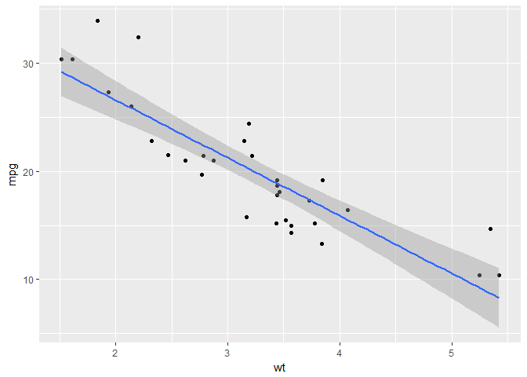

``` r
# scatter plot with an OLS linear model without points
ggplot(mtcars, aes(x = wt, y = mpg)) +
  geom_smooth(method = 'lm', se = FALSE)
```


**Grouping variables**

``` r
# cyl as a factor variable
ggplot(mtcars, aes(x = wt, y = mpg, col = factor(cyl))) +
  geom_point() +
  stat_smooth(method = 'lm', se = FALSE)
```


``` r
# set the group aesthetic
ggplot(mtcars, aes(x = wt, y = mpg, col = factor(cyl), group = 1)) +
  geom_point() +
  stat_smooth(method = 'lm', se = F)
```


``` r
# add a second smooth layer in which the group aesthetic is set
ggplot(mtcars, aes(x = wt, y = mpg, col = factor(cyl))) +
  geom_point() +
  stat_smooth(method = 'lm', se = FALSE) +
  stat_smooth(method = 'lm', se = FALSE, aes(group = 1))
```


**Modifying `stat_smooth`**

``` r
# change the LOESS span
ggplot(mtcars, aes(x = wt, y = mpg)) +
  geom_point() +
  geom_smooth(se = FALSE, span = 0.7, method = 'auto')
```


``` r
# method = 'auto' is by default
```

``` r
# set the model to the default LOESS and use a span of 0.7
ggplot(mtcars, aes(x = wt, y = mpg, col = factor(cyl))) +
  geom_point() +
  stat_smooth(method = 'lm', se = FALSE) +
  stat_smooth(method = 'auto', se = FALSE, aes(group = 1), col = 'black', span = 0.7)
```


``` r
# set col to 'All', inside the aes layer
ggplot(mtcars, aes(x = wt, y = mpg, col = factor(cyl))) +
  geom_point() +
  stat_smooth(method = 'lm', se = FALSE) +
  stat_smooth(method = 'auto', se = FALSE, aes(group = 1, col = 'All cyl'), span = 0.7)
```

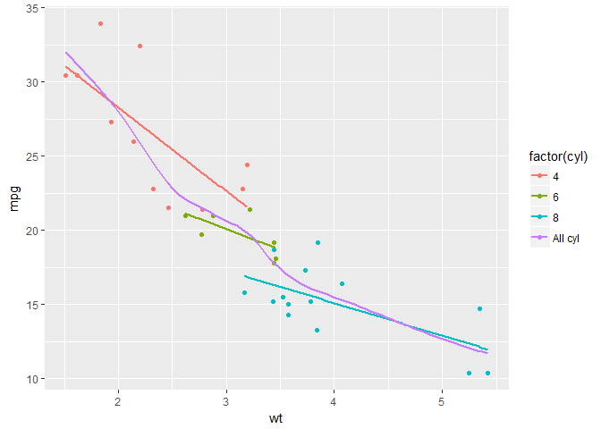

``` r
# add `scale_color_manual` to change the colors
myColors <- c(brewer.pal(3, 'Dark2'), 'black')

ggplot(mtcars, aes(x = wt, y = mpg, col = factor(cyl))) +
  geom_point() +
  stat_smooth(method = 'lm', se = FALSE) +
  stat_smooth(method = 'auto', se = FALSE, aes(group = 1, col = 'All cyl'), span = 0.7) +
  scale_color_manual('Cylinders', values = myColors)
```


**Modifying `stat_smooth` (2)**

``` r
# jittered scatter plot, add a linear model (lm) smooth
ggplot(Vocab, aes(x = education, y = vocabulary)) +
  geom_jitter(alpha = 0.2) +
  stat_smooth(method = 'lm', se = FALSE)
```


``` r
# only lm, colored by year
ggplot(Vocab, aes(x = education, y = vocabulary, col = factor(year))) +
  stat_smooth(method = 'lm', se = FALSE)
```


``` r
# set a color brewer palette
ggplot(Vocab, aes(x = education, y = vocabulary, col = factor(year))) + 
  stat_smooth(method = 'lm', se = FALSE) +
  scale_color_brewer('Accent')
```


``` r
# change col and group, specify alpha, size and geom, and add scale_color_gradient
ggplot(Vocab, aes(x = education, y = vocabulary, col = year, group = factor(year))) + 
  stat_smooth(method = 'lm', se = FALSE, alpha = 0.6, size = 2, geom = 'path') +
  scale_color_brewer('Blues') +
  scale_color_gradientn(colors = brewer.pal(9, 'YlOrRd'))
```


**Quantiles**

``` r
# use stat_quantile instead of stat_smooth
ggplot(Vocab, aes(x = education, y = vocabulary, col = year, group = factor(year))) +  stat_quantile(alpha = 0.6, size = 2) + 
  scale_color_gradientn(colors = brewer.pal(9,'YlOrRd'))
```


``` r
# set quantile to 0.5
ggplot(Vocab, aes(x = education, y = vocabulary, col = year, group = factor(year))) + 
  stat_quantile(alpha = 0.6, size = 2, quantiles = c(0.5)) + 
  scale_color_gradientn(colors = brewer.pal(9,'YlOrRd'))
```


**Sum**

``` r
# plot with linear and loess model
p <- ggplot(Vocab, aes(x = education, y = vocabulary)) + 
  stat_smooth(method = 'loess', aes(col = 'red'), se = F) + 
  stat_smooth(method = 'lm', aes(col = 'blue'), se = F) + 
  scale_color_discrete('Model', labels = c('red' = 'LOESS', 'blue' = 'lm'))

p
```


``` r
# add stat_sum (by overall proportion)
p + 
  stat_sum()
```


``` r
#aes(group = 1)
```

``` r
# set size range
p + 
  stat_sum() + 
  scale_size(range = c(1,10))
```


``` r
# proportional within years of education; set group aesthetic
p + 
  stat_sum(aes(group = education))
```


``` r
# set the n
p + 
  stat_sum(aes(group = education, size = ..n..))
```


**Preparations**

``` r
# convert cyl and am to factors
mtcars$cyl <- as.factor(mtcars$cyl)
mtcars$am <- as.factor(mtcars$am)

# define positions
posn.d <- position_dodge(width = 0.1)
posn.jd <- position_jitterdodge(jitter.width = 0.1, dodge.width = 0.2)
posn.j <- position_jitter(width = 0.2)

# base layers
wt.cyl.am <- ggplot(mtcars, aes(x = cyl, y = wt, col = am, group = am, fill = am))
```

**Plotting variations**

``` r
# base layer
wt.cyl.am <- ggplot(mtcars, aes(x = cyl,  y = wt, col = am, fill = am, group = am))
```

``` r
# jittered, dodged scatter plot with transparent points
wt.cyl.am + 
  geom_point(position = posn.jd, alpha = 0.6)
```

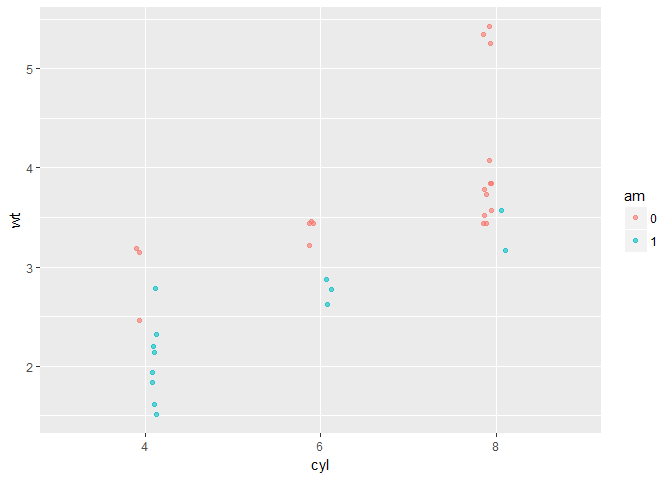

``` r
# mean and sd
wt.cyl.am +
  geom_point(position = posn.jd, alpha = 0.6) + stat_summary(fun.data = mean_sdl, fun.args = list(mult = 1), position = posn.d)
```


``` r
# mean and 95% CI
wt.cyl.am + 
  geom_point(position = posn.jd, alpha = 0.6) + 
  stat_summary(fun.data = mean_cl_normal, position = posn.d)
```


``` r
# mean and SD with T-tipped error bars
wt.cyl.am + 
  geom_point(position = posn.jd, alpha = 0.6) + 
  stat_summary(geom = 'point', fun.y = mean, position = posn.d) + 
  stat_summary(geom = 'errorbar', fun.data = mean_sdl, fun.args = list(mult = 1), width = 0.1, position = posn.d)
```

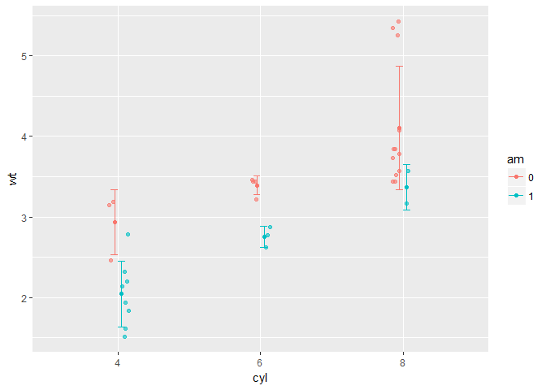

Coordinates and Facets
-------------------------

**Zooming In**

``` r
# basic
p <- ggplot(mtcars, aes(x = wt, y = hp, col = am)) + 
  geom_point() + 
  geom_smooth()
```

``` r
# add scale_x_continuous
p + 
  scale_x_continuous(limits = c(3, 6), expand = c(0,0))
```

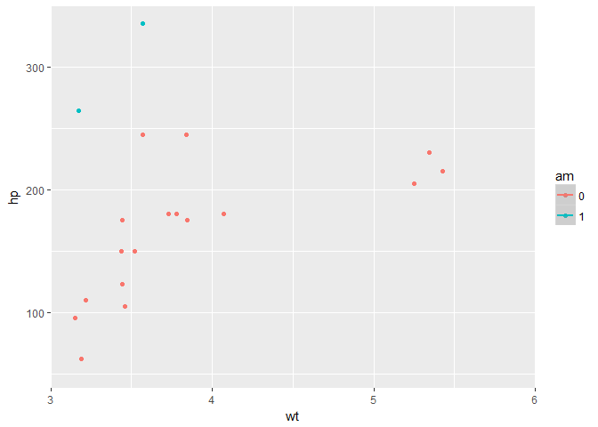

``` r
# zoom in
p + 
  coord_cartesian(xlim = c(3, 6))
```


**Aspect Ratio**

``` r
# scatter plot
base.plot <- ggplot(iris, aes(y = Sepal.Width, x = Sepal.Length, col = Species)) + 
  geom_jitter() + 
  geom_smooth(method = 'lm', se = FALSE)
```

``` r
# default aspect ratio
# fix aspect ratio (1:1)
base.plot + 
  coord_equal()
```


``` r
base.plot + 
  coord_fixed()
```


**Pie Charts**

``` r
# stacked bar plot
thin.bar <- ggplot(mtcars, aes(x = 1, fill = cyl)) + 
  geom_bar()

thin.bar
```


``` r
# convert thin.bar to pie chart
thin.bar + 
  coord_polar(theta = 'y')
```


``` r
# create stacked bar plot
wide.bar <- ggplot(mtcars, aes(x = 1, fill = cyl)) + 
  geom_bar(width = 1)

wide.bar
```


``` r
# Convert wide.bar to pie chart
wide.bar + coord_polar(theta = 'y')
```


**Facets: the basics**

``` r
# scatter plot
p <- ggplot(mtcars, aes(x = wt, y = mpg)) + geom_point()
```

``` r
# separate rows according am
# facet_grid(rows ~ cols)
p + 
  facet_grid(am ~ .)
```


``` r
# separate columns according to cyl
# facet_grid(rows ~ cols)
p + facet_grid(. ~ cyl)
```

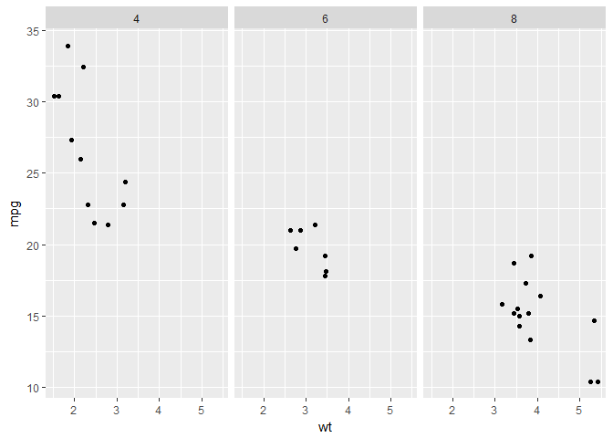

``` r
# separate by both columns and rows 
# facet_grid(rows ~ cols)
p + 
  facet_grid(am ~ cyl)
```


**Many variables**

``` r
# create the `cyl_am` col and `myCol` vector
mtcars$cyl_am <- paste(mtcars$cyl, mtcars$am, sep = '_')

myCol <- rbind(brewer.pal(9, 'Blues')[c(3,6,8)],
               brewer.pal(9, 'Reds')[c(3,6,8)])
```

``` r
# scatter plot, add color scale
ggplot(mtcars, aes(x = wt, y = mpg, col = cyl_am)) + 
  geom_point() + 
  scale_color_manual(values = myCol)
```


``` r
# facet according on rows and columns
ggplot(mtcars, aes(x = wt, y = mpg, col = cyl_am)) +
  geom_point() + 
  scale_color_manual(values = myCol) + 
  facet_grid(gear ~ vs)
```


``` r
# add more variables
ggplot(mtcars, aes(x = wt, y = mpg, col = cyl_am, size = disp)) + 
  geom_point() + 
  scale_color_manual(values = myCol) + 
  facet_grid(gear ~ vs)
```

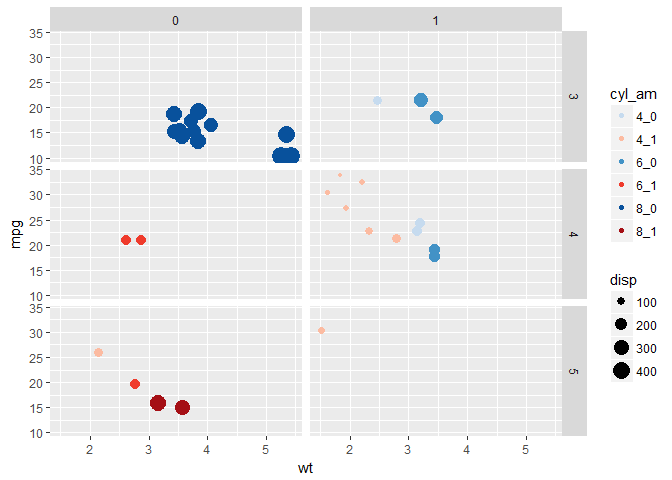

**Dropping levels**

``` r
# scatter plot
ggplot(mamsleep, aes(x = time, y = name, col = sleep)) + 
  geom_point()
```

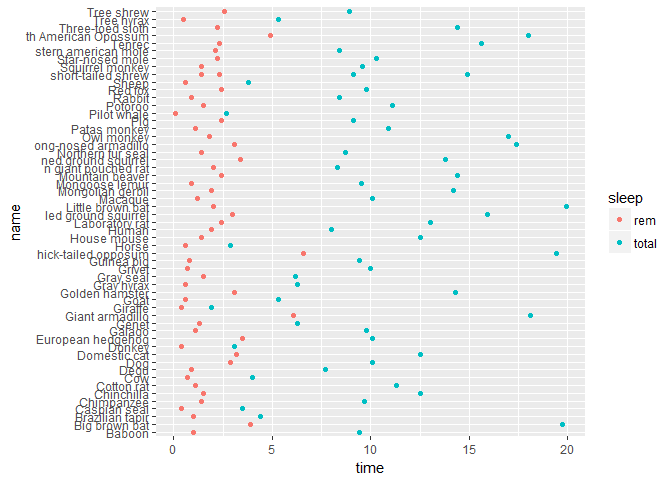

``` r
# facet rows according to `vore`
ggplot(mamsleep, aes(x = time, y = name, col = sleep)) + 
  geom_point() + 
  facet_grid(vore ~ .)
```


``` r
# specify scale and space arguments to free up rows
ggplot(mamsleep, aes(x = time, y = name, col = sleep)) + 
  geom_point() + 
  facet_grid(vore ~ ., scale = 'free_y', space = 'free_y')
```

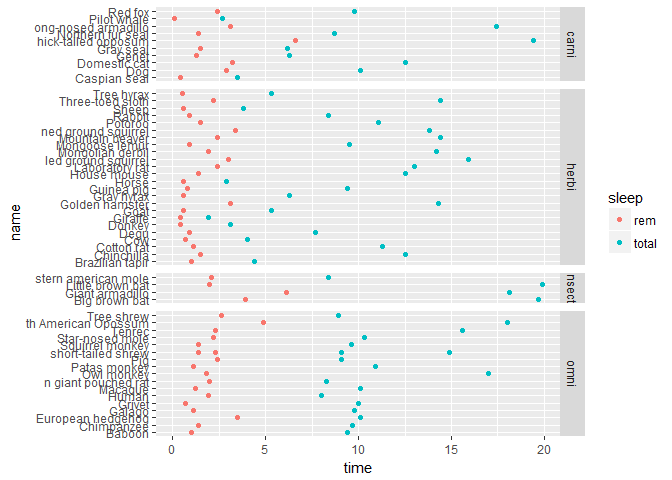

Themes
---------

**Rectangles**

``` r
# separate columns according to cyl
# facet_grid(rows ~ cols)
mtcars$cyl <- c(6, 6, 4, 6, 8, 6, 8, 4, 4, 6, 6, 8, 8, 8, 8, 8, 8, 4, 4, 4, 4, 8, 8, 8, 8, 4, 4, 4, 8, 6, 8, 4)

mtcars$Cylinders <- factor(mtcars$cyl)

z <- ggplot(mtcars, aes(x = wt, y = mpg, col = Cylinders)) + 
  geom_point(size = 2, alpha = 0.7) + 
  facet_grid(. ~ cyl) + 
  labs(x = 'Weight (lb/1000)', y = 'Miles/(US) gallon') + 
  geom_smooth(method = 'lm', se = FALSE) +
  theme_base() +
  scale_colour_economist()
z
```


``` r
# change the plot background color to myPink (#FEE0D2)
myPink <- '#FEE0D2'

z + 
  theme(plot.background = element_rect(fill = myPink))
```


``` r
# adjust the border to be a black line of size 3
z + 
  theme(plot.background = element_rect(fill = myPink, color = 'black', size = 3))
```


``` r
# adjust the border to be a black line of size 3
z + 
  theme(plot.background = element_rect(color = 'black', size = 3))
```


``` r
# set panel.background, legend.key, legend.background and strip.background to element_blank()
z + 
  theme(plot.background = element_rect(fill = myPink, color = 'black', size = 3), panel.background = element_blank(), legend.key = element_blank(), legend.background = element_blank(), strip.background = element_blank())
```


**Lines**

``` r
# Extend z with theme() and three arguments
z +
    theme(panel.grid = element_blank(), axis.line = element_line(color = 'black'), axis.ticks = element_line(color = 'black'))
```


**Text**

``` r
# extend z with theme() function and four arguments
myRed <- '#99000D'

z +
    theme(strip.text = element_text(size = 16, color = myRed), axis.title.x = element_text(color = myRed, hjust = 0, face = 'italic'), axis.title.y = element_text(color = myRed, hjust = 0, face = 'italic'), axis.text = element_text(color = 'black'))
```

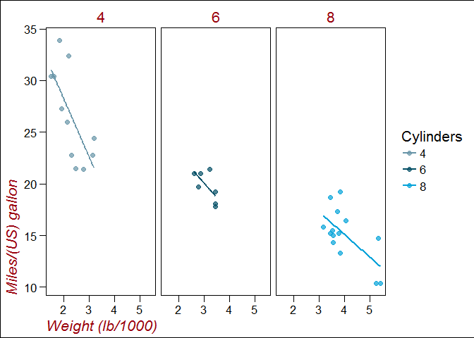

**Legends**

``` r
# move legend by position
z + 
  theme(legend.position = c(0.85, 0.85))
```


``` r
# change direction
z + 
  theme(legend.direction = 'horizontal')
```


``` r
# change location by name
z + 
  theme(legend.position = 'bottom')
```


``` r
# remove legend entirely
z + 
  theme(legend.position = 'none')
```


**Positions**

``` r
# increase spacing between facets
z + 
  theme(panel.margin.x = unit(2, 'cm'))
```

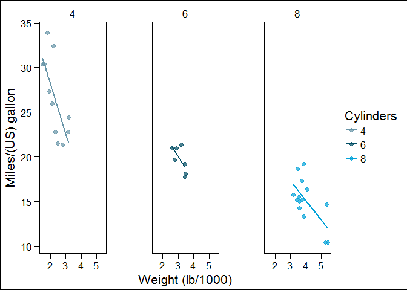

``` r
# add code to remove any excess plot margin space
z + 
  theme(panel.margin.x = unit(2, 'cm'), plot.margin = unit(c(0,0,0,0), 'cm'))
```


**Update Themestheme update**

``` r
# theme layer saved as an object, theme_pink
theme_pink <- theme(panel.background = element_blank(), legend.key = element_blank(), legend.background = element_blank(), strip.background = element_blank(), plot.background = element_rect(fill = myPink, color = 'black', size = 3), panel.grid = element_blank(), axis.line = element_line(color = 'black'), axis.ticks = element_line(color = 'black'), strip.text = element_text(size = 16, color = myRed), axis.title.y = element_text(color = myRed, hjust = 0, face = 'italic'), axis.title.x = element_text(color = myRed, hjust = 0, face = 'italic'), axis.text = element_text(color = 'black'), legend.position = 'none')
```

``` r
z2 <- z

# apply theme_pink to z2
z2 + 
  theme_pink
```


``` r
# change code so that old theme is saved as old
old <- theme_update(panel.background = element_blank(), legend.key = element_blank(), legend.background = element_blank(), strip.background = element_blank(), plot.background = element_rect(fill = myPink, color = 'black', size = 3), panel.grid = element_blank(),axis.line = element_line(color = 'black'), axis.ticks = element_line(color = 'black'), strip.text = element_text(size = 16, color = myRed), axis.title.y = element_text(color = myRed, hjust = 0, face = 'italic'), axis.title.x = element_text(color = myRed, hjust = 0, face = 'italic'), axis.text = element_text(color = 'black'), legend.position = 'none')
```

``` r
# display the plot z2
theme_set(theme_pink)

z2 + 
  theme_pink
```


``` r
# restore the old plot
theme_set(old)

z2
```


**Exploring ggthemes**

``` r
# apply theme_tufte
# set the theme with theme_set
theme_set(theme_tufte())

# or apply it in the ggplot command
z2 + 
  theme_tufte()
```


``` r
# apply theme_tufte, modified
# set the theme with theme_set
theme_set(theme_tufte() + 
  theme(legend.position = c(0.9, 0.9), axis.title = element_text(face = 'italic', size = 12),  legend.title = element_text(face = 'italic', size = 12)))

# or apply it in the ggplot command
z2 + 
  theme_tufte() +
  theme(legend.position = c(0.9, 0.9),        axis.title = element_text(face = 'italic', size = 12), legend.title = element_text(face = 'italic', size = 12))
```


``` r
# apply theme_igray
# set the theme with `theme_set`
theme_set(theme_igray())

# or apply it in the ggplot command
z2 + 
  theme_igray()
```


``` r
# apply `theme_igray`, modified
# set the theme with `theme_set`
theme_set(theme_igray() + 
  theme(legend.position = c(0.9, 0.9), legend.key = element_blank(), legend.background = element_rect(fill = 'grey90')))

z2 + 
  # Or apply it in the ggplot command
  theme_igray() +
  theme(legend.position = c(0.9, 0.9),
        legend.key = element_blank(),
        legend.background = element_rect(fill = 'grey90'))
```


Best Practices
-----------------

**Bar Plots (1)**

``` r
# base layers
m <- ggplot(mtcars, aes(x = cyl, y = wt))
```

``` r
# dynamite plot
m + 
  stat_summary(fun.y = mean, geom = 'bar', fill = 'skyblue') + stat_summary(fun.data = mean_sdl, fun.args = list(mult = 1), geom = 'errorbar', width = 0.1)
```


**Bar Plots (2)**

``` r
# base layers
m <- ggplot(mtcars, aes(x = cyl,y = wt, col = am, fill = am))
```

``` r
# dynamite plot
m + 
  stat_summary(fun.y = mean, geom = 'bar') + stat_summary(fun.data = mean_sdl, fun.args = list(mult = 1), geom = 'errorbar', width = 0.1)
```


``` r
# set position dodge in each `stat` function
m + 
  stat_summary(fun.y = mean, geom = 'bar', position = 'dodge') + stat_summary(fun.data = mean_sdl, fun.args = list(mult = 1), geom = 'errorbar', width = 0.1, position = 'dodge')
```


``` r
# set your dodge `posn` manually
posn.d <- position_dodge(0.9)
```

``` r
# redraw dynamite plot
m + 
  stat_summary(fun.y = mean, geom = 'bar', position = posn.d) +  stat_summary(fun.data = mean_sdl, fun.args = list(mult = 1), geom = 'errorbar', width = 0.1, position = posn.d)
```

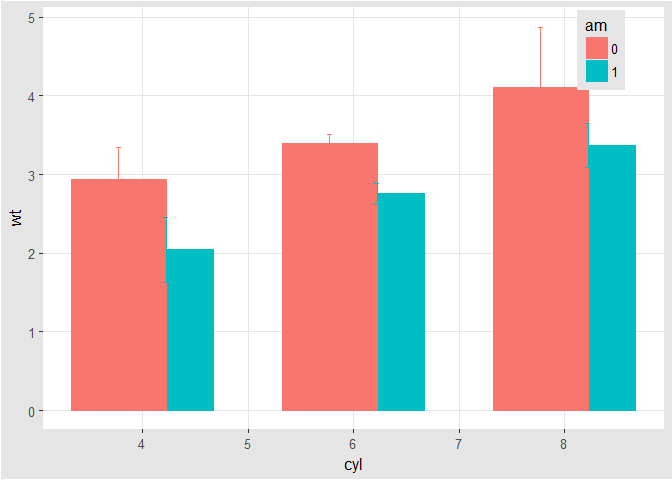

**Bar Plots (3)**

``` r
# base layers
mtcars.cyl <- mtcars %>% group_by(cyl) %>% summarise(wt.avg = mean(wt))
mtcars.cyl
```

    ## # A tibble: 3 × 2
    ##     cyl   wt.avg
    ##   <dbl>    <dbl>
    ## 1     4 2.285727
    ## 2     6 3.117143
    ## 3     8 3.999214

``` r
m <- ggplot(mtcars.cyl, aes(x = cyl, y = wt.avg))
m
```


``` r
# draw bar plot
m + 
  geom_bar(stat = 'identity', fill = 'skyblue')
```

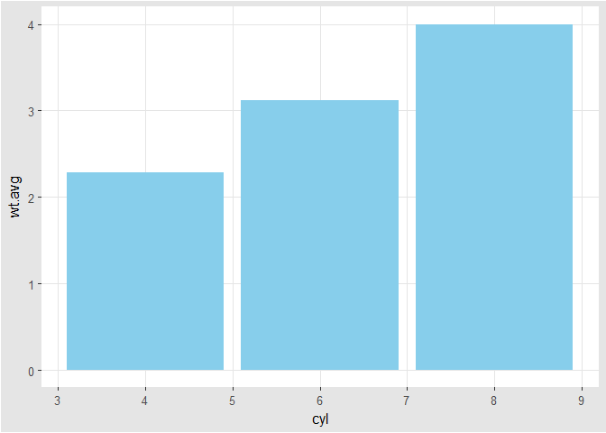

**Pie Charts (1)**

``` r
# bar chart to pie chart
ggplot(mtcars, aes(x = cyl, fill = am)) + geom_bar(position = 'fill')
```


``` r
ggplot(mtcars, aes(x = cyl, fill = am)) + geom_bar(position = 'fill') + facet_grid(. ~ cyl)
```


``` r
ggplot(mtcars, aes(x = factor(1), fill = am)) + geom_bar(position = 'fill') + facet_grid(. ~ cyl)
```

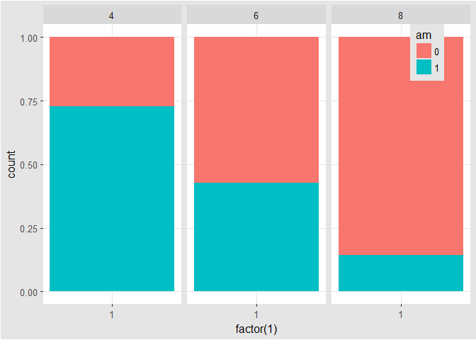

``` r
ggplot(mtcars, aes(x = factor(1), fill = am)) + geom_bar(position = 'fill') + facet_grid(. ~ cyl) + coord_polar(theta = 'y')
```


``` r
ggplot(mtcars, aes(x = factor(1), fill = am)) + geom_bar(position = 'fill', width = 1) + facet_grid(. ~ cyl) + coord_polar(theta = 'y')
```


**Parallel coordinate plot**

``` r
# parallel coordinates plot using `GGally`
# all columns except `am` (`am` column is the 9th)
group_by_am <- 9
my_names_am <- (1:11)[-group_by_am]
```

``` r
# parallel plot; each variable plotted as a z-score transformation
ggparcoord(mtcars, columns = my_names_am, groupColumn = group_by_am, alpha = 0.8)
```


``` r
# scaled between 0-1 and most discriminating variable first
ggparcoord(mtcars, columns = my_names_am, groupColumn = group_by_am, alpha = 0.8, scale = 'uniminmax', order = 'anyClass')
```


``` r
ggparcoord(iris, columns = 1:4, groupColumn = 'Species') # xlab, ylab, scale_x_discrete, them
```


``` r
ggparcoord(iris, columns = 1:4, groupColumn = 'Species', scale = 'uniminmax')
```


``` r
ggparcoord(iris, columns = 1:4, groupColumn = 'Species', scale = 'globalminmax')
```


``` r
ggparcoord(iris, columns = 1:4, groupColumn = 'Species', mapping = aes(size = 1))
```


``` r
ggparcoord(iris, columns = 1:4, groupColumn = 'Species', alphaLines = 0.3)
```


``` r
ggparcoord(iris, columns = 1:4, groupColumn = 'Species', scale = 'center')
```


``` r
ggparcoord(iris, columns = 1:4, groupColumn = 'Species', scaleSummary = 'median', missing = 'exclude')
```


``` r
ggparcoord(iris, columns = 1:4, groupColumn = 'Species', order = 'allClass') # or custom filter
```


``` r
ggparcoord(iris, columns = 1:4, groupColumn = 'Species', scale = 'std')
```


**Splom**

``` r
library(dplyr)

data(Pima.tr2, package = 'MASS')
PimaV <- select(Pima.tr2, glu:age)

ggpairs(PimaV, diag = list(continuous = 'density'), axisLabels = 'show')
```

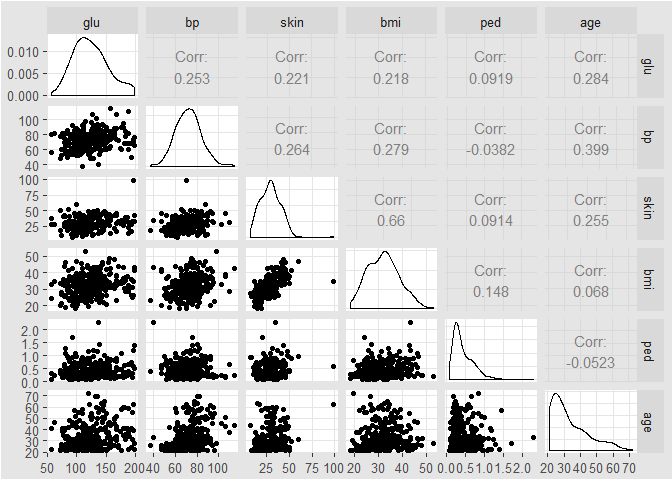

**Heat Maps**

``` r
# create color palette
myColors <- brewer.pal(9, 'Reds')
```

``` r
# heat map
ggplot(barley, aes(x = year, y = variety, fill = yield)) + 
  geom_tile()
```

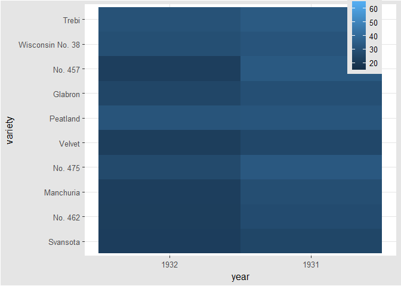

``` r
# add facet_wrap(~ variable); not like facet_grid(. ~ variable)
ggplot(barley, aes(x = year, y = variety, fill = yield)) + 
  geom_tile() + 
  facet_wrap( ~ site, ncol = 1)
```


``` r
# 
ggplot(barley, aes(x = year, y = variety, fill = yield)) + geom_tile() + facet_wrap( ~ site, ncol = 1) + 
  scale_fill_gradientn(colors = myColors)
```


**Heat Maps Alternatives (1)**

``` r
# line plots
ggplot(barley, aes(x = year, y = yield, col = variety, group = variety)) + geom_line() + 
  facet_wrap(facets = ~ site, nrow = 1)
```


**Heat Maps Alternatives (2)**

``` r
# overlapping ribbon plot
ggplot(barley, aes(x = year, y = yield, col = site, group = site, fill = site)) + geom_line() + 
  stat_summary(fun.y = mean, geom = 'line') + 
  stat_summary(fun.data = mean_sdl, fun.args = list(mult = 1), geom = 'ribbon', col = NA, alpha = 0.1)
```


Case Study
-------------

**Sort and order**

``` r
# reorder
data(Cars93, package = 'MASS')

Cars93 <- within(Cars93, TypeWt <- reorder(Type, Weight, mean))

Cars93 <- within(Cars93, Type1 <- factor(Type, levels = c('Small', 'Sporty', 'Compact', 'Midsize', 'Large', 'Van')))

with(Cars93, table(TypeWt, Type1))
```

    ##          Type1
    ## TypeWt    Small Sporty Compact Midsize Large Van
    ##   Small      21      0       0       0     0   0
    ##   Sporty      0     14       0       0     0   0
    ##   Compact     0      0      16       0     0   0
    ##   Midsize     0      0       0      22     0   0
    ##   Large       0      0       0       0    11   0
    ##   Van         0      0       0       0     0   9

``` r
ggplot(Cars93, aes(TypeWt, 100/MPG.city)) + 
  geom_boxplot() + 
  ylab('Gallons per 100 miles') + 
  xlab('Car type')
```


``` r
Cars93 <- within(Cars93, {
  levels(Type1) <- c('Small', 'Large', 'Midsize', 'Small', 'Sporty', 'Large')
})

ggplot(Cars93, aes(TypeWt, 100/MPG.city)) + 
  geom_boxplot() + 
  ylab('Gallons per 100 miles') + 
  xlab('Car type')
```


**Ensemble plots**

``` r
library(gridExtra)

data(Fertility, package = 'AER')

p0 <- ggplot(Fertility) + geom_histogram(binwidth = 1) + ylab('')
p1 <- p0 + aes(x = age)
p2 <- p0 + aes(x = work) + xlab('Weeks worked in 1979')

k <- ggplot(Fertility) + 
  geom_bar() + ylab('') + 
  ylim(0, 250000)

p3 <- k + aes(x = morekids) + 
  xlab('has more children')
p4 <- k + aes(x = gender1) + 
  xlab('first child')
p5 <- k + aes(x = gender2) + 
  xlab('second child')
p6 <- k + aes(x = afam) + 
  xlab('African-American')
p7 <- k + aes(x = hispanic) + 
  xlab('Hispanic')
p8 <- k + aes(x = other) + 
  xlab('other race')

grid.arrange(arrangeGrob(p1, p2, ncol = 2, widths = c(3, 3)), arrangeGrob(p3, p4, p5, p6, p7, p8, ncol = 6), nrow = 2, heights = c(1.25, 1))
```


**Exploring Data**

``` r
# histogram
ggplot(adult, aes(x = SRAGE_P)) + 
  geom_histogram()
```


``` r
# histogram
ggplot(adult, aes(x = BMI_P)) + 
  geom_histogram()
```


``` r
# color, default binwidth
ggplot(adult,aes(x = SRAGE_P, fill = factor(RBMI))) + 
  geom_histogram(binwidth = 1)
```


**Data Cleaning**

``` r
# remove individual aboves 84
adult <- adult[adult$SRAGE_P <= 84, ] 

# remove individuals with a BMI below 16 and above or equal to 52
adult <- adult[adult$BMI_P >= 16 & adult$BMI_P < 52, ]

# relabel race
adult$RACEHPR2 <- factor(adult$RACEHPR2, labels = c('Latino', 'Asian', 'African American', 'White'))

# relabel the BMI categories variable
adult$RBMI <- factor(adult$RBMI, labels = c('Under-weight', 'Normal-weight', 'Over-weight', 'Obese'))
```

**Multiple Histograms**

``` r
# color palette BMI_fill
BMI_fill <- scale_fill_brewer('BMI Category', palette = 'Reds')
```

``` r
# histogram, add BMI_fill and customizations
ggplot(adult, aes(x = SRAGE_P, fill= factor(RBMI))) + 
  geom_histogram(binwidth = 1) + 
  BMI_fill + facet_grid(RBMI ~ .) + 
  theme_classic()
```


**Alternatives**

``` r
# count histogram
ggplot(adult, aes(x = SRAGE_P, fill = factor(RBMI))) + 
  geom_histogram(binwidth = 1) +
  BMI_fill
```


``` r
# density histogram
ggplot(adult, aes(x = SRAGE_P, fill= factor(RBMI))) + 
  geom_histogram(aes(y = ..density..), binwidth = 1) +
  BMI_fill
```


``` r
# faceted count histogram
ggplot(adult, aes(x = SRAGE_P, fill= factor(RBMI))) + 
  geom_histogram(binwidth = 1) +
  BMI_fill + facet_grid(RBMI ~ .)
```


``` r
# faceted density histogram
ggplot(adult, aes(x = SRAGE_P, fill= factor(RBMI))) + 
  geom_histogram(aes(y = ..density..), binwidth = 1) +
  BMI_fill + facet_grid(RBMI ~ .)
```

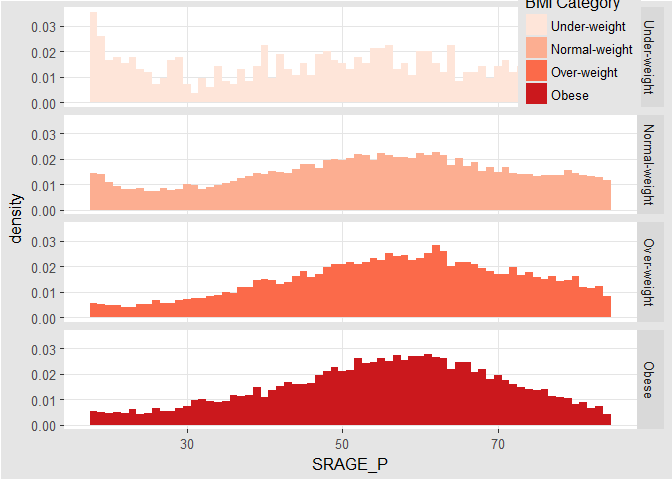

``` r
# density histogram with `position = 'fill'`
ggplot(adult, aes (x = SRAGE_P, fill = factor(RBMI))) + 
  geom_histogram(aes(y = ..density..), binwidth = 1, position = 'fill') +
  BMI_fill
```


``` r
# accurate histogram
ggplot(adult, aes(x = SRAGE_P, fill = factor(RBMI))) + 
  geom_histogram(aes(y = ..count../sum(..count..)), binwidth = 1, position = 'fill') +
  BMI_fill
```


**Do Things Manually**

``` r
# an attempt to facet the accurate frequency histogram from before (failed)
ggplot(adult, aes(x = SRAGE_P, fill = factor(RBMI))) + 
  geom_histogram(aes(y = ..count../sum(..count..)), binwidth = 1, position = 'fill') +
  BMI_fill +
  facet_grid(RBMI ~ .)
```

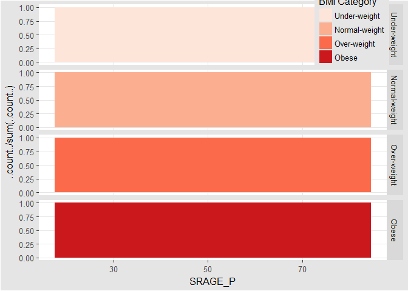

``` r
# create DF with `table()`
DF <- table(adult$RBMI, adult$SRAGE_P)

# use apply on DF to get frequency of each group
DF_freq <- apply(DF, 2, function(x) x/sum(x))

# melt on DF to create DF_melted
DF_melted <- melt(DF_freq)

# change names of DF_melted
names(DF_melted) <- c('FILL', 'X', 'value')
```

``` r
# add code to make this a faceted plot
ggplot(DF_melted, aes(x = X, y = value, fill = FILL)) +
  geom_bar(stat = 'identity', position = 'stack') +
  BMI_fill + 
  facet_grid(FILL ~ .)
```


**Merimeko/Mosaic Plot**

``` r
# The initial contingency table
DF <- as.data.frame.matrix(table(adult$SRAGE_P, adult$RBMI))

# Add the columns groupsSum, xmax and xmin. Remove groupSum again.
DF$groupSum <- rowSums(DF)
DF$xmax <- cumsum(DF$groupSum)
DF$xmin <- DF$xmax - DF$groupSum
# The groupSum column needs to be removed, don't remove this line
DF$groupSum <- NULL

# Copy row names to variable X
DF$X <- row.names(DF)

# Melt the dataset
DF_melted <- melt(DF, id.vars = c('X', 'xmin', 'xmax'), variable.name = 'FILL')

# dplyr call to calculate ymin and ymax - don't change
DF_melted <- DF_melted %>% 
  group_by(X) %>% 
  mutate(ymax = cumsum(value/sum(value)),
         ymin = ymax - value/sum(value))

# Plot rectangles - don't change.
ggplot(DF_melted, aes(ymin = ymin, 
                 ymax = ymax,
                 xmin = xmin, 
                 xmax = xmax, 
                 fill = FILL)) + 
  geom_rect(colour = 'white') +
  scale_x_continuous(expand = c(0,0)) +
  scale_y_continuous(expand = c(0,0)) +
  BMI_fill +
  theme_tufte()
```


**Adding statistics**

``` r
# perform chi.sq test (`RBMI` and `SRAGE_P`)
results <- chisq.test(table(adult$RBMI, adult$SRAGE_P))

# melt results$residuals and store as resid
resid <- melt(results$residuals)

# change names of resid
names(resid) <- c('FILL', 'X', 'residual')

# merge the two datasets
DF_all <- merge(DF_melted, resid)
```

``` r
# update plot command
ggplot(DF_all, aes(ymin = ymin, ymax = ymax, xmin = xmin, xmax = xmax, fill = residual)) +
  geom_rect() +
  scale_fill_gradient2() +
  scale_x_continuous(expand = c(0,0)) +
  scale_y_continuous(expand = c(0,0)) +
  theme_tufte()
```


**Adding text**

``` r
# position for labels on x axis
DF_all$xtext <- DF_all$xmin + (DF_all$xmax - DF_all$xmin) / 2

# position for labels on y axis
index <- DF_all$xmax == max(DF_all$xmax)
DF_all$ytext <- DF_all$ymin[index] + (DF_all$ymax[index] - DF_all$ymin[index])/2
```

``` r
# plot
ggplot(DF_all, aes(ymin = ymin, ymax = ymax, xmin = xmin, xmax = xmax, fill = residual)) + 
  geom_rect(col = 'white') +
  # geom_text for ages (i.e. the x axis)
  geom_text(aes(x = xtext, label = X), y = 1, size = 3, angle = 90, hjust = 1, show.legend = FALSE) +
  # geom_text for BMI (i.e. the fill axis)
  geom_text(aes(x = max(xmax), y = ytext, label = FILL), size = 3, hjust = 1, show.legend  = FALSE) +
  scale_fill_gradient2() +
  theme_tufte() +
  theme(legend.position = 'bottom')
```


**Generalizations**

``` r
# script generalized into a function
mosaicGG <- function(data, X, FILL) {
  # Proportions in raw data
  DF <- as.data.frame.matrix(table(data[[X]], data[[FILL]]))
  DF$groupSum <- rowSums(DF)
  DF$xmax <- cumsum(DF$groupSum)
  DF$xmin <- DF$xmax - DF$groupSum
  DF$X <- row.names(DF)
  DF$groupSum <- NULL
  DF_melted <- melt(DF, id = c('X', 'xmin', 'xmax'), variable.name = 'FILL')
  
  DF_melted <- DF_melted %>% 
    group_by(X) %>% 
    mutate(ymax = cumsum(value/sum(value)),
           ymin = ymax - value/sum(value))
  
  # Chi-sq test
  results <- chisq.test(table(data[[FILL]], data[[X]])) # fill and then x
  resid <- melt(results$residuals)
  names(resid) <- c('FILL', 'X', 'residual')
  # Merge data
  DF_all <- merge(DF_melted, resid)
   # Positions for labels
  DF_all$xtext <- DF_all$xmin + (DF_all$xmax - DF_all$xmin)/2
  index <- DF_all$xmax == max(DF_all$xmax)
  DF_all$ytext <- DF_all$ymin[index] + (DF_all$ymax[index] - DF_all$ymin[index])/2
  
  # plot
  g <- ggplot(DF_all, aes(ymin = ymin,  ymax = ymax, xmin = xmin, 
                          xmax = xmax, fill = residual)) + 
    geom_rect(col = 'white') +
    geom_text(aes(x = xtext, label = X), y = 1, size = 3, angle = 90, hjust = 1, show.legend = FALSE) + geom_text(aes(x = max(xmax),  y = ytext, label = FILL), size = 3, hjust = 1, show.legend = FALSE) +
    scale_fill_gradient2('Residuals') +
    scale_x_continuous('Individuals', expand = c(0,0)) +
    scale_y_continuous('Proportion', expand = c(0,0)) +
    theme_tufte() +
    theme(legend.position = 'bottom')
  print(g)
}
```

``` r
# BMI described by age (in x)
mosaicGG(adult, 'SRAGE_P','RBMI')
```


``` r
# poverty described by age (in x)
mosaicGG(adult, 'SRAGE_P', 'POVLL')
```


``` r
# `am` described by `cyl` (in x)
mosaicGG(mtcars, 'cyl', 'am')
```


``` r
# `Vocab` described by education
mosaicGG(Vocab, 'education', 'vocabulary')
```


SECTION 3
---------

SECTION 4 - Cheat List
----------------------

ggplot(data, aes(x = , y = ), col = , fill = , size = , labels = , alpha
= , shape = , line = , position = 'jitter')

    + geom_point()

    + geom_point(aes(), col = , position = posn.j)

    + geom_jitter()

    + facet_grid(. ~ x) # y ~ x

    + scale_x_continous('Sepal Length', limits = c(2, 8), breaks = seq(2, 8, 3))

    + scale_color_discrete('Species', labels = c('a', 'b', 'c'))

    + labs(x = , y = , col = )

posn.j &lt;- position\_jitter(width = 0.1)

**Data**

-   `diamonds`, prices of 50,000 round cut diamonds.
-   `economics`, economics\_long, US economic time series.
-   `faithfuld`, 2d density estimate of Old Faithful data.
-   `luv_colours`, colors().
-   `midwest`, midwest demographics.
-   `mpg`, fuel economy data from 1999 and 2008 for 38 popular models of car.
-   `msleep`, an updated and expanded version of the mammals  sleep dataset.
-   `presidential`, terms of 11 presidents from Eisenhower to Obama.
-   `seals`, vector field of seal movements.
-   `txhousing`, Housing sales in TX.

**Aesthetics**

-   x-axis.
-   y-asix.
-   color.
-   fill.
-   size (points, lines).
-   labels.
-   alpha.
-   shape (points).
-   linetype (lines).
-   `aes`, Define aesth.etic mappings.
-   `aes_` (aes\_q, aes\_string), Define aesthetic mappings from strings, or quoted calls and formulas.
-   `aes_all`, Given a character vector, create a set of    identity mappings.
-   `aes_auto`, Automatic aesthetic mapping.
-   `aes_colour_fill_alpha` (color, colour, fill), Colour related aesthetics: colour, fill and alpha.
-   `aes_group_order` (group), Aesthetics: group. aes\_linetype\_size\_shape (linetype, shape, size), Differentiation related aesthetics: linetype, size, shape.
-   `aes_position` (x, xend, xmax, xmin, y, yend, ymax, ymin), Position related aesthetics: x, y, xmin, xmax, ymin, ymax, xend, yend.

**Position**

-   `position_dodge`, Adjust position by dodging overlaps to the side.
-   `position_fill` (position\_stack), Stack overlapping objects on top of one another.
-   `position_identity`, Don't adjust position
-   `position_nudge`, Nudge points.
-   `position_jitter`, Jitter points to avoid overplotting.
-   `position_jitterdodge`, Adjust position by simultaneously dodging and jittering.

**Scales**

-   `expand_limits`, Expand the plot limits with data.
-   `guides`, Set guides for each scale.
-   `guide_legend`, Legend guide.
-   `guide_colourbar` (guide\_colorbar), Continuous colour bar guide.
-   `lims` (xlim, ylim), Convenience functions to set the axis limits.
-   `scale_alpha` (scale\_alpha\_continuous, scale\_alpha\_discrete), Alpha scales.
-   `scale_colour_brewer` (scale\_color\_brewer, scale\_color\_distiller, scale\_colour\_distiller, scale\_fill\_brewer, scale\_fill\_distiller), Sequential, diverging and qualitative colour scales from colorbrewer.org
-   `scale_colour_gradient` (scale\_color\_continuous, scale\_color\_gradient, scale\_color\_gradient2, scale\_color\_gradientn, scale\_colour\_continuous, scale\_colour\_date, scale\_colour\_datetime, scale\_colour\_gradient2, scale\_colour\_gradientn, scale\_fill\_continuous, scale\_fill\_date, scale\_fill\_datetime, scale\_fill\_gradient, scale\_fill\_gradient2, scale\_fill\_gradientn).
-   `scale_colour_grey` (scale\_color\_grey, scale\_fill\_grey), Sequential grey colour scale.
-   `scale_colour_hue` (scale\_color\_discrete, scale\_color\_hue, scale\_colour\_discrete, scale\_fill\_discrete, scale\_fill\_hue), Qualitative colour scale with evenly spaced hues.
-   `scale_identity` (scale\_alpha\_identity, scale\_color\_identity, scale\_colour\_identity, scale\_fill\_identity, scale\_linetype\_identity, scale\_shape\_identity, scale\_size\_identity), Use values without scaling.
-   `scale_manual` (scale\_alpha\_manual, scale\_color\_manual, scale\_colour\_manual, scale\_fill\_manual, scale\_linetype\_manual, scale\_shape\_manual, scale\_size\_manual), Create your own discrete scale.
-   `scale_linetype` (scale\_linetype\_continuous, scale\_linetype\_discrete), Scale for line patterns.
-   `scale_shape` (scale\_shape\_continuous, scale\_shape\_discrete), Scale for shapes, aka glyphs.
-   `scale_size` (scale\_radius, scale\_size\_area,
    scale\_size\_continuous, scale\_size\_date, scale\_size\_datetime, scale\_size\_discrete), Scale size (area or radius).
-   `scale_x_discrete` (scale\_y\_discrete), Discrete position.
-   `labs` (ggtitle, xlab, ylab), Change axis labels and legend titles.
-   `update_labels`, Update axis/legend labels.

**Geometries**

-   point.
-   line.
-   histogram.
-   bar.
-   boxplot.
-   `geom_abline` (geom\_hline, geom\_vline), Lines: horizontal,
    vertical, and specified by slope and intercept.
-   `geom_bar` (stat\_count), Bars, rectangles with bases on x-axis
-   `geom_bin2d` (stat\_bin2d, stat\_bin\_2d), Add heatmap of 2d bin counts.
-   `geom_blank`, Blank, draws nothing.
-   `geom_boxplot` (stat\_boxplot), Box and whiskers plot.
-   `geom_contour` (stat\_contour), Display contours of a 3d surface in 2d.
-   `geom_count`(stat\_sum), Count the number of observations at each location.
-   `geom_crossbar` (geom\_errorbar, geom\_linerange, geom\_pointrange), Vertical intervals: lines, crossbars & errorbars.
-   `geom_density` (stat\_density), Display a smooth density estimate.
-   `geom_density_2d` (geom\_density2d, stat\_density2d,    stat\_density\_2d), Contours from a 2d density estimate.
-   `geom_dotplot`, Dot plot
-   `geom_errorbarh`, Horizontal error bars.
-   `geom_freqpoly` (geom\_histogram, stat\_bin), Histograms and frequency polygons.
-   `geom_hex` (stat\_bin\_hex, stat\_binhex), Hexagon binning.
-   `geom_jitter`, Points, jittered to reduce overplotting.
-   `geom_label` (geom\_text), Textual annotations.
-   `geom_map`, Polygons from a reference map.
-   `geom_path` (geom\_line, geom\_step), Connect observations.
-   `geom_point`, Points, as for a scatterplot.
-   `geom_polygon`, Polygon, a filled path.
-   `geom_quantile` (stat\_quantile), Add quantile lines from a quantile regression.
-   `geom_raster` (geom\_rect, geom\_tile), Draw rectangles.
-   `geom_ribbon` (geom\_area), Ribbons and area plots.
-   `geom_rug`, Marginal rug plots.
-   `geom_segment` (geom\_curve), Line segments and curves.
-   `geom_smooth` (stat\_smooth), Add a smoothed conditional mean.
-   `geom_violin` (stat\_ydensity), Violin plot.

**Facets**

-   columns.
-   rows.
-   `facet_grid`, Lay out panels in a grid.
-   `facet_null`, Facet specification: a single panel.
-   `facet_wrap`, Wrap a 1d ribbon of panels into 2d.
-   `labeller`, Generic labeller function for facets.
-   `label_bquote`, Backquoted labeller.

**Annotation**

-   `annotate`, Create an annotation layer.
-   `annotation_custom`, Annotation: Custom grob.
-   `annotation_logticks`, Annotation: log tick marks.
-   `annotation_map`, Annotation: maps.
-   `annotation_raster`, Annotation: High-performance
    rectangular tiling.
-   `borders`, Create a layer of map borders.

**Fortify**

-   `fortify`, Fortify a model with data.
-   `fortify-multcomp` (fortify.cld, fortify.confint.glht, fortify.glht, fortify.summary.glht), Fortify methods for objects produced by.
-   `fortify.lm`, Supplement the data fitted to a linear model with model fit statistics.
-   `fortify.map`, Fortify method for map objects.
-   `fortify.sp` (fortify.Line, fortify.Lines, fortify.Polygon, fortify.Polygons, fortify.SpatialLinesDataFrame, fortify.SpatialPolygons, fortify.SpatialPolygonsDataFrame), Fortify method for classes from the sp package.
-   `map_data`, Create a data frame of map data.

**Statistics**

-   binning.
-   smoothing.
-   descriptive.
-   inferential.
-   `stat_ecdf`, Empirical Cumulative Density Function.
-   `stat_ellipse`, Plot data ellipses.
-   `stat_function`, Superimpose a function.
-   `stat_identity`, Identity statistic.
-   `stat_qq` (geom\_qq), Calculation for quantile-quantile plot.
-   `stat_summary_2d` (stat\_summary2d, stat\_summary\_hex), Bin and summarise in 2d (rectangle & hexagons)
-   `stat_unique`, Remove duplicates.
-   Coordinates.
-   cartesian.
-   fixes.
-   polar.
-   limites.
-   `coord_cartesian`, Cartesian coordinates.
-   `coord_fixed` (coord\_equal), Cartesian coordinates with fixed
    relationship between x and y scales.
-   `coord_flip`, Flipped cartesian coordinates.
-   `coord_map` (coord\_quickmap), Map projections.
-   `coord_polar`, Polar coordinates.
-   `coord_trans`, Transformed cartesian coordinate system.

**Themes**

-   `theme_bw`
-   `theme_grey`
-   `theme_classic`
-   `theme_minimal`
-   `ggthemes`
