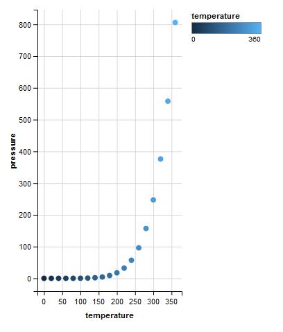
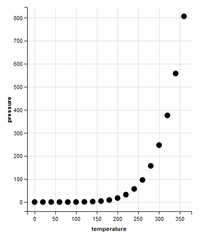
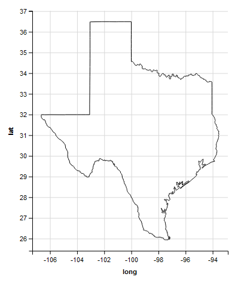
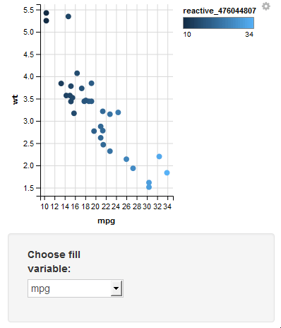
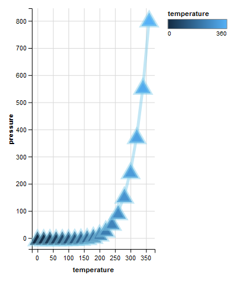
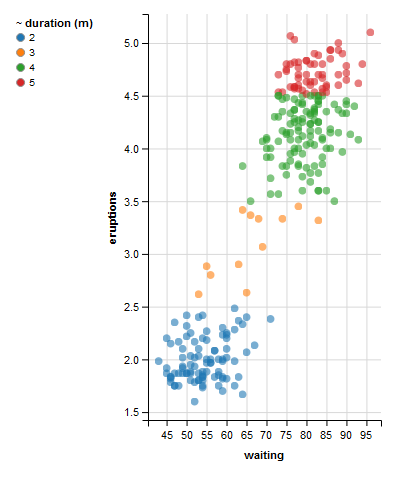
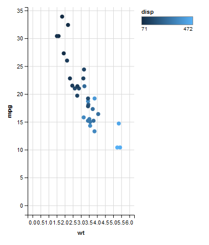

-   [Documentation](#documentation)
-   [Dataset](#dataset)
-   [The `ggvis` Package](#the-ggvis-package)
-   [1, The Grammar of Graphics](#the-grammar-of-graphics)
-   [2, Lines and Syntax](#lines-and-syntax)
-   [3, Transformations](#transformations)
-   [4, Interactivity and Layers](#interactivity-and-layers)
-   [5, Customizing Axes, Legends, and
    Scales](#customizing-axes-legends-and-scales)

------------------------------------------------------------------------

**Foreword**

-   Output options: the 'tango' syntax and the 'readable' theme.
-   Snippets and results.
-   `ggvis` generates html outputs. Graphics presented here are images:
    .png files; .gif files when specified.

------------------------------------------------------------------------

Documentation
-------------

-   [`ggvis` Overview](http://ggvis.rstudio.com/)
-   [`ggvis` Cookbook](http://ggvis.rstudio.com/cookbook.html)

Dataset
-------

For most examples, we use the `mtcars`, `pressure`, `faithful` datasets.

The `ggvis` Package
-------------------

``` r
library(ggvis)
```

1, The Grammar of Graphics
--------------------------

**Start to explore **

``` r
# change the code below to plot the disp variable of mtcars on the x axis
mtcars %>%
  ggvis(~disp, ~mpg) %>%
  layer_points()
```


**`ggvis` and its capabilities **

``` r
# Change the code below to make a graph with red points
mtcars %>%
  ggvis(~wt, ~mpg, fill := "red") %>%
  layer_points()
```


``` r
# Change the code below draw smooths instead of points
mtcars %>%
  ggvis(~wt, ~mpg) %>%
  layer_smooths()
```


``` r
# Change the code below to make a graph containing both points and a smoothed summary line
mtcars %>%
  ggvis(~wt, ~mpg) %>%
  layer_points() %>%
  layer_smooths()
```


**`ggvis` grammar ~ graphics grammar**

``` r
# Make a scatterplot of the pressure dataset
pressure %>%
  ggvis(~temperature, ~pressure) %>%
  layer_points
```


``` r
# Adapt the code you wrote for the first challenge: show bars instead of points
pressure %>%
  ggvis(~temperature, ~pressure) %>%
  layer_bars
```


``` r
# Adapt the code you wrote for the first challenge: show lines instead of points
pressure %>%
  ggvis(~temperature, ~pressure) %>%
  layer_lines
```


``` r
# Adapt the code you wrote for the first challenge: map the fill property to the temperature variable
pressure %>%
  ggvis(~temperature, ~pressure, fill = ~temperature) %>%
  layer_points
```



``` r
# Extend the code you wrote for the previous challenge: map the size property to the pressure variable
pressure %>%
  ggvis(~temperature, ~pressure, fill = ~temperature, size = ~pressure) %>%
  layer_points
```


**4 essential components of a graph**

``` r
faithful %>%
    ggvis(~waiting, ~eruptions, fill := "red") %>%
    layer_points() %>%
    add_axis("y", title = "Duration of eruption (m)",
             values = c(2, 3, 4, 5), subdivide = 9) %>%
    add_axis("x", title = "Time since previous eruption (m)")
```


2, Lines and Syntax
-------------------

**Three operators: `%>%`, `=` and `:=`**

``` r
layer_points(ggvis(faithful, ~waiting, ~eruptions))
```


``` r
# Rewrite the code with the pipe operator     
faithful %>%
  ggvis(~waiting, ~eruptions) %>%
  layer_points()
```


``` r
pressure %>%
  ggvis(~temperature, ~pressure) %>%
  layer_points()
```


``` r
# Modify this graph to map the size property to the pressure variable
pressure %>%
  ggvis(~temperature, ~pressure, size = ~pressure) %>%
  layer_points()
```


``` r
pressure %>%
  ggvis(~temperature, ~pressure) %>%
  layer_points()
```


``` r
# Modify this graph by setting the size property
pressure %>%
  ggvis(~temperature, ~pressure, size := 100) %>%
  layer_points()
```



``` r
pressure %>% 
  ggvis(~temperature, ~pressure, fill = "red") %>%
  layer_points()
```


``` r
# Fix this code to set the fill property to red
pressure %>% 
  ggvis(~temperature, ~pressure, fill := "red") %>%
  layer_points()
```


**Referring to different objects**

``` r
red <- "green"
pressure$red <- pressure$temperature

pressure %>%
  ggvis(~temperature, ~pressure, fill := red) %>%
  layer_points()
```


**Properties for points**

``` r
# Change the code to set the fills using pressure$black
pressure %>%
  ggvis(~temperature, ~pressure, fill := ~'black') %>%
  layer_points()
```


``` r
# Plot the faithful data as described in the second instruction
faithful %>% 
  ggvis(~waiting, ~eruptions, size = ~eruptions, opacity := 0.5, fill := "blue", stroke := "black") %>% 
  layer_points()
```


``` r
# Plot the faithful data as described in the third instruction
faithful %>% 
  ggvis(~waiting, ~eruptions, size := 100, fill := "red", fillOpacity = ~eruptions, stroke := "red", shape := "cross") %>%
  layer_points()
```


**Properties for lines**

``` r
# Change the code below to use the lines mark
pressure %>%
  ggvis(~temperature, ~pressure) %>%
  layer_lines()
```


``` r
# Set the properties described in the second instruction in the graph below
pressure %>%
  ggvis(~temperature, ~pressure, stroke := "red", strokeWidth := 2, strokeDash := 6) %>%
  layer_lines()
```


**Display model fits**

`layer_lines()` will always connect the points in your plot from the
leftmost point to the rightmost point. This can be undesirable if you
are trying to plot a specific shape.

`layer_paths()`: this mark connects the points in the order that they
appear in the data set. So the paths mark will connect the point that
corresponds to the first row of the data to the point that corresponds
to the second row of data, and so on - no matter where those points
appear in the graph.

``` r
# change the third line of code to plot a map of Texas
library(maps)
library(ggplot2)

texas <- ggplot2::map_data("state", region = "texas")

texas %>%
  ggvis(~long, ~lat) %>%
  layer_paths()
```



``` r
# Same plot, but set the fill property of the texas map to dark orange
texas %>%
  ggvis(~long, ~lat, fill := "darkorange") %>%
  layer_paths()
```


**`compute_smooth()` to simplify model fits**

`compute_model_prediction()` is a useful function to use with line
graphs. It takes a data frame as input and returns a new data frame as
output. The new data frame will contain the x and y values of a line
fitted to the data in the original data frame.

Generate the x and y coordinates for a LOESS smooth line.

``` r
faithful %>%
  compute_model_prediction(eruptions ~ waiting, model = "lm") %>%
  head(10)
```

    ##       pred_    resp_
    ## 1  43.00000 1.377986
    ## 2  43.67089 1.428724
    ## 3  44.34177 1.479461
    ## 4  45.01266 1.530199
    ## 5  45.68354 1.580937
    ## 6  46.35443 1.631674
    ## 7  47.02532 1.682412
    ## 8  47.69620 1.733150
    ## 9  48.36709 1.783888
    ## 10 49.03797 1.834625

``` r
# Compute the x and y coordinates for a loess smooth line that predicts mpg with the wt
mtcars %>%
  compute_smooth(mpg ~ wt) %>%
  head(10)
```

    ##       pred_    resp_
    ## 1  1.513000 32.08897
    ## 2  1.562506 31.68786
    ## 3  1.612013 31.28163
    ## 4  1.661519 30.87037
    ## 5  1.711025 30.45419
    ## 6  1.760532 30.03318
    ## 7  1.810038 29.60745
    ## 8  1.859544 29.17711
    ## 9  1.909051 28.74224
    ## 10 1.958557 28.30017

``` r
#model = "loess" is set by default
```

3, Transformations
------------------

**Histograms (1)**

``` r
# Build a histogram of the waiting variable of the faithful data set.
faithful %>%
  ggvis(~waiting) %>%
  layer_histograms()
```


``` r
# Build the same histogram, but with a binwidth (width argument) of 5 units
faithful %>%
  ggvis(~waiting) %>%
  layer_histograms(width = 5)
```


**Histograms (2)**

``` r
faithful %>%
  ggvis(~waiting) %>%
  layer_histograms(width = 5)
```


``` r
# Transform the code: just compute the bins instead of plotting a histogram
faithful %>%
  compute_bin(~waiting, width = 5)
```

    ##    count_ x_ xmin_ xmax_ width_
    ## 1      13 45  42.5  47.5      5
    ## 2      24 50  47.5  52.5      5
    ## 3      29 55  52.5  57.5      5
    ## 4      21 60  57.5  62.5      5
    ## 5      13 65  62.5  67.5      5
    ## 6      13 70  67.5  72.5      5
    ## 7      42 75  72.5  77.5      5
    ## 8      58 80  77.5  82.5      5
    ## 9      38 85  82.5  87.5      5
    ## 10     17 90  87.5  92.5      5
    ## 11      4 95  92.5  97.5      5

``` r
# Combine the solution to the first challenge with layer_rects() to build a histogram
faithful %>%
  compute_bin(~waiting, width = 5) %>%
  ggvis(x = ~xmin_, x2 = ~xmax_, y = 0, y2 = ~count_) %>%
  layer_rects()
```


**Density plots**

``` r
# Combine compute_density() with layer_lines() to make a density plot of the waiting variable.
faithful %>%
  compute_density(~waiting) %>%
  ggvis(~pred_,~resp_) %>%
  layer_lines()
```


``` r
# Build a density plot directly using layer_densities. Use the correct variables and properties.
faithful %>%
  ggvis(~waiting) %>%
  layer_densities(fill := "green")
```


**Shortcuts**

``` r
# Complete the code to plot a bar graph of the cyl factor.
mtcars %>%
  ggvis(~factor(cyl)) %>%
  layer_bars()
```


``` r
# Adapt the solution to the first challenge to just calculate the count values. No plotting!
mtcars %>%
  compute_count(~factor(cyl))
```

    ##   count_ x_
    ## 1     11  4
    ## 2      7  6
    ## 3     14  8

**`ggvis` and `group_by`**

``` r
mtcars %>%
  group_by(am) %>%
  ggvis(~mpg, ~wt, stroke = ~factor(am)) %>%
  layer_smooths()
```


``` r
# Change the code to plot a unique smooth line for each value of the cyl variable.
mtcars %>%
  group_by(cyl) %>%
  ggvis(~mpg, ~wt, stroke = ~factor(cyl)) %>%
  layer_smooths()
```


``` r
# Adapt the graph to contain a separate density for each value of cyl.
mtcars %>%
  group_by(cyl) %>%
  ggvis(~mpg) %>%
  layer_densities()
```


``` r
# Copy and alter the solution to the second challenge to map the fill property to a categorical version of cyl.
mtcars %>%
  group_by(cyl) %>%
  ggvis(~mpg) %>%
  layer_densities(fill = ~factor(cyl))
```


**`group_by()` versus `interaction()`**

``` r
mtcars %>%
  group_by(cyl) %>%
  ggvis(~mpg) %>%
  layer_densities(fill = ~factor(cyl))
```


``` r
# Alter the graph: separate density for each unique combination of 'cyl' and 'am'.
mtcars %>%
  group_by(cyl,am) %>%
  ggvis(~mpg, fill = ~factor(cyl)) %>%
  layer_densities()

#factor(cyl),factor(am)
```


``` r
mtcars %>%
  group_by(cyl, am) %>%
  ggvis(~mpg, fill = ~factor(cyl)) %>%
  layer_densities()
```


``` r
# Update the graph to map `fill` to the unique combinations of the grouping variables.
mtcars %>%
  group_by(cyl, am) %>%
  ggvis(~mpg, fill = ~interaction(cyl,am)) %>% 
  layer_densities()
```


**Chaining is a virtue**

``` r
mtcars %>%
    group_by(cyl, am) %>%
    ggvis(~mpg, fill = ~interaction(cyl, am)) %>%
    layer_densities()
```


This call is exactly equivalent to the following piece of code that is
very hard to read:

``` r
layer_densities(ggvis(group_by(mtcars, cyl, am), ~mpg, fill = ~interaction(cyl, am)))
```


4, Interactivity and Layers
---------------------------

**The basics of interactive plots**

``` r
# Run this code and inspect the output. Follow the link in the instructions for the interactive version
faithful %>% 
  ggvis(~waiting, ~eruptions, fillOpacity := 0.5, 
        shape := input_select(label = "Choose shape:", choices = c("circle", "square", "cross", "diamond", "triangle-up", "triangle-down"))) %>% 
  layer_points()
```

.gif file:


``` r
# Copy the first code chunk and alter the code to make the fill property interactive using a select box
faithful %>%
  ggvis(~waiting, ~eruptions, fillOpacity := 0.5, shape := input_select(label = "Choose shape:", choices = c("circle", "square", "cross", "diamond", "triangle-up", "triangle-down")), fill := input_select(label = "Choose color:", choices = c("black","red","blue","green"))) %>%
  layer_points()
```

.gif file:


``` r
# Add radio buttons to control the fill of the plot
mtcars %>% 
  ggvis(~mpg, ~wt, fill := input_radiobuttons(label = "Choose color:", choices = c("black","red","blue","green"))) %>%
  layer_points()
```

.gif file:


**Input widgets in more detail**

``` r
mtcars %>%
  ggvis(~mpg, ~wt, fill := input_radiobuttons(label = "Choose color:", choices = c("black", "red", "blue", "green"))) %>%
  layer_points()
```

.gif file:


``` r
# Change the radiobuttons widget to a text widget 
mtcars %>%
  ggvis(~mpg, ~wt, fill := input_text(label = "Choose color:", value = c("black"))) %>%
  layer_points()
```

.gif file:


``` r
mtcars %>%
  ggvis(~mpg, ~wt) %>%
  layer_points()
```


``` r
# Map the fill property to a select box that returns variable names
mtcars %>%
  ggvis(~mpg, ~wt, fill = input_select(label = "Choose fill variable:", choices = names(mtcars), map = as.name)) %>%
  layer_points()
```

.gif file:


**Input widgets in more detail (2)**

``` r
# Map the fill property to a select box that returns variable names
mtcars %>%
  ggvis(~mpg, ~wt, fill = input_select(label = "Choose fill variable:", choices = names(mtcars), map = as.name)) %>%
  layer_points()
```

.gif file:



**Control parameters and values**

``` r
# Map the bindwidth to a numeric field ("Choose a binwidth:")
mtcars %>%
  ggvis(~mpg) %>%
  layer_histograms(width = input_numeric(value = 1, label = "Choose a binwidth:"))
```

.gif file:


``` r
# Map the binwidth to a slider bar ("Choose a binwidth:") with the correct specifications
mtcars %>%
  ggvis(~mpg) %>%
  layer_histograms(width = input_slider(min = 1, max = 20, label = "Choose a binwidth:"))
```

.gif file:


**Multi-layered plots and their properties**

``` r
# Add a layer of points to the graph below.
pressure %>%
  ggvis(~temperature, ~pressure, stroke := "skyblue") %>% layer_lines() %>%
  layer_points()
```


``` r
# Copy and adapt the solution to the first instruction below so that only the lines layer uses a skyblue stroke.
pressure %>%
  ggvis(~temperature, ~pressure) %>%
  layer_lines(stroke := "skyblue") %>%
  layer_points()
```


``` r
# Rewrite the code below so that only the points layer uses the shape property.
pressure %>%
  ggvis(~temperature, ~pressure) %>%
  layer_lines(stroke := "skyblue") %>%
  layer_points(shape := "triangle-up")
```


``` r
# Refactor the code for the graph below to make it as concise as possible
pressure %>%
  ggvis(~temperature, ~pressure, stroke := "skyblue", strokeOpacity := 0.5, strokeWidth := 5) %>%
  layer_lines() %>%
  layer_points(fill = ~temperature, shape := "triangle-up", size := 300)
```


**Multi-layered plots and their properties (2)**

``` r
# Rewrite the code below so that only the points layer uses the shape property.
pressure %>%
  ggvis(~temperature, ~pressure) %>%
  layer_lines(stroke := "skyblue") %>%
  layer_points(shape := "triangle-up")
```


``` r
# Refactor the code for the graph below to make it as concise as possible
pressure %>%
  ggvis(~temperature, ~pressure, stroke := "skyblue",
        strokeOpacity := 0.5, strokeWidth := 5) %>%
  layer_lines() %>%
  layer_points(fill = ~temperature, shape := "triangle-up", size := 300)
```



**There is no limit on the number of layers!**

``` r
# Create a graph containing a scatterplot, a linear model and a smooth line.
pressure %>%
  ggvis(~temperature, ~pressure) %>%
  layer_points() %>%
  layer_lines(stroke := "black", opacity := 0.5) %>%
  layer_model_predictions(model = "lm", stroke := "navy") %>%
  layer_smooths(stroke := "skyblue")
```


**Taking local and global to the next level**

``` r
pressure %>%
  ggvis(~temperature, ~pressure, stroke := "darkred") %>%
  layer_lines(stroke := "orange", strokeDash := 5, strokeWidth := 5) %>%
  layer_points(shape := "circle", size := 100, fill := "lightgreen") %>%
  layer_smooths()
```


5, Customizing Axes, Legends, and Scales
----------------------------------------

**Axes**

``` r
# add the title of the x axis: "Time since previous eruption (m)"
faithful %>% 
  ggvis(~waiting, ~eruptions) %>% 
  layer_points() %>% 
  add_axis("y", title = "Duration of eruption (m)") %>%
  add_axis("x", title = "Time since previous eruption (m)")
```


``` r
# Add to the code to place a labelled tick mark at 50, 60, 70, 80, 90 on the x axis.
faithful %>% 
  ggvis(~waiting, ~eruptions) %>% 
  layer_points() %>% 
  add_axis("y", title = "Duration of eruption (m)", values = c(2, 3, 4, 5), subdivide = 9) %>% 
  add_axis("x", title = "Time since previous eruption (m)", values = c(50, 60, 70, 80, 90), subdivide = 9)
```


``` r
# Add to the code below to change the location of the y axis
faithful %>% 
  ggvis(~waiting, ~eruptions) %>% 
  layer_points() %>%
  add_axis("x", orient = "top") %>% add_axis("y", orient = "right")
```


**Legends**

``` r
# Add a legend to the plot below: use the correct title and orientation
faithful %>% 
  ggvis(~waiting, ~eruptions, opacity := 0.6, fill = ~factor(round(eruptions))) %>% 
  layer_points() %>%
  add_legend("fill", title = "~ duration (m)", orient = "left")
```



``` r
#add_legend(vis, scales = NULL, orient = "right", title = NULL, format = NULL, values = NULL, properties = NULL)

# Use add_legend() to combine the legends in the plot below. Adjust its properties as instructed.
faithful %>% 
  ggvis(~waiting, ~eruptions, opacity := 0.6, fill = ~factor(round(eruptions)), shape = ~factor(round(eruptions)), 
        size = ~round(eruptions))  %>%
  layer_points() %>%
  add_legend(c("fill", "shape", "size"), title = "~ duration (m)", values = c(2,3,4,5))
```


**Legends (2)**

``` r
# Fix the legend
faithful %>% 
  ggvis(~waiting, ~eruptions, opacity := 0.6, fill = ~factor(round(eruptions)), shape = ~factor(round(eruptions)), 
        size = ~round(eruptions)) %>% 
    layer_points() %>% 
    add_legend(c("fill", "shape", "size"), title = "~ duration (m)")
```


**Scale types**

``` r
# Add to the code below to make the stroke color range from "darkred" to "orange".
mtcars %>% 
  ggvis(~wt, ~mpg, fill = ~disp, stroke = ~disp, strokeWidth := 2) %>%
  layer_points() %>%
  scale_numeric("fill", range = c("red", "yellow")) %>% scale_numeric("stroke", range = c("darkred", "orange"))
```


``` r
# Change the graph below to make the fill colors range from green to beige.
mtcars %>% ggvis(~wt, ~mpg, fill = ~hp) %>%
  layer_points() %>% scale_numeric("fill", range = c("green", "beige"))
```


``` r
# Create a scale that will map `factor(cyl)` to a new range of colors: purple, blue, and green. 
mtcars %>% ggvis(~wt, ~mpg, fill = ~factor(cyl)) %>%
  layer_points() %>% scale_nominal("fill", range = c("purple", "blue", "green"))
```


**Adjust any visual property**

``` r
# Add a scale that limits the range of opacity from 0.2 to 1. 
mtcars %>%
  ggvis(x = ~wt, y = ~mpg, fill = ~factor(cyl), opacity = ~hp) %>%
  layer_points() %>%
  scale_numeric("opacity", range = c(0.2,1))
```


``` r
# Add a second scale that will expand the x axis to cover data values from 0 to 6.
mtcars %>%
  ggvis(~wt, ~mpg, fill = ~disp) %>%
  layer_points() %>%
  scale_numeric("y", domain = c(0, NA)) %>%
  scale_numeric("x", domain = c(0, 6))
```


**Adjust any visual property (2)**

``` r
# Add a second scale to set domain for x
mtcars %>%
  ggvis(~wt, ~mpg, fill = ~disp) %>%
  layer_points() %>%
  scale_numeric("y", domain = c(0, NA)) %>%
  scale_numeric("x", domain = c(0, 6))
```



**"`=`" versus "`:=`"**

``` r
# Set the fill value to the color variable instead of mapping it, and see what happens
mtcars$color <- c("red", "teal", "#cccccc", "tan")

mtcars %>%
  ggvis(x = ~wt, y = ~mpg, fill = ~color) %>%
  layer_points()
```


``` r
mtcars %>%
  ggvis(x = ~wt, y = ~mpg, fill := ~color) %>%
  layer_points()
```


