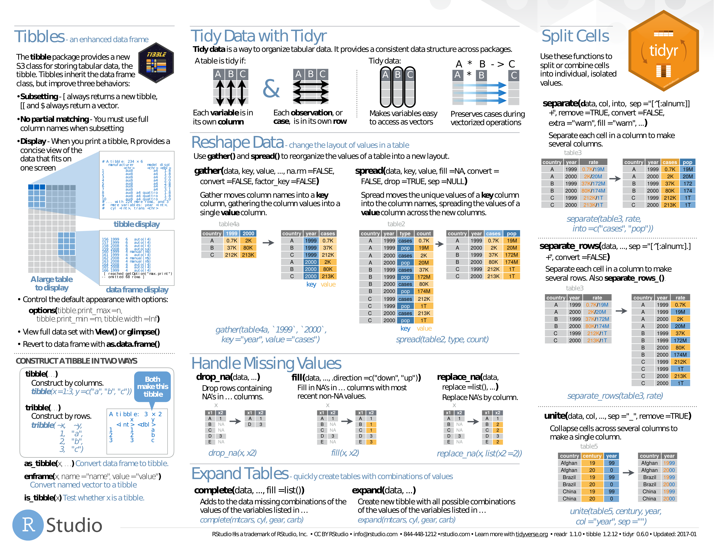
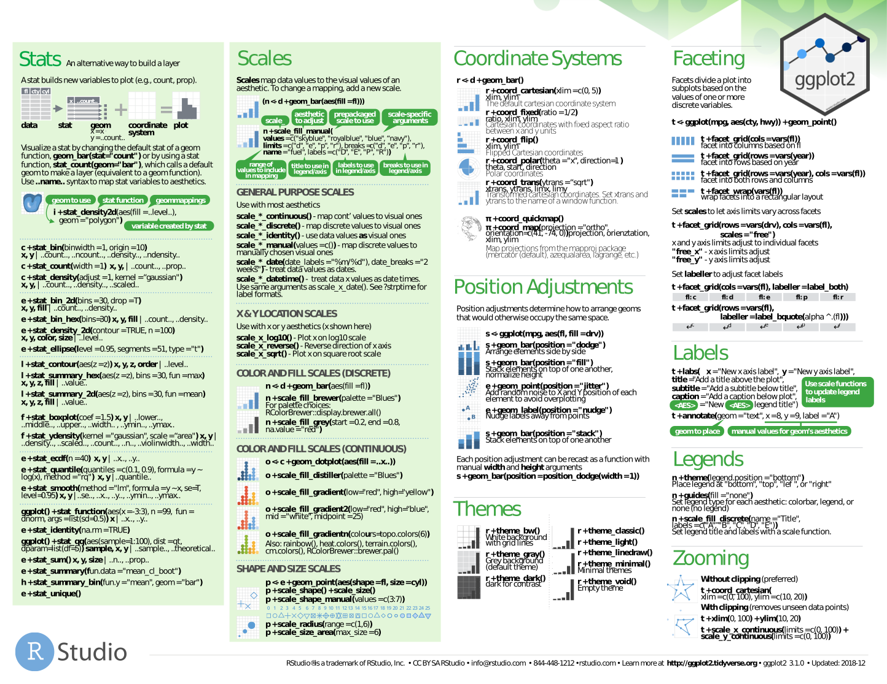

<!--
---

[TOC]
-->
---

**Foreword**

Cheat sheets.

---

## Basics

- [Base R](baseR-cheat-sheet-3.pdf). PDF.

---

- [Tidy Data](tidy_data.pdf). PDF only.

- [Data Import](data-import.pdf). PDF.

---

- [Control Structures](R-Cheat-Sheet-Brief-Introduction-to-Language-Elements-and-Control-Structures.pdf). PDF.

## Advanced

- [Advanced R](advancedR.pdf). PDF.

## RStudio & RMarkdown

- [R Markdown Reference Guide](R-Markdown-Reference.pdf). PDF only.
    - *syntax, chunk options, pandoc options, slide formats, LaTeX options*
- [R Markdown](rmarkdown.pdf). PDF.

---

- [RStudio](rstudio.pdf). PDF.

## Specialization

### Tydyverse

- [Tidyverse](Tidyverse_for_Beginners.pdf). PDF.

### dplyr & tidyr

- [Grammar of dplyr](r-dplyr.pdf). PDF only (explanatory slides).
- [dplyr](dplyr.pdf). PDF.

---

- [dplyr & tidyr](dplyr-and-tidyr-data-wrangling-Cheatsheet.pdf). PDF.
    

### data.table

- [data.table Intro](data.table-Intro.pdf). PDF only (explanatory article).
- [data.table](data.table.pdf) 1. PDF.
- [data.table](data+table+cheat+sheet.pdf) 2. PDF.

### Caret

- [caret](caret.pdf). PDF.

### Probabilities

- [Probabilities](probability_cheatsheet.pdf). PDF only.

### Regular Expressions

- [Basic Regular Expressions](RegExCheatsheet.pdf). PDF.

### R-Quandl

- [Quandl](R-Quandl-Cheatsheet.pdf).

### Spark

- [sparklyr](sparklyr-cheatsheet.pdf). PDF.

### Time series

- [Time Series](R-FUNCTIONS-FOR-TIME-SERIES-ANALYSIS.pdf). PDF only.
    - *input, decomposition, tests, stochastic, graphics, miscellaneous*
- [xts](xts_Cheat_Sheet_R.pdf). PDF only.
- [Time Series in R -- The Power of `xts` and `zoo`](Time+Series+in+R+The+Power+of+xts+and+zoo.html). HTML.

### Survival, regression, data mining, machine learning

- [survminer](survminer_cheatsheet.pdf). PDF only.
    - *curve, ggplot2, cox model*
- [Regressions](Ricci-refcard-regression.pdf). PDF only.
    - *linear model, variable selection, diagnostics, graphics, tests, variable transformation, ridge, segmented, gls, glm, nls, gnls, loess, splines, robust, structural equation, simultaneous equation, pls, principal components, quantile, linear and nonlinear mixed effects, generalized additive, survival analysis, classification & regression trees, beta*
- [Data Mining](R-Reference-Card-for-Data-Mining.pdf). PDF only.
    - *association rules, sequential patterns, classification & prediction, regression, clustering, outliers, time series, text mining, socila networks, graph mining, spatial data, statistics, graphics, data manipulation, data access, big data, parallel computing, reports, weka, editors, guis*
- [Big Data Machine Learning](4503-rc158-010d-machinelearning_1.pdf). PDF only.
    - *linear regression, logistic regression, regularization (ridge, lasso), neural network, support vector machine, nayesian network and naïve bayes, k-nearest neighbors, decision tree, tree ensembles (bagging or random forest, boosting)*

## Visualization (ggplot2, ggmap, ggvis, shiny, plotly, Leaflet)

- [ggplot2](ggplot2.pdf). PDF.

---

- [ggmap](ggmapCheatsheet.pdf). PDF.

---

- [ggvis](shanly3011_data-visualization-in-r-ggvis.pdf). PDF.

---

- [ggvis](shanly3011_data-visualization-in-r-ggvis-continued.pdf). PDF.

---

- [shiny](shiny-cheatsheet.pdf). PDF.

---

- [plotly](plotly_r_cheat_sheet.pdf). PDF only.

---

- [Leaflet](leaflet-cheat-sheet.pdf). PDF.

### Charts

### Parameters

**Lines**

**Points**

### Graphs

- [Graphs](how-big-is-your-graph.pdf).

### Colors

