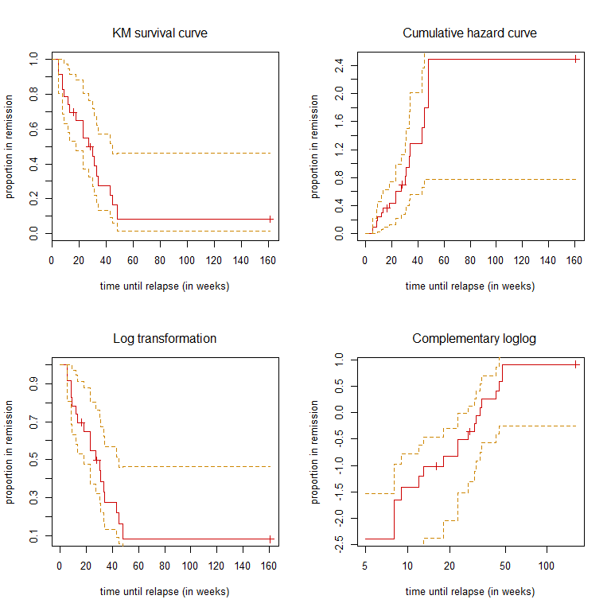
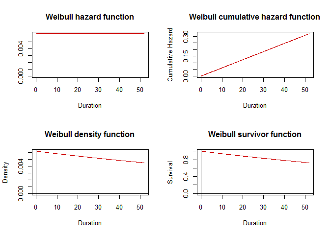
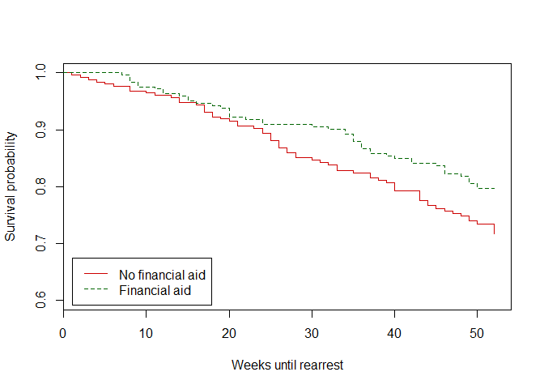
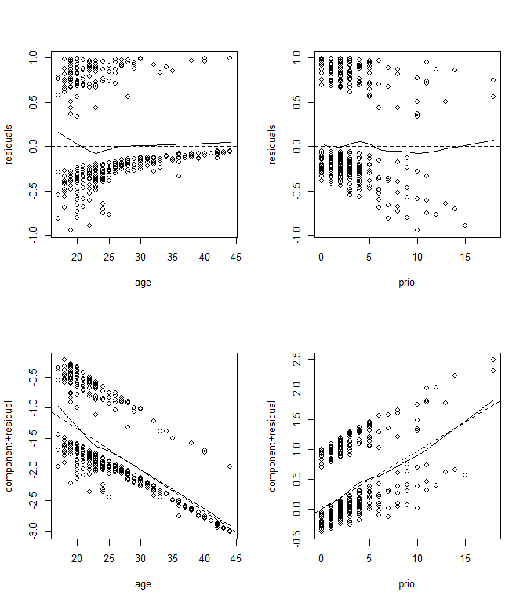

-   [Survival Analysis: Goal and
    Applications](#survival-analysis-goal-and-applications)
-   [1, The Non-parametric Methods: the Kaplan-Meier (KM)
    Estimator](#the-non-parametric-methods-the-kaplan-meier-km-estimator)
-   [2, The Parametric Methods](#the-parametric-methods)
-   [3, The Semi-parametric Methods](#the-semi-parametric-methods)
-   [Recapitulation](#recapitulation)
-   [Going further (with the `Rossi` dataset
    in mind)](#going-further-with-the-rossi-dataset-in-mind)
-   [Terminology](#terminology)

------------------------------------------------------------------------

**Foreword**

-   Output options: 'pygments' syntax, the 'readable' theme.
-   Some Snippets and all results.
-   Use of `htmlTable`

------------------------------------------------------------------------

<center>

</center>


------------------------------------------------------------------------

Survival Analysis: Goal and Applications
----------------------------------------

**How to**

One good approach is to take a peek at the [Terminology](#terminology),
go through all the other sections, review the
[Recapitulation](#recapitulation) and the [Terminology](#terminology),
and repeat, go over, repeat...

These terms will come back over and over:

-   Cumulative distribution function (CDF) (distribution of the
    dependent variable or the disturbances in cases of
    AFT parametrization).
-   Survivor function (survival over time).
-   Hazard function (odds of the event over time).
-   Cumulative hazard function.

These functions are often plotted in the worked examples. Note that the
'CDF' is related to 'probability distribution'; 'distribution' is
synonymous with 'density function'.

A 'covariate' is an 'explanatory variable' or a 'regressor'.

**Survival analysis (SA) goes by various names**

-   Survival analysis in biostatistics, medical science,
    and epidemiology.
-   Reliability analysis in engineering.
-   Duration models within economics.
-   Churn models within marketing.
-   Event history analysis within sociology, demography, psychology and
    political science.

We sometimes hear of hazard rate analysis (the conditional probability
of event occurrence).

**The primary goals of SA**

-   Estimate and interpret survivor (hazard functions) from
    survival data.
-   Analyze hazard or the odds an event will occur.
-   Assess the impact of explanatory variables (regressors
    or covariates) on survival time.

Unlike other techniques, it also takes a different approach by not only
focusing on the outcome but also analyzing the time to an event.

This enables us to compare the survival between two or more groups and
to assess the relationship between explanatory variables and survival
time.

Another unique feature is the ability to include time-varying covariates
(that change their values over time such as age or education), which is
not possible in OLS or logistic regression.

**Applications**

-   Survival analysis: the time until death from cancer.
-   Reliability or failure time analysis: the time until a pump
    breaks down.
-   Duration models: the length of time a person is unemployed.
-   Churn models: the length of time a person will subscribe.
    -   Churn models are at the core of Customer Lifetime Value (LTV).
-   Event history analysis: a longitudinal record of events in a
    person's life such a marriage.
    -   Transition analysis: from marriage to divorce.

**Approaches**

There are three basic approaches to analyzing surviving data:

1.  The non-parametric (no assumption probability distribution) methods;
    the Kaplan-Meier Estimator.
2.  The parametric methods.
3.  The partially parametric or semi-parametric methods.

We are going to touch base with these three approaches with a dataset
about recidivism: convicts who were released from prisons and who were
followed up for one year after release. The analysis measures the length
of time until rearrest (or not).

However, we begin with the simplest methods, non-parametric, and a
dataset about leukemia.

------------------------------------------------------------------------

<center>

</center>

------------------------------------------------------------------------

1, The Non-parametric Methods: the Kaplan-Meier (KM) Estimator
--------------------------------------------------------------

In non-parametric models, which include actuarial life table and
Kaplan-Meier estimates, there is no assumption about the shape of the
hazard function or about how covariates may affect that shape.
Non-parametric methods cannot handle the inclusion of multiple
covariates.

This is often an excellent preliminary descriptive technique to use at
the beginning of your data analysis.

**Adapting the data**

It is possible to create survival data from existing information:

-   The duration of U.N. peacekeeping missions.
-   The time between a terrorist attack and the fall of a government.
-   Business start and end dates, mergers, takeovers or other
    traceable events.
-   Policy changes or take-up over time.

The central point is that you need the timing of events and an outcome
variable.

**The `survival` package**

There are several packages. We begin with `survival`.

``` r
library(survival)
```

The package contains several datasets.

``` r
str(leukemia) # alternativaly, str(aml)
```

    ## 'data.frame':    23 obs. of  3 variables:
    ##  $ time  : num  9 13 13 18 23 28 31 34 45 48 ...
    ##  $ status: num  1 1 0 1 1 0 1 1 0 1 ...
    ##  $ x     : Factor w/ 2 levels "Maintained","Nonmaintained": 1 1 1 1 1 1 1 1 1 1 ...

Where:

-   `time`, the duration of an episode (calculated from the start and
    end time or censoring).
-   `status=1`, the occurrence of an event (or right censoring since
    there are no data beyond the event).
-   `x`, the only covariate; `x=Maintained` or not a treatment
    against leukemia.


The data is right-censored. Even though a patient survived (`status=0`),
we have no data beyond the data point. This is a snapshot: this analysis
about this chemotherapy cyle.

<center>
<!--html_preserve-->
<table class="gmisc_table" style="border-collapse: collapse; margin-left: 1em; margin-right: 2em; margin-top: 1em; margin-bottom: 1em">
<thead>
<tr>
<td colspan="4" style="text-align: left;">
</td>
</tr>
<tr>
<th style="border-bottom: 1px solid grey; border-top: 2px solid grey;">
</th>
<th style="border-bottom: 1px solid grey; border-top: 2px solid grey; text-align: center;">
time
</th>
<th style="border-bottom: 1px solid grey; border-top: 2px solid grey; text-align: center;">
status
</th>
<th style="border-bottom: 1px solid grey; border-top: 2px solid grey; text-align: center;">
x
</th>
</tr>
</thead>
<tbody>
<tr>
<td style="text-align: left;">
1
</td>
<td style="padding-left: 2em; padding-right: 2em; text-align: center;">
9
</td>
<td style="padding-left: 2em; padding-right: 2em; text-align: center;">
1
</td>
<td style="padding-left: 2em; padding-right: 2em; text-align: center;">
Maintained
</td>
</tr>
<tr style="background-color: #f7f7f7;">
<td style="background-color: #f7f7f7; text-align: left;">
2
</td>
<td style="padding-left: 2em; padding-right: 2em; background-color: #f7f7f7; text-align: center;">
13
</td>
<td style="padding-left: 2em; padding-right: 2em; background-color: #f7f7f7; text-align: center;">
1
</td>
<td style="padding-left: 2em; padding-right: 2em; background-color: #f7f7f7; text-align: center;">
Maintained
</td>
</tr>
<tr>
<td style="text-align: left;">
3
</td>
<td style="padding-left: 2em; padding-right: 2em; text-align: center;">
13
</td>
<td style="padding-left: 2em; padding-right: 2em; text-align: center;">
0
</td>
<td style="padding-left: 2em; padding-right: 2em; text-align: center;">
Maintained
</td>
</tr>
<tr style="background-color: #f7f7f7;">
<td style="background-color: #f7f7f7; text-align: left;">
4
</td>
<td style="padding-left: 2em; padding-right: 2em; background-color: #f7f7f7; text-align: center;">
18
</td>
<td style="padding-left: 2em; padding-right: 2em; background-color: #f7f7f7; text-align: center;">
1
</td>
<td style="padding-left: 2em; padding-right: 2em; background-color: #f7f7f7; text-align: center;">
Maintained
</td>
</tr>
<tr>
<td style="text-align: left;">
5
</td>
<td style="padding-left: 2em; padding-right: 2em; text-align: center;">
23
</td>
<td style="padding-left: 2em; padding-right: 2em; text-align: center;">
1
</td>
<td style="padding-left: 2em; padding-right: 2em; text-align: center;">
Maintained
</td>
</tr>
<tr style="background-color: #f7f7f7;">
<td style="background-color: #f7f7f7; text-align: left;">
6
</td>
<td style="padding-left: 2em; padding-right: 2em; background-color: #f7f7f7; text-align: center;">
28
</td>
<td style="padding-left: 2em; padding-right: 2em; background-color: #f7f7f7; text-align: center;">
0
</td>
<td style="padding-left: 2em; padding-right: 2em; background-color: #f7f7f7; text-align: center;">
Maintained
</td>
</tr>
<tr>
<td style="text-align: left;">
7
</td>
<td style="padding-left: 2em; padding-right: 2em; text-align: center;">
31
</td>
<td style="padding-left: 2em; padding-right: 2em; text-align: center;">
1
</td>
<td style="padding-left: 2em; padding-right: 2em; text-align: center;">
Maintained
</td>
</tr>
<tr style="background-color: #f7f7f7;">
<td style="background-color: #f7f7f7; text-align: left;">
8
</td>
<td style="padding-left: 2em; padding-right: 2em; background-color: #f7f7f7; text-align: center;">
34
</td>
<td style="padding-left: 2em; padding-right: 2em; background-color: #f7f7f7; text-align: center;">
1
</td>
<td style="padding-left: 2em; padding-right: 2em; background-color: #f7f7f7; text-align: center;">
Maintained
</td>
</tr>
<tr>
<td style="text-align: left;">
9
</td>
<td style="padding-left: 2em; padding-right: 2em; text-align: center;">
45
</td>
<td style="padding-left: 2em; padding-right: 2em; text-align: center;">
0
</td>
<td style="padding-left: 2em; padding-right: 2em; text-align: center;">
Maintained
</td>
</tr>
<tr style="background-color: #f7f7f7;">
<td style="background-color: #f7f7f7; text-align: left;">
10
</td>
<td style="padding-left: 2em; padding-right: 2em; background-color: #f7f7f7; text-align: center;">
48
</td>
<td style="padding-left: 2em; padding-right: 2em; background-color: #f7f7f7; text-align: center;">
1
</td>
<td style="padding-left: 2em; padding-right: 2em; background-color: #f7f7f7; text-align: center;">
Maintained
</td>
</tr>
<tr>
<td style="text-align: left;">
11
</td>
<td style="padding-left: 2em; padding-right: 2em; text-align: center;">
161
</td>
<td style="padding-left: 2em; padding-right: 2em; text-align: center;">
0
</td>
<td style="padding-left: 2em; padding-right: 2em; text-align: center;">
Maintained
</td>
</tr>
<tr style="background-color: #f7f7f7;">
<td style="background-color: #f7f7f7; text-align: left;">
12
</td>
<td style="padding-left: 2em; padding-right: 2em; background-color: #f7f7f7; text-align: center;">
5
</td>
<td style="padding-left: 2em; padding-right: 2em; background-color: #f7f7f7; text-align: center;">
1
</td>
<td style="padding-left: 2em; padding-right: 2em; background-color: #f7f7f7; text-align: center;">
Nonmaintained
</td>
</tr>
<tr>
<td style="text-align: left;">
13
</td>
<td style="padding-left: 2em; padding-right: 2em; text-align: center;">
5
</td>
<td style="padding-left: 2em; padding-right: 2em; text-align: center;">
1
</td>
<td style="padding-left: 2em; padding-right: 2em; text-align: center;">
Nonmaintained
</td>
</tr>
<tr style="background-color: #f7f7f7;">
<td style="background-color: #f7f7f7; text-align: left;">
14
</td>
<td style="padding-left: 2em; padding-right: 2em; background-color: #f7f7f7; text-align: center;">
8
</td>
<td style="padding-left: 2em; padding-right: 2em; background-color: #f7f7f7; text-align: center;">
1
</td>
<td style="padding-left: 2em; padding-right: 2em; background-color: #f7f7f7; text-align: center;">
Nonmaintained
</td>
</tr>
<tr>
<td style="text-align: left;">
15
</td>
<td style="padding-left: 2em; padding-right: 2em; text-align: center;">
8
</td>
<td style="padding-left: 2em; padding-right: 2em; text-align: center;">
1
</td>
<td style="padding-left: 2em; padding-right: 2em; text-align: center;">
Nonmaintained
</td>
</tr>
<tr style="background-color: #f7f7f7;">
<td style="background-color: #f7f7f7; text-align: left;">
16
</td>
<td style="padding-left: 2em; padding-right: 2em; background-color: #f7f7f7; text-align: center;">
12
</td>
<td style="padding-left: 2em; padding-right: 2em; background-color: #f7f7f7; text-align: center;">
1
</td>
<td style="padding-left: 2em; padding-right: 2em; background-color: #f7f7f7; text-align: center;">
Nonmaintained
</td>
</tr>
<tr>
<td style="text-align: left;">
17
</td>
<td style="padding-left: 2em; padding-right: 2em; text-align: center;">
16
</td>
<td style="padding-left: 2em; padding-right: 2em; text-align: center;">
0
</td>
<td style="padding-left: 2em; padding-right: 2em; text-align: center;">
Nonmaintained
</td>
</tr>
<tr style="background-color: #f7f7f7;">
<td style="background-color: #f7f7f7; text-align: left;">
18
</td>
<td style="padding-left: 2em; padding-right: 2em; background-color: #f7f7f7; text-align: center;">
23
</td>
<td style="padding-left: 2em; padding-right: 2em; background-color: #f7f7f7; text-align: center;">
1
</td>
<td style="padding-left: 2em; padding-right: 2em; background-color: #f7f7f7; text-align: center;">
Nonmaintained
</td>
</tr>
<tr>
<td style="text-align: left;">
19
</td>
<td style="padding-left: 2em; padding-right: 2em; text-align: center;">
27
</td>
<td style="padding-left: 2em; padding-right: 2em; text-align: center;">
1
</td>
<td style="padding-left: 2em; padding-right: 2em; text-align: center;">
Nonmaintained
</td>
</tr>
<tr style="background-color: #f7f7f7;">
<td style="background-color: #f7f7f7; text-align: left;">
20
</td>
<td style="padding-left: 2em; padding-right: 2em; background-color: #f7f7f7; text-align: center;">
30
</td>
<td style="padding-left: 2em; padding-right: 2em; background-color: #f7f7f7; text-align: center;">
1
</td>
<td style="padding-left: 2em; padding-right: 2em; background-color: #f7f7f7; text-align: center;">
Nonmaintained
</td>
</tr>
<tr>
<td style="text-align: left;">
21
</td>
<td style="padding-left: 2em; padding-right: 2em; text-align: center;">
33
</td>
<td style="padding-left: 2em; padding-right: 2em; text-align: center;">
1
</td>
<td style="padding-left: 2em; padding-right: 2em; text-align: center;">
Nonmaintained
</td>
</tr>
<tr style="background-color: #f7f7f7;">
<td style="background-color: #f7f7f7; text-align: left;">
22
</td>
<td style="padding-left: 2em; padding-right: 2em; background-color: #f7f7f7; text-align: center;">
43
</td>
<td style="padding-left: 2em; padding-right: 2em; background-color: #f7f7f7; text-align: center;">
1
</td>
<td style="padding-left: 2em; padding-right: 2em; background-color: #f7f7f7; text-align: center;">
Nonmaintained
</td>
</tr>
<tr>
<td style="border-bottom: 2px solid grey; text-align: left;">
23
</td>
<td style="padding-left: 2em; padding-right: 2em; border-bottom: 2px solid grey; text-align: center;">
45
</td>
<td style="padding-left: 2em; padding-right: 2em; border-bottom: 2px solid grey; text-align: center;">
1
</td>
<td style="padding-left: 2em; padding-right: 2em; border-bottom: 2px solid grey; text-align: center;">
Nonmaintained
</td>
</tr>
</tbody>
</table>
<!--/html_preserve-->
</center>
For example, patient 3 survived for 13 weeks from the chemotherapy
cycle. We ignore what happen after. Patient 1 deceased 9 weeks after the
beginning the treatment.

The question is whether the standard course of chemotherapy should be
extended (`maintained`) for additional cycles.

Does the treatment of maintenance chemotherapy significantly prolong a
patient's survival time until death?

**Objects**

First, create an object.

``` r
with(leukemia, Surv(time, status))
```

    ##  [1]   9   13   13+  18   23   28+  31   34   45+  48  161+   5    5    8 
    ## [15]   8   12   16+  23   27   30   33   43   45

Print some objects:

``` r
# Survival object
args(Surv)
```

    ## function (time, time2, event, type = c("right", "left", "interval", 
    ##     "counting", "interval2", "mstate"), origin = 0) 
    ## NULL

``` r
# Survival analysis
args(survfit)
```

    ## function (formula, ...) 
    ## NULL

``` r
# Difference test
args(survdiff)
```

    ## function (formula, data, subset, na.action, rho = 0) 
    ## NULL

Consult the help in R for definitions.

**Producing KM estimates**

``` r
leukemia_fit <- survfit(Surv(time, status) ~ 1, 
                        conf.type = 'log', 
                        conf.int = 0.95, 
                        type = 'kaplan-meier', 
                        error = 'greenwood', 
                        se.fit = TRUE, 
                        data = leukemia)

# other parameters:
# type = c('fleming-harrington', 'fh2')
# weight =
# individual = FALSE, TRUE for multiple periods
# error = 'tsiatis'
attributes(leukemia_fit)
```

    ## $names
    ##  [1] "n"         "time"      "n.risk"    "n.event"   "n.censor" 
    ##  [6] "surv"      "type"      "std.err"   "upper"     "lower"    
    ## [11] "conf.type" "conf.int"  "call"     
    ## 
    ## $class
    ## [1] "survfit"

**Interpretation of KM estimates**

``` r
summary(leukemia_fit$time)
```

    ##    Min. 1st Qu.  Median    Mean 3rd Qu.    Max. 
    ##    5.00   13.75   27.50   32.44   33.75  161.00

The results statistics. For example, the median and mean survival time
in weeks.

``` r
summary(leukemia_fit)
```

    ## Call: survfit(formula = Surv(time, status) ~ 1, data = leukemia, conf.type = "log", 
    ##     conf.int = 0.95, type = "kaplan-meier", error = "greenwood", 
    ##     se.fit = TRUE)
    ## 
    ##  time n.risk n.event survival std.err lower 95% CI upper 95% CI
    ##     5     23       2   0.9130  0.0588       0.8049        1.000
    ##     8     21       2   0.8261  0.0790       0.6848        0.996
    ##     9     19       1   0.7826  0.0860       0.6310        0.971
    ##    12     18       1   0.7391  0.0916       0.5798        0.942
    ##    13     17       1   0.6957  0.0959       0.5309        0.912
    ##    18     14       1   0.6460  0.1011       0.4753        0.878
    ##    23     13       2   0.5466  0.1073       0.3721        0.803
    ##    27     11       1   0.4969  0.1084       0.3240        0.762
    ##    30      9       1   0.4417  0.1095       0.2717        0.718
    ##    31      8       1   0.3865  0.1089       0.2225        0.671
    ##    33      7       1   0.3313  0.1064       0.1765        0.622
    ##    34      6       1   0.2761  0.1020       0.1338        0.569
    ##    43      5       1   0.2208  0.0954       0.0947        0.515
    ##    45      4       1   0.1656  0.0860       0.0598        0.458
    ##    48      2       1   0.0828  0.0727       0.0148        0.462

-   `time`: consists of the ordered event or failure times (deceases).
-   `n.risk`: referred to as the risk set, is the number of patients who
    have survived to at least time t; in other words, the number of
    subjects in the risk set at the start of the interval.
-   `n.event`: refers to the number of failures (decease) or events in
    the specified time interval.
-   `survival`: an estimated probability that a patient will survive the
    time; a percent of patients will survive a given time or more. For
    example, in row 1, 21/23 survived or 91.3 %.
-   `std.err`: an estimate of the standard error of the KM estimate
    according to the error parameter.
-   `lower, upper 95% CI`: confidence intervals.

<!-- -->

``` r
quantile(leukemia_fit, quantiles = c(.25, .5, .75))
```

    ## $quantile
    ## 25 50 75 
    ## 12 27 43 
    ## 
    ## $lower
    ## 25 50 75 
    ##  8 18 31 
    ## 
    ## $upper
    ## 25 50 75 
    ## 30 48 NA

The earliest time at which the curve drops below 1 − 0.25 = 0.75. The
25th quartile is 43 weeks, which is interpreted as the smallest event
time for which the probability of dying earlier is greater than 0.25.

In SA, we are more interested in the median survival time, which is the
50th percentile. In this case, it is 27 weeks, with a 95 % confidence
interval of 18 to 45.

The median is the preferred measure due to the fact that the mean is
biased downward when there are right-censored times that are greater
than the largest event time.

**Plotting a univariate KM survival curve**


Other plots resulting from transformations.



**Comparing two KM survival curves**

We use the sole covariate: `x`.

``` r
# x behing the sole covariate, a factor
leukemia_fit2 <- survfit(Surv(time, status) ~ x,
                         type = 'kaplan-meier',
                         data = leukemia)

leukemia_fit2
```

    ## Call: survfit(formula = Surv(time, status) ~ x, data = leukemia, type = "kaplan-meier")
    ## 
    ##                  n events median 0.95LCL 0.95UCL
    ## x=Maintained    11      7     31      18      NA
    ## x=Nonmaintained 12     11     23       8      NA

We can now observe that patients in the treatment group (`x=Maintained`
chemotherapy) lived on average 31 weeks in comparison to the control
group (`x=Nonmaintained`), who had a median survival time of 23 weeks.


Since the estimated survival function for the maintained group does not
go to zero (which is the case for the non-maintained group), we can
determine that the largest observation is a censored value.

**Testing differences between two groups**

Whether there is a statistically significant difference between the two
survival curves; akin to the two-sample t-test or the one-way ANOVA.

In other words, does the treatment of maintenance chemotherapy
significantly prolong a patient's survival time until death?

Different tests:

-   Mantel-Haenszel test or log-rank test (the most common).
-   Wilcoxon test.
-   Gehan test.
-   Peto and Peto test or Peto-Peto-Prentice test.
-   Tarone-Ware test.
-   Fleming-Harrington test.

We test the hypothesis that the survival function is identical for the
two groups.

**The log-rank test**

``` r
# rho=0 (p-value) is the default
survdiff(Surv(time, status) ~ x,
         data = leukemia,
         rho = 0)
```

    ## Call:
    ## survdiff(formula = Surv(time, status) ~ x, data = leukemia, rho = 0)
    ## 
    ##                  N Observed Expected (O-E)^2/E (O-E)^2/V
    ## x=Maintained    11        7    10.69      1.27       3.4
    ## x=Nonmaintained 12       11     7.31      1.86       3.4
    ## 
    ##  Chisq= 3.4  on 1 degrees of freedom, p= 0.0653

Since it is a two-tailed test, the p-value is twice that of the log-rank
statistic. The one-sided test is appropriate and its p-value is
0.0653/2 = 0.033.

Considering the small sample size, there is actually some evidence that
maintenance chemotherapy significantly prolongs life in the remission
period. The weakness of this effect is probably due to the small sample.

**Alternative or confirmation: stratifying the analysis by a covariate**

In a stratified test, we produce the estimates and perform the log-rank
tests separately and then combine them to produce an overall statistic.

Contrary to the log-rank test, we avoid (potential) misleading
statements on the basis of an aggregated analysis by not acknowledging
important confounding or interaction effects.

First.

``` r
leukemia_fit3 <- survfit(Surv(time, status) ~ x,
                         conf.type = 'log',
                         conf.int = 0.95,
                         type = 'kaplan-meier',
                         data = leukemia)

leukemia_fit3
```

    ## Call: survfit(formula = Surv(time, status) ~ x, data = leukemia, conf.type = "log", 
    ##     conf.int = 0.95, type = "kaplan-meier")
    ## 
    ##                  n events median 0.95LCL 0.95UCL
    ## x=Maintained    11      7     31      18      NA
    ## x=Nonmaintained 12     11     23       8      NA

Then, we divide the estimates by `x`.

``` r
quantile(leukemia_fit3, c(.25, .5, .75))
```

    ## $quantile
    ##                 25 50 75
    ## x=Maintained    18 31 48
    ## x=Nonmaintained  8 23 33
    ## 
    ## $lower
    ##                 25 50 75
    ## x=Maintained    13 18 34
    ## x=Nonmaintained  5  8 27
    ## 
    ## $upper
    ##                 25 50 75
    ## x=Maintained    NA NA NA
    ## x=Nonmaintained 30 NA NA

There is a difference in the median:

-   `Maintained`: 31 weeks.
-   `Nonmaintained`: 23 weeks.

Maintenance chemotherapy likely prolongs life in the remission period;
confirming the above test.

It is only possible to compare differences between a limited number of
groups, by including only one or a few covariates.

------------------------------------------------------------------------

<center>

</center>

------------------------------------------------------------------------

2, The Parametric Methods
-------------------------

The parametric approach is largely used for continuous time data. There
are several parametric models that are used in duration analysis. Each
depends on the assumed probability distribution, such as the normal,
binomial (logistic), Poisson, etc.

The most common forms of distribution to describe survival time are the
exponential (a special case of Weibull), Weibull, lognormal, generalized
gamma, and log-logistic.

Since the CDF of each of these distributions is known, we can easily
derive the corresponding hazard and survival functions. Parametric
models not only include assumptions about the distribution of failure or
event times, but also about the relationship between the covariates and
survival. This is related to whether you opt for one of the two
specifications:

-   Proportional hazards (PH).
-   Accelerated failure time (AFT) model.

**Proportional Hazards (PH) versus Accelerated Failure Time (AFT)
models**

-   In the PH models, the covariates have a multiplicative effect on the
    hazard function.
-   In AFT models, the natural logarithm of the survival time is
    expressed as a linear function of the covariates.

A central difference between these models is also the interpretation of
the parameter estimates. We will see the examples.

-   we used the Cox PH regression model in **Section 3**.
-   An advantage of the AFT approach is that the effect of the
    covariates is described in absolute terms (i.e. a number of months
    or years) instead of in relative terms (i.e. a hazard ratio).
-   A central assumption in AFT models is that all observations follow
    the same distribution of the hazard function, but that the time axis
    varies in a way that some groups pass through stages of the hazard
    curve faster than others.

A common analogy used to understand AFT models is the difference between
people-years versus dog-years in relation to survival time.

> Every dog-year is the equivalent of seven human years.

Although the time equivalent differs, you would still have the same
hypothesis about the shape of the hazard function from birth to death.
This means that, even though you are assuming the same hazard function,
you would observe the rather sizeable difference, for instance, that 90
% of humans would survive to the age of 63 compared to 90 % of dogs that
would survive to the age of 9 (i.e. 63/7).

### A tour of the models and distributions


**Summary of selected parametric survival distributions**

-   Certain models, exponential, Weibull, can be estimated as both PH
    and AFT models.
-   Gompertz only as a PH,
-   Lognormal, log-logistic and generalized gamma models only in the
    AFT metric.

**The exponential model (PH, AFT)**

The exponential model is a special case of the Weibull model with shape
*ρ* = 1.

This model is useful for modeling data with a constant hazard, due to
the fact that the baseline hazard function is assumed as constant or
flat over time.

The risk of an event occurring, conditional on covariates, is the same
across all points in time. Regardless of how long the duration is (e.g.
treatment, marriage, unemployment), there will still be the same chance
of the event occurring over that time period.

Consider the example of a constant-hazard rate of survival of a wine
glass: the wine glass breaks or not. Since wine glasses do not wear out,
if we assume that the probability of the event (i.e. breaking) is not
dependent on how often it has been used, the wine glass has the same
probability of breaking whether the glass is 0, 5, 10 or 15 years old.

Any deviation of the hazard function from the flat line is attributed to
the covariate effects

There are several shortcomings of the exponential model:

-   It is a 'memoryless' distribution in the sense that the distribution
    of the survival time is not affected by knowing the history of
    survival up to a certain period of time.
-   Second, it has the very restrictive assumption that the distribution
    is fully determined by the single parameter. The exponential
    relationship holds when a rate of change is proportional to the size
    of the quantity that is changing. For example, if you wanted to
    calculate the probability of surviving an extra 10 years, it would
    be the same for 10-year-olds and for 90-year-olds.

There are few applied settings:

-   Mortality of the chronically ill or the oldest-old individuals.
-   Narrow time windows (very short time periods) or highly
    homogeneous groups.
-   Newton's law of cooling.
-   Interest accumulated in a bank.
-   Loss of electrical charge.

**Piecewise constant exponential model (PH, AFT)**

It is similar to the exponential model, with the additional assumption
that time is divided into different periods and that the hazard rate is
then constant within any of these time periods. In other words, a
piecewise exponential model gives you the flexibility of the Cox model
(that will be addressed in **Section 3**) with the added advantage of
being able to estimate the shape of the hazard function.

Each time period is given a 'time dummy variable' with the estimates for
each dummy representing the hazard function for that particular time
period.

A piecewise exponential model to examine various labour market
transitions between unemployment to employment. In their model of the
transitions from unemployment to employment re-entry, they include the
periods of 1-6, 6-12 and 12+ months, with the assumption that
transitions out of unemployment varied across these time periods.

**The Weibull model (PH, AFT)**

We know the exponential model is a special case of the Weibull model
with shape *ρ* = 1. *ρ* can take other values.

*PH*

The baseline hazard is characterized as monotonic (i.e. constantly going
up or down). With the Weibull model, the baseline hazard may be
monotonically increasing or decreasing over time, or it may be flat as
in the exponential model (*ρ* = 1).

A monotonically increasing hazard rate might be, for example, patients
who are not responding to a particular treatment. As survival time
increases over time for each patient, coupled with a worsening
prognosis, the probability of death increases.

A decreasing hazard could be the survival times of patients recovering
from surgery, such as organ transplantation. The potential of dying
immediately after surgery is high and decreases over time after the
surgery.

*AFT*

As with the exponential model, the Weibull model can also be specified
as an AFT model. The regression parameters are therefore expressed as
log duration times. When covariates are included in the model, they
impact the scale parameter, with the shape of the distribution remaining
constant.

**Lognormal and Log-logistic models (AFT)**

Both the log-logistic and log-normal models are only implemented in the
AFT form and are parametric models that allow for non-monotonic hazard
functions.

It accommodates processes where there is an initial increase and then
decreasing rates.

**Other parametric models (AFT)**

A relatively prominent model is the generalized gamma model.

It is possible to estimate additional models including the Gaussian,
Gompertz, logistic, and Gompertz-Makeham models.

**Packages**

In the following worked examples, we use the `eha` package for PH
parametrization and the `survival` package for AFT parametrization.

Consult the `survival` and `eha` packages documentations.

### Exponential model: PH parameterization

Load in the data and take a look at a sample of the `Rossi` dataset[1]
about recidivism.

The data pertain to 432 convicts who were released from prisons and who
were followed up for one year after release. Half the released convicts
were assigned at random to an experimental treatment in which they were
given financial aid; half did not receive aid.

The head of the dataset.

<center>
<!--html_preserve-->
<table class="gmisc_table" style="border-collapse: collapse; margin-left: 1em; margin-right: 1em; margin-top: 1em; margin-bottom: 1em">
<thead>
<tr>
<td colspan="11" style="text-align: left;">
</td>
</tr>
<tr>
<th style="border-bottom: 1px solid grey; border-top: 2px solid grey;">
</th>
<th style="border-bottom: 1px solid grey; border-top: 2px solid grey; text-align: center;">
week
</th>
<th style="border-bottom: 1px solid grey; border-top: 2px solid grey; text-align: center;">
arrest
</th>
<th style="border-bottom: 1px solid grey; border-top: 2px solid grey; text-align: center;">
fin
</th>
<th style="border-bottom: 1px solid grey; border-top: 2px solid grey; text-align: center;">
age
</th>
<th style="border-bottom: 1px solid grey; border-top: 2px solid grey; text-align: center;">
race
</th>
<th style="border-bottom: 1px solid grey; border-top: 2px solid grey; text-align: center;">
wexp
</th>
<th style="border-bottom: 1px solid grey; border-top: 2px solid grey; text-align: center;">
mar
</th>
<th style="border-bottom: 1px solid grey; border-top: 2px solid grey; text-align: center;">
paro
</th>
<th style="border-bottom: 1px solid grey; border-top: 2px solid grey; text-align: center;">
prio
</th>
<th style="border-bottom: 1px solid grey; border-top: 2px solid grey; text-align: center;">
educ
</th>
</tr>
</thead>
<tbody>
<tr>
<td style="text-align: left;">
1
</td>
<td style="padding-left: 1em; padding-right: 2em; text-align: center;">
20
</td>
<td style="padding-left: 1em; padding-right: 2em; text-align: center;">
1
</td>
<td style="padding-left: 1em; padding-right: 2em; text-align: center;">
no
</td>
<td style="padding-left: 1em; padding-right: 2em; text-align: center;">
27
</td>
<td style="padding-left: 1em; padding-right: 2em; text-align: center;">
black
</td>
<td style="padding-left: 1em; padding-right: 2em; text-align: center;">
no
</td>
<td style="padding-left: 1em; padding-right: 2em; text-align: center;">
not married
</td>
<td style="padding-left: 1em; padding-right: 2em; text-align: center;">
yes
</td>
<td style="padding-left: 1em; padding-right: 2em; text-align: center;">
3
</td>
<td style="padding-left: 1em; padding-right: 2em; text-align: center;">
3
</td>
</tr>
<tr style="background-color: #f7f7f7;">
<td style="background-color: #f7f7f7; text-align: left;">
2
</td>
<td style="padding-left: 1em; padding-right: 2em; background-color: #f7f7f7; text-align: center;">
17
</td>
<td style="padding-left: 1em; padding-right: 2em; background-color: #f7f7f7; text-align: center;">
1
</td>
<td style="padding-left: 1em; padding-right: 2em; background-color: #f7f7f7; text-align: center;">
no
</td>
<td style="padding-left: 1em; padding-right: 2em; background-color: #f7f7f7; text-align: center;">
18
</td>
<td style="padding-left: 1em; padding-right: 2em; background-color: #f7f7f7; text-align: center;">
black
</td>
<td style="padding-left: 1em; padding-right: 2em; background-color: #f7f7f7; text-align: center;">
no
</td>
<td style="padding-left: 1em; padding-right: 2em; background-color: #f7f7f7; text-align: center;">
not married
</td>
<td style="padding-left: 1em; padding-right: 2em; background-color: #f7f7f7; text-align: center;">
yes
</td>
<td style="padding-left: 1em; padding-right: 2em; background-color: #f7f7f7; text-align: center;">
8
</td>
<td style="padding-left: 1em; padding-right: 2em; background-color: #f7f7f7; text-align: center;">
4
</td>
</tr>
<tr>
<td style="text-align: left;">
3
</td>
<td style="padding-left: 1em; padding-right: 2em; text-align: center;">
25
</td>
<td style="padding-left: 1em; padding-right: 2em; text-align: center;">
1
</td>
<td style="padding-left: 1em; padding-right: 2em; text-align: center;">
no
</td>
<td style="padding-left: 1em; padding-right: 2em; text-align: center;">
19
</td>
<td style="padding-left: 1em; padding-right: 2em; text-align: center;">
other
</td>
<td style="padding-left: 1em; padding-right: 2em; text-align: center;">
yes
</td>
<td style="padding-left: 1em; padding-right: 2em; text-align: center;">
not married
</td>
<td style="padding-left: 1em; padding-right: 2em; text-align: center;">
yes
</td>
<td style="padding-left: 1em; padding-right: 2em; text-align: center;">
13
</td>
<td style="padding-left: 1em; padding-right: 2em; text-align: center;">
3
</td>
</tr>
<tr style="background-color: #f7f7f7;">
<td style="background-color: #f7f7f7; text-align: left;">
4
</td>
<td style="padding-left: 1em; padding-right: 2em; background-color: #f7f7f7; text-align: center;">
52
</td>
<td style="padding-left: 1em; padding-right: 2em; background-color: #f7f7f7; text-align: center;">
0
</td>
<td style="padding-left: 1em; padding-right: 2em; background-color: #f7f7f7; text-align: center;">
yes
</td>
<td style="padding-left: 1em; padding-right: 2em; background-color: #f7f7f7; text-align: center;">
23
</td>
<td style="padding-left: 1em; padding-right: 2em; background-color: #f7f7f7; text-align: center;">
black
</td>
<td style="padding-left: 1em; padding-right: 2em; background-color: #f7f7f7; text-align: center;">
yes
</td>
<td style="padding-left: 1em; padding-right: 2em; background-color: #f7f7f7; text-align: center;">
married
</td>
<td style="padding-left: 1em; padding-right: 2em; background-color: #f7f7f7; text-align: center;">
yes
</td>
<td style="padding-left: 1em; padding-right: 2em; background-color: #f7f7f7; text-align: center;">
1
</td>
<td style="padding-left: 1em; padding-right: 2em; background-color: #f7f7f7; text-align: center;">
5
</td>
</tr>
<tr>
<td style="border-bottom: 2px solid grey; text-align: left;">
5
</td>
<td style="padding-left: 1em; padding-right: 2em; border-bottom: 2px solid grey; text-align: center;">
52
</td>
<td style="padding-left: 1em; padding-right: 2em; border-bottom: 2px solid grey; text-align: center;">
0
</td>
<td style="padding-left: 1em; padding-right: 2em; border-bottom: 2px solid grey; text-align: center;">
no
</td>
<td style="padding-left: 1em; padding-right: 2em; border-bottom: 2px solid grey; text-align: center;">
19
</td>
<td style="padding-left: 1em; padding-right: 2em; border-bottom: 2px solid grey; text-align: center;">
other
</td>
<td style="padding-left: 1em; padding-right: 2em; border-bottom: 2px solid grey; text-align: center;">
yes
</td>
<td style="padding-left: 1em; padding-right: 2em; border-bottom: 2px solid grey; text-align: center;">
not married
</td>
<td style="padding-left: 1em; padding-right: 2em; border-bottom: 2px solid grey; text-align: center;">
yes
</td>
<td style="padding-left: 1em; padding-right: 2em; border-bottom: 2px solid grey; text-align: center;">
3
</td>
<td style="padding-left: 1em; padding-right: 2em; border-bottom: 2px solid grey; text-align: center;">
3
</td>
</tr>
</tbody>
<tfoot>
<tr>
<td colspan="11">
Note: The 'empl1 to emplo52' fields are not shown.
</td>
</tr>
</tfoot>
</table>
<!--/html_preserve-->
</center>
Using the `Rossi` dataset, estimate the PH exponential model. The
exponential model is a special case of the Weibull model with shape
*ρ* = 1.

``` r
library(eha)

# shape = 1 for rho = 1
exp_ph_model <-  phreg(Surv(week, arrest) ~ fin + age + prio,
                       dist = 'weibull',
                       shape = 1,
                       data = Rossi)

summary(exp_ph_model)
```

    ## Call:
    ## phreg(formula = Surv(week, arrest) ~ fin + age + prio, data = Rossi, 
    ##     dist = "weibull", shape = 1)
    ## 
    ## Covariate          W.mean      Coef Exp(Coef)  se(Coef)    Wald p
    ## fin 
    ##               no    0.489     0         1           (reference)
    ##              yes    0.511    -0.335     0.715     0.190     0.078 
    ## age                24.765    -0.065     0.937     0.021     0.002 
    ## prio                2.841     0.091     1.095     0.027     0.001 
    ## 
    ## log(scale)                    3.761               0.500     0.000 
    ## 
    ##  Shape is fixed at  1 
    ## 
    ## Events                    114 
    ## Total time at risk         19809 
    ## Max. log. likelihood      -688.38 
    ## LR test statistic         0.06 
    ## Degrees of freedom        3 
    ## Overall p-value           0.995681

The parameter estimates are shown for the coefficient and exponent of
the coefficient. Turning to the estimates of financial assistance
(`fin=yes`), we see that the estimate is -0.335, which is significant at
a 0.078 level.

Since this is a PH model, a negative coefficient means that the risk of
the event (rearrest) decreases, resulting in a longer duration.

If we take the exponent, *e*<sup>−0.335</sup> = 0.715, the hazard of
rearrest for those who received financial (`fin=yes`) assistance is 72 %
of the hazard for those who did not receive financial assistance
(`fin=no`).

Basic plots (the exponential model is a special case of the Weibull
model).



Compute the confidence intervals.

<center>
<!--html_preserve-->
<table class="gmisc_table" style="border-collapse: collapse; margin-left: 1em; margin-right: 1em; margin-top: 1em; margin-bottom: 1em">
<thead>
<tr>
<td colspan="2" style="text-align: left;">
</td>
</tr>
<tr>
<th style="border-bottom: 1px solid grey; border-top: 2px solid grey; text-align: center;">
Lower 95% CI
</th>
<th style="border-bottom: 1px solid grey; border-top: 2px solid grey; text-align: center;">
Upper 95% CI
</th>
</tr>
</thead>
<tbody>
<tr>
<td style="padding-left: 5em; padding-right: 5em; border-bottom: 2px solid grey; text-align: center;">
0.49
</td>
<td style="padding-left: 5em; padding-right: 5em; border-bottom: 2px solid grey; text-align: center;">
1.04
</td>
</tr>
</tbody>
<tfoot>
<tr>
<td colspan="2">
</td>
</tr>
</tfoot>
</table>
<!--/html_preserve-->
</center>
The exponentiated coefficient of financial aid (0.715) has 95 % CI of
(0.49, 1.04).

We can also use the parameter estimates to provide an estimate of the
time to any value of the quartiles.

<center>
<!--html_preserve-->
<table class="gmisc_table" style="border-collapse: collapse; margin-left: 1em; margin-right: 1em; margin-top: 1em; margin-bottom: 1em">
<thead>
<tr>
<td colspan="3" style="text-align: left;">
</td>
</tr>
<tr>
<th style="border-bottom: 1px solid grey; border-top: 2px solid grey; text-align: center;">
0.25
</th>
<th style="border-bottom: 1px solid grey; border-top: 2px solid grey; text-align: center;">
0.50
</th>
<th style="border-bottom: 1px solid grey; border-top: 2px solid grey; text-align: center;">
0.75
</th>
</tr>
</thead>
<tbody>
<tr>
<td style="padding-left: 3em; padding-right: 3em; border-bottom: 2px solid grey; text-align: center;">
42.63
</td>
<td style="padding-left: 3em; padding-right: 3em; border-bottom: 2px solid grey; text-align: center;">
21.32
</td>
<td style="padding-left: 3em; padding-right: 3em; border-bottom: 2px solid grey; text-align: center;">
8.85
</td>
</tr>
</tbody>
<tfoot>
<tr>
<td colspan="3">
</td>
</tr>
</tfoot>
</table>
<!--/html_preserve-->
</center>
### Exponential model: AFT parameterization

Estimate the AFT exponential model.

``` r
library(survival)

exp_aft_model <- survreg(Surv(week, arrest) ~ fin + age + prio,
                         dist = 'exponential',
                         data = Rossi)

summary(exp_aft_model)
```

    ## 
    ## Call:
    ## survreg(formula = Surv(week, arrest) ~ fin + age + prio, data = Rossi, 
    ##     dist = "exponential")
    ##               Value Std. Error     z        p
    ## (Intercept)  3.7614     0.4998  7.53 5.24e-14
    ## finyes       0.3352     0.1901  1.76 7.78e-02
    ## age          0.0650     0.0207  3.14 1.71e-03
    ## prio        -0.0911     0.0270 -3.38 7.33e-04
    ## 
    ## Scale fixed at 1 
    ## 
    ## Exponential distribution
    ## Loglik(model)= -688.4   Loglik(intercept only)= -702
    ##  Chisq= 27.2 on 3 degrees of freedom, p= 5.3e-06 
    ## Number of Newton-Raphson Iterations: 5 
    ## n= 432

The interpretations of the parameter estimates for PH and AFT models
differ.

The PH assumption is useful for a comparison of hazards and the AFT
assumption is useful for a comparison of survival times.

The acceleration factor is the key measure in AFT models and is used to
evaluate the effect of the covariate(s) on survival time.

-   In parametric models, negative regression coefficients imply
    decreasing survival times and shorter expected durations.
-   In Cox models, however, these negative coefficients referred to
    decreased risk and longer duration times.

This means that the interpretation of the coefficients is essentially
the opposite.

The coefficient for financial aid (`finyes`), which is 0.335. Since it
has a positive sign, those who receive financial assistance have a
longer expected time to arrest.

We generally estimate the acceleration factor, which is simply
*e*<sup>0.335</sup> = 1.43. To interpret these results we would say that
the provision of financial assistance is effective for delaying rearrest
by stretching the survival time by a factor of 1.43.

<center>
<!--html_preserve-->
<table class="gmisc_table" style="border-collapse: collapse; margin-left: 1em; margin-right: 1em; margin-top: 1em; margin-bottom: 1em">
<thead>
<tr>
<td colspan="3" style="text-align: left;">
</td>
</tr>
<tr>
<th style="border-bottom: 1px solid grey; border-top: 2px solid grey; text-align: center;">
finyes
</th>
<th style="border-bottom: 1px solid grey; border-top: 2px solid grey; text-align: center;">
age
</th>
<th style="border-bottom: 1px solid grey; border-top: 2px solid grey; text-align: center;">
prio
</th>
</tr>
</thead>
<tbody>
<tr>
<td style="padding-left: 3em; padding-right: 3em; border-bottom: 2px solid grey; text-align: center;">
1.4
</td>
<td style="padding-left: 3em; padding-right: 3em; border-bottom: 2px solid grey; text-align: center;">
1.07
</td>
<td style="padding-left: 3em; padding-right: 3em; border-bottom: 2px solid grey; text-align: center;">
0.91
</td>
</tr>
</tbody>
<tfoot>
<tr>
<td colspan="3">
</td>
</tr>
</tfoot>
</table>
<!--/html_preserve-->
</center>
An acceleration factor &gt; 1 means that financial assistance is
beneficial to survival (i.e. staying out of prison), and vice versa. An
acceleration factor or hazard ratio of 1 would mean no effect.

Express the AFT results in absolute terms of the number of weeks of
additional survival time until rearrest if you receive financial aid.

<center>
<!--html_preserve-->
<table class="gmisc_table" style="border-collapse: collapse; margin-left: 1em; margin-right: 1em; margin-top: 1em; margin-bottom: 1em">
<thead>
<tr>
<td colspan="1" style="text-align: left;">
</td>
</tr>
<tr>
<th style="border-bottom: 1px solid grey; border-top: 2px solid grey; text-align: center;">
finyes
</th>
</tr>
</thead>
<tbody>
<tr>
<td style="padding-left: 3em; padding-right: 3em; border-bottom: 2px solid grey; text-align: center;">
60.1
</td>
</tr>
</tbody>
<tfoot>
<tr>
<td colspan="1">
</td>
</tr>
</tfoot>
</table>
<!--/html_preserve-->
</center>
In other words, receiving financial assistance will extend the time
until rearrest by 60 weeks.

Interpret a continuous variable such as `prio` (-0.091).

<center>
<!--html_preserve-->
<table class="gmisc_table" style="border-collapse: collapse; margin-left: 1em; margin-right: 1em; margin-top: 1em; margin-bottom: 1em">
<thead>
<tr>
<td colspan="1" style="text-align: left;">
</td>
</tr>
<tr>
<th style="border-bottom: 1px solid grey; border-top: 2px solid grey; text-align: center;">
prio
</th>
</tr>
</thead>
<tbody>
<tr>
<td style="padding-left: 3em; padding-right: 3em; border-bottom: 2px solid grey; text-align: center;">
-8.7
</td>
</tr>
</tbody>
<tfoot>
<tr>
<td colspan="1">
</td>
</tr>
</tfoot>
</table>
<!--/html_preserve-->
</center>
Holding the covariates of financial assistance and `age` constant, each
additional prior conviction is associated with an 8.7 % decrease in the
expected time to arrest.

The 95 % confidence intervals for financial assistance.

<center>
<!--html_preserve-->
<table class="gmisc_table" style="border-collapse: collapse; margin-left: 1em; margin-right: 1em; margin-top: 1em; margin-bottom: 1em">
<thead>
<tr>
<td colspan="2" style="text-align: left;">
</td>
</tr>
<tr>
<th style="border-bottom: 1px solid grey; border-top: 2px solid grey; text-align: center;">
Lower 95% CI
</th>
<th style="border-bottom: 1px solid grey; border-top: 2px solid grey; text-align: center;">
Upper 95% CI
</th>
</tr>
</thead>
<tbody>
<tr>
<td style="padding-left: 5em; padding-right: 5em; border-bottom: 2px solid grey; text-align: center;">
0.96
</td>
<td style="padding-left: 5em; padding-right: 5em; border-bottom: 2px solid grey; text-align: center;">
2.03
</td>
</tr>
</tbody>
<tfoot>
<tr>
<td colspan="2">
</td>
</tr>
</tfoot>
</table>
<!--/html_preserve-->
</center>
The hazard ratio for the effect of financial assistance was estimated as
*e*<sup>−0.335</sup> = 0.715 in the PH form of the exponential model
(`exp_ph_model`).

Although the PH and AFT exponential models have different underlying
assumptions, they are essentially the same model with the only
difference being their parameterization.

Estimate the median survival time, which for the financial assistance
variable.

``` r
medfin <- predict(exp_aft_model,
                  type = 'uquantile',
                  p = 0.5,
                  se.fit = TRUE)

medfin1 <- medfin$fit[2]
medfin1.se <- medfin$se.git[2]
expmedfin <- exp(medfin1)

round(expmedfin, 2)
```

    ## [1] 46.35

From the results, we can test the model overall significance.

``` r
summary(exp_aft_model)
```

    ## 
    ## Call:
    ## survreg(formula = Surv(week, arrest) ~ fin + age + prio, data = Rossi, 
    ##     dist = "exponential")
    ##               Value Std. Error     z        p
    ## (Intercept)  3.7614     0.4998  7.53 5.24e-14
    ## finyes       0.3352     0.1901  1.76 7.78e-02
    ## age          0.0650     0.0207  3.14 1.71e-03
    ## prio        -0.0911     0.0270 -3.38 7.33e-04
    ## 
    ## Scale fixed at 1 
    ## 
    ## Exponential distribution
    ## Loglik(model)= -688.4   Loglik(intercept only)= -702
    ##  Chisq= 27.2 on 3 degrees of freedom, p= 5.3e-06 
    ## Number of Newton-Raphson Iterations: 5 
    ## n= 432

There two values of the log-likelihood: with the three fixed covariates
and with the null model (intercept only). According to the p-value, we
can reject the null hypothesis. In other words, at least one of the
above covariates significantly improves the fit of the model.

### Piecewise Exponential model: PH and AFT parameterization

It is possible to reshape your data by chosen cut points -- or
episode-splitting -- to examine how the hazard rate differs across time
periods.

**Reshaping of data by chosen cut-points**

The Rossi data can be divided over the 52-week period into four periods,
split at 0, 13, 26 and 39 weeks; in four quarters of 13 weeks each.
Recall that financial assistance changed at 13 weeks, which makes 13
weeks a useful cut-point.

Since it is an exponential model, we assume that the hazard is constant
within each of these intervals.

Create a new data set where one record is created for each period where
the subject was at risk.

``` r
Rossi$id <- 1:432

Rossi_piecewise <- survSplit(Rossi,
                             cut = c(0, 13, 26, 39),
                             end = 'week',
                             event = 'arrest',
                             start = 'start',
                             episode = 'i')

# order
Rossi_piecewise <- Rossi_piecewise[order(Rossi_piecewise$id, Rossi_piecewise$start),]

Rossi_piecewise$t0 <- ifelse(Rossi_piecewise$start == 0, 1, 0)
Rossi_piecewise$t13 <- ifelse(Rossi_piecewise$start == 13, 1, 0)
Rossi_piecewise$t26 <- ifelse(Rossi_piecewise$start == 26, 1, 0)
Rossi_piecewise$t39 <- ifelse(Rossi_piecewise$start == 39, 1, 0)

Rossi_piecewise[1:2, c(1:8, 61:69)]
```

    ##   fin age  race wexp         mar paro prio educ id start week arrest i t0
    ## 1  no  27 black   no not married  yes    3    3  1     0   13      0 2  1
    ## 2  no  27 black   no not married  yes    3    3  1    13   20      1 3  0
    ##   t13 t26 t39
    ## 1   0   0   0
    ## 2   1   0   0

The data is right-censored in the 'last quarter'. The first subject
(`id = 1`) was arrested in the 2nd quarter.

``` r
Rossi_piecewise[3:6, c(1:8, 61:69)]
```

    ##   fin age  race wexp         mar paro prio educ id start week arrest i t0
    ## 3  no  18 black   no not married  yes    8    4  2     0   13      0 2  1
    ## 4  no  18 black   no not married  yes    8    4  2    13   17      1 3  0
    ## 5  no  19 other  yes not married  yes   13    3  3     0   13      0 2  1
    ## 6  no  19 other  yes not married  yes   13    3  3    13   25      1 3  0
    ##   t13 t26 t39
    ## 3   0   0   0
    ## 4   1   0   0
    ## 5   0   0   0
    ## 6   1   0   0

Individual 2 and 3 are also arrested in the 2nd quarter.

``` r
Rossi_piecewise[7:10, c(1:8, 61:69)]
```

    ##    fin age  race wexp     mar paro prio educ id start week arrest i t0 t13
    ## 7  yes  23 black  yes married  yes    1    5  4     0   13      0 2  1   0
    ## 8  yes  23 black  yes married  yes    1    5  4    13   26      0 3  0   1
    ## 9  yes  23 black  yes married  yes    1    5  4    26   39      0 4  0   0
    ## 10 yes  23 black  yes married  yes    1    5  4    39   52      0 5  0   0
    ##    t26 t39
    ## 7    0   0
    ## 8    0   0
    ## 9    1   0
    ## 10   0   1

Since Individual 4 (`id = 4`) was not arrested, the subject has four
splits, at 0, 13, 26 and 39 weeks.

We use only fixed covariates; they are repeated for each line. If we had
integrated time-varying covariates, they would change between intervals.

**Estimation of the model**

The `survival` or `eha` packages are not able to estimate the piecewise
constant exponential model.

It is possible, however by using the previously reshaped data to
estimate the variation in the hazard across time intervals using the PH
or AFT specification, which in substantive terms provides equivalent
results.

Each of the period variables representing the quarters is then
estimated. For reasons of collinearity, the last quarter (`t39`) is not
included in the model.

``` r
library(eha)

# shape = 0 or rho = 1
pe_ph_model <- phreg(Surv(week, arrest) ~ t0 + t13 + t26 + fin + age + prio,
                     dist = 'weibull',
                     shape = 1,
                     data = Rossi_piecewise)

summary(pe_ph_model)
```

    ## Call:
    ## phreg(formula = Surv(week, arrest) ~ t0 + t13 + t26 + fin + age + 
    ##     prio, data = Rossi_piecewise, dist = "weibull", shape = 1)
    ## 
    ## Covariate          W.mean      Coef Exp(Coef)  se(Coef)    Wald p
    ## t0                  0.113     0.619     1.857     0.284     0.029 
    ## t13                 0.216     0.525     1.690     0.245     0.032 
    ## t26                 0.300    -0.011     0.989     0.260     0.967 
    ## fin 
    ##               no    0.488     0         1           (reference)
    ##              yes    0.512    -0.335     0.716     0.190     0.078 
    ## age                24.772    -0.064     0.938     0.021     0.002 
    ## prio                2.811     0.094     1.099     0.027     0.001 
    ## 
    ## log(scale)                    4.913               0.522     0.000 
    ## 
    ##  Shape is fixed at  1 
    ## 
    ## Events                    114 
    ## Total time at risk         48682 
    ## Max. log. likelihood      -785.7 
    ## LR test statistic         6155.94 
    ## Degrees of freedom        6 
    ## Overall p-value           0

Form our previous results, we stated that the hazard of rearrest for
those who received financial (`fin=1`) assistance is 72 % of the hazard
for those who did not receive financial assistance (`fin=0`).

`t0` 186 % of the hazard for `t39` (the unshown baseline where `t39=1`).
The hazard decreases and moves back up to 1 (`t39`).

Visually.


It is also possible to estimate an AFT model using the `survreg`
function.

``` r
library(survival)

pe_ph_model2 <- survreg(Surv(week, arrest) ~ t0 + t13 + t26 + fin + age + prio,
                        dist = 'exponential',
                        data = Rossi_piecewise)

summary(pe_ph_model2)
```

    ## 
    ## Call:
    ## survreg(formula = Surv(week, arrest) ~ t0 + t13 + t26 + fin + 
    ##     age + prio, data = Rossi_piecewise, dist = "exponential")
    ##               Value Std. Error      z        p
    ## (Intercept)  4.9132     0.5218  9.416 4.69e-21
    ## t0          -0.6188     0.2840 -2.179 2.94e-02
    ## t13         -0.5248     0.2446 -2.146 3.19e-02
    ## t26          0.0107     0.2595  0.041 9.67e-01
    ## finyes       0.3347     0.1902  1.760 7.85e-02
    ## age          0.0640     0.0207  3.094 1.98e-03
    ## prio        -0.0944     0.0273 -3.452 5.56e-04
    ## 
    ## Scale fixed at 1 
    ## 
    ## Exponential distribution
    ## Loglik(model)= -785.7   Loglik(intercept only)= -804.5
    ##  Chisq= 37.56 on 6 degrees of freedom, p= 1.4e-06 
    ## Number of Newton-Raphson Iterations: 7 
    ## n= 1573

We recall that:

-   The interpretations of the parameter estimates for PH and AFT
    models differ.
-   The PH assumption is useful for a comparison of hazards.
    -   A negative coefficient means that the risk of the
        event (rearrest) decreases, resulting in a longer duration.
-   The AFT assumption is useful for a comparison of survival times.
    -   The acceleration factor is the key measure in AFT models and is
        used to evaluate the effect of the covariate(s) on
        survival time.
-   In parametric models, negative regression coefficients imply
    decreasing survival times and shorter expected durations.

Since this is a PH model, the estimates over the four periods
demonstrate that the hazard is not constant over time. The coefficients
of the three periods `t0`, `t13` and `t26` are all contrasted with the
last period (would-be `t39`).

We see that the hazard of arrest in the first 13 weeks (`t0`) is
significantly lower than the hazard in the last quarter (the baseline
`t39`).

Visually, it is easier to interpret.


-   The more negative the coefficient is, the longer the duration.
-   `t39`, the baseline is at y = 0 (in red).
-   `t0` to `t13`, increase in hazard, decrease in duration.
-   `t13` to `t26`, increase in hazard, decrease in duration.
-   `t26` to `t39`, decrease in hazard, increase in duration.

Both models, `pe_ph_model` and `pe_ph_model2`, end up with the same
conclusion despite the different results. The first quarter has the most
significative impact on rearrest.

### Weibull model: PH parameterization

It is possible to estimate the Weibull model using a PH assumption.

``` r
library(eha)

# shape is NULL compared to pe_ph_model
weibull_ph_model <- phreg(Surv(week, arrest) ~ fin + age + prio,
                          dist = 'weibull',
                          data = Rossi)

summary(weibull_ph_model)
```

    ## Call:
    ## phreg(formula = Surv(week, arrest) ~ fin + age + prio, data = Rossi, 
    ##     dist = "weibull")
    ## 
    ## Covariate          W.mean      Coef Exp(Coef)  se(Coef)    Wald p
    ## fin 
    ##               no    0.489     0         1           (reference)
    ##              yes    0.511    -0.349     0.705     0.190     0.066 
    ## age                24.765    -0.067     0.935     0.021     0.001 
    ## prio                2.841     0.098     1.103     0.027     0.000 
    ## 
    ## log(scale)                    3.774               0.358     0.000 
    ## log(shape)                    0.337               0.089     0.000 
    ## 
    ## Events                    114 
    ## Total time at risk         19809 
    ## Max. log. likelihood      -682.04 
    ## LR test statistic         29.17 
    ## Degrees of freedom        3 
    ## Overall p-value           2.06634e-06

The results are similar to the exponential model (`exp_ph_model`).

<center>
<!--html_preserve-->
<table class="gmisc_table" style="border-collapse: collapse; margin-left: 1em; margin-right: 1em; margin-top: 1em; margin-bottom: 1em">
<thead>
<tr>
<td colspan="4" style="text-align: left;">
</td>
</tr>
<tr>
<th style="border-bottom: 1px solid grey; border-top: 2px solid grey;">
</th>
<th style="border-bottom: 1px solid grey; border-top: 2px solid grey; text-align: center;">
finyes
</th>
<th style="border-bottom: 1px solid grey; border-top: 2px solid grey; text-align: center;">
age
</th>
<th style="border-bottom: 1px solid grey; border-top: 2px solid grey; text-align: center;">
prio
</th>
</tr>
</thead>
<tbody>
<tr>
<td style="text-align: left;">
exp\_ph\_model\_exp\_coef
</td>
<td style="padding-left: 3em; padding-right: 3em; text-align: center;">
0.7152
</td>
<td style="padding-left: 3em; padding-right: 3em; text-align: center;">
0.9371
</td>
<td style="padding-left: 3em; padding-right: 3em; text-align: center;">
1.0953
</td>
</tr>
<tr style="background-color: #f7f7f7;">
<td style="background-color: #f7f7f7; border-bottom: 2px solid grey; text-align: left;">
weibull\_ph\_model\_exp\_coef
</td>
<td style="padding-left: 3em; padding-right: 3em; background-color: #f7f7f7; border-bottom: 2px solid grey; text-align: center;">
0.7051
</td>
<td style="padding-left: 3em; padding-right: 3em; background-color: #f7f7f7; border-bottom: 2px solid grey; text-align: center;">
0.9353
</td>
<td style="padding-left: 3em; padding-right: 3em; background-color: #f7f7f7; border-bottom: 2px solid grey; text-align: center;">
1.1027
</td>
</tr>
</tbody>
<tfoot>
<tr>
<td colspan="4">
</td>
</tr>
</tfoot>
</table>
<!--/html_preserve-->
</center>
Basic plots.


### Weibull model: AFT parameterization

Alternatively.

``` r
library(survival)

weibull_aft_model <- survreg(Surv(week, arrest) ~ fin + age + prio,
                             dist = 'weibull',
                             data = Rossi)

summary(weibull_aft_model)
```

    ## 
    ## Call:
    ## survreg(formula = Surv(week, arrest) ~ fin + age + prio, data = Rossi, 
    ##     dist = "weibull")
    ##               Value Std. Error     z        p
    ## (Intercept)  3.7738     0.3581 10.54 5.67e-26
    ## finyes       0.2495     0.1372  1.82 6.90e-02
    ## age          0.0478     0.0154  3.11 1.89e-03
    ## prio        -0.0698     0.0201 -3.47 5.11e-04
    ## Log(scale)  -0.3367     0.0892 -3.77 1.61e-04
    ## 
    ## Scale= 0.714 
    ## 
    ## Weibull distribution
    ## Loglik(model)= -682   Loglik(intercept only)= -696.6
    ##  Chisq= 29.17 on 3 degrees of freedom, p= 2.1e-06 
    ## Number of Newton-Raphson Iterations: 6 
    ## n= 432

If we compare the results from the PH and AFT specifications of the If
we compare the results from the PH and AFT specifications of the Weibull
model above, we Weibull model above, we see that the PH estimates for
the Weibull model differ.

The scale in the AFT estimates is 0.714, which means that the hazard
rate is increasing at a decreasing rate (rate &lt; 1).

We can also calculate (1 / 0.714) - 1 = 0.4006.

1 % increase in time since the release of prison results in a 0.40 %
increase in the hazard for rearrest.

Without exploring the details, both models, `weibull_ph_model` and
`weibull_aft_model`, converge towards the same conclusions.

Just a reminder that:

-   The interpretations of the parameter estimates for PH and AFT
    models differ.
-   The PH assumption is useful for a comparison of hazards.
-   The AFT assumption is useful for a comparison of survival times.
-   The acceleration factor (`Scale` = 0.714 and *σ* = 0.4006) is the
    key measure in AFT models and is used to evaluate the effect of
    the covariate(s) on survival time.
-   In parametric models, negative regression coefficients imply
    decreasing survival times and shorter expected durations.
-   In Cox models, these negative coefficients referred to decreased
    risk and longer duration times.
-   This means that the interpretation of the coefficients is
    essentially the opposite.

### Lognormal and Log-logistic models: AFT parameterization\*\*

It is also possible to estimate the lognormal and log-logistic models.

The PH result plots.


The AFT parametrization.

``` r
library(survival)

loglogistic_aft_model <- survreg(Surv(week, arrest) ~ fin + age + prio,
                                 dist = 'loglogistic',
                                 data = Rossi)

summary(loglogistic_aft_model)
```

    ## 
    ## Call:
    ## survreg(formula = Surv(week, arrest) ~ fin + age + prio, data = Rossi, 
    ##     dist = "loglogistic")
    ##               Value Std. Error     z        p
    ## (Intercept)  3.6572     0.3651 10.02 1.28e-23
    ## finyes       0.2582     0.1452  1.78 7.55e-02
    ## age          0.0455     0.0152  3.00 2.66e-03
    ## prio        -0.0743     0.0219 -3.39 6.97e-04
    ## Log(scale)  -0.4260     0.0868 -4.91 9.22e-07
    ## 
    ## Scale= 0.653 
    ## 
    ## Log logistic distribution
    ## Loglik(model)= -682.9   Loglik(intercept only)= -696.7
    ##  Chisq= 27.49 on 3 degrees of freedom, p= 4.7e-06 
    ## Number of Newton-Raphson Iterations: 4 
    ## n= 432

We see that scale is 0.653, which is less than 1.0, meaning that hazard
rate is increasing at a decreasing rate and that the estimated hazard
function follows an inverted U-shape form.

The PH paramatrization plots.


The AFT parametrization.

``` r
library(survival)

lognormal_aft_model <- survreg(Surv(week, arrest) ~ fin + age + prio,
                               dist = 'lognormal',
                               data = Rossi)

summary(lognormal_aft_model)
```

    ## 
    ## Call:
    ## survreg(formula = Surv(week, arrest) ~ fin + age + prio, data = Rossi, 
    ##     dist = "lognormal")
    ##               Value Std. Error     z        p
    ## (Intercept)  3.9785     0.3933 10.12 4.66e-24
    ## finyes       0.3226     0.1668  1.93 5.31e-02
    ## age          0.0379     0.0154  2.47 1.36e-02
    ## prio        -0.0755     0.0266 -2.84 4.45e-03
    ## Log(scale)   0.2815     0.0766  3.67 2.39e-04
    ## 
    ## Scale= 1.33 
    ## 
    ## Log Normal distribution
    ## Loglik(model)= -687.4   Loglik(intercept only)= -697.9
    ##  Chisq= 20.94 on 3 degrees of freedom, p= 0.00011 
    ## Number of Newton-Raphson Iterations: 4 
    ## n= 432

The estimate of `fin` is: *e*<sup>0.3226</sup> = 1.38.

The expected time to rearrest for those who received financial
assistance is 38 % greater than for those who did not receive financial
assistance.

In both models, `loglogistic_aft_model` and `lognormal_aft_model`, the
estimates are very similar to the Weibull model (`weibull_aft_model`).

<center>
<!--html_preserve-->
<table class="gmisc_table" style="border-collapse: collapse; margin-left: 1em; margin-right: 1em; margin-top: 1em; margin-bottom: 1em">
<thead>
<tr>
<td colspan="4" style="text-align: left;">
</td>
</tr>
<tr>
<th style="border-bottom: 1px solid grey; border-top: 2px solid grey;">
</th>
<th style="border-bottom: 1px solid grey; border-top: 2px solid grey; text-align: center;">
finyes
</th>
<th style="border-bottom: 1px solid grey; border-top: 2px solid grey; text-align: center;">
age
</th>
<th style="border-bottom: 1px solid grey; border-top: 2px solid grey; text-align: center;">
prio
</th>
</tr>
</thead>
<tbody>
<tr>
<td style="text-align: left;">
weibull\_aft\_model\_exp\_coef
</td>
<td style="padding-left: 3em; padding-right: 3em; text-align: center;">
43.5439
</td>
<td style="padding-left: 3em; padding-right: 3em; text-align: center;">
1.2834
</td>
<td style="padding-left: 3em; padding-right: 3em; text-align: center;">
1.0489
</td>
</tr>
<tr style="background-color: #f7f7f7;">
<td style="background-color: #f7f7f7; text-align: left;">
loglogistic\_aft\_model\_exp\_coef
</td>
<td style="padding-left: 3em; padding-right: 3em; background-color: #f7f7f7; text-align: center;">
38.7532
</td>
<td style="padding-left: 3em; padding-right: 3em; background-color: #f7f7f7; text-align: center;">
1.2946
</td>
<td style="padding-left: 3em; padding-right: 3em; background-color: #f7f7f7; text-align: center;">
1.0466
</td>
</tr>
<tr>
<td style="border-bottom: 2px solid grey; text-align: left;">
lognormal\_aft\_model\_exp\_coef
</td>
<td style="padding-left: 3em; padding-right: 3em; border-bottom: 2px solid grey; text-align: center;">
53.4388
</td>
<td style="padding-left: 3em; padding-right: 3em; border-bottom: 2px solid grey; text-align: center;">
1.3807
</td>
<td style="padding-left: 3em; padding-right: 3em; border-bottom: 2px solid grey; text-align: center;">
1.0387
</td>
</tr>
</tbody>
<tfoot>
<tr>
<td colspan="4">
</td>
</tr>
</tfoot>
</table>
<!--/html_preserve-->
</center>
We can compare models with the log-likelihood (`Loglik(model)`)
statistics.

Since,

*A**I**C* = −2*l**o**g*(*L*)+2*k*
*B**I**C* = −2*l**o**g*(*L*)+*k**l**o**g*(*n*)

where *l**o**g*(*L*) = `Loglik(model)`, the log-likelihood is related to
the AIC and BIC. We can pick the best model that minimizes both the AIC
and BIC by picking the highest `Loglik(model)` (closest to 0).

<center>
<!--html_preserve-->
<table class="gmisc_table" style="border-collapse: collapse; margin-left: 1em; margin-right: 1em; margin-top: 1em; margin-bottom: 1em">
<thead>
<tr>
<td colspan="4" style="text-align: left;">
</td>
</tr>
<tr>
<th style="border-bottom: 1px solid grey; border-top: 2px solid grey;">
</th>
<th style="border-bottom: 1px solid grey; border-top: 2px solid grey; text-align: center;">
weibull
</th>
<th style="border-bottom: 1px solid grey; border-top: 2px solid grey; text-align: center;">
loglogistic
</th>
<th style="border-bottom: 1px solid grey; border-top: 2px solid grey; text-align: center;">
lognormal
</th>
</tr>
</thead>
<tbody>
<tr>
<td style="border-bottom: 2px solid grey; text-align: left;">
Loglik(model)
</td>
<td style="padding-left: 3em; padding-right: 3em; border-bottom: 2px solid grey; text-align: center;">
-696.6
</td>
<td style="padding-left: 3em; padding-right: 3em; border-bottom: 2px solid grey; text-align: center;">
-696.7
</td>
<td style="padding-left: 3em; padding-right: 3em; border-bottom: 2px solid grey; text-align: center;">
-697.9
</td>
</tr>
</tbody>
<tfoot>
<tr>
<td colspan="4">
</td>
</tr>
</tfoot>
</table>
<!--/html_preserve-->
</center>
`weibull_aft_model` win!

**One final word of caution**

Parametric models can have potentially dangerous consequences.
Parametric models will directly model the shape of the hazard rate even
if the parameterization that we have chosen is incorrect. If the model
choice is incorrect, we risk making incorrect substantive
interpretations.

Covariates can also be sensitive to the specification of the
distribution, meaning that even interpretations of the relationship
between the covariates with survival time may be incorrect.

Furthermore, parametric models are very sensitive to included or omitted
covariates, with the distribution function conditional on these
covariates. For this reason, it is important not only to focus on the
choice of semi- versus different types of parametric models but to pay
close attention to key covariates. Models often highly vary depending
upon the covariates that we do or do not include.

This makes model building and diagnostics a key step in our analysis.

------------------------------------------------------------------------

<center>

</center>

------------------------------------------------------------------------

3, The Semi-parametric Methods
------------------------------

Semi-parametric models can take any form:

-   Cox proportional-hazard (PH) regression model.
-   Piecewise constant exponential model.

They are flexible:

-   We make no assumption about the shape of the hazard.
-   Contrary to non-parametric methods, we are able to include
    multiple covariates.

### Cox Proportional Hazard (PH) regression model

One of the predominant survival models with two key innovations:

-   The proportional hazards model.
    -   The hazard for any particular individual is a fixed proportion
        of the hazard for any other individual.
-   The method of partial likelihood estimation.
    -   Maximum likelihood estimation (MLE), but partial likelihood, is
        required to fit a statistical model to data and provide
        estimates for the model's parameters.

Unlike the parametric models, the Cox method is flexible and does not
oblige us to choose a particular probability distribution in advance. It
generally fits data well, regardless of which parametric model is
appropriate.

Special features:

-   Cox models do not have an intercept term; this term is absorbed into
    the baseline hazard function.
-   It is written as a *linear* model for the log-hazard or as a
    *multiplicative* model for the hazard.

**The Cox PH model with time-constant covariates**

Fixed covariates are those whose values remain constant over time, such
as 'sex' or 'place of birth' for example.

**The Cox PH model with time-varying covariates**

Time-dependent variables are those where the values differ over time,
such as 'age', 'labour market status' or 'treatment status' for example.

It may be a continuous variable such as 'age', or vary discretely over
time, such as a time-varying binary variable like 'monthly employment
status' (0, 1), which may change from time period to time period with no
set pattern.

**Package and object**

We use the `survival` package for Cox PH regressions. Print the `coxph`
object.

``` r
args(coxph)
```

    ## function (formula, data, weights, subset, na.action, init, control, 
    ##     ties = c("efron", "breslow", "exact"), singular.ok = TRUE, 
    ##     robust = FALSE, model = FALSE, x = FALSE, y = TRUE, tt, method = ties, 
    ##     ...) 
    ## NULL

### Cox PH regression model with time-constant covariates

Load in the `Rossi` dataset about recidivism.

The data pertains to 432 convicts who were released from prisons and who
were followed up for one year after release. Half the released convicts
were assigned at random to an experimental treatment in which they were
given financial aid; half did not receive aid.

The head of the dataset.

<center>
<!--html_preserve-->
<table class="gmisc_table" style="border-collapse: collapse; margin-left: 1em; margin-right: 1em; margin-top: 1em; margin-bottom: 1em">
<thead>
<tr>
<td colspan="11" style="text-align: left;">
</td>
</tr>
<tr>
<th style="border-bottom: 1px solid grey; border-top: 2px solid grey;">
</th>
<th style="border-bottom: 1px solid grey; border-top: 2px solid grey; text-align: center;">
week
</th>
<th style="border-bottom: 1px solid grey; border-top: 2px solid grey; text-align: center;">
arrest
</th>
<th style="border-bottom: 1px solid grey; border-top: 2px solid grey; text-align: center;">
fin
</th>
<th style="border-bottom: 1px solid grey; border-top: 2px solid grey; text-align: center;">
age
</th>
<th style="border-bottom: 1px solid grey; border-top: 2px solid grey; text-align: center;">
race
</th>
<th style="border-bottom: 1px solid grey; border-top: 2px solid grey; text-align: center;">
wexp
</th>
<th style="border-bottom: 1px solid grey; border-top: 2px solid grey; text-align: center;">
mar
</th>
<th style="border-bottom: 1px solid grey; border-top: 2px solid grey; text-align: center;">
paro
</th>
<th style="border-bottom: 1px solid grey; border-top: 2px solid grey; text-align: center;">
prio
</th>
<th style="border-bottom: 1px solid grey; border-top: 2px solid grey; text-align: center;">
educ
</th>
</tr>
</thead>
<tbody>
<tr>
<td style="text-align: left;">
1
</td>
<td style="padding-left: 1em; padding-right: 2em; text-align: center;">
20
</td>
<td style="padding-left: 1em; padding-right: 2em; text-align: center;">
1
</td>
<td style="padding-left: 1em; padding-right: 2em; text-align: center;">
no
</td>
<td style="padding-left: 1em; padding-right: 2em; text-align: center;">
27
</td>
<td style="padding-left: 1em; padding-right: 2em; text-align: center;">
black
</td>
<td style="padding-left: 1em; padding-right: 2em; text-align: center;">
no
</td>
<td style="padding-left: 1em; padding-right: 2em; text-align: center;">
not married
</td>
<td style="padding-left: 1em; padding-right: 2em; text-align: center;">
yes
</td>
<td style="padding-left: 1em; padding-right: 2em; text-align: center;">
3
</td>
<td style="padding-left: 1em; padding-right: 2em; text-align: center;">
3
</td>
</tr>
<tr style="background-color: #f7f7f7;">
<td style="background-color: #f7f7f7; text-align: left;">
2
</td>
<td style="padding-left: 1em; padding-right: 2em; background-color: #f7f7f7; text-align: center;">
17
</td>
<td style="padding-left: 1em; padding-right: 2em; background-color: #f7f7f7; text-align: center;">
1
</td>
<td style="padding-left: 1em; padding-right: 2em; background-color: #f7f7f7; text-align: center;">
no
</td>
<td style="padding-left: 1em; padding-right: 2em; background-color: #f7f7f7; text-align: center;">
18
</td>
<td style="padding-left: 1em; padding-right: 2em; background-color: #f7f7f7; text-align: center;">
black
</td>
<td style="padding-left: 1em; padding-right: 2em; background-color: #f7f7f7; text-align: center;">
no
</td>
<td style="padding-left: 1em; padding-right: 2em; background-color: #f7f7f7; text-align: center;">
not married
</td>
<td style="padding-left: 1em; padding-right: 2em; background-color: #f7f7f7; text-align: center;">
yes
</td>
<td style="padding-left: 1em; padding-right: 2em; background-color: #f7f7f7; text-align: center;">
8
</td>
<td style="padding-left: 1em; padding-right: 2em; background-color: #f7f7f7; text-align: center;">
4
</td>
</tr>
<tr>
<td style="text-align: left;">
3
</td>
<td style="padding-left: 1em; padding-right: 2em; text-align: center;">
25
</td>
<td style="padding-left: 1em; padding-right: 2em; text-align: center;">
1
</td>
<td style="padding-left: 1em; padding-right: 2em; text-align: center;">
no
</td>
<td style="padding-left: 1em; padding-right: 2em; text-align: center;">
19
</td>
<td style="padding-left: 1em; padding-right: 2em; text-align: center;">
other
</td>
<td style="padding-left: 1em; padding-right: 2em; text-align: center;">
yes
</td>
<td style="padding-left: 1em; padding-right: 2em; text-align: center;">
not married
</td>
<td style="padding-left: 1em; padding-right: 2em; text-align: center;">
yes
</td>
<td style="padding-left: 1em; padding-right: 2em; text-align: center;">
13
</td>
<td style="padding-left: 1em; padding-right: 2em; text-align: center;">
3
</td>
</tr>
<tr style="background-color: #f7f7f7;">
<td style="background-color: #f7f7f7; text-align: left;">
4
</td>
<td style="padding-left: 1em; padding-right: 2em; background-color: #f7f7f7; text-align: center;">
52
</td>
<td style="padding-left: 1em; padding-right: 2em; background-color: #f7f7f7; text-align: center;">
0
</td>
<td style="padding-left: 1em; padding-right: 2em; background-color: #f7f7f7; text-align: center;">
yes
</td>
<td style="padding-left: 1em; padding-right: 2em; background-color: #f7f7f7; text-align: center;">
23
</td>
<td style="padding-left: 1em; padding-right: 2em; background-color: #f7f7f7; text-align: center;">
black
</td>
<td style="padding-left: 1em; padding-right: 2em; background-color: #f7f7f7; text-align: center;">
yes
</td>
<td style="padding-left: 1em; padding-right: 2em; background-color: #f7f7f7; text-align: center;">
married
</td>
<td style="padding-left: 1em; padding-right: 2em; background-color: #f7f7f7; text-align: center;">
yes
</td>
<td style="padding-left: 1em; padding-right: 2em; background-color: #f7f7f7; text-align: center;">
1
</td>
<td style="padding-left: 1em; padding-right: 2em; background-color: #f7f7f7; text-align: center;">
5
</td>
</tr>
<tr>
<td style="border-bottom: 2px solid grey; text-align: left;">
5
</td>
<td style="padding-left: 1em; padding-right: 2em; border-bottom: 2px solid grey; text-align: center;">
52
</td>
<td style="padding-left: 1em; padding-right: 2em; border-bottom: 2px solid grey; text-align: center;">
0
</td>
<td style="padding-left: 1em; padding-right: 2em; border-bottom: 2px solid grey; text-align: center;">
no
</td>
<td style="padding-left: 1em; padding-right: 2em; border-bottom: 2px solid grey; text-align: center;">
19
</td>
<td style="padding-left: 1em; padding-right: 2em; border-bottom: 2px solid grey; text-align: center;">
other
</td>
<td style="padding-left: 1em; padding-right: 2em; border-bottom: 2px solid grey; text-align: center;">
yes
</td>
<td style="padding-left: 1em; padding-right: 2em; border-bottom: 2px solid grey; text-align: center;">
not married
</td>
<td style="padding-left: 1em; padding-right: 2em; border-bottom: 2px solid grey; text-align: center;">
yes
</td>
<td style="padding-left: 1em; padding-right: 2em; border-bottom: 2px solid grey; text-align: center;">
3
</td>
<td style="padding-left: 1em; padding-right: 2em; border-bottom: 2px solid grey; text-align: center;">
3
</td>
</tr>
</tbody>
<tfoot>
<tr>
<td colspan="11">
Note: The 'empl1 to emplo52' fields are not shown.
</td>
</tr>
</tfoot>
</table>
<!--/html_preserve-->
</center>
The main covariates:

-   `fin`; `yes` for the individual's received financial aid, `no` for
    no aid.
-   `age` in years at time of release from prison.
-   `race;`1`for black,`0\` for other.
-   `wexp`; full-time work experience prior to incarceration; `1` for
    yes, `0` for no.
-   `mar`; `1` for married at time of release or not.
-   `paro`; `1` for released on parole or not.
-   `prio` for prior number of convictions.

Estimate a first model with the above covariates.

``` r
library(survival)

cox_model1 <- coxph(Surv(week, arrest) ~ fin + age + race + wexp + mar + paro + prio,
                    method = 'efron',
                    data = Rossi)

summary(cox_model1)
```

    ## Call:
    ## coxph(formula = Surv(week, arrest) ~ fin + age + race + wexp + 
    ##     mar + paro + prio, data = Rossi, method = "efron")
    ## 
    ##   n= 432, number of events= 114 
    ## 
    ##                    coef exp(coef) se(coef)      z Pr(>|z|)   
    ## finyes         -0.37942   0.68426  0.19138 -1.983  0.04742 * 
    ## age            -0.05744   0.94418  0.02200 -2.611  0.00903 **
    ## raceother      -0.31390   0.73059  0.30799 -1.019  0.30812   
    ## wexpyes        -0.14980   0.86088  0.21222 -0.706  0.48029   
    ## marnot married  0.43370   1.54296  0.38187  1.136  0.25606   
    ## paroyes        -0.08487   0.91863  0.19576 -0.434  0.66461   
    ## prio            0.09150   1.09581  0.02865  3.194  0.00140 **
    ## ---
    ## Signif. codes:  0 '***' 0.001 '**' 0.01 '*' 0.05 '.' 0.1 ' ' 1
    ## 
    ##                exp(coef) exp(-coef) lower .95 upper .95
    ## finyes            0.6843     1.4614    0.4702    0.9957
    ## age               0.9442     1.0591    0.9043    0.9858
    ## raceother         0.7306     1.3688    0.3995    1.3361
    ## wexpyes           0.8609     1.1616    0.5679    1.3049
    ## marnot married    1.5430     0.6481    0.7300    3.2614
    ## paroyes           0.9186     1.0886    0.6259    1.3482
    ## prio              1.0958     0.9126    1.0360    1.1591
    ## 
    ## Concordance= 0.64  (se = 0.027 )
    ## Rsquare= 0.074   (max possible= 0.956 )
    ## Likelihood ratio test= 33.27  on 7 df,   p=2.362e-05
    ## Wald test            = 32.11  on 7 df,   p=3.871e-05
    ## Score (logrank) test = 33.53  on 7 df,   p=2.11e-05

-   The model coefficient are the *β*<sub>*i*</sub>.
-   The exponentiated coefficient represents the multiplicative effects
    on the hazard: the hazard or risk ratio.
-   Some covariable are binary (`fin`, `age`), others are continuous
    (`prio`, `educ`).

A ratio means the 'odds', not the 'probability'.

-   An estimated hazard ratio &gt; 1 indicates the covariate is
    associated with an increased hazard of recidivism (the event of
    interest); and vice versa.
-   An estimated hazard ratio = 1 indicates no association between the
    covariate and hazard.

For example, the hazard ratio for receiving financial aid (`finyes`) is
0.6843:1 or 69 % of the hazard for those who did not receive financial
aid (the baseline or 100%). Since it is less than 1, those who received
financial aid had a lower hazard of rearrest.

*Fixed-continuous variable*

Results as the percentage change in the hazard:
(*e*<sup>*b*</sup> − 1)\*100.

`age`, for example: *e*<sup>*b*</sup> = 0.944. (0.944 − 1)\*100 = −5.6.
For every one-year increase in an individual's age at release, the
hazard of arrest goes down by an estimated 5.6 %. Older prisoners are
significantly less likely to be rearrested after release than younger
ones.

*Binary variable*

The hazard ratio for the not-married group is 1.5, which means that
those who are not married have a 1.5 greater chance of rearrest. This is
a ratio, therefore the odds and not the probability.

There is a difference in interpretation of the hazard ratio between
binary and fixed-continuous covariates.

Finally, since the hazard ratio is a constant we could also state it in
terms of odds by saying that the odds of that a person who is not
married is more likely to get rearrested is 1.5:1 in comparison to those
who are married. Or we could state it in terms of a percentage, but
articulate it as a 1.5/4 = 37.5% chance that an unmarried person would
get rearrested, compared to a married person. It is incorrect to
statements: (1) that the unmarried person will get rearrested 1.5 times
faster; (2) that rearrest time is cut by 1.5 times or (3) that 1.5 times
as many unmarried persons will get rearrested by a given time

The results as the percentage change in the hazard for the 7 covariates.

``` r
summary(cox_model1)[1]
```

    ## $call
    ## coxph(formula = Surv(week, arrest) ~ fin + age + race + wexp + 
    ##     mar + paro + prio, data = Rossi, method = "efron")

``` r
round(((summary(cox_model1)$coefficients[8:14] - 1) * 100), 1)
```

    ## [1] -31.6  -5.6 -26.9 -13.9  54.3  -8.1   9.6

**The overall significance**

The rest of the results pertain to statistical significance and
confidence intervals.

The likelihood-ratio test, Wald test and score log-rank (chi-square)
statistics all test the hypothesis that all coefficients are zero.

These statistics are all significant (p-ratios &lt; 5 %). We can then
reject the hypothesis; at least one of the covariates contributes
significantly to the explanation of the duration to the event, which in
this case is rearrested.

The likelihood-ratio test is generally preferred over other tests.

**The intercept**

There is no estimate of the intercept; it is already incorporated in the
baseline hazard function.


The hazard at a given time interval is the probability of the given
event (e.g. `arrest=1`, the status of the `Surv` object) occurring in
that time period, given that the subject survived through all of the
prior time intervals.

**Plotting the estimated survival function**


**Compare**

To assess, for example, how the receipt of financial aid (`fin`)
impacted rearrest times, we can stratify the analysis.

``` r
cox_model2 <- coxph(Surv(week, arrest) ~ age + race + wexp + mar + paro + prio + strata(fin),
                    method = 'efron',
                    data = Rossi)
```

Plotting the results shows the difference.



### Cox PH regression model with time-varying covariates

A general hypothesis of the recidivism study was that those who received
financial aid would have lower arrest rates than those who did not.

However, financial aid was only provided during the first 13 weeks. When
we examine the data, we also see that the proportion of prisoners
working full-time increases steadily over the one-year period. For this
reason, it is also useful to test a time-varying hypothesis, which
predicts that the effect of financial aid is greatest during the first
13 weeks

Within the `Rossi` data frame, there are weekly employment status
variables (i.e. `emp1` to `emp52`), which can be used as time-varying
covariates to predict the time until rearrest.

``` r
Rossi[1, 1:10]
```

    ##   week arrest fin age  race wexp         mar paro prio educ
    ## 1   20      1  no  27 black   no not married  yes    3    3

``` r
Rossi[1, 11:dim(Rossi)[2]]
```

    ##   emp1 emp2 emp3 emp4 emp5 emp6 emp7 emp8 emp9 emp10 emp11 emp12 emp13
    ## 1   no   no   no   no   no   no   no   no   no    no    no    no    no
    ##   emp14 emp15 emp16 emp17 emp18 emp19 emp20 emp21 emp22 emp23 emp24 emp25
    ## 1    no    no    no    no    no    no    no  <NA>  <NA>  <NA>  <NA>  <NA>
    ##   emp26 emp27 emp28 emp29 emp30 emp31 emp32 emp33 emp34 emp35 emp36 emp37
    ## 1  <NA>  <NA>  <NA>  <NA>  <NA>  <NA>  <NA>  <NA>  <NA>  <NA>  <NA>  <NA>
    ##   emp38 emp39 emp40 emp41 emp42 emp43 emp44 emp45 emp46 emp47 emp48 emp49
    ## 1  <NA>  <NA>  <NA>  <NA>  <NA>  <NA>  <NA>  <NA>  <NA>  <NA>  <NA>  <NA>
    ##   emp50 emp51 emp52
    ## 1  <NA>  <NA>  <NA>

Since the first individual was arrested at `week=20`, the employment
indicators are missing for further weeks.

The first step is to create a person-period (or long) data frame that
contains only the non-missing periods of observation (i.e. for person 1,
only up to `emp20` -- after that it is only NAs).

The variables that we are concerned with during the restructuring of the
data are the `emp1` to `emp52` variables, which chart the employment
status of the individuals at each week of the study.

If we look at the first 13 variables only, we see that the first five
individuals were not employed within the first three weeks of being
released from prison (i.e. `emp1` to `emp3` equals `no`).

<center>
<!--html_preserve-->
<table class="gmisc_table" style="border-collapse: collapse; margin-left: 1em; margin-right: 1em; margin-top: 1em; margin-bottom: 1em">
<thead>
<tr>
<td colspan="14" style="text-align: left;">
</td>
</tr>
<tr>
<th style="border-bottom: 1px solid grey; border-top: 2px solid grey;">
</th>
<th style="border-bottom: 1px solid grey; border-top: 2px solid grey; text-align: center;">
week
</th>
<th style="border-bottom: 1px solid grey; border-top: 2px solid grey; text-align: center;">
arrest
</th>
<th style="border-bottom: 1px solid grey; border-top: 2px solid grey; text-align: center;">
fin
</th>
<th style="border-bottom: 1px solid grey; border-top: 2px solid grey; text-align: center;">
age
</th>
<th style="border-bottom: 1px solid grey; border-top: 2px solid grey; text-align: center;">
race
</th>
<th style="border-bottom: 1px solid grey; border-top: 2px solid grey; text-align: center;">
wexp
</th>
<th style="border-bottom: 1px solid grey; border-top: 2px solid grey; text-align: center;">
mar
</th>
<th style="border-bottom: 1px solid grey; border-top: 2px solid grey; text-align: center;">
paro
</th>
<th style="border-bottom: 1px solid grey; border-top: 2px solid grey; text-align: center;">
prio
</th>
<th style="border-bottom: 1px solid grey; border-top: 2px solid grey; text-align: center;">
educ
</th>
<th style="border-bottom: 1px solid grey; border-top: 2px solid grey; text-align: center;">
emp1
</th>
<th style="border-bottom: 1px solid grey; border-top: 2px solid grey; text-align: center;">
emp2
</th>
<th style="border-bottom: 1px solid grey; border-top: 2px solid grey; text-align: center;">
emp3
</th>
</tr>
</thead>
<tbody>
<tr>
<td style="text-align: left;">
1
</td>
<td style="padding-left: 1em; padding-right: 1em; text-align: center;">
20
</td>
<td style="padding-left: 1em; padding-right: 1em; text-align: center;">
1
</td>
<td style="padding-left: 1em; padding-right: 1em; text-align: center;">
no
</td>
<td style="padding-left: 1em; padding-right: 1em; text-align: center;">
27
</td>
<td style="padding-left: 1em; padding-right: 1em; text-align: center;">
black
</td>
<td style="padding-left: 1em; padding-right: 1em; text-align: center;">
no
</td>
<td style="padding-left: 1em; padding-right: 1em; text-align: center;">
not married
</td>
<td style="padding-left: 1em; padding-right: 1em; text-align: center;">
yes
</td>
<td style="padding-left: 1em; padding-right: 1em; text-align: center;">
3
</td>
<td style="padding-left: 1em; padding-right: 1em; text-align: center;">
3
</td>
<td style="padding-left: 1em; padding-right: 1em; text-align: center;">
no
</td>
<td style="padding-left: 1em; padding-right: 1em; text-align: center;">
no
</td>
<td style="padding-left: 1em; padding-right: 1em; text-align: center;">
no
</td>
</tr>
<tr style="background-color: #f7f7f7;">
<td style="background-color: #f7f7f7; text-align: left;">
2
</td>
<td style="padding-left: 1em; padding-right: 1em; background-color: #f7f7f7; text-align: center;">
17
</td>
<td style="padding-left: 1em; padding-right: 1em; background-color: #f7f7f7; text-align: center;">
1
</td>
<td style="padding-left: 1em; padding-right: 1em; background-color: #f7f7f7; text-align: center;">
no
</td>
<td style="padding-left: 1em; padding-right: 1em; background-color: #f7f7f7; text-align: center;">
18
</td>
<td style="padding-left: 1em; padding-right: 1em; background-color: #f7f7f7; text-align: center;">
black
</td>
<td style="padding-left: 1em; padding-right: 1em; background-color: #f7f7f7; text-align: center;">
no
</td>
<td style="padding-left: 1em; padding-right: 1em; background-color: #f7f7f7; text-align: center;">
not married
</td>
<td style="padding-left: 1em; padding-right: 1em; background-color: #f7f7f7; text-align: center;">
yes
</td>
<td style="padding-left: 1em; padding-right: 1em; background-color: #f7f7f7; text-align: center;">
8
</td>
<td style="padding-left: 1em; padding-right: 1em; background-color: #f7f7f7; text-align: center;">
4
</td>
<td style="padding-left: 1em; padding-right: 1em; background-color: #f7f7f7; text-align: center;">
no
</td>
<td style="padding-left: 1em; padding-right: 1em; background-color: #f7f7f7; text-align: center;">
no
</td>
<td style="padding-left: 1em; padding-right: 1em; background-color: #f7f7f7; text-align: center;">
no
</td>
</tr>
<tr>
<td style="text-align: left;">
3
</td>
<td style="padding-left: 1em; padding-right: 1em; text-align: center;">
25
</td>
<td style="padding-left: 1em; padding-right: 1em; text-align: center;">
1
</td>
<td style="padding-left: 1em; padding-right: 1em; text-align: center;">
no
</td>
<td style="padding-left: 1em; padding-right: 1em; text-align: center;">
19
</td>
<td style="padding-left: 1em; padding-right: 1em; text-align: center;">
other
</td>
<td style="padding-left: 1em; padding-right: 1em; text-align: center;">
yes
</td>
<td style="padding-left: 1em; padding-right: 1em; text-align: center;">
not married
</td>
<td style="padding-left: 1em; padding-right: 1em; text-align: center;">
yes
</td>
<td style="padding-left: 1em; padding-right: 1em; text-align: center;">
13
</td>
<td style="padding-left: 1em; padding-right: 1em; text-align: center;">
3
</td>
<td style="padding-left: 1em; padding-right: 1em; text-align: center;">
no
</td>
<td style="padding-left: 1em; padding-right: 1em; text-align: center;">
no
</td>
<td style="padding-left: 1em; padding-right: 1em; text-align: center;">
no
</td>
</tr>
<tr style="background-color: #f7f7f7;">
<td style="background-color: #f7f7f7; text-align: left;">
4
</td>
<td style="padding-left: 1em; padding-right: 1em; background-color: #f7f7f7; text-align: center;">
52
</td>
<td style="padding-left: 1em; padding-right: 1em; background-color: #f7f7f7; text-align: center;">
0
</td>
<td style="padding-left: 1em; padding-right: 1em; background-color: #f7f7f7; text-align: center;">
yes
</td>
<td style="padding-left: 1em; padding-right: 1em; background-color: #f7f7f7; text-align: center;">
23
</td>
<td style="padding-left: 1em; padding-right: 1em; background-color: #f7f7f7; text-align: center;">
black
</td>
<td style="padding-left: 1em; padding-right: 1em; background-color: #f7f7f7; text-align: center;">
yes
</td>
<td style="padding-left: 1em; padding-right: 1em; background-color: #f7f7f7; text-align: center;">
married
</td>
<td style="padding-left: 1em; padding-right: 1em; background-color: #f7f7f7; text-align: center;">
yes
</td>
<td style="padding-left: 1em; padding-right: 1em; background-color: #f7f7f7; text-align: center;">
1
</td>
<td style="padding-left: 1em; padding-right: 1em; background-color: #f7f7f7; text-align: center;">
5
</td>
<td style="padding-left: 1em; padding-right: 1em; background-color: #f7f7f7; text-align: center;">
no
</td>
<td style="padding-left: 1em; padding-right: 1em; background-color: #f7f7f7; text-align: center;">
no
</td>
<td style="padding-left: 1em; padding-right: 1em; background-color: #f7f7f7; text-align: center;">
no
</td>
</tr>
<tr>
<td style="border-bottom: 2px solid grey; text-align: left;">
5
</td>
<td style="padding-left: 1em; padding-right: 1em; border-bottom: 2px solid grey; text-align: center;">
52
</td>
<td style="padding-left: 1em; padding-right: 1em; border-bottom: 2px solid grey; text-align: center;">
0
</td>
<td style="padding-left: 1em; padding-right: 1em; border-bottom: 2px solid grey; text-align: center;">
no
</td>
<td style="padding-left: 1em; padding-right: 1em; border-bottom: 2px solid grey; text-align: center;">
19
</td>
<td style="padding-left: 1em; padding-right: 1em; border-bottom: 2px solid grey; text-align: center;">
other
</td>
<td style="padding-left: 1em; padding-right: 1em; border-bottom: 2px solid grey; text-align: center;">
yes
</td>
<td style="padding-left: 1em; padding-right: 1em; border-bottom: 2px solid grey; text-align: center;">
not married
</td>
<td style="padding-left: 1em; padding-right: 1em; border-bottom: 2px solid grey; text-align: center;">
yes
</td>
<td style="padding-left: 1em; padding-right: 1em; border-bottom: 2px solid grey; text-align: center;">
3
</td>
<td style="padding-left: 1em; padding-right: 1em; border-bottom: 2px solid grey; text-align: center;">
3
</td>
<td style="padding-left: 1em; padding-right: 1em; border-bottom: 2px solid grey; text-align: center;">
no
</td>
<td style="padding-left: 1em; padding-right: 1em; border-bottom: 2px solid grey; text-align: center;">
no
</td>
<td style="padding-left: 1em; padding-right: 1em; border-bottom: 2px solid grey; text-align: center;">
no
</td>
</tr>
</tbody>
<tfoot>
<tr>
<td colspan="14">
</td>
</tr>
</tfoot>
</table>
<!--/html_preserve-->
</center>
**Creating a subject-period data frame**

Restructure the data frame using a custom function: `unfold`. The
`unfold` function resemble the `melt` function from the `reshape2`
package or the `gather` function from the `tidyr` package.

We want to go from a wide data frame to a long data frame. The dataset
`Rossi` has 432 rows and 62 columns. With the new person-period (long)
data frame, we should have over 19K rows and 14 columns.

The new `Rossi_long` data frame.

<center>
<!--html_preserve-->
<table class="gmisc_table" style="border-collapse: collapse; margin-left: 1em; margin-right: 1em; margin-top: 1em; margin-bottom: 1em">
<thead>
<tr>
<td colspan="15" style="text-align: left;">
</td>
</tr>
<tr>
<th style="border-bottom: 1px solid grey; border-top: 2px solid grey;">
</th>
<th style="border-bottom: 1px solid grey; border-top: 2px solid grey; text-align: center;">
start
</th>
<th style="border-bottom: 1px solid grey; border-top: 2px solid grey; text-align: center;">
stop
</th>
<th style="border-bottom: 1px solid grey; border-top: 2px solid grey; text-align: center;">
arrest.time
</th>
<th style="border-bottom: 1px solid grey; border-top: 2px solid grey; text-align: center;">
week
</th>
<th style="border-bottom: 1px solid grey; border-top: 2px solid grey; text-align: center;">
arrest
</th>
<th style="border-bottom: 1px solid grey; border-top: 2px solid grey; text-align: center;">
fin
</th>
<th style="border-bottom: 1px solid grey; border-top: 2px solid grey; text-align: center;">
age
</th>
<th style="border-bottom: 1px solid grey; border-top: 2px solid grey; text-align: center;">
race
</th>
<th style="border-bottom: 1px solid grey; border-top: 2px solid grey; text-align: center;">
wexp
</th>
<th style="border-bottom: 1px solid grey; border-top: 2px solid grey; text-align: center;">
mar
</th>
<th style="border-bottom: 1px solid grey; border-top: 2px solid grey; text-align: center;">
paro
</th>
<th style="border-bottom: 1px solid grey; border-top: 2px solid grey; text-align: center;">
prio
</th>
<th style="border-bottom: 1px solid grey; border-top: 2px solid grey; text-align: center;">
educ
</th>
<th style="border-bottom: 1px solid grey; border-top: 2px solid grey; text-align: center;">
employed
</th>
</tr>
</thead>
<tbody>
<tr>
<td style="text-align: left;">
1.1
</td>
<td style="padding-left: 1em; padding-right: 1em; text-align: center;">
0
</td>
<td style="padding-left: 1em; padding-right: 1em; text-align: center;">
1
</td>
<td style="padding-left: 1em; padding-right: 1em; text-align: center;">
0
</td>
<td style="padding-left: 1em; padding-right: 1em; text-align: center;">
20
</td>
<td style="padding-left: 1em; padding-right: 1em; text-align: center;">
1
</td>
<td style="padding-left: 1em; padding-right: 1em; text-align: center;">
no
</td>
<td style="padding-left: 1em; padding-right: 1em; text-align: center;">
27
</td>
<td style="padding-left: 1em; padding-right: 1em; text-align: center;">
black
</td>
<td style="padding-left: 1em; padding-right: 1em; text-align: center;">
no
</td>
<td style="padding-left: 1em; padding-right: 1em; text-align: center;">
not married
</td>
<td style="padding-left: 1em; padding-right: 1em; text-align: center;">
yes
</td>
<td style="padding-left: 1em; padding-right: 1em; text-align: center;">
3
</td>
<td style="padding-left: 1em; padding-right: 1em; text-align: center;">
3
</td>
<td style="padding-left: 1em; padding-right: 1em; text-align: center;">
no
</td>
</tr>
<tr style="background-color: #f7f7f7;">
<td style="background-color: #f7f7f7; text-align: left;">
1.2
</td>
<td style="padding-left: 1em; padding-right: 1em; background-color: #f7f7f7; text-align: center;">
1
</td>
<td style="padding-left: 1em; padding-right: 1em; background-color: #f7f7f7; text-align: center;">
2
</td>
<td style="padding-left: 1em; padding-right: 1em; background-color: #f7f7f7; text-align: center;">
0
</td>
<td style="padding-left: 1em; padding-right: 1em; background-color: #f7f7f7; text-align: center;">
20
</td>
<td style="padding-left: 1em; padding-right: 1em; background-color: #f7f7f7; text-align: center;">
1
</td>
<td style="padding-left: 1em; padding-right: 1em; background-color: #f7f7f7; text-align: center;">
no
</td>
<td style="padding-left: 1em; padding-right: 1em; background-color: #f7f7f7; text-align: center;">
27
</td>
<td style="padding-left: 1em; padding-right: 1em; background-color: #f7f7f7; text-align: center;">
black
</td>
<td style="padding-left: 1em; padding-right: 1em; background-color: #f7f7f7; text-align: center;">
no
</td>
<td style="padding-left: 1em; padding-right: 1em; background-color: #f7f7f7; text-align: center;">
not married
</td>
<td style="padding-left: 1em; padding-right: 1em; background-color: #f7f7f7; text-align: center;">
yes
</td>
<td style="padding-left: 1em; padding-right: 1em; background-color: #f7f7f7; text-align: center;">
3
</td>
<td style="padding-left: 1em; padding-right: 1em; background-color: #f7f7f7; text-align: center;">
3
</td>
<td style="padding-left: 1em; padding-right: 1em; background-color: #f7f7f7; text-align: center;">
no
</td>
</tr>
<tr>
<td style="text-align: left;">
1.3
</td>
<td style="padding-left: 1em; padding-right: 1em; text-align: center;">
2
</td>
<td style="padding-left: 1em; padding-right: 1em; text-align: center;">
3
</td>
<td style="padding-left: 1em; padding-right: 1em; text-align: center;">
0
</td>
<td style="padding-left: 1em; padding-right: 1em; text-align: center;">
20
</td>
<td style="padding-left: 1em; padding-right: 1em; text-align: center;">
1
</td>
<td style="padding-left: 1em; padding-right: 1em; text-align: center;">
no
</td>
<td style="padding-left: 1em; padding-right: 1em; text-align: center;">
27
</td>
<td style="padding-left: 1em; padding-right: 1em; text-align: center;">
black
</td>
<td style="padding-left: 1em; padding-right: 1em; text-align: center;">
no
</td>
<td style="padding-left: 1em; padding-right: 1em; text-align: center;">
not married
</td>
<td style="padding-left: 1em; padding-right: 1em; text-align: center;">
yes
</td>
<td style="padding-left: 1em; padding-right: 1em; text-align: center;">
3
</td>
<td style="padding-left: 1em; padding-right: 1em; text-align: center;">
3
</td>
<td style="padding-left: 1em; padding-right: 1em; text-align: center;">
no
</td>
</tr>
<tr style="background-color: #f7f7f7;">
<td style="background-color: #f7f7f7; text-align: left;">
1.4
</td>
<td style="padding-left: 1em; padding-right: 1em; background-color: #f7f7f7; text-align: center;">
3
</td>
<td style="padding-left: 1em; padding-right: 1em; background-color: #f7f7f7; text-align: center;">
4
</td>
<td style="padding-left: 1em; padding-right: 1em; background-color: #f7f7f7; text-align: center;">
0
</td>
<td style="padding-left: 1em; padding-right: 1em; background-color: #f7f7f7; text-align: center;">
20
</td>
<td style="padding-left: 1em; padding-right: 1em; background-color: #f7f7f7; text-align: center;">
1
</td>
<td style="padding-left: 1em; padding-right: 1em; background-color: #f7f7f7; text-align: center;">
no
</td>
<td style="padding-left: 1em; padding-right: 1em; background-color: #f7f7f7; text-align: center;">
27
</td>
<td style="padding-left: 1em; padding-right: 1em; background-color: #f7f7f7; text-align: center;">
black
</td>
<td style="padding-left: 1em; padding-right: 1em; background-color: #f7f7f7; text-align: center;">
no
</td>
<td style="padding-left: 1em; padding-right: 1em; background-color: #f7f7f7; text-align: center;">
not married
</td>
<td style="padding-left: 1em; padding-right: 1em; background-color: #f7f7f7; text-align: center;">
yes
</td>
<td style="padding-left: 1em; padding-right: 1em; background-color: #f7f7f7; text-align: center;">
3
</td>
<td style="padding-left: 1em; padding-right: 1em; background-color: #f7f7f7; text-align: center;">
3
</td>
<td style="padding-left: 1em; padding-right: 1em; background-color: #f7f7f7; text-align: center;">
no
</td>
</tr>
<tr>
<td style="text-align: left;">
1.5
</td>
<td style="padding-left: 1em; padding-right: 1em; text-align: center;">
4
</td>
<td style="padding-left: 1em; padding-right: 1em; text-align: center;">
5
</td>
<td style="padding-left: 1em; padding-right: 1em; text-align: center;">
0
</td>
<td style="padding-left: 1em; padding-right: 1em; text-align: center;">
20
</td>
<td style="padding-left: 1em; padding-right: 1em; text-align: center;">
1
</td>
<td style="padding-left: 1em; padding-right: 1em; text-align: center;">
no
</td>
<td style="padding-left: 1em; padding-right: 1em; text-align: center;">
27
</td>
<td style="padding-left: 1em; padding-right: 1em; text-align: center;">
black
</td>
<td style="padding-left: 1em; padding-right: 1em; text-align: center;">
no
</td>
<td style="padding-left: 1em; padding-right: 1em; text-align: center;">
not married
</td>
<td style="padding-left: 1em; padding-right: 1em; text-align: center;">
yes
</td>
<td style="padding-left: 1em; padding-right: 1em; text-align: center;">
3
</td>
<td style="padding-left: 1em; padding-right: 1em; text-align: center;">
3
</td>
<td style="padding-left: 1em; padding-right: 1em; text-align: center;">
no
</td>
</tr>
<tr style="background-color: #f7f7f7;">
<td style="background-color: #f7f7f7; text-align: left;">
1.6
</td>
<td style="padding-left: 1em; padding-right: 1em; background-color: #f7f7f7; text-align: center;">
5
</td>
<td style="padding-left: 1em; padding-right: 1em; background-color: #f7f7f7; text-align: center;">
6
</td>
<td style="padding-left: 1em; padding-right: 1em; background-color: #f7f7f7; text-align: center;">
0
</td>
<td style="padding-left: 1em; padding-right: 1em; background-color: #f7f7f7; text-align: center;">
20
</td>
<td style="padding-left: 1em; padding-right: 1em; background-color: #f7f7f7; text-align: center;">
1
</td>
<td style="padding-left: 1em; padding-right: 1em; background-color: #f7f7f7; text-align: center;">
no
</td>
<td style="padding-left: 1em; padding-right: 1em; background-color: #f7f7f7; text-align: center;">
27
</td>
<td style="padding-left: 1em; padding-right: 1em; background-color: #f7f7f7; text-align: center;">
black
</td>
<td style="padding-left: 1em; padding-right: 1em; background-color: #f7f7f7; text-align: center;">
no
</td>
<td style="padding-left: 1em; padding-right: 1em; background-color: #f7f7f7; text-align: center;">
not married
</td>
<td style="padding-left: 1em; padding-right: 1em; background-color: #f7f7f7; text-align: center;">
yes
</td>
<td style="padding-left: 1em; padding-right: 1em; background-color: #f7f7f7; text-align: center;">
3
</td>
<td style="padding-left: 1em; padding-right: 1em; background-color: #f7f7f7; text-align: center;">
3
</td>
<td style="padding-left: 1em; padding-right: 1em; background-color: #f7f7f7; text-align: center;">
no
</td>
</tr>
<tr>
<td style="text-align: left;">
1.7
</td>
<td style="padding-left: 1em; padding-right: 1em; text-align: center;">
6
</td>
<td style="padding-left: 1em; padding-right: 1em; text-align: center;">
7
</td>
<td style="padding-left: 1em; padding-right: 1em; text-align: center;">
0
</td>
<td style="padding-left: 1em; padding-right: 1em; text-align: center;">
20
</td>
<td style="padding-left: 1em; padding-right: 1em; text-align: center;">
1
</td>
<td style="padding-left: 1em; padding-right: 1em; text-align: center;">
no
</td>
<td style="padding-left: 1em; padding-right: 1em; text-align: center;">
27
</td>
<td style="padding-left: 1em; padding-right: 1em; text-align: center;">
black
</td>
<td style="padding-left: 1em; padding-right: 1em; text-align: center;">
no
</td>
<td style="padding-left: 1em; padding-right: 1em; text-align: center;">
not married
</td>
<td style="padding-left: 1em; padding-right: 1em; text-align: center;">
yes
</td>
<td style="padding-left: 1em; padding-right: 1em; text-align: center;">
3
</td>
<td style="padding-left: 1em; padding-right: 1em; text-align: center;">
3
</td>
<td style="padding-left: 1em; padding-right: 1em; text-align: center;">
no
</td>
</tr>
<tr style="background-color: #f7f7f7;">
<td style="background-color: #f7f7f7; text-align: left;">
1.8
</td>
<td style="padding-left: 1em; padding-right: 1em; background-color: #f7f7f7; text-align: center;">
7
</td>
<td style="padding-left: 1em; padding-right: 1em; background-color: #f7f7f7; text-align: center;">
8
</td>
<td style="padding-left: 1em; padding-right: 1em; background-color: #f7f7f7; text-align: center;">
0
</td>
<td style="padding-left: 1em; padding-right: 1em; background-color: #f7f7f7; text-align: center;">
20
</td>
<td style="padding-left: 1em; padding-right: 1em; background-color: #f7f7f7; text-align: center;">
1
</td>
<td style="padding-left: 1em; padding-right: 1em; background-color: #f7f7f7; text-align: center;">
no
</td>
<td style="padding-left: 1em; padding-right: 1em; background-color: #f7f7f7; text-align: center;">
27
</td>
<td style="padding-left: 1em; padding-right: 1em; background-color: #f7f7f7; text-align: center;">
black
</td>
<td style="padding-left: 1em; padding-right: 1em; background-color: #f7f7f7; text-align: center;">
no
</td>
<td style="padding-left: 1em; padding-right: 1em; background-color: #f7f7f7; text-align: center;">
not married
</td>
<td style="padding-left: 1em; padding-right: 1em; background-color: #f7f7f7; text-align: center;">
yes
</td>
<td style="padding-left: 1em; padding-right: 1em; background-color: #f7f7f7; text-align: center;">
3
</td>
<td style="padding-left: 1em; padding-right: 1em; background-color: #f7f7f7; text-align: center;">
3
</td>
<td style="padding-left: 1em; padding-right: 1em; background-color: #f7f7f7; text-align: center;">
no
</td>
</tr>
<tr>
<td style="text-align: left;">
1.9
</td>
<td style="padding-left: 1em; padding-right: 1em; text-align: center;">
8
</td>
<td style="padding-left: 1em; padding-right: 1em; text-align: center;">
9
</td>
<td style="padding-left: 1em; padding-right: 1em; text-align: center;">
0
</td>
<td style="padding-left: 1em; padding-right: 1em; text-align: center;">
20
</td>
<td style="padding-left: 1em; padding-right: 1em; text-align: center;">
1
</td>
<td style="padding-left: 1em; padding-right: 1em; text-align: center;">
no
</td>
<td style="padding-left: 1em; padding-right: 1em; text-align: center;">
27
</td>
<td style="padding-left: 1em; padding-right: 1em; text-align: center;">
black
</td>
<td style="padding-left: 1em; padding-right: 1em; text-align: center;">
no
</td>
<td style="padding-left: 1em; padding-right: 1em; text-align: center;">
not married
</td>
<td style="padding-left: 1em; padding-right: 1em; text-align: center;">
yes
</td>
<td style="padding-left: 1em; padding-right: 1em; text-align: center;">
3
</td>
<td style="padding-left: 1em; padding-right: 1em; text-align: center;">
3
</td>
<td style="padding-left: 1em; padding-right: 1em; text-align: center;">
no
</td>
</tr>
<tr style="background-color: #f7f7f7;">
<td style="background-color: #f7f7f7; text-align: left;">
1.10
</td>
<td style="padding-left: 1em; padding-right: 1em; background-color: #f7f7f7; text-align: center;">
9
</td>
<td style="padding-left: 1em; padding-right: 1em; background-color: #f7f7f7; text-align: center;">
10
</td>
<td style="padding-left: 1em; padding-right: 1em; background-color: #f7f7f7; text-align: center;">
0
</td>
<td style="padding-left: 1em; padding-right: 1em; background-color: #f7f7f7; text-align: center;">
20
</td>
<td style="padding-left: 1em; padding-right: 1em; background-color: #f7f7f7; text-align: center;">
1
</td>
<td style="padding-left: 1em; padding-right: 1em; background-color: #f7f7f7; text-align: center;">
no
</td>
<td style="padding-left: 1em; padding-right: 1em; background-color: #f7f7f7; text-align: center;">
27
</td>
<td style="padding-left: 1em; padding-right: 1em; background-color: #f7f7f7; text-align: center;">
black
</td>
<td style="padding-left: 1em; padding-right: 1em; background-color: #f7f7f7; text-align: center;">
no
</td>
<td style="padding-left: 1em; padding-right: 1em; background-color: #f7f7f7; text-align: center;">
not married
</td>
<td style="padding-left: 1em; padding-right: 1em; background-color: #f7f7f7; text-align: center;">
yes
</td>
<td style="padding-left: 1em; padding-right: 1em; background-color: #f7f7f7; text-align: center;">
3
</td>
<td style="padding-left: 1em; padding-right: 1em; background-color: #f7f7f7; text-align: center;">
3
</td>
<td style="padding-left: 1em; padding-right: 1em; background-color: #f7f7f7; text-align: center;">
no
</td>
</tr>
<tr>
<td style="text-align: left;">
1.11
</td>
<td style="padding-left: 1em; padding-right: 1em; text-align: center;">
10
</td>
<td style="padding-left: 1em; padding-right: 1em; text-align: center;">
11
</td>
<td style="padding-left: 1em; padding-right: 1em; text-align: center;">
0
</td>
<td style="padding-left: 1em; padding-right: 1em; text-align: center;">
20
</td>
<td style="padding-left: 1em; padding-right: 1em; text-align: center;">
1
</td>
<td style="padding-left: 1em; padding-right: 1em; text-align: center;">
no
</td>
<td style="padding-left: 1em; padding-right: 1em; text-align: center;">
27
</td>
<td style="padding-left: 1em; padding-right: 1em; text-align: center;">
black
</td>
<td style="padding-left: 1em; padding-right: 1em; text-align: center;">
no
</td>
<td style="padding-left: 1em; padding-right: 1em; text-align: center;">
not married
</td>
<td style="padding-left: 1em; padding-right: 1em; text-align: center;">
yes
</td>
<td style="padding-left: 1em; padding-right: 1em; text-align: center;">
3
</td>
<td style="padding-left: 1em; padding-right: 1em; text-align: center;">
3
</td>
<td style="padding-left: 1em; padding-right: 1em; text-align: center;">
no
</td>
</tr>
<tr style="background-color: #f7f7f7;">
<td style="background-color: #f7f7f7; text-align: left;">
1.12
</td>
<td style="padding-left: 1em; padding-right: 1em; background-color: #f7f7f7; text-align: center;">
11
</td>
<td style="padding-left: 1em; padding-right: 1em; background-color: #f7f7f7; text-align: center;">
12
</td>
<td style="padding-left: 1em; padding-right: 1em; background-color: #f7f7f7; text-align: center;">
0
</td>
<td style="padding-left: 1em; padding-right: 1em; background-color: #f7f7f7; text-align: center;">
20
</td>
<td style="padding-left: 1em; padding-right: 1em; background-color: #f7f7f7; text-align: center;">
1
</td>
<td style="padding-left: 1em; padding-right: 1em; background-color: #f7f7f7; text-align: center;">
no
</td>
<td style="padding-left: 1em; padding-right: 1em; background-color: #f7f7f7; text-align: center;">
27
</td>
<td style="padding-left: 1em; padding-right: 1em; background-color: #f7f7f7; text-align: center;">
black
</td>
<td style="padding-left: 1em; padding-right: 1em; background-color: #f7f7f7; text-align: center;">
no
</td>
<td style="padding-left: 1em; padding-right: 1em; background-color: #f7f7f7; text-align: center;">
not married
</td>
<td style="padding-left: 1em; padding-right: 1em; background-color: #f7f7f7; text-align: center;">
yes
</td>
<td style="padding-left: 1em; padding-right: 1em; background-color: #f7f7f7; text-align: center;">
3
</td>
<td style="padding-left: 1em; padding-right: 1em; background-color: #f7f7f7; text-align: center;">
3
</td>
<td style="padding-left: 1em; padding-right: 1em; background-color: #f7f7f7; text-align: center;">
no
</td>
</tr>
<tr>
<td style="text-align: left;">
1.13
</td>
<td style="padding-left: 1em; padding-right: 1em; text-align: center;">
12
</td>
<td style="padding-left: 1em; padding-right: 1em; text-align: center;">
13
</td>
<td style="padding-left: 1em; padding-right: 1em; text-align: center;">
0
</td>
<td style="padding-left: 1em; padding-right: 1em; text-align: center;">
20
</td>
<td style="padding-left: 1em; padding-right: 1em; text-align: center;">
1
</td>
<td style="padding-left: 1em; padding-right: 1em; text-align: center;">
no
</td>
<td style="padding-left: 1em; padding-right: 1em; text-align: center;">
27
</td>
<td style="padding-left: 1em; padding-right: 1em; text-align: center;">
black
</td>
<td style="padding-left: 1em; padding-right: 1em; text-align: center;">
no
</td>
<td style="padding-left: 1em; padding-right: 1em; text-align: center;">
not married
</td>
<td style="padding-left: 1em; padding-right: 1em; text-align: center;">
yes
</td>
<td style="padding-left: 1em; padding-right: 1em; text-align: center;">
3
</td>
<td style="padding-left: 1em; padding-right: 1em; text-align: center;">
3
</td>
<td style="padding-left: 1em; padding-right: 1em; text-align: center;">
no
</td>
</tr>
<tr style="background-color: #f7f7f7;">
<td style="background-color: #f7f7f7; text-align: left;">
1.14
</td>
<td style="padding-left: 1em; padding-right: 1em; background-color: #f7f7f7; text-align: center;">
13
</td>
<td style="padding-left: 1em; padding-right: 1em; background-color: #f7f7f7; text-align: center;">
14
</td>
<td style="padding-left: 1em; padding-right: 1em; background-color: #f7f7f7; text-align: center;">
0
</td>
<td style="padding-left: 1em; padding-right: 1em; background-color: #f7f7f7; text-align: center;">
20
</td>
<td style="padding-left: 1em; padding-right: 1em; background-color: #f7f7f7; text-align: center;">
1
</td>
<td style="padding-left: 1em; padding-right: 1em; background-color: #f7f7f7; text-align: center;">
no
</td>
<td style="padding-left: 1em; padding-right: 1em; background-color: #f7f7f7; text-align: center;">
27
</td>
<td style="padding-left: 1em; padding-right: 1em; background-color: #f7f7f7; text-align: center;">
black
</td>
<td style="padding-left: 1em; padding-right: 1em; background-color: #f7f7f7; text-align: center;">
no
</td>
<td style="padding-left: 1em; padding-right: 1em; background-color: #f7f7f7; text-align: center;">
not married
</td>
<td style="padding-left: 1em; padding-right: 1em; background-color: #f7f7f7; text-align: center;">
yes
</td>
<td style="padding-left: 1em; padding-right: 1em; background-color: #f7f7f7; text-align: center;">
3
</td>
<td style="padding-left: 1em; padding-right: 1em; background-color: #f7f7f7; text-align: center;">
3
</td>
<td style="padding-left: 1em; padding-right: 1em; background-color: #f7f7f7; text-align: center;">
no
</td>
</tr>
<tr>
<td style="text-align: left;">
1.15
</td>
<td style="padding-left: 1em; padding-right: 1em; text-align: center;">
14
</td>
<td style="padding-left: 1em; padding-right: 1em; text-align: center;">
15
</td>
<td style="padding-left: 1em; padding-right: 1em; text-align: center;">
0
</td>
<td style="padding-left: 1em; padding-right: 1em; text-align: center;">
20
</td>
<td style="padding-left: 1em; padding-right: 1em; text-align: center;">
1
</td>
<td style="padding-left: 1em; padding-right: 1em; text-align: center;">
no
</td>
<td style="padding-left: 1em; padding-right: 1em; text-align: center;">
27
</td>
<td style="padding-left: 1em; padding-right: 1em; text-align: center;">
black
</td>
<td style="padding-left: 1em; padding-right: 1em; text-align: center;">
no
</td>
<td style="padding-left: 1em; padding-right: 1em; text-align: center;">
not married
</td>
<td style="padding-left: 1em; padding-right: 1em; text-align: center;">
yes
</td>
<td style="padding-left: 1em; padding-right: 1em; text-align: center;">
3
</td>
<td style="padding-left: 1em; padding-right: 1em; text-align: center;">
3
</td>
<td style="padding-left: 1em; padding-right: 1em; text-align: center;">
no
</td>
</tr>
<tr style="background-color: #f7f7f7;">
<td style="background-color: #f7f7f7; text-align: left;">
1.16
</td>
<td style="padding-left: 1em; padding-right: 1em; background-color: #f7f7f7; text-align: center;">
15
</td>
<td style="padding-left: 1em; padding-right: 1em; background-color: #f7f7f7; text-align: center;">
16
</td>
<td style="padding-left: 1em; padding-right: 1em; background-color: #f7f7f7; text-align: center;">
0
</td>
<td style="padding-left: 1em; padding-right: 1em; background-color: #f7f7f7; text-align: center;">
20
</td>
<td style="padding-left: 1em; padding-right: 1em; background-color: #f7f7f7; text-align: center;">
1
</td>
<td style="padding-left: 1em; padding-right: 1em; background-color: #f7f7f7; text-align: center;">
no
</td>
<td style="padding-left: 1em; padding-right: 1em; background-color: #f7f7f7; text-align: center;">
27
</td>
<td style="padding-left: 1em; padding-right: 1em; background-color: #f7f7f7; text-align: center;">
black
</td>
<td style="padding-left: 1em; padding-right: 1em; background-color: #f7f7f7; text-align: center;">
no
</td>
<td style="padding-left: 1em; padding-right: 1em; background-color: #f7f7f7; text-align: center;">
not married
</td>
<td style="padding-left: 1em; padding-right: 1em; background-color: #f7f7f7; text-align: center;">
yes
</td>
<td style="padding-left: 1em; padding-right: 1em; background-color: #f7f7f7; text-align: center;">
3
</td>
<td style="padding-left: 1em; padding-right: 1em; background-color: #f7f7f7; text-align: center;">
3
</td>
<td style="padding-left: 1em; padding-right: 1em; background-color: #f7f7f7; text-align: center;">
no
</td>
</tr>
<tr>
<td style="text-align: left;">
1.17
</td>
<td style="padding-left: 1em; padding-right: 1em; text-align: center;">
16
</td>
<td style="padding-left: 1em; padding-right: 1em; text-align: center;">
17
</td>
<td style="padding-left: 1em; padding-right: 1em; text-align: center;">
0
</td>
<td style="padding-left: 1em; padding-right: 1em; text-align: center;">
20
</td>
<td style="padding-left: 1em; padding-right: 1em; text-align: center;">
1
</td>
<td style="padding-left: 1em; padding-right: 1em; text-align: center;">
no
</td>
<td style="padding-left: 1em; padding-right: 1em; text-align: center;">
27
</td>
<td style="padding-left: 1em; padding-right: 1em; text-align: center;">
black
</td>
<td style="padding-left: 1em; padding-right: 1em; text-align: center;">
no
</td>
<td style="padding-left: 1em; padding-right: 1em; text-align: center;">
not married
</td>
<td style="padding-left: 1em; padding-right: 1em; text-align: center;">
yes
</td>
<td style="padding-left: 1em; padding-right: 1em; text-align: center;">
3
</td>
<td style="padding-left: 1em; padding-right: 1em; text-align: center;">
3
</td>
<td style="padding-left: 1em; padding-right: 1em; text-align: center;">
no
</td>
</tr>
<tr style="background-color: #f7f7f7;">
<td style="background-color: #f7f7f7; text-align: left;">
1.18
</td>
<td style="padding-left: 1em; padding-right: 1em; background-color: #f7f7f7; text-align: center;">
17
</td>
<td style="padding-left: 1em; padding-right: 1em; background-color: #f7f7f7; text-align: center;">
18
</td>
<td style="padding-left: 1em; padding-right: 1em; background-color: #f7f7f7; text-align: center;">
0
</td>
<td style="padding-left: 1em; padding-right: 1em; background-color: #f7f7f7; text-align: center;">
20
</td>
<td style="padding-left: 1em; padding-right: 1em; background-color: #f7f7f7; text-align: center;">
1
</td>
<td style="padding-left: 1em; padding-right: 1em; background-color: #f7f7f7; text-align: center;">
no
</td>
<td style="padding-left: 1em; padding-right: 1em; background-color: #f7f7f7; text-align: center;">
27
</td>
<td style="padding-left: 1em; padding-right: 1em; background-color: #f7f7f7; text-align: center;">
black
</td>
<td style="padding-left: 1em; padding-right: 1em; background-color: #f7f7f7; text-align: center;">
no
</td>
<td style="padding-left: 1em; padding-right: 1em; background-color: #f7f7f7; text-align: center;">
not married
</td>
<td style="padding-left: 1em; padding-right: 1em; background-color: #f7f7f7; text-align: center;">
yes
</td>
<td style="padding-left: 1em; padding-right: 1em; background-color: #f7f7f7; text-align: center;">
3
</td>
<td style="padding-left: 1em; padding-right: 1em; background-color: #f7f7f7; text-align: center;">
3
</td>
<td style="padding-left: 1em; padding-right: 1em; background-color: #f7f7f7; text-align: center;">
no
</td>
</tr>
<tr>
<td style="text-align: left;">
1.19
</td>
<td style="padding-left: 1em; padding-right: 1em; text-align: center;">
18
</td>
<td style="padding-left: 1em; padding-right: 1em; text-align: center;">
19
</td>
<td style="padding-left: 1em; padding-right: 1em; text-align: center;">
0
</td>
<td style="padding-left: 1em; padding-right: 1em; text-align: center;">
20
</td>
<td style="padding-left: 1em; padding-right: 1em; text-align: center;">
1
</td>
<td style="padding-left: 1em; padding-right: 1em; text-align: center;">
no
</td>
<td style="padding-left: 1em; padding-right: 1em; text-align: center;">
27
</td>
<td style="padding-left: 1em; padding-right: 1em; text-align: center;">
black
</td>
<td style="padding-left: 1em; padding-right: 1em; text-align: center;">
no
</td>
<td style="padding-left: 1em; padding-right: 1em; text-align: center;">
not married
</td>
<td style="padding-left: 1em; padding-right: 1em; text-align: center;">
yes
</td>
<td style="padding-left: 1em; padding-right: 1em; text-align: center;">
3
</td>
<td style="padding-left: 1em; padding-right: 1em; text-align: center;">
3
</td>
<td style="padding-left: 1em; padding-right: 1em; text-align: center;">
no
</td>
</tr>
<tr style="background-color: #f7f7f7;">
<td style="background-color: #f7f7f7; border-bottom: 2px solid grey; text-align: left;">
1.20
</td>
<td style="padding-left: 1em; padding-right: 1em; background-color: #f7f7f7; border-bottom: 2px solid grey; text-align: center;">
19
</td>
<td style="padding-left: 1em; padding-right: 1em; background-color: #f7f7f7; border-bottom: 2px solid grey; text-align: center;">
20
</td>
<td style="padding-left: 1em; padding-right: 1em; background-color: #f7f7f7; border-bottom: 2px solid grey; text-align: center;">
1
</td>
<td style="padding-left: 1em; padding-right: 1em; background-color: #f7f7f7; border-bottom: 2px solid grey; text-align: center;">
20
</td>
<td style="padding-left: 1em; padding-right: 1em; background-color: #f7f7f7; border-bottom: 2px solid grey; text-align: center;">
1
</td>
<td style="padding-left: 1em; padding-right: 1em; background-color: #f7f7f7; border-bottom: 2px solid grey; text-align: center;">
no
</td>
<td style="padding-left: 1em; padding-right: 1em; background-color: #f7f7f7; border-bottom: 2px solid grey; text-align: center;">
27
</td>
<td style="padding-left: 1em; padding-right: 1em; background-color: #f7f7f7; border-bottom: 2px solid grey; text-align: center;">
black
</td>
<td style="padding-left: 1em; padding-right: 1em; background-color: #f7f7f7; border-bottom: 2px solid grey; text-align: center;">
no
</td>
<td style="padding-left: 1em; padding-right: 1em; background-color: #f7f7f7; border-bottom: 2px solid grey; text-align: center;">
not married
</td>
<td style="padding-left: 1em; padding-right: 1em; background-color: #f7f7f7; border-bottom: 2px solid grey; text-align: center;">
yes
</td>
<td style="padding-left: 1em; padding-right: 1em; background-color: #f7f7f7; border-bottom: 2px solid grey; text-align: center;">
3
</td>
<td style="padding-left: 1em; padding-right: 1em; background-color: #f7f7f7; border-bottom: 2px solid grey; text-align: center;">
3
</td>
<td style="padding-left: 1em; padding-right: 1em; background-color: #f7f7f7; border-bottom: 2px solid grey; text-align: center;">
no
</td>
</tr>
</tbody>
<tfoot>
<tr>
<td colspan="15">
</td>
</tr>
</tfoot>
</table>
<!--/html_preserve-->
</center>
The first individual was rearrested at 20 weeks. If we examine the first
20 cases, we see that the `arrest.time` variable has a value of 0. 0
until week 20, when the individual was rearrested -- where it then turns
to a value of 1.

The time intervals or periods are stacked to form a very long data frame
of *i* rows by *j* columns.

``` r
dim(Rossi_long)
```

    ## [1] 19809    14

Estimate the Cox model with time-varying covariates.

``` r
library(survival)

cox_model3 <- coxph(Surv(start, stop, arrest.time) ~ fin + age + race + wexp + mar + paro + prio + employed, data = Rossi_long)

summary(cox_model3)
```

    ## Call:
    ## coxph(formula = Surv(start, stop, arrest.time) ~ fin + age + 
    ##     race + wexp + mar + paro + prio + employed, data = Rossi_long)
    ## 
    ##   n= 19809, number of events= 114 
    ## 
    ##                    coef exp(coef) se(coef)      z Pr(>|z|)    
    ## finyes         -0.35672   0.69997  0.19113 -1.866  0.06198 .  
    ## age            -0.04634   0.95472  0.02174 -2.132  0.03301 *  
    ## raceother      -0.33866   0.71273  0.30960 -1.094  0.27402    
    ## wexpyes        -0.02555   0.97477  0.21142 -0.121  0.90380    
    ## marnot married  0.29375   1.34145  0.38303  0.767  0.44314    
    ## paroyes        -0.06421   0.93781  0.19468 -0.330  0.74156    
    ## prio            0.08514   1.08887  0.02896  2.940  0.00328 ** 
    ## employedyes    -1.32832   0.26492  0.25072 -5.298 1.17e-07 ***
    ## ---
    ## Signif. codes:  0 '***' 0.001 '**' 0.01 '*' 0.05 '.' 0.1 ' ' 1
    ## 
    ##                exp(coef) exp(-coef) lower .95 upper .95
    ## finyes            0.7000     1.4286    0.4813    1.0180
    ## age               0.9547     1.0474    0.9149    0.9963
    ## raceother         0.7127     1.4031    0.3885    1.3075
    ## wexpyes           0.9748     1.0259    0.6441    1.4753
    ## marnot married    1.3414     0.7455    0.6332    2.8419
    ## paroyes           0.9378     1.0663    0.6403    1.3735
    ## prio              1.0889     0.9184    1.0288    1.1525
    ## employedyes       0.2649     3.7747    0.1621    0.4330
    ## 
    ## Concordance= 0.708  (se = 0.027 )
    ## Rsquare= 0.003   (max possible= 0.066 )
    ## Likelihood ratio test= 68.65  on 8 df,   p=9.114e-12
    ## Wald test            = 56.15  on 8 df,   p=2.632e-09
    ## Score (logrank) test = 64.48  on 8 df,   p=6.102e-11

The most striking difference is that the newly included time-varying
covariate (`employedyes`) has the strongest effect of all coefficients
in the model. It is also the most significant. This variable measures
whether an individual was employed or not each week.

With a hazard ratio of 0.2649: we can conclude that the risk of arrest
for individuals who were employed full time is about 25 % of the risk
for those who were not employed full-time.

Plotting the results.


### Cox PH regression model with time-varying covariates -- Lagged covariates

Lagged variables are often essential for dealing with causal ordering
problems. By lagging a variable, you ensure that you correctly specify
that the cause precedes the effect.

Most time-varying covariates should be entered in a lagged form to avoid
this problem of simultaneity of cause and effect.

In the previous section, we prepared the data to predict arrests in a
given week in relation to the individual's employment status in the very
same week. Being arrested on a Monday makes it impossible to work for
the rest of the week.

In this case, being arrested influences one's employment status. But
since data is only registered on a weekly basis, it could appear that
the person's unemployment status had influenced their arrest status. The
problem of reverse causation is a common one with time-varying
covariates and even more poignant acute when event times are not
measured precisely but in broader units such as a month or year.

**Creating a subject-period file with lagged variables to reduce
problems of causal ordering**

To lag the variable and reduce the problem with causal ordering we need
to specify the employment status in the previous week. The `unfold`
function has a parameter for that.

Unfold the data, rerun the survival analysis and print the results.

``` r
Rossi_long2 <- unfold(Rossi, 'week', 'arrest', 11:62, 'employed', lag = 1)

library(survival)

cox_model4 <- coxph(Surv(start, stop, arrest.time) ~ fin + age + race + wexp + mar + paro + prio + employed, data = Rossi_long2)

summary(cox_model4)
```

    ## Call:
    ## coxph(formula = Surv(start, stop, arrest.time) ~ fin + age + 
    ##     race + wexp + mar + paro + prio + employed, data = Rossi_long2)
    ## 
    ##   n= 19377, number of events= 113 
    ## 
    ##                    coef exp(coef) se(coef)      z Pr(>|z|)    
    ## finyes         -0.35130   0.70377  0.19181 -1.831 0.067035 .  
    ## age            -0.04977   0.95144  0.02189 -2.274 0.022969 *  
    ## raceother      -0.32147   0.72508  0.30912 -1.040 0.298369    
    ## wexpyes        -0.04764   0.95348  0.21323 -0.223 0.823207    
    ## marnot married  0.34476   1.41165  0.38322  0.900 0.368310    
    ## paroyes        -0.04710   0.95399  0.19630 -0.240 0.810375    
    ## prio            0.09199   1.09635  0.02880  3.194 0.001402 ** 
    ## employedyes    -0.78689   0.45526  0.21808 -3.608 0.000308 ***
    ## ---
    ## Signif. codes:  0 '***' 0.001 '**' 0.01 '*' 0.05 '.' 0.1 ' ' 1
    ## 
    ##                exp(coef) exp(-coef) lower .95 upper .95
    ## finyes            0.7038     1.4209    0.4832    1.0250
    ## age               0.9514     1.0510    0.9115    0.9932
    ## raceother         0.7251     1.3792    0.3956    1.3290
    ## wexpyes           0.9535     1.0488    0.6278    1.4481
    ## marnot married    1.4116     0.7084    0.6661    2.9917
    ## paroyes           0.9540     1.0482    0.6493    1.4016
    ## prio              1.0964     0.9121    1.0362    1.1600
    ## employedyes       0.4553     2.1966    0.2969    0.6981
    ## 
    ## Concordance= 0.67  (se = 0.027 )
    ## Rsquare= 0.002   (max possible= 0.067 )
    ## Likelihood ratio test= 47.16  on 8 df,   p=1.43e-07
    ## Wald test            = 43.37  on 8 df,   p=7.483e-07
    ## Score (logrank) test = 46.4  on 8 df,   p=1.993e-07

The coefficient for the lagged employment, `employedyes`, is still
highly significant.

The effect of the coefficient, however, is much smaller as it clearly
drops from -1.33 in `cox_model3` to -0.79 in `cox_model4`. More or less,
a 55 % decrease.

The risk of arrest (`exp(coeff)`) for individuals who were employed is
around 45 % of the risk compared to those who were not employed.

Showing the differences between `cox_model3` and `cox_model4`, the 'lag'
model.

The 'lag' model is more realistic: the hazard is larger, the duration is
shorter, and the survival probability is smaller.


### Cox PH regression model with time-varying covariates -- Interactions

**Interactions with time as time-varying covariates -- part 1**

Another approach to examining time-dependence is by splitting the
episode by a particular time point.

We want to determine whether financial aid would lower rearrest rates.
Since financial aid was only provided during the first 13 weeks, we can
hypothesize that the effect of financial aid should be stronger for the
first 13 weeks and then wane after this period.

**Creating episode-splitting at time intervals**

We cut or split the dataset at '13 weeks' using the and create a set
named `Rossi_split`.

``` r
Rossi2 <- Rossi
Rossi2$id <- 1:432

Rossi_split <- survSplit(Rossi2, 
                         cut = c(13),
                         end = 'week',
                         event = 'arrest',
                         start = 'start',
                         episode = 'i')

# Reorder
Rossi_split <- Rossi_split[order(Rossi_split$id, Rossi_split$start),]

Rossi_split[1:2,]
```

    ##   fin age  race wexp         mar paro prio educ emp1 emp2 emp3 emp4 emp5
    ## 1  no  27 black   no not married  yes    3    3   no   no   no   no   no
    ## 2  no  27 black   no not married  yes    3    3   no   no   no   no   no
    ##   emp6 emp7 emp8 emp9 emp10 emp11 emp12 emp13 emp14 emp15 emp16 emp17
    ## 1   no   no   no   no    no    no    no    no    no    no    no    no
    ## 2   no   no   no   no    no    no    no    no    no    no    no    no
    ##   emp18 emp19 emp20 emp21 emp22 emp23 emp24 emp25 emp26 emp27 emp28 emp29
    ## 1    no    no    no  <NA>  <NA>  <NA>  <NA>  <NA>  <NA>  <NA>  <NA>  <NA>
    ## 2    no    no    no  <NA>  <NA>  <NA>  <NA>  <NA>  <NA>  <NA>  <NA>  <NA>
    ##   emp30 emp31 emp32 emp33 emp34 emp35 emp36 emp37 emp38 emp39 emp40 emp41
    ## 1  <NA>  <NA>  <NA>  <NA>  <NA>  <NA>  <NA>  <NA>  <NA>  <NA>  <NA>  <NA>
    ## 2  <NA>  <NA>  <NA>  <NA>  <NA>  <NA>  <NA>  <NA>  <NA>  <NA>  <NA>  <NA>
    ##   emp42 emp43 emp44 emp45 emp46 emp47 emp48 emp49 emp50 emp51 emp52 id
    ## 1  <NA>  <NA>  <NA>  <NA>  <NA>  <NA>  <NA>  <NA>  <NA>  <NA>  <NA>  1
    ## 2  <NA>  <NA>  <NA>  <NA>  <NA>  <NA>  <NA>  <NA>  <NA>  <NA>  <NA>  1
    ##   start week arrest i
    ## 1     0   13      0 1
    ## 2    13   20      1 2

The first subject (`id=1`) had an event (i.e. rearrested) in week 20 and
therefore has one split at week 13. The data frame shows 2 rows (`i=1` &
`i=2`: the first 13 weeks (1-13) where `arrest=0` and the second 13
weeks (14-26, stopped at `week=20`) where `arrest=1`.

There was no event between 0 and 13 weeks. The newly defined `start`
variable has the value of 13 for observations with the survival time
exceeding or equal to 13 and 0 for otherwise.

Another example with `id=2`.

``` r
Rossi_split[3:4,]
```

    ##   fin age  race wexp         mar paro prio educ emp1 emp2 emp3 emp4 emp5
    ## 3  no  18 black   no not married  yes    8    4   no   no   no   no   no
    ## 4  no  18 black   no not married  yes    8    4   no   no   no   no   no
    ##   emp6 emp7 emp8 emp9 emp10 emp11 emp12 emp13 emp14 emp15 emp16 emp17
    ## 3   no   no   no   no   yes   yes   yes   yes   yes    no    no    no
    ## 4   no   no   no   no   yes   yes   yes   yes   yes    no    no    no
    ##   emp18 emp19 emp20 emp21 emp22 emp23 emp24 emp25 emp26 emp27 emp28 emp29
    ## 3  <NA>  <NA>  <NA>  <NA>  <NA>  <NA>  <NA>  <NA>  <NA>  <NA>  <NA>  <NA>
    ## 4  <NA>  <NA>  <NA>  <NA>  <NA>  <NA>  <NA>  <NA>  <NA>  <NA>  <NA>  <NA>
    ##   emp30 emp31 emp32 emp33 emp34 emp35 emp36 emp37 emp38 emp39 emp40 emp41
    ## 3  <NA>  <NA>  <NA>  <NA>  <NA>  <NA>  <NA>  <NA>  <NA>  <NA>  <NA>  <NA>
    ## 4  <NA>  <NA>  <NA>  <NA>  <NA>  <NA>  <NA>  <NA>  <NA>  <NA>  <NA>  <NA>
    ##   emp42 emp43 emp44 emp45 emp46 emp47 emp48 emp49 emp50 emp51 emp52 id
    ## 3  <NA>  <NA>  <NA>  <NA>  <NA>  <NA>  <NA>  <NA>  <NA>  <NA>  <NA>  2
    ## 4  <NA>  <NA>  <NA>  <NA>  <NA>  <NA>  <NA>  <NA>  <NA>  <NA>  <NA>  2
    ##   start week arrest i
    ## 3     0   13      0 1
    ## 4    13   17      1 2

Create two new Heaviside function variables.

``` r
Rossi_split$fin <- as.numeric(Rossi_split$fin)

Rossi_split$hv1 <- Rossi_split$fin*(1 - (Rossi_split$start / 13))

Rossi_split$hv2 <- Rossi_split$fin*(Rossi_split$start / 13)
```

We are now able to run a time-dependent model using these variables.

``` r
library(survival)

cox_model5 <- coxph(Surv(week, arrest) ~ age + prio + hv1 + hv2, data = Rossi_split)

summary(cox_model5)
```

    ## Call:
    ## coxph(formula = Surv(week, arrest) ~ age + prio + hv1 + hv2, 
    ##     data = Rossi_split)
    ## 
    ##   n= 844, number of events= 114 
    ## 
    ##          coef exp(coef) se(coef)      z Pr(>|z|)    
    ## age  -0.06705   0.93515  0.02087 -3.212 0.001316 ** 
    ## prio  0.09955   1.10467  0.02746  3.625 0.000289 ***
    ## hv1   0.70481   2.02345  0.33179  2.124 0.033651 *  
    ## hv2  -0.54135   0.58196  0.20345 -2.661 0.007794 ** 
    ## ---
    ## Signif. codes:  0 '***' 0.001 '**' 0.01 '*' 0.05 '.' 0.1 ' ' 1
    ## 
    ##      exp(coef) exp(-coef) lower .95 upper .95
    ## age     0.9352     1.0693    0.8977    0.9742
    ## prio    1.1047     0.9052    1.0468    1.1658
    ## hv1     2.0235     0.4942    1.0560    3.8772
    ## hv2     0.5820     1.7183    0.3906    0.8671
    ## 
    ## Concordance= 0.679  (se = 0.029 )
    ## Rsquare= 0.054   (max possible= 0.805 )
    ## Likelihood ratio test= 46.73  on 4 df,   p=1.732e-09
    ## Wald test            = 41.24  on 4 df,   p=2.398e-08
    ## Score (logrank) test = 45.21  on 4 df,   p=3.6e-09

The results show a significant hazard ratio (at 0.05 significance level)
of 2.023 for the effect of no financial aid in the first 13 weeks
(`hv1`).

This is contrasted with the hazard ratio of 0.582 (significant at the
0.01 level) for second 13 weeks (`hv2`).

*H**R* being the hazard ratio.

*t* &lt; 13 *w**e**e**k**s* :  *H**R* = *e*<sup>0.7048</sup> = 2.023

*t* ≥ 13 *w**e**e**k**s* :  *H**R* = *e*<sup>0.5413</sup> = 0.582

Note that the variables `hv1` and `hv2` are the product terms or
interaction terms between *f**i**n* × *g*1 and *f**i**n* × *g*2, `g1`
and `g2` being dummies
(*g*1 = 1 *i**f* *t* &lt; 13, 0 *o**t**h**e**r**w**i**s**e* and
*g*2 = 1 *i**f* *t* ≥ 13, 0 *o**t**h**e**r**w**i**s**e*.

The estimates should be interpreted just as you would any interaction
effect which in this case has 'Financial aid = yes' as the reference
group. No financial assistance clearly shows higher rearrest rates in
the first weeks since the `exp(coef` &gt; 1.

There is a large difference in survival times (i.e. not being
rearrested) after 13 weeks for those who did not receive any financial
compensation at the beginning in comparison to a smaller difference in
rearrest survival times prior to 13 weeks (`exp(coef` &lt; 1).

Overall, those who received financial aid always did better in terms of
survival at any time than those who did not.

### Cox PH regression model -- Tests, interaction, stratification, and measures

**Checking proportional hazards**

Tests and graphical diagnostics for proportional hazards may be based on
the 'scaled Schoenfeld residuals'; these can be obtained directly as
`residuals(coxph, 'scaledsch')`.

We illustrate these tests with a scaled-down version of the Cox
regression model fit to the recidivism data in Section, eliminating the
covariates whose coefficients were not statistically significant in
`cox_model1`.

``` r
library(survival)

cox_model6 <- coxph(Surv(week, arrest) ~ fin + age + prio, data = Rossi)

cox_model6
```

    ## Call:
    ## coxph(formula = Surv(week, arrest) ~ fin + age + prio, data = Rossi)
    ## 
    ##           coef exp(coef) se(coef)     z       p
    ## finyes -0.3470    0.7068   0.1902 -1.82 0.06820
    ## age    -0.0671    0.9351   0.0209 -3.22 0.00129
    ## prio    0.0969    1.1017   0.0273  3.56 0.00038
    ## 
    ## Likelihood ratio test=29.1  on 3 df, p=2.19e-06
    ## n= 432, number of events= 114

The coefficient for financial aid, which is the focus of the study, now
has a two-sided p-value greater than 5 %; a one-sided test is
appropriate here, however, because we expect the coefficient to be
negative, so there is still marginal evidence for the effect of this
covariate on the time of rearrest.

Tests for the proportional-hazards assumption are obtained from cox.zph,
which computes a test for each covariate.

``` r
cox.zph(cox_model6)
```

    ##             rho   chisq      p
    ## finyes -0.00657 0.00507 0.9433
    ## age    -0.20976 6.54147 0.0105
    ## prio   -0.08004 0.77288 0.3793
    ## GLOBAL       NA 7.13046 0.0679

There is strong evidence of non-proportional hazards of `age`, while the
global test is not quite statistically significant (over 5 %). These
tests are sensitive to linear trends in the hazard.

Visually.


Interpretation of these graphs is greatly facilitated by smoothing, for
which purpose `cox.zph` uses a smoothing spline, shown on each graph by
a solid line; the broken lines represent 2-standarderror envelopes
around the fit.

Systematic departures from a horizontal line are indicative of
non-proportional hazards. The assumption of proportional hazards appears
to be supported for the binary covariates `finyes` and continuous
covariate `prio`, but there appears to be a trend in the plot for
continuous covariate `age`, with the age effect declining with time.

**Interaction -- part 2**

One way of accommodating non-proportional hazards is to build
interactions between covariates and time into the Cox regression model;
such interactions are themselves time-dependent covariates.

``` r
library(survival)

cox_model7 <- coxph(Surv(start, stop, arrest.time) ~
    fin + age + age:stop + prio, data = Rossi_long)

cox_model7
```

    ## Call:
    ## coxph(formula = Surv(start, stop, arrest.time) ~ fin + age + 
    ##     age:stop + prio, data = Rossi_long)
    ## 
    ##              coef exp(coef) se(coef)     z       p
    ## finyes   -0.34856   0.70570  0.19023 -1.83 0.06690
    ## age       0.03228   1.03280  0.03943  0.82 0.41301
    ## prio      0.09818   1.10316  0.02726  3.60 0.00032
    ## age:stop -0.00383   0.99617  0.00147 -2.61 0.00899
    ## 
    ## Likelihood ratio test=36  on 4 df, p=2.85e-07
    ## n= 19809, number of events= 114

As expected, the coefficient for the interaction is negative and highly
statistically significant: the effect of age declines with time.

**Stratification**

An alternative to incorporating an interaction in the model is to divide
the data into strata based on the value of one or more covariates. Each
stratum is permitted to have a different baseline hazard function, while
the coefficients of the remaining covariates are assumed to be constant
across strata.

An advantage of this approach is that we do not have to assume a
particular form of interaction between the stratifying covariates and
time. A disadvantage is the resulting inability to examine the effects
of the stratifying covariates. Stratification is most natural when a
covariate takes on only a few distinct values, and when the effect of
the stratifying variable is not of direct interest.

In our example, `age` takes on many different values, but we can create
categories by arbitrarily dissecting the variable into class intervals.
After examining the distribution of `age`, we decided to define four
intervals:

-   19 or younger;
-   20 to 25;
-   26 to 30;
-   31 or older.

We use the `recode` function in the `car` package to categorize age:

``` r
library(car)

Rossi3 <- Rossi

Rossi3$age_cat <- recode(Rossi3$age, 'lo:19=1; 20:25=2; 26:30=3; 31:hi=4')
```


Most of the individuals in the dataset are in the second `age` category,
20 to 25.

A stratified Cox regression model, such as `cox_model2`, is fit by
including a call to the strata function on the righthand side of the
model formula. Test the results.

``` r
library(survival)

cox_model8 <- coxph(Surv(week, arrest) ~
    fin + prio + strata(age_cat), data = Rossi3)

cox_model8
```

    ## Call:
    ## coxph(formula = Surv(week, arrest) ~ fin + prio + strata(age_cat), 
    ##     data = Rossi3)
    ## 
    ##           coef exp(coef) se(coef)     z      p
    ## finyes -0.3408    0.7112   0.1902 -1.79 0.0732
    ## prio    0.0941    1.0986   0.0270  3.48 0.0005
    ## 
    ## Likelihood ratio test=13.4  on 2 df, p=0.00122
    ## n= 432, number of events= 114

``` r
cox.zph(cox_model8)
```

    ##            rho  chisq     p
    ## finyes -0.0183 0.0392 0.843
    ## prio   -0.0771 0.6859 0.408
    ## GLOBAL      NA 0.7299 0.694

No p-value is below 5 %. There is no evidence of non-proportional
hazards for the remaining covariates.

**Influential observations**

`type = 'dfbetas'` produces the estimated changes in the coefficients
divided by their standard errors.

``` r
dfbeta <- residuals(cox_model6, type = 'dfbeta')
```

Residuals per covariate.


Comparing the magnitudes of the largest dfbeta values to the regression
coefficients suggests that none of the observations is terribly
influential individually, even though some of the `dfbeta` values for
`age` are large compared with the others.

**Nonlinearity**

Nonlinearity -- that is, an incorrectly specified functional form in the
parametric part of the model -- is a potential problem in Cox model
regression as it is in linear and generalized linear models.

The *martingale residuals* may be plotted against covariates to detect
nonlinearity, and may also be used to form component-plus-residual (or
partial-residual) plots, again in the manner of linear and generalized
linear models.

For the regression of time to rearrest on financial aid, age, and the
number of prior arrests, let us examine plots of *martingale residuals*
and partial residuals against the last two of these covariates;
nonlinearity is not an issue for financial aid, because this covariate
is dichotomous:

``` r
res <- residuals(cox_model6, type = 'martingale')

X <- as.matrix(Rossi3[, c('age', 'prio')])
```

*Martingale residuals* for two covariates.



------------------------------------------------------------------------

<center>

</center>

------------------------------------------------------------------------

Recapitulation
--------------

We will not tackle the mathematical explanations and keep greek
equations to the minimum. The [Terminology](#terminology) section is a
good reference for the principal key words.

### 1, Non-parametric Methods: the Kaplan-Meier (KM) Estimator

-   Strengths: simplicity, no assumption about the distribution of the
    hazard (whether it is constant over time, accelerating,
    U-shaped, etc). Good for predicting.
-   Weaknesses: take only one covariate.

Worked examples:

-   `leukemia_fit`, a base model with no covariate and plotting.
-   `leukemia_fit2` with one covariate and plotting.
-   `leukemia_fit2` with (binary) stratified results (using
    the covariate).

### Discrete-time (data) Methods (not covered)

These are models with binary dependent variable *Y*: logit, probit, and
log-log. These model are related to survival analysis because a discrete
event (*Y* = 1) is a nonrepeated event of a single kind.

-   Strengths: good for predicting once we have computed the regressor
    coefficients since they are regression models just like with
    the OLS. Take multiple covariates. Take multiple forms
    (linear, polynomial).
-   Weaknesses: time must be subdivided into a set of distinct
    observational units.

We do not cover these model in details. We only provide an example.

We have doctoral graduates. The event of interest is 'promotion to
associate professor' during a time window of 10 years following
graduation. These events are recorded in discrete time periods since we
know only the year in which the promotion occur. The regression model
captures the conditional probability of a promotion during the 10-year
time window depending on several explanatory variables.

Key concepts:

-   The 'risk' of event occurrence at each point in time, being
    promoted, diminishes from year 1 to year 10.
-   The hazard rate is the conditional probability that an event will
    occur at a particular time to a particular individual.

-   Logistic regression model.
    -   Linear: the risk is a function of the explanatory variables such
        as time. The risk is constant over time.
    -   Quadratic: the risk can be curvilinear; a U-shaped risk would
        mean the risk accelerates (rise faster year after year). Beyond
        a certain point, the risk continues to rise, but at
        decreasing rate. Among many potential regressors, we have two
        explanatory variables: time and squared time.
    -   Other polynomial and functional forms (a mix of linear and
        logarithmic variables).
-   Linear form.

$$log \\bigg( \\frac{P(t)}{1 - P(t)} \\bigg) = \\beta\_0 + \\beta\_1x\_1 + \\beta\_2x\_2(t)$$

-   Quadratic form.

$$log \\bigg( \\frac{P(t)}{1 - P(t)} \\bigg) = \\beta\_0 + \\beta\_1x\_1 + \\beta\_2x\_2(t) + \\beta\_3t + \\beta\_4t^2$$

-   Alternatively, we can use a probit or a log-log model.
-   A log-log model is equivalent to the Cox PH regression model, but
    the later can work with both discrete-time and continuous-time data.

*l**o**g*\[ − *l**o**g*(1 − *P*(*t*))\] = *β*<sub>0</sub> + *β*<sub>1</sub>*x*<sub>1</sub> + *β*<sub>2</sub>*x*<sub>2</sub>(*t*)

-   Logit, probit and log-log models are addressed in other projects.
    -   Modeling Credit Risk.
    -   Data Storytelling.
-   Consider tree-based methods.
    -   [Random
        Forests](https://pedroconcejero.wordpress.com/2015/11/12/survival-random-forests-for-churn-prediction-3/)

### A word on censoring and truncating

A study spans on a given time window (defined by a beginning time period
and an ending time period). Censoring occurred for two reasons:


-   The event does not occur during the time window.
-   Some individuals or firms (observations) leave the study (another
    event forcing them to leave). For example, the event is 'promotion'
    or 'recidivism' and the individual dies during the study.

-   Left censoring: an individual has already experienced an event by
    the time the study begins, but we don't know when it occurred. It
    may pose a problem in some model.
-   Interval censoring: an event happened between two time periods (the
    time window), but we don't know exactly when.
-   Right censoring: an individual has not experienced an event by the
    time the study ends and we don't know when or if it will occur.

An individual that is censored at a particular point in time provides no
information about that person's hazard at that time. There is no way to
test the assumption that censoring in non-informative. There are no
available methods to relax that assumption. We can just ignore the
problem and hope for the best. Non-parametric, parametric and
semi-parametric methods handle left and interval censoring.

Outside survival analysis, censoring may pose problems to OLS models.
This is a situation of 'limited dependent variable'.[2] We can remedy
the situation with a Tobit model. By the way, the `AER` package for
running Tobit regressions interfaces with the `survreg` function of the
`survival` package.

In a truncated sample, we do not even pick up observations that lie
outside a certain range. We both miss the dependent and the explanatory
variables.

### Continuous-time (data) methods

-   2, Parametric Methods.
    -   Proportional Hazard (PH) parametrization.
    -   Accelerated Failure Time (AFT) parametrization.
-   3, Semi-parametric Methods.

### 2a, A note on PH and AFT parametrizations

-   The PH assumption is useful for a comparison of hazards.
-   A negative coefficient means that the risk of the event decreases,
    resulting in a longer duration.
-   Done with the `eha` package.
-   We can plot the results.

-   The AFT assumption is useful for a comparison of survival times.
-   The acceleration factor is the key measure in AFT models and is used
    to evaluate the effect of the covariate(s) on survival time.
-   Done with the `survival` package.
-   We cannot plot the results since the focus is on
    coefficient estimation.

### 2b, Parametric PH models

-   Strengths: time must not be subdivided. Handle left censoring and
    interval censoring. The use of multiple covariates. Good for
    predicting once we have computed the covariate coefficients just
    like with OLS or logistic regressions.
-   Weaknesses: fitting the right distribution.

Specs:

-   *h*(*t*) is the hazard function; the 'risk' of event occurence
    given covariates.
-   *l**o**g*(*h*(*t*)) is the dependent variable; covariates are
    explanatory variables.
-   *t* is the continuous time.

We seek to find the best distribution to fit the *hazard function*.
Among the most common models:

-   The exponential model,

*l**o**g*(*h*(*t*)) = *β*<sub>0</sub> + *β*<sub>1</sub>*x*<sub>1</sub> + *β*<sub>2</sub>*x*<sub>2</sub>

a special case of the Weibull model.

*l**o**g*(*h*(*t*)) = *β*<sub>0</sub> + *β*<sub>1</sub>*x*<sub>1</sub> + *β*<sub>2</sub>*x*<sub>2</sub> + *c**l**o**g*(*t*)

-   c = 1 (flat and constant over time); log(1) = 0.

Worked examples:

-   `exp_ph_model` and plotting

-   The piecewise constant exponential model.

Similar to the exponential model, with the additional assumption that
time is divided into different periods and that the hazard rate is then
constant within any of these time periods. In other words, a piecewise
exponential model gives you the flexibility of the Cox model with the
added advantage of being able to estimate the shape of the hazard
function.

Worked examples with 4 time segments:

-   `pe_ph_model` and plotting (with the `eha` package).
-   `pe_ph_model` (with the `survival` package).

-   The Weibull model.

*l**o**g*(*h*(*t*)) = *β*<sub>0</sub> + *β*<sub>1</sub>*x*<sub>1</sub> + *β*<sub>2</sub>*x*<sub>2</sub> + *c**l**o**g*(*t*)

-   c (or rho, Scale, acceleration factor, sigma or other names) is the
    time coefficient.
-   This accelerator factor can be positive (increasing risk), negative
    (decreasing risk), less than 1 (decreasing returns) or more than 1
    (increasing return).
-   When we plot the hazard function, we see a curve (positive or
    negative, accelerating or decelerating).

Worked examples:

-   `weibull_ph_model` and plotting.

-   The Gompertz model.

*l**o**g*(*h*(*t*)) = *β*<sub>0</sub> + *β*<sub>1</sub>*x*<sub>1</sub> + *β*<sub>2</sub>*x*<sub>2</sub> + *c**t*

-   c is a time coefficient.
-   This accelerator factor can be positive (increasing risk) or
    negative (decreasing risk).
-   When we plot the hazard function, we see a curve (positive
    or negative) flattening over time (less than 1).
-   The Gompertz distribution has an S-shaped like the
    logistic distribution.
-   The Gompertz-Makeham model, a special case, states that the human
    death rate is the sum of an age-independent component and an
    age-dependent component which increases exponentially with age.

### 2c, Parametric AFT models

-   Strengths: time must not be subdivided. Handle left censoring and
    interval censoring. The use of multiple covariates. Good for
    predicting once we have computed the covariate coefficients just
    like with OLS or logistic regressions.
-   Weaknesses: fitting the right distribution.

Specs:

-   *T* is the elapsed time until an event occurs given covariates.
-   *l**o**g* *T* is the dependent variable; covariates are
    explanatory variables.
-   *t* is the continuous time.
-   *ε* is the disturbances or residuals.

We seek to find the best distribution to fit the *disturbances or
residuals*.

-   The general model.

*l**o**g* *T* = *β*<sub>0</sub> + *β*<sub>1</sub>*x*<sub>1</sub> + *β*<sub>2</sub>*x*<sub>2</sub> + *ε*

The most common nonmonotonic distributions:

-   Lognormal.
-   Log-logistic.
-   Generalized gamma.

Worked examples:

-   `lognormal_aft_model`.
-   `loglogistic_aft_model`.

We can also apply the AFT model to the exponential, Weibull and Gompertz
monotonic distributions.

Worked examples:

-   `exp_aft_model`.
-   `weibull_aft_model`.

Other notable distributions:

-   Normal.
-   Log-gamma.
-   Logistic
-   Extreme value.

### 2d, The function of time


-   Monotonic: the Weibull and Gompertz models can be an increasing or
    decreasing function of time. In other words, disturbances rise
    (or decline). The Weibull model can even but accelerate or
    decelerate over time. The Gompertz curve flattens out over time. The
    exponential model, a special case of the Weibull model, is constant
    over time.
-   Nonmonotonic: other models can first increase, reach a peak and then
    decrease (hump, U-shaped). Some have fat tails, others have
    steep climbs.
-   Piecewise: similar to the exponential model, with the additional
    assumption that time is subdivided and that the hazard rate is then
    constant within any of these time periods. There can be two periods
    or a multitude of periods. There can be increase/decreasing steps or
    ups and downs.

Finding the right distribution (density function) to fit the hazard
function (PH) or disturbances (AFT) is crucial. Here are a couple of
situations:

-   Following graduation, we want to model the 'hazard' of promotion
    (the event). We know the chance of being promoted rises with time
    (years of experience). Monotonic exponential model.
-   On the other hand, a chance for a doctoral graduate to become
    associate professor rises over time, but at a decreasing rate.
    Whether you are a promising researcher with a bright publishing
    record or not will decide your fate. If you are not promoted after a
    certain time, you might thing reorienting your career
    outside academics. Monotonic Weibull or Gompertz models. We can run
    both models and test which is the best.
-   Mortality is a function of age. Youngsters and elders are more prone
    to getting sick. U-shaped models (nonmonotonic) such as the
    lognormal or log-logistic models.
-   And so on.

A study of the data (a priori) will indicate which distribution we
should opt for. We might consider less common forms such the lognormal,
log-logistic, generalized gamma distributions; or even the normal,
log-gamma, logistic, and extreme value distributions.

Tests (a posteriori) can also measure the goodness of fit of several
models. We can rely on the log-likelihood statistics and the AIC and
BIC.

### 3, Semi-parametric Methods

-   Strengths: can work with time-constant (like the parametric
    exponential model) and time-varying covariates (like the other
    parametric models). Handle left censoring and interval censoring.
    Multiple covariates. No assumptions about the distribution of the
    hazard (constant over time, accelerating, U-shaped, etc).
    Multiple covariates. Good for predicting. Weaknesses: more flexible
    methods are time-consuming since we must set lots of parameters!

-   The Cox PH regression models -- time-constant models.

*l**o**g*(*h*(*t*)) = *a*(*t*)+*β*<sub>1</sub>*x*<sub>1</sub> + *β*<sub>2</sub>*x*<sub>2</sub>

Cox models do not have an intercept term; this term is absorbed into the
baseline hazard function.

Worked examples:

-   `cox_model1` and plotting.

-   Stratification.

*l**o**g*(*h*(*t*)) = *a*<sub>1</sub>(*t*)+*β*<sub>1</sub>*x*<sub>1</sub> + *β*<sub>2</sub>*x*<sub>2</sub>
*l**o**g*(*h*(*t*)) = *a*<sub>2</sub>(*t*)+*β*<sub>1</sub>*x*<sub>1</sub> + *β*<sub>2</sub>*x*<sub>2</sub>

Worked examples:

-   `cox_model2` with a binary stratification (using one covariate)
    and plotting.
-   `cox_model8` where one covariate is split into 4 categories.
    `cox_model6`, a base model and plotting, is a comparative basis for
    `cox_model8`.

-   Time-varying models.

*l**o**g*(*h*(*t*)) = *a*(*t*)+*β*<sub>1</sub>*x*<sub>1</sub> + *β*<sub>2</sub>*x*<sub>2</sub>(*t*)

Worked examples:

-   `cox_model3` (with a 'long' dataset instead of a 'wide')
    and plotting.

-   Time-varying models with a lagged covariate.

*l**o**g*(*h*(*t*)) = *a*(*t*)+*β*<sub>1</sub>*x*<sub>1</sub> + *β*<sub>2</sub>*x*<sub>2</sub>(*t* − 1)

Worked examples:

-   `cox_model4` (with a 'long' dataset instead of a 'wide') and
    comparative plots with `cox_model3`.

-   Interaction.

*l**o**g*(*h*(*t*)) = *a*(*t*)+(*b* + *c**t*)*x*

Worked examples:

-   `cox_model5` with an interaction with time-varying covariates.
-   `cox_model6`, a base model and plotting, vs.`cox_model7` with an
    interaction covariate-time and plot plotting.

-   The piecewise constant exponential models can be
    considered semi-parametric.

------------------------------------------------------------------------

<center>

</center>

------------------------------------------------------------------------

Going further (with the `Rossi` dataset in mind)
------------------------------------------------

There are several techniques that provide guidance on model-building and
diagnostics.

There has also been growing attention to multiple kinds of events,
repeated and recurrent events such as multiple rearrests or recurring
recidivism. In other cases, we may face multiple relapses from
remission, repeated heart attacks or infections, multiple marriages,
births, cabinet durations or unemployment episodes. We can use count
data models, methods based on gap times, and on times since origin.

Non-parametric KM models are related to actuarial life tables (in
insurance) and half-life models. The later, along with the parametric
exponential models, have very specific applied settings. We supplied a
couple of examples with the parametric exponential model. We can also
think of the duration of radioactive disintegration and medication
absorption (elimination).

Semi-parametric Cox PH regression models are related to Poisson
regressions (count models). Survival models measure the odds of one or
more events while count models account for the number of events.

Cox model can have communal covariates (that vary in time outside any
individual and are common to all individual at each specific calendar
time). It is an exogenous variable such as the effect of inflation (rent
increase) on rearrest (and whether financial aid can curb the event of
rearrest).

Frailty models (some subjects may be frailer and exhibit a higher
likelihood of experiencing an event than others) are sometimes also
referred to as multi-level or random effect models or unobserved
heterogeneity.

We can also account for competing risks with the Rossi dataset. We could
consider two kinds of rearrest: crimes against property (robbery,
burglary, larceny, etc.) and other crimes. We might expect that
financial aid would reduce the hazard of arrests for crimes against
property, where there is a financial incentive to commit the crime. We
can account for dependence among different kinds of events and model a
cumulative incidence function.

We address causality with the example of the lagged variable in the Cox
PH regression model with time-varying covariates. There is a lot more we
can take into account: causal inference, predictive causality,
counterfactual or treatment effect or reverse causality, Aalen's
additive hazards model, dynamic path analysis, and matching.

### The Packages

-   `survival`. Handle non-parametric models and Cox PH models. Also
    handle parametric AFT models although plotting is not possible.
-   `eha` (event history analysis). Handle parametric PH models in
    this case. Capable of handling parametric AFT models.

-   `coxme` for frailty models in Cox regression.
-   `timereg` for extending the Cox model and `aareg` from `survival`
    (Aalen's additive hazard models).
-   `cmprsk` for competing risks.

And also `lattice`, `mstate` (multistate and competing risk), `TRaMineR`
(sequence analysis), `cluster` (cluster analysis), `reshape2` and
`tidyr` (data restructuring).

### Books

-   Event History Analysis with R, CRC Press, 2012.
-   Multivariate Survival Analysis and Competing Risks, CRC Press, .
-   Survival Analysis, A Self-Learning Text, Springer, 2012.
-   Survival Analysis by Example, Hands on approach using R,
    self-published, 2016.
-   Econometrics by Example, PalgraveMacmilan, 2011.

------------------------------------------------------------------------

Terminology
-----------

-   Event: a qualitative change that occurs at a specific point in time
    such as death, job changes, promotions, layoffs, retirement,
    convictions, incarcerations, admission, etc.
-   Duration spell: the length of time before an event occurs.
-   Discrete-time analysis and discrete-time event history: some events
    occur only at discrete times; every year, monthly, etc.
-   Continuous time analysis: very few events are observed along a
    time continuum. Weekly at best. The statistical techniques used to
    handle continuous time SA are different form those used to handle
    discrete time SA.
-   Cumulative distribution function (CDF) of time: let *T* denote the
    time until the event happens. If we treat *T* as a continuous
    variable, the distribution of *T* is given by the CDF which gives
    the probability that the event has occurred by duration *t*.
-   Survivor function: the probability of surviving past time *t*.
-   Hazard function or hazard rate function: in simple terms, the hazard
    function is the ratio of the density function to the survivor
    function for a random variable. Simply stated, it gives the
    probability that someone fails at time *t*, given that they have
    survived up to that point, failure to be understood in the
    given context.

How do we choose the density and survivor function in practice? Before:

-   Censoring: a frequently encountered problem in SA and is that the
    data are often censored. Suppose we follow 100 unemployed people at
    time *t* and followed them until time period (*t* + *h*). Depending
    on the value we choose for *h*, there is no guarantee that all 100
    people will still be unemployed at time (*t* + *h*); some of them
    will have to be reemployed and some dropped out of the labor force.
    Therefore, we will have a censored sample. The sample may be
    right-censored because we stopped following are the sample of the
    unemployed at time (*t* + *h*). Our sample can also be left-censored
    because we do not know how many of the 100 unemployed were in that
    status before time *t*. In estimating the hazard function we have to
    take into account this censoring problem. We cover these problems in
    detail when we will discuss the censored and truncated sample
    regression models in the next section.
-   Hazard function with or without covariates (or regressors): in SA
    our interest is not only in estimating the hazard function but also
    in trying to find out if it depends on some explanatory variables or
    covariates. Duration dependence: if the hazard functions not
    constant, there is a duration dependence. There can be a positive
    duration dependence. In this case, the probability of exiting the
    initial state increases the longer a person is in the initial state.
    For example, the longer a person is unemployed, his probability of
    exiting the unemployment status increases in the case of positive
    duration dependence. The opposite is the case if there is a
    negative dependency.
-   Unobserved heterogeneity: no matter how many covariates we consider,
    there may be intrinsic heterogeneity among individuals and we may
    have to account for this.

> *«Ave Imperator, morituri te salutant.[3]»*

------------------------------------------------------------------------

<center>

</center>

[1] The criminal recidivism dataset from Rossi, P. H., Berk R. A., and
Lenihan, K. J. (1980). Money, work and crime: Some experimental results.
New York, NY:Academic.

[2] Consult project 'Limited Dependent Variable'.

[3] We who are about to die, salute you!
