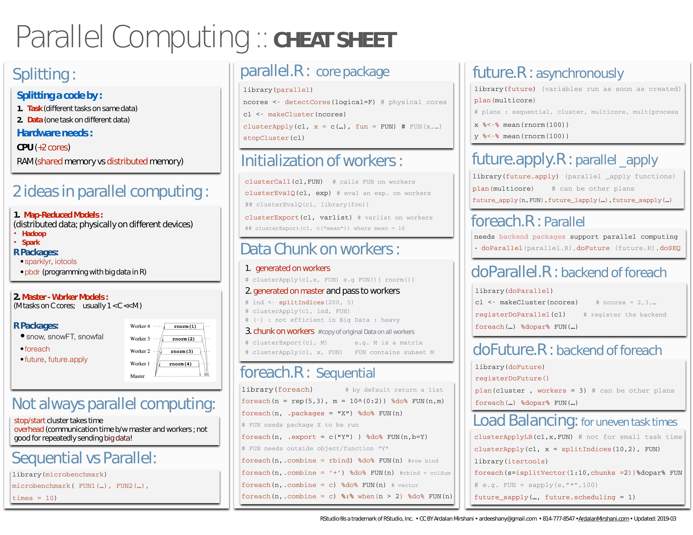
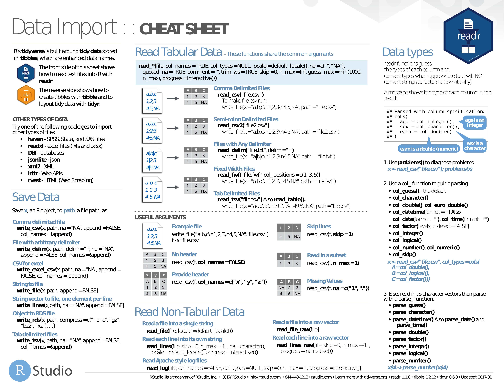
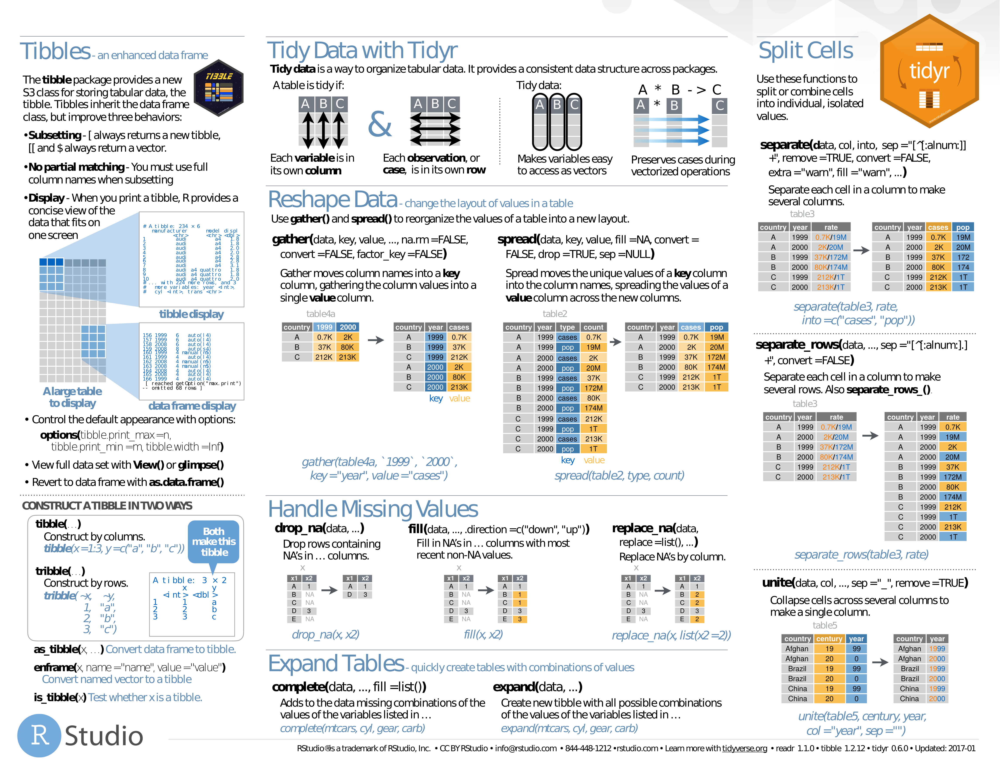

# Big Data

## Parallel Computing

- [parallel](pdf/parallel_computation.pdf). PDF.

## sparklyr

- [sparklyr](pdf/sparklyr.pdf). PDF.

# Data mining and modeling

- [Data Mining](pdf/R-Reference-Card-for-Data-Mining.pdf). PDF only.
    - *association rules, sequential patterns, classification & prediction, regression, clustering, outliers, time series, text mining, socila networks, graph mining, spatial data, statistics, graphics, data manipulation, data access, big data, parallel computing, reports, weka, editors, guis*

## data.table

- [data.table Intro](pdf/data.table-Intro.pdf). PDF only (explanatory article).
- [data.table](pdf/datatable.pdf). PDF.

## dplyr

- [Grammar of dplyr](pdf/r-dplyr.pdf). PDF only (explanatory slides).
- [dplyr](pdf/dplyr.pdf). PDF.

## forcats

- [forcats](pdf/forcats.pdf). PDF.

## sjmisc

- [sjmisc](pdf/sjmisc.pdf). PDF.
    

# Import and Tidy up

- [readr and tidyr](pdf/data-import.pdf). PDF.

# Machine Learning

## caret

- [caret](pdf/caret.pdf). PDF.

## estimatr

- [estimatr](pdf/estimatr.pdf). PDF.

## h2o

- [h2o](pdf/h2o.pdf). PDF.

## Keras

- [Keras](pdf/keras.pdf). PDF.

## Machine Learning

- [Machine Learning](pdf/super-cheatsheet-machine-learning.pdf). PDF only.
    - Supervised Learning;
    - Unsupervised Learning;
    - Deep Learning;
    - Machine Learning Tips and Tricks;
    - Probabilities and Statistics;
    - Linear Algebra and Calculus.

- [Big Data Machine Learning](pdf/4503-rc158-010d-machinelearning_1.pdf). PDF only.
    - *linear regression, logistic regression, regularization (ridge, lasso), neural network, support vector machine, nayesian network and naïve bayes, k-nearest neighbors, decision tree, tree ensembles (bagging or random forest, boosting)*

- [Machine Learning Modelling in R](pdf/Machine_Learning_Modelling_in_R.pdf). PDF.

## mlr

- [mlr](pdf/mlr.pdf). PDF.

## Regressions

- [Regressions](pdf/Ricci-refcard-regression.pdf). PDF only.
    - *linear model, variable selection, diagnostics, graphics, tests, variable transformation, ridge, segmented, gls, glm, nls, gnls, loess, splines, robust, structural equation, simultaneous equation, pls, principal components, quantile, linear and nonlinear mixed effects, generalized additive, survival analysis, classification & regression trees, beta*

## Survival Analysis

- [survminer](pdf/survminer_cheatsheet.pdf). PDF only.
    - *curve, ggplot2, cox model*

# NLP

## quanteda

- [quanteda](pdf/quanteda.pdf). PDF.

## Regex

- [Basic Regular Expressions](pdf/RegExCheatsheet.pdf). PDF.

## stringr

- [stringr](pdf/stringr.pdf). PDF.

## xplain

- [xplain](pdf/xplain.pdf). PDF.

# Probabilities and randomness

## Probabilities

- [Probability Cheat Sheet](pdf/probability_cheatsheet.pdf). PDF only.

- [Probabilities](pdf/probability.pdf). PDF.

## randomizr

- [randomizr](pdf/randomizr.pdf). PDF.

## vtree

- [vtree](pdf/vtree.pdf). PDF.

# Programming

## purrr

- [purrr](pdf/purrr.pdf). PDF.

## rlang

- [rlang](pdf/rlang.pdf). PDF.

# Python

## reticulate

- [reticulate](pdf/reticulate.pdf). PDF.

# Quandl

- [Quandl](pdf/R-Quandl-Cheatsheet.pdf). PDF.

# Time Series

## lubridate

- [lubridate](pdf/lubridate.pdf). PDF.

## nardl

- [nardl](pdf/nardl.pdf). PDF.

## Time series

- [Time Series](pdf/R-FUNCTIONS-FOR-TIME-SERIES-ANALYSIS.pdf). PDF only.
    - *input, decomposition, tests, stochastic, graphics, miscellaneous*

## tsbox

- [tsbox](pdf/tsbox.pdf). PDF.

## xts

- [xts](pdf/xts_Cheat_Sheet_R.pdf). PDF.

# Tidyverse

- [Tidyverse](pdf/Tidyverse_for_Beginners.pdf). PDF.

## Syntax

- [Syntax](pdf/syntax.pdf). PDF.

