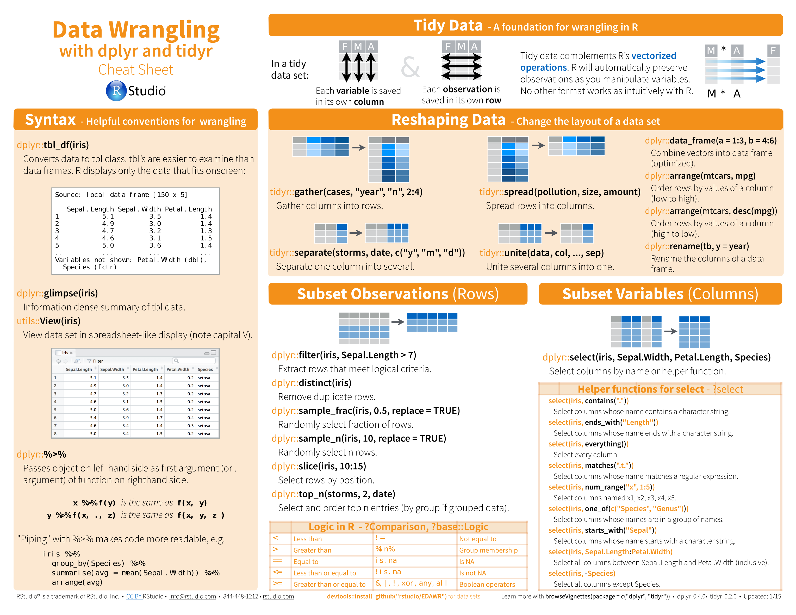
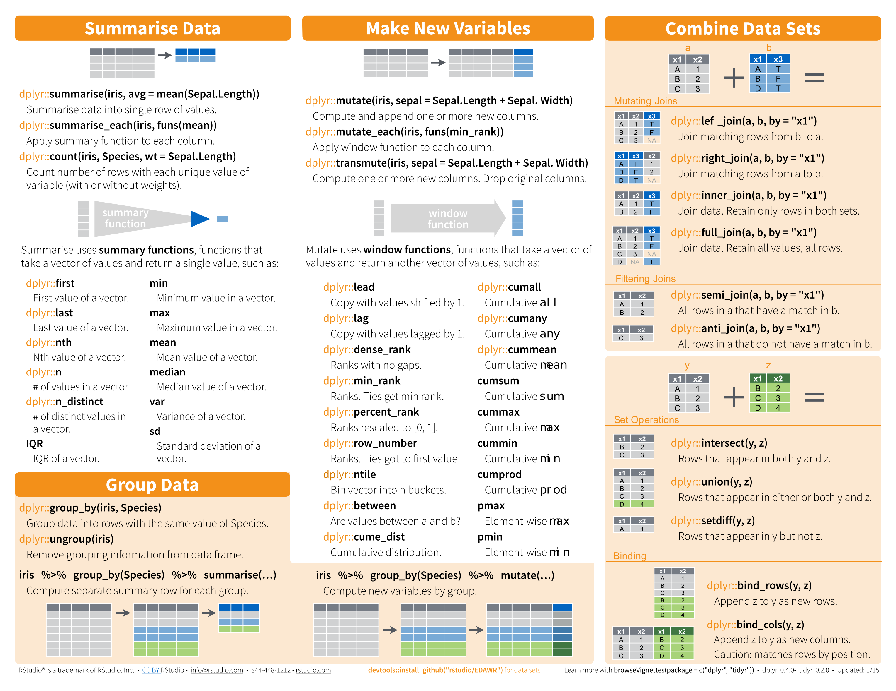
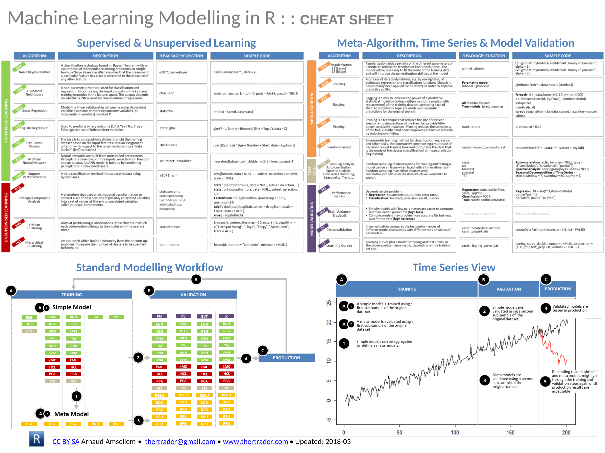
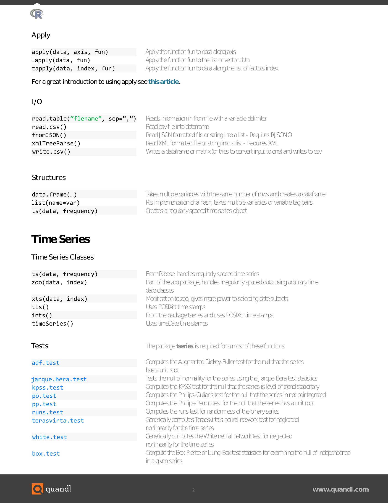
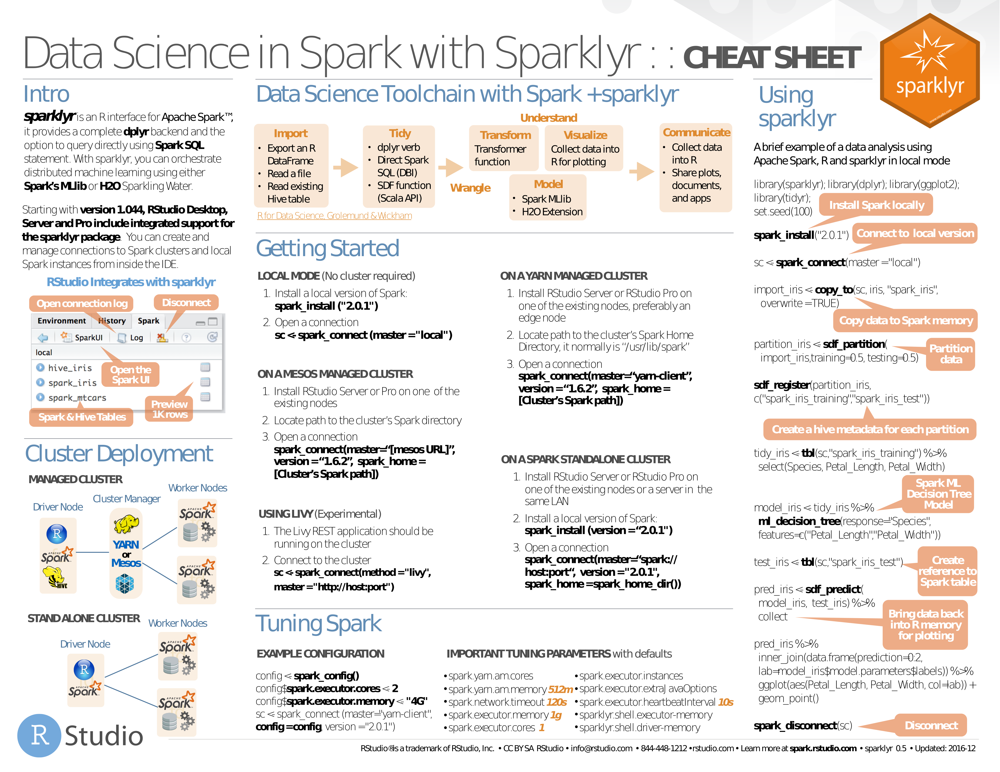

# Caret

- [caret](pdf/caret.pdf). PDF.

---

# Data mining

- [Data Mining](pdf/R-Reference-Card-for-Data-Mining.pdf). PDF only.
    - *association rules, sequential patterns, classification & prediction, regression, clustering, outliers, time series, text mining, socila networks, graph mining, spatial data, statistics, graphics, data manipulation, data access, big data, parallel computing, reports, weka, editors, guis*

# data.table

- [data.table Intro](pdf/data.table-Intro.pdf). PDF only (explanatory article).
- [data.table](pdf/datatable.pdf). PDF.

# dplyr & tidyr

- [Grammar of dplyr](pdf/r-dplyr.pdf). PDF only (explanatory slides).
- [dplyr](pdf/dplyr.pdf). PDF.

---

- [dplyr & tidyr](pdf/dplyr-and-tidyr-data-wrangling-Cheatsheet.pdf). PDF.
    

# Machine Learning

- [Machine Learning](pdf/super-cheatsheet-machine-learning.pdf). PDF only.
    - Supervised Learning;
    - Unsupervised Learning;
    - Deep Learning;
    - Machine Learning Tips and Tricks;
    - Probabilities and Statistics;
    - Linear Algebra and Calculus.

- [Big Data Machine Learning](pdf/4503-rc158-010d-machinelearning_1.pdf). PDF only.
    - *linear regression, logistic regression, regularization (ridge, lasso), neural network, support vector machine, nayesian network and naïve bayes, k-nearest neighbors, decision tree, tree ensembles (bagging or random forest, boosting)*

---

- [Machine Learning Modelling in R](pdf/Machine_Learning_Modelling_in_R.pdf). PDF.

---

- [Machine Learning with R](pdf/mlr.pdf). PDF.

---

- [quanteda](pdf/quanteda.pdf) (for NLP). PDF.

---

- [Keras](pdf/keras.pdf). PDF.

# Probabilities

- [Probabilities](pdf/probability_cheatsheet.pdf). PDF only.

# Quandl

- [Quandl](pdf/R-Quandl-Cheatsheet.pdf). PDF.

# Regular Expressions (regex)

- [Basic Regular Expressions](pdf/RegExCheatsheet.pdf). PDF.

# sjmisc

- [sjmisc](pdf/sjmisc.pdf). PDF.
    

# Spark

- [sparklyr](pdf/sparklyr.pdf). PDF.

# Strings

- [stringr](pdf/stringr.pdf). PDF.

# Survival Analysis & Regression

- [survminer](pdf/survminer_cheatsheet.pdf). PDF only.
    - *curve, ggplot2, cox model*
- [Regressions](pdf/Ricci-refcard-regression.pdf). PDF only.
    - *linear model, variable selection, diagnostics, graphics, tests, variable transformation, ridge, segmented, gls, glm, nls, gnls, loess, splines, robust, structural equation, simultaneous equation, pls, principal components, quantile, linear and nonlinear mixed effects, generalized additive, survival analysis, classification & regression trees, beta*

# Time Series

- [lubridate](pdf/lubridate.pdf). PDF only.
- [Time Series](pdf/R-FUNCTIONS-FOR-TIME-SERIES-ANALYSIS.pdf). PDF only.
    - *input, decomposition, tests, stochastic, graphics, miscellaneous*
- [xts](pdf/xts_Cheat_Sheet_R.pdf). PDF only.

# Tydyverse

- [Purrr](pdf/purrr.pdf). PDF.

- [Tidyverse](pdf/Tidyverse_for_Beginners.pdf). PDF.

