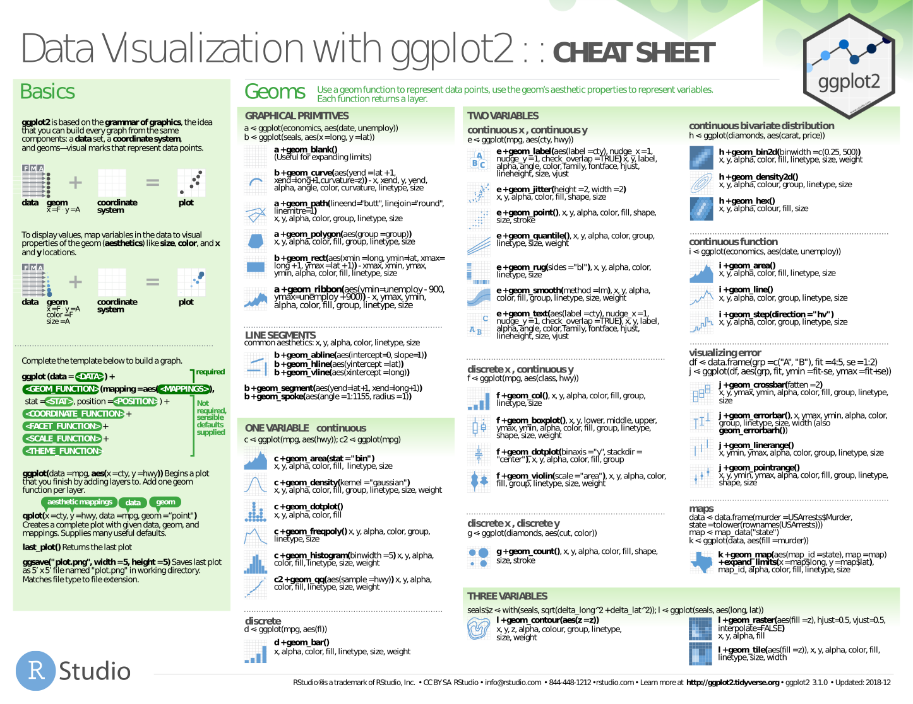
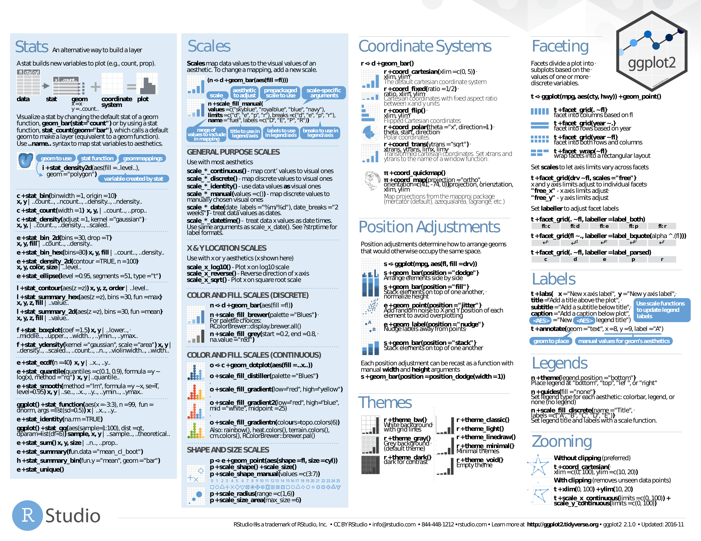

# cartography

- [cartography](pdf/cartography.pdf). PDF.

# ggmap

- [ggmap](pdf/ggmapCheatsheet.pdf). PDF.

# ggplot2

- [ggplot2](pdf/ggplot2.pdf). PDF.

# ggvis

- [ggvis](pdf/ggvis_.pdf). PDF.
- [ggvis cont'd](pdf/ggvis_c.pdf). PDF.

# Leaflet

- [Leaflet](pdf/leaflet-cheat-sheet.pdf). PDF.

# plotly

- [plotly](pdf/plotly_r_cheat_sheet.pdf). PDF.

# shiny

- [shiny](pdf/shiny.pdf). PDF.

# Visualization Parameters

# Colors

# Graphs

- [Graphs](pdf/how-big-is-your-graph.pdf). PDF.

# Lines

# Points

